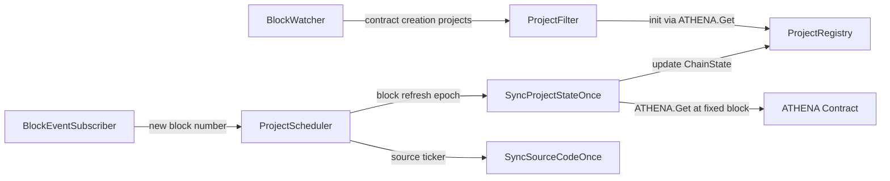

# 区块驱动项目状态刷新重构

## 当前问题定位

当前代码已经完成了一次重要优化：项目链上状态不再由本地逐字段调用 ERC20、Pair、Factory 组合出来，而是通过自部署的 `ATHENA` 合约一次性读取：

```go
type Project struct {
    Meta       ProjectMeta
    ChainState athenacontract.AthenaProject
    SourceCode ProjectSourceCodeState
    Simulate    ProjectSimulateState
}
```

相关路径：

- `[/home/yege/work/athena/pkg/abi/ATHENA/ATHENA.go](/home/yege/work/athena/pkg/abi/ATHENA/ATHENA.go)`：生成的合约 binding，`Get(tokenContract, lockers)` 返回 `AthenaProject`。
- `[/home/yege/work/athena/internal/application/evm/athena_fetcher.go](/home/yege/work/athena/internal/application/evm/athena_fetcher.go)`：`AthenaFetcher.FetchProject(ctx, token)` 封装 `ATHENA.Get`。
- `[/home/yege/work/athena/internal/application/project_filter.go](/home/yege/work/athena/internal/application/project_filter.go)`：新项目入 registry 前已经用 `FetchProject` 初始化 `ChainState` 并过滤非 ERC20。
- `[/home/yege/work/athena/internal/application/project_sync.go](/home/yege/work/athena/internal/application/project_sync.go)`：`SyncPairSnapshotOnce` 已经调用 `FetchProject` 并整体覆盖 `event.ChainState`。

剩余问题集中在调度层：`[/home/yege/work/athena/internal/application/project_scheduler.go](/home/yege/work/athena/internal/application/project_scheduler.go)` 仍使用 heap 管理 `sourceCodeTask` 和 `pairSnapshotTask`，`pairSnapshotTask` 按 `PairSnapshotInterval` 周期重排。这和目标“每个新区块触发所有项目刷新到最新链上状态”不一致，也会在项目数增加后产生和区块节奏无关的滞后刷新。

现有 `[/home/yege/work/athena/internal/application/block_watcher.go](/home/yege/work/athena/internal/application/block_watcher.go)` 继续只负责历史区块扫描和合约创建项目发现，不承载项目状态刷新触发职责。

## 目标设计

- 源码刷新：保持低频、独立节奏，默认 `1 * time.Minute` 遍历 registry 中项目；`SyncSourceCodeOnce` 对已完成源码的项目快速返回。
- 链上状态刷新：由新区块 header 事件触发；每收到新区块后，调度器读取 registry 中所有 project，并发调用 `ATHENA.Get` 刷新 `Project.ChainState`。
- 项目发现：保持当前 `BlockWatcher -> ProjectFilter -> Registry` 路径不变，不在这次重构里调整扫描起点、历史扫描语义或项目过滤逻辑。
- 新区块事件：新增独立组件订阅 `SubscribeNewHead`，只输出区块号，不扫描交易、不初始化项目。
- 读取一致性：每一轮状态刷新使用同一个 `blockNumber` 对 `ATHENA.Get` 发起 `eth_call`，避免一轮内不同项目读到不同区块的链上状态。
- 性能边界：采用 latest-wins 全局刷新 epoch；刷新未完成时收到更多新区块，只记录最新 block，不为旧 block 堆积项目任务。
- 合约聚合优先：不再引入本地逐字段 JSON-RPC batch 或 Multicall3 计划。`ATHENA` 合约已经是当前聚合层，调度器只控制触发时机、并发上限和固定 block 读取。



## 实施步骤

1. 新增新区块事件订阅组件
   - 新增 `BlockEventSubscriber`，内部使用 `SubscribeNewHead(ctx, headers)` 订阅最新区块。
   - 每个 header 到达后，只发送 `header.Number.Uint64()` 到 `blockCh chan<- uint64`。
   - 订阅错误通过日志或返回通道暴露；`ctx` 取消时正常退出。
   - 不修改 `BlockWatcher` 的职责，避免把“发现项目”和“状态刷新触发”混在同一组件里。

2. 重塑 `[/home/yege/work/athena/internal/application/project_scheduler.go](/home/yege/work/athena/internal/application/project_scheduler.go)`
   - 删除 heap 调度模型、`ProjectSyncTask`、`pairSnapshotTask`、`PairSnapshotInterval`、`InitialDelay/MaxDelay/SourceCodeMaxAttempts` 这组退避参数。
   - `ProjectSchedulerOptions` 收敛为：
     - `WorkerCount`：区块刷新并发上限，默认建议 `32`，最高不超过 `64`。
     - `QueueCapacity`：保留给内部 work queue 或删除，取决于实现选择。
     - `SourceCodeInterval`：源码刷新周期，默认 `1 * time.Minute`。
     - `InitialStateRefreshTimeout`：可选，新项目刚加入后触发一次初始状态刷新时使用。
   - `ProjectScheduler` 构造函数新增 `blockCh <-chan uint64`，或新增方法 `NotifyBlock(blockNumber uint64)`。优先选择 `blockCh`，生命周期更清晰。
   - `Start` 后启动两个循环：
     - `sourceCodeLoop`：按 `SourceCodeInterval` 获取 registry 快照并调用 `SyncSourceCodeOnce`。
     - `blockRefreshLoop`：消费新区块号，驱动全量 `ChainState` 刷新。
   - `blockRefreshLoop` 使用 latest-wins 状态机：
     - 收到新区块时更新 `latestBlockNumber`。
     - 没有刷新在跑时启动刷新 goroutine 刷新 registry 当前快照。
     - 刷新在跑时只设置 `dirty=true`，不为旧 block 追加项目任务。
     - 当前轮完成后，如果 `dirty=true`，用最新 `latestBlockNumber` 立即再跑一轮。
     - 事件循环本身不做 RPC，保持持续消费 `blockCh`，避免 `SubscribeNewHead` 被状态刷新反压。
   - 每轮刷新开始前调用 `registry.ListProjects(ctx)` 获取项目切片；不要在 registry 锁内做 RPC。
   - 每轮状态刷新把固定 `blockNumber` 传给同步层，确保所有 `ATHENA.Get` 都在同一个 block 上执行。
   - `EnqueueProject` 简化为“新项目进入 registry 后触发一次源码尝试和一次状态刷新请求”，不再创建周期性 pair snapshot 任务。

3. 调整 `[/home/yege/work/athena/internal/application/project_sync.go](/home/yege/work/athena/internal/application/project_sync.go)`
   - 将接口从 `SyncPairSnapshotOnce(ctx, project)` 改为 `SyncProjectStateOnce(ctx, blockNumber, project)`，命名反映当前行为是“刷新 ATHENA 聚合项目状态”，不再只代表 pair snapshot。
   - `SyncProjectStateOnce` 内部调用 `AthenaFetcher.FetchProjectAtBlock(ctx, blockNumber, project.Meta.Contract)`，成功后整体覆盖 `project.ChainState`。
   - 保留模拟逻辑：刷新到新 `ChainState` 后继续执行 `projectSimulator.Simulate(event.Meta.Creator, event.Meta.Contract, snapshot.Pair.ContractAddress)`。
   - 如果 `ATHENA.Get` 失败，该项目本轮失败并记录日志；不要阻塞其他项目刷新。
   - 如果 simulation 失败，只标记 `Simulate.CreatorResult.MarkFailed`，不回滚已经成功读取的 `ChainState`。
   - 明确项目状态写入的并发模型：不要让刷新 goroutine 和 API view 构造同时无保护地读写同一个 `Project` 指针。优先在 `ProjectRegistry` 增加小粒度更新/读取快照方法，或给 `Project` 增加内部锁；避免在高频区块刷新中引入 data race。

4. 调整 `[/home/yege/work/athena/internal/application/evm/athena_fetcher.go](/home/yege/work/athena/internal/application/evm/athena_fetcher.go)`
   - 在 `AthenaFetcher` 增加按 block 读取方法：

```go
FetchProjectAtBlock(ctx context.Context, blockNumber uint64, token common.Address) (athenacontract.AthenaProject, error)
```

   - 实现中复用生成的 `ATHENACaller.Get`，但设置 `bind.CallOpts{Context: ctx, BlockNumber: new(big.Int).SetUint64(blockNumber)}`。
   - 保留现有 `FetchProject(ctx, token)` 供 `ProjectFilter.initProject` 使用 latest 初始化，或让其内部调用 `FetchProjectAtBlock` 的 latest 变体。
   - 不编辑 `pkg/abi/ATHENA/ATHENA.go`，这是生成代码。

5. 更新 `[/home/yege/work/athena/internal/application/service.go](/home/yege/work/athena/internal/application/service.go)`
   - 新增 `blockCh := make(chan uint64, 16)` 或同等小缓冲通道；容量只用于吸收瞬时抖动，真正的去重和追最新由 scheduler 状态机负责。
   - 创建并持有 `BlockEventSubscriber`，把 `blockCh` 注入 scheduler。
   - 启动顺序建议：
     - 创建 `athenaFetcher`、`projectSync`、`scheduler`。
     - `scheduler.Start(ctx)`。
     - `blockSubscriber.Start(ctx)`。
     - `blockWatcher.Start(ctx)` 和 `projectFilter.Start(ctx)` 继续负责项目发现。
   - Stop 顺序保持先取消 context，再停止 subscriber、watcher、filter、scheduler，最后关闭项目发现 channel。不要在仍有发送者时关闭 `blockCh`。

6. 更新测试
   - 重写 `[/home/yege/work/athena/internal/application/project_scheduler_test.go](/home/yege/work/athena/internal/application/project_scheduler_test.go)`：
     - fake registry 的 `ListProjects` 返回真实项目快照。
     - 验证源码按 `SourceCodeInterval` 遍历项目，不再使用指数退避和 max attempts。
     - 验证收到 block N 后对 registry 中所有 project 调用 `SyncProjectStateOnce(ctx, N, project)`。
     - 验证刷新进行中收到 N+1、N+2 时不会堆积旧轮次，只在当前轮结束后使用 N+2 再刷一轮。
     - 验证 `Stop` 能结束 source loop、block refresh loop 和 worker。
   - 为 `ProjectSync` 增加单元测试：
     - 确认 `SyncProjectStateOnce` 成功时覆盖 `ChainState` 并执行 simulation。
     - 确认 simulation 失败不会丢弃已刷新的 `ChainState`。
   - 为 `AthenaFetcher.FetchProjectAtBlock` 增加轻量测试或接口级 fake 测试，重点覆盖 `blockNumber` 被传入 `bind.CallOpts.BlockNumber` 的行为。
   - 为 `BlockEventSubscriber` 使用小接口封装 `SubscribeNewHead`，通过 fake subscription 测试 header 输出和 ctx 取消退出。

## 预期影响

- `ProjectSchedulerOptions` 从延迟任务参数收敛为 `WorkerCount/SourceCodeInterval` 和少量队列控制参数。
- `ProjectSync` 语义更清晰：源码由 `SyncSourceCodeOnce` 管，链上聚合状态由 `SyncProjectStateOnce` 管。
- 每个 project 每轮区块刷新只调用一次 `ATHENA.Get`，性能瓶颈从“逐字段 RPC 次数”变成“项目数 × 合约聚合 eth_call”。调度层必须坚持 worker 上限和 latest-wins，不追求补齐每个历史块。
- 固定 block 读取会让同一轮 UI/API 展示的项目状态更一致；`project.ChainState.UpdatedAt` 可以作为合约侧状态更新时间参考。
- 新区块订阅依赖 WebSocket RPC；当前服务已经使用 `ethclient.Client`，但部署时要确认传入的是支持 `SubscribeNewHead` 的 ws client。
- 不再把 JSON-RPC batch 或 Multicall3 作为当前重构的一部分；如后续 `ATHENA.Get` 对 100-200 个项目仍不足够快，再评估在 ATHENA 合约层增加批量 `GetMany`，而不是回退到应用层逐字段 batch。

