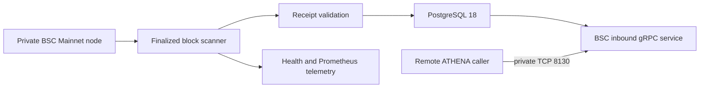

# BSC Inbound Normal Transactions

## Scope

This service indexes successful finalized BNB Smart Chain Mainnet transactions that directly transfer more than `10000000000000000` wei with empty calldata to a non-null recipient. It owns the initial 30-day backfill, finalized-head following, receipt validation, atomic PostgreSQL persistence, address-first keyset pagination, gRPC serving, and scanner health reporting.

BEP-20 transfers, internal transactions, execution traces, swaps, outbound history, multi-chain indexing, and integration with the Token Intelligence wallet-history collector are outside this capability.

## Source Locations

| Concern | Source | Key symbols |
| --- | --- | --- |
| Standalone process | [cmd/athena-bsc-transaction-indexer](../../../cmd/athena-bsc-transaction-indexer) | `main`, `commands.NewCommand` |
| Deployment bundle | [deploy/bsc-transaction-indexer](../../../deploy/bsc-transaction-indexer) | dedicated `Dockerfile`, Compose services `postgres` and `indexer` |
| Remote Docker bootstrap | [hack/install-docker-vps.sh](../../../hack/install-docker-vps.sh) | idempotent Ubuntu Docker Engine and Compose installation |
| Remote deployment | [hack/deploy-bsc-transaction-indexer.sh](../../../hack/deploy-bsc-transaction-indexer.sh) | image build, SSH transfer, idempotent Compose update |
| Finalized block ingestion | [internal/bscinbound/scanner.go](../../../internal/bscinbound/scanner.go) | `Scanner.Run`, `Scanner.runOnce` |
| BSC node access | [internal/bscinbound/node.go](../../../internal/bscinbound/node.go) | `DialNode`, `Node.FinalizedHeader` |
| Public gRPC contract | [internal/bscinbound/bscinbound.proto](../../../internal/bscinbound/bscinbound.proto) | `BscInboundTransactionService`, `ListInboundNormalTransactions` |
| Query behavior | [internal/bscinbound/service.go](../../../internal/bscinbound/service.go) | `Service.ListInboundNormalTransactions` |
| PostgreSQL boundary | [internal/bscinbound/store/store.go](../../../internal/bscinbound/store/store.go) | `Store.CommitBatch`, `Store.ListInboundNormalTransactions` |
| Schema | [internal/bscinbound/store/migrations/000001_init.sql](../../../internal/bscinbound/store/migrations/000001_init.sql) | `inbound_normal_transaction`, `bsc_inbound_scan_checkpoint` |
| Health and metrics | [internal/bscinbound/telemetry.go](../../../internal/bscinbound/telemetry.go) | `Metrics`, `TelemetryServer` |

## Architecture

The scanner and gRPC service run in one process and share one PostgreSQL connection pool. The scanner is the only writer. PostgreSQL owns both the qualifying transaction facts and the durable scan cursor. The gRPC service performs direct indexed reads and does not call the BSC node.

The process has its own executable, minimal runtime image, Compose project, PostgreSQL 18 container, and persistent Docker volume. It is absent from the main ATHENA executable dispatch, Procfile, production Compose, and PostgreSQL bootstrap. The deployment bundle therefore runs on an independent server without installing or restarting the main ATHENA stack.

The Docker bootstrap script prepares a fresh Ubuntu server through a direct root SSH session using Docker's official APT repository. It is idempotent only for a fully healthy Engine and Compose installation; incomplete installations and conflicting distribution packages fail without automatic removal or replacement. It does not manage Swap, host firewalls, or cloud security groups.

The deployment script builds the dedicated image locally, streams it over SSH, installs the Compose and environment files, and recreates only this Compose project. Repeated deployments preserve the named PostgreSQL volume. A remote ATHENA component can connect to the exposed gRPC endpoint, but selecting and integrating that caller is outside this capability.

## Runtime Flow

1. The standalone `main` invokes `NewCommand`, which opens and migrates the dedicated `bsc_inbound` database, connects to the configured node, and rejects any node whose chain ID is not `56`.
2. The process starts gRPC, standard gRPC Health, HTTP health/readiness, Prometheus metrics, and the scanner goroutine.
3. When no checkpoint exists, the scanner reads the finalized header, subtracts 30 days from its timestamp, and binary-searches block headers for the first block at or after that timestamp. The preceding header becomes the initial committed cursor.
4. Every scanner iteration samples one finalized head and selects up to the configured batch size after the committed cursor.
5. Blocks are fetched concurrently and restored to block-number order. The first parent hash must match the committed cursor, and every later parent must match the preceding block.
6. Transactions with a null recipient, a value at or below `10000000000000000` wei, or non-empty calldata are discarded before sender recovery and receipt retrieval. Sender recovery and receipt retrieval occur only for remaining candidates.
7. Only receipts with successful status and the expected block position produce persisted transactions.
8. Transaction inserts and the conditional cursor advance commit in one PostgreSQL transaction. A successful iteration immediately starts the next batch while behind; a caught-up or failed iteration waits for the poll interval.
9. gRPC reads are ordered by block number and transaction index descending. The opaque page token binds the address and the last returned block position.
10. Cancellation stops new RPC work, gracefully stops gRPC and telemetry, and closes the node and PostgreSQL connections.

## State / Data

`inbound_normal_transaction` stores one row per qualifying transaction. Transaction hash is the primary key, block number plus transaction index is unique, and fixed-length checks protect all hashes and addresses. `value_wei` uses `NUMERIC(78,0)` and the schema enforces the strict minimum value. The only query index is `(to_address, block_number DESC, transaction_index DESC)`.

`bsc_inbound_scan_checkpoint` is a singleton row containing the initial block, highest committed block, its hash and timestamp, and lifecycle timestamps. `Store.CommitBatch` updates it only when its current cursor equals the expected cursor, so concurrent scanner instances cannot advance the same range independently.

Page tokens use a versioned binary encoding of recipient address, block number, and transaction index. New inserts do not change the meaning of an existing token.

## Configuration

| Setting | Behavior |
| --- | --- |
| `ATHENA_BSC_INBOUND_NODE_RPC_URL` | Required private BSC Mainnet JSON-RPC endpoint. Startup verifies chain ID `56`. |
| `ATHENA_BSC_INBOUND_POSTGRES_DSN` | Dedicated PostgreSQL connection. The local default database name is `bsc_inbound`. |
| `ATHENA_BSC_INBOUND_GRPC_LISTEN_ADDRESS` | gRPC address. Default `127.0.0.1:8130`. |
| `ATHENA_BSC_INBOUND_TELEMETRY_LISTEN_ADDRESS` | Health and metrics address. Default `127.0.0.1:8131`. |
| `ATHENA_BSC_INBOUND_SCAN_BATCH_SIZE` | Maximum finalized blocks per commit. Default `1000`, range `1` through `10000`. |
| `ATHENA_BSC_INBOUND_FETCH_CONCURRENCY` | Shared block and receipt RPC concurrency. Default `64`, range `1` through `512`. |
| `ATHENA_BSC_INBOUND_POLL_INTERVAL` | Delay after caught-up and failed iterations. Default `1s`, range `100ms` through `1m`. |
| `ATHENA_POSTGRES_AUTO_MIGRATE` | Controls embedded migration execution. The standalone Compose enables it. |

The 30-day initial lookback, BSC chain ID, strict value threshold, default page size `100`, and maximum page size `300` are application constants.

The standalone Compose publishes gRPC on `BSC_INDEXER_GRPC_BIND_ADDRESS:BSC_INDEXER_GRPC_PORT`, defaulting to `0.0.0.0:8130`. Telemetry defaults to host-only `127.0.0.1:8131`. `BSC_INDEXER_POSTGRES_VOLUME` names the persistent PostgreSQL volume mounted at the PostgreSQL 18 image's `/var/lib/postgresql` volume root. PostgreSQL has no host port mapping.

## Invariants

- Every stored transaction is finalized, successful, has a recipient, has empty calldata, and transfers strictly more than `0.01 BNB` at the top transaction level.
- Token logs, traces, internal transfers, failed transactions, contract creations, and contract calls with non-empty calldata are never persisted.
- Empty calldata is the operational wallet-transfer heuristic. The scanner does not call `eth_getCode`, so a direct BNB transfer to a contract receive or fallback handler can still be persisted.
- The cursor advances only in the transaction that makes the entire preceding batch durable.
- The block chain from the committed cursor through every new batch is hash-contiguous.
- API results are newest first and scoped to one exact recipient address.
- The service contains no `chain_id` field because it accepts only BSC Mainnet.

## Failure Recovery

Node, block, receipt, sender recovery, continuity, or PostgreSQL failures abort the current iteration without cursor advancement. The scanner retries after the poll interval. A process restart reloads the durable cursor and resumes at exactly `cursor + 1`.

The transaction hash primary key makes repeated inserts harmless, while the conditional cursor update rejects concurrent advancement. A cursor conflict rolls back the transaction rows written by that attempt. Because only finalized blocks are accepted, the service does not implement mutable reorg repair.

Invalid configuration, database startup failure, telemetry binding failure, gRPC binding failure, or a node reporting any chain other than BSC Mainnet prevents startup.

Remote deployment does not remove the Compose volume or recreate the database. A failed image transfer leaves the running deployment unchanged. A failed Compose update reports container state and recent logs while retaining all indexed state for a corrected redeployment.

## Observability

Standard gRPC Health reports process serving state. `GET /healthz` reports whether the process is running. `GET /readyz` also requires PostgreSQL connectivity, at least one successful scanner iteration within two minutes, and a cursor caught up to the last observed finalized height. The initial backfill is live but not ready.

`GET /metrics` exports finalized height, indexed height, block lag, processed block count, stored transaction count, scanner failures, and gRPC query duration. Completed batches log their inclusive range, block count, qualifying transaction count, and duration. Failed iterations log the causal error without reporting completion.

The Compose healthcheck uses `/healthz`, so deployment can complete while the initial backfill is still running. Operators use the host-only `/readyz` endpoint to determine when indexed results have caught up to the observed finalized height.

## Change Checklist

- [ ] Recheck finalized-head lookup, timestamp binary search, and chain-ID validation.
- [ ] Recheck recipient, value, empty-calldata prefiltering, sender recovery, receipt success, and position validation.
- [ ] Recheck hash continuity and the transaction/checkpoint commit boundary.
- [ ] Recheck address-first ordering, opaque token validation, and page-size limits.
- [ ] Recheck gRPC, health, readiness, metrics, and graceful shutdown behavior.
- [ ] Keep the design index and generated proto/SQLC artifacts synchronized.
