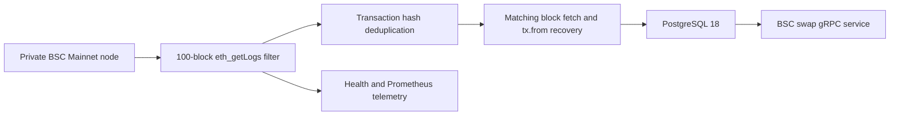

# BSC V2 Swap Transactions

> 当前状态（2026-09-16）：专属代码、契约、构建和部署入口已删除。本文保留删除前设计与历史路径；逐环境运行/数据状态以[清理验收记录](../../testing/module-removal-cleanup-acceptance.md)为准，不代表本轮执行了历史数据删除。

## Scope

This service indexes finalized BNB Smart Chain Mainnet transactions that emit at least one log whose topic zero is `0xd78ad95fa46c994b6551d0da85fc275fe613ce37657fb8d5e3d130840159d822`. It owns the initial 30-day backfill, fixed 100-block log-filter windows, transaction-sender recovery, transaction-level deduplication, atomic PostgreSQL persistence, wallet-first keyset pagination, gRPC serving, and scanner health reporting.

The topic is the only classification rule. Router addresses, log contract addresses, factories, pair bytecode, token addresses, calldata, log data, amounts, and route details are not inspected or stored. The dataset can therefore include any V2 implementation or unrelated contract that emits the same topic. Downstream consumers decide how to interpret returned transaction hashes.

## Source Locations

| Concern | Source | Key symbols |
| --- | --- | --- |
| Standalone process | cmd/athena-bsc-swap-indexer（历史路径 `cmd/athena-bsc-swap-indexer`，基线 `264d0dc1`） | `main`, `commands.NewCommand` |
| Deployment bundle | deploy/bsc-swap-indexer（历史路径 `deploy/bsc-swap-indexer`，基线 `264d0dc1`） | dedicated `Dockerfile`, Compose services `postgres` and `indexer` |
| Remote deployment | hack/deploy-bsc-swap-indexer.sh（历史路径 `hack/deploy-bsc-swap-indexer.sh`，基线 `264d0dc1`） | image build, SSH transfer, idempotent Compose update |
| Finalized log ingestion | internal/bscswap/scanner.go（历史路径 `internal/bscswap/scanner.go`，基线 `264d0dc1`） | `Scanner.Run`, `Scanner.runOnce`, `collectCandidates` |
| BSC node access | internal/bscswap/node.go（历史路径 `internal/bscswap/node.go`，基线 `264d0dc1`） | `DialNode`, `Node.FilterSwapLogs`, `V2SwapTopic` |
| Public gRPC contract | internal/bscswap/bscswap.proto（历史路径 `internal/bscswap/bscswap.proto`，基线 `264d0dc1`） | `BscSwapTransactionService`, `ListSwapTransactions` |
| PostgreSQL boundary | internal/bscswap/store/store.go（历史路径 `internal/bscswap/store/store.go`，基线 `264d0dc1`） | `Store.CommitBatch`, `Store.ListSwapTransactions` |
| Schema | internal/bscswap/store/migrations/000001_init.sql（历史路径 `internal/bscswap/store/migrations/000001_init.sql`，基线 `264d0dc1`） | `bsc_swap_transaction`, `bsc_swap_scan_checkpoint` |
| Health and metrics | internal/bscswap/telemetry.go（历史路径 `internal/bscswap/telemetry.go`，基线 `264d0dc1`） | `Metrics`, `TelemetryServer` |

## Architecture

The scanner and gRPC service run in one process and share one PostgreSQL connection pool. The scanner is the only writer. It uses one `eth_getLogs` request for each contiguous range of at most 100 finalized blocks and fetches full blocks only when the filtered logs contain a transaction in that block. It does not request individual receipts.

The process has its own executable, image, Compose project, PostgreSQL database, and persistent volume. It is independent of the main ATHENA process and the inbound BSC transaction indexer. Its gRPC query remains available to authorized independent clients.

## Runtime Flow

1. The standalone command opens and migrates the `bsc_swap` database, connects to the configured node, and rejects nodes whose chain ID is not `56`.
2. It starts gRPC, standard gRPC Health, HTTP telemetry, and the scanner goroutine.
3. When no checkpoint exists, the scanner samples the finalized header, subtracts 30 days from its timestamp, binary-searches for the first block at or after that timestamp, and commits the preceding block as the initial cursor.
4. Each iteration selects the next contiguous range ending at the lower of `cursor + 100` or the sampled finalized height. It re-reads the cursor block header and requires its hash to match the committed checkpoint.
5. `Node.FilterSwapLogs` sends one range query with only the fixed topic-zero filter and no address filter.
6. Logs must be non-removed, lie inside the requested range, contain the requested topic, and have non-empty block and transaction hashes. Multiple logs for the same transaction must report the same block position and collapse into one candidate.
7. Candidate blocks are fetched concurrently. Each log block hash, transaction hash, and transaction index must match the fetched canonical block. The BSC signer recovers the top-level transaction sender, which becomes the wallet address.
8. Matching transactions and the range-end checkpoint commit in one PostgreSQL transaction. A successful iteration immediately begins the next range while behind.
9. `ListSwapTransactions` requires an exclusive block-number boundary on the first page and returns transaction hashes ordered by block number and transaction index descending. Continuation pages use an opaque position token bound to the wallet.
10. Cancellation stops new RPC work, gracefully stops gRPC and telemetry, and closes the node and database connections.

## State / Data

`bsc_swap_transaction` stores one row per matching top-level transaction. Its primary key is the transaction hash, its block number plus transaction index is unique, and fixed-length constraints protect hashes and wallet addresses. The query index is `(from_address, block_number DESC, transaction_index DESC)`.

`bsc_swap_scan_checkpoint` is a singleton containing the initial block, highest committed block, cursor block hash and timestamp, and lifecycle timestamps. `Store.CommitBatch` advances it only when the current cursor equals the expected cursor, preventing concurrent scanners from committing the same range independently.

Page tokens encode a version, wallet address, block number, and transaction index. They are opaque to clients and valid only for the wallet used to create them. No raw log, log contract, pair, token, amount, route, or Router data is persisted.

## Configuration

| Setting | Behavior |
| --- | --- |
| `ATHENA_BSC_SWAP_NODE_RPC_URL` | Required BSC Mainnet JSON-RPC endpoint. Startup verifies chain ID `56`. |
| `ATHENA_BSC_SWAP_POSTGRES_DSN` | Dedicated PostgreSQL connection. The local database name is `bsc_swap`. |
| `ATHENA_BSC_SWAP_GRPC_LISTEN_ADDRESS` | gRPC address. Default `127.0.0.1:8130`. |
| `ATHENA_BSC_SWAP_TELEMETRY_LISTEN_ADDRESS` | Health and metrics address. Default `127.0.0.1:8131`. |
| `ATHENA_BSC_SWAP_FETCH_CONCURRENCY` | Maximum concurrent matching-block requests. Default `16`, range `1` through `512`. |
| `ATHENA_BSC_SWAP_POLL_INTERVAL` | Delay after caught-up and failed iterations. Default `1s`, range `100ms` through `1m`. |
| `ATHENA_POSTGRES_AUTO_MIGRATE` | Controls embedded migration execution. The standalone Compose enables it. |

The 30-day lookback, 100-block filter range, topic zero, chain ID, default page size `100`, and maximum page size `300` are application constants. Compose publishes gRPC on `0.0.0.0:8130` by default, binds telemetry to host-only `127.0.0.1:8131`, and does not publish PostgreSQL.

## Invariants

- Every stored transaction is from a finalized block and emitted at least one non-removed log with the exact configured topic zero.
- Topic equality is the only protocol classification; no PancakeSwap, Router, Factory, pair, token, or bytecode guarantee is implied.
- One `eth_getLogs` request covers each committed range of at most 100 blocks.
- One transaction produces at most one stored row regardless of matching log count.
- The stored wallet is always the recoverable top-level `tx.from` address.
- The checkpoint advances only in the transaction that makes the complete range durable.
- Initial API queries exclude the entire `before_block_number`; continuation pages use an exclusive block-and-transaction position.
- API results are newest first and return hashes rather than stored position metadata.

## Failure Recovery

Node, header, log-filter, candidate validation, block fetch, sender recovery, or PostgreSQL failures abort the current range without checkpoint advancement. The scanner retries after the poll interval. A restart reloads the durable cursor and resumes at exactly `cursor + 1`.

Transaction-hash conflict handling makes replayed inserts harmless. A checkpoint conflict rolls back the rows written by that attempt. The scanner revalidates the committed cursor block hash before every range; finalized blocks are otherwise treated as immutable, so there is no mutable reorg repair path.

Invalid configuration, database startup failure, telemetry or gRPC binding failure, or a non-BSC node prevents startup. Deployment preserves the named PostgreSQL volume and does not alter the main ATHENA Compose project.

## Observability

Standard gRPC Health reports process serving state. `GET /healthz` reports whether the process is running. `GET /readyz` additionally requires PostgreSQL connectivity, a successful scanner iteration within two minutes, and zero finalized-block lag. The initial backfill is live but not ready.

`GET /metrics` exports finalized height, indexed height, block lag, processed blocks, matching log count, stored transaction count, scanner failures, and query duration. Completed batches log the inclusive block range, block count, matching log count, deduplicated transaction count, and duration.

## Change Checklist

- [ ] Recheck the fixed topic and single-query 100-block filter range.
- [ ] Recheck log position validation, transaction deduplication, block matching, and sender recovery.
- [ ] Recheck the transaction/checkpoint atomic commit boundary.
- [ ] Recheck exclusive block queries, continuation tokens, ordering, and page-size limits.
- [ ] Recheck gRPC, health, readiness, metrics, deployment isolation, and graceful shutdown.
- [ ] Keep the design index and generated proto/SQLC artifacts synchronized.
