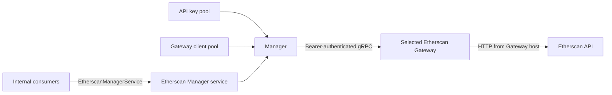

# Etherscan Manager

> 设计状态：已实现

## Scope

The Etherscan Manager is ATHENA's internal gRPC entry point for Etherscan-backed
normal-transaction and contract-source queries. It owns the API key pool, the
Etherscan Gateway client pool, and request scheduling across both pools.

The Manager does not send HTTP requests to Etherscan itself and does not manage
Gateway process deployment. `athena-etherscan-gateway` owns the outbound HTTP
request from each Gateway host, while business consumers such as the token
collector own their collection lifecycle.

## Source Locations

| Concern | Source | Key symbols |
| --- | --- | --- |
| Process entry | [`cmd/athena-etherscan-manager/commands/athena_etherscan_manager.go`](../../../cmd/athena-etherscan-manager/commands/athena_etherscan_manager.go) | `NewCommand` |
| Key and Gateway scheduling | [`internal/etherscanmanager/manager.go`](../../../internal/etherscanmanager/manager.go) | `Manager`, `NewManager`, `nextGatewayClient` |
| gRPC service lifecycle | [`internal/etherscanmanager/service.go`](../../../internal/etherscanmanager/service.go), [`internal/etherscanmanager/server.go`](../../../internal/etherscanmanager/server.go) | `Service`, `Server` |
| Public internal contract | [`internal/etherscanmanager/etherscanmanager.proto`](../../../internal/etherscanmanager/etherscanmanager.proto) | `EtherscanManagerService` |
| Gateway execution | [`internal/etherscangateway/service.go`](../../../internal/etherscangateway/service.go) | `Service.ListNormalTransactions`, `Service.GetSourceCode` |
| Etherscan HTTP client | [`util/etherscanapi/client.go`](../../../util/etherscanapi/client.go) | `Client`, `NewClientWithConfig` |
| Token consumers | [`internal/token/adapters/sourcecode/provider.go`](../../../internal/token/adapters/sourcecode/provider.go), [`internal/token/adapters/normaltransactions/provider.go`](../../../internal/token/adapters/normaltransactions/provider.go) | `sourcecode.Provider`, `normaltransactions.Provider` |

## Architecture

The gRPC service validates consumer requests and converts responses into the
Manager contract. `Manager` selects one API key and one Gateway client for each
request. The selected Gateway uses the request's API key with the shared
`util/etherscanapi` client and returns typed Gateway protobuf data.

## Runtime Flow

1. `athena-etherscan-manager` parses the API key list, Gateway address list, and
   shared Gateway bearer token.
2. `NewManager` rejects empty pools, invalid `host:port` Gateway addresses, or
   a missing bearer token, then creates one gRPC client connection per Gateway.
3. The server registers `EtherscanManagerService`, the version service, and the
   standard gRPC health service. Health starts as `NOT_SERVING`.
4. `Server.Start` starts the service and changes health to `SERVING`.
5. `ListNormalTransactions` or `GetSourceCode` validates its request before
   invoking `Manager`.
6. `nextGatewayClient` atomically increments one sequence number. The same
   number selects the API key and Gateway independently with modulo arithmetic.
7. The Manager adds the shared bearer token to gRPC metadata and makes exactly
   one call to the selected Gateway.
8. Gateway responses are converted back into the Manager response contract.
   Gateway failures are mapped to the Manager's public gRPC error semantics.
9. On process shutdown, gRPC stops gracefully, service health becomes
   `NOT_SERVING`, and all Gateway client connections are closed.

## State / Data

All Manager state is in memory:

- a deduplicated, ordered API key slice;
- a deduplicated, ordered Gateway client slice and its gRPC connections;
- the Gateway bearer token;
- one atomic request sequence used for both round-robin selections;
- the service's started flag.

The Manager has no durable storage or cache. Restarting it resets the
round-robin sequence to the first API key and first Gateway.

## Configuration

| Setting | Behavior |
| --- | --- |
| `ATHENA_ETHERSCAN_MANAGER_LISTEN_ADDRESS` | gRPC listen address; defaults to `0.0.0.0`. |
| `ATHENA_ETHERSCAN_MANAGER_PORT` | gRPC port; defaults to `8100`. |
| `ATHENA_ETHERSCAN_MANAGER_API_KEYS` | Required comma-, whitespace-, or newline-separated Etherscan API key pool. |
| `ATHENA_ETHERSCAN_MANAGER_GATEWAY_ADDRS` | Required comma-, whitespace-, or newline-separated Gateway `host:port` pool. |
| `ATHENA_ETHERSCAN_GATEWAY_AUTH_TOKEN` | Required shared bearer token added to Gateway gRPC calls. |
| `ATHENA_GRPC_MAX_SIZE_MB` | Maximum Manager gRPC receive size; defaults to `100` MiB. |
| `ATHENA_TOKEN_ETHERSCAN_MANAGER_SERVER_ADDRESS` | Token contract-source and wallet-normal-transaction collector address; local default `127.0.0.1:8100`. Production Compose supplies its service DNS address. |

## Invariants

- Every outbound request uses exactly one API key and one Gateway selected from
  the same monotonically increasing request sequence.
- API keys and Gateway addresses preserve configured order after trimming and
  deduplication.
- A request is never retried with another API key or Gateway.
- Gateway bearer authentication is attached to every Manager-to-Gateway
  business RPC.
- `ListNormalTransactions` and `GetSourceCode` retain their request validation,
  response fields, pagination, and chain-ID behavior.

## Failure Recovery

Invalid startup configuration prevents the Manager process from becoming
operational. gRPC connection creation errors close connections already created
during that startup attempt.

Token collectors construct one nonblocking Etherscan Manager clientset per
provider and reuse its channel for all tasks. Invalid targets prevent provider
construction; temporary Manager unavailability is handled by gRPC background
reconnection. `Provider.Close` closes the channel when the worker lifecycle
ends.

Request cancellation and deadline expiration propagate to the caller. Gateway
rate limits become `ResourceExhausted`; invalid requests become
`InvalidArgument`; malformed responses become `DataLoss`; authentication or
plan failures become `FailedPrecondition`; other Gateway and transport failures
become `Unavailable`.

There is no in-process retry or failover. A later caller request advances the
round-robin sequence and can therefore select a different key or Gateway.

## Observability

The standard gRPC health service reports `SERVING` only after `Server.Start`
succeeds and returns to `NOT_SERVING` during shutdown.
`GetEtherscanManagerStatus` exposes the service started flag as
`started` plus `running` or `stopped`. The shared version service remains
registered on the same gRPC server. Startup, shutdown, and connection-close
failures are emitted through the process logger.

## Change Checklist

- [ ] Manager, Gateway, HTTP-client, and consumer responsibilities still match this document.
- [ ] API key and Gateway selection continue to use one atomic sequence.
- [ ] Request validation, response conversion, and error mapping remain current.
- [ ] Configuration names, defaults, health behavior, and shutdown flow are current.
- [ ] Source links and named symbols resolve to the implementation.
- [ ] The [design index](../README.md) contains the correct entry.
