# AI Discovery Documentation

## Scope

AI Discovery Documentation owns Athena's public, build-time documentation
surface for LLMs and API clients: the curated `/llms.txt` entry point, focused
Markdown guidance under `/docs/ai/`, and the generated Swagger 2.0 description
served at `/swagger.json` and rendered at `/swagger-ui`. The Web UI's Connect AI
workflow packages absolute runtime locations for these resources with a newly
issued bearer and verification instructions so the user can transfer one
self-contained block to an HTTP-capable AI.

This capability describes and exposes the current HTTP API; it does not define
business RPC contracts, authenticate callers, authorize modules, or provide an
agent execution protocol. An ordinary account holder may directly give an
account-level API Key to an AI, which then uses the same authorized read and
write operations as any other bearer client. Athena does not publish its
internal `docs/design/` tree through this surface, and this capability does not
implement MCP, OAuth delegation, scoped API Keys, `llms-full.txt`, or separate
AI-specific operations. Connect AI is a browser convenience over the existing
ordinary-account API Key contract; it does not add a server-side connection or
credential type. The fixed administrator remains outside the API Key and AI
connection path.

## Source Locations

| Concern | Source | Key symbols |
| --- | --- | --- |
| Curated public discovery entry | [ui/src/assets/llms.txt](../../../ui/src/assets/llms.txt) | `Start Here`, `API Reference`, `Optional` link groups |
| Public AI guidance | [ui/src/assets/docs/ai/](../../../ui/src/assets/docs/ai/) | overview, authentication, modules, errors and pagination, and safety documents |
| Browser connection assembly | [ui/src/app/shared/ai-connection.ts](../../../ui/src/app/shared/ai-connection.ts), [ui/src/app/pages/account-center.tsx](../../../ui/src/app/pages/account-center.tsx) | `AIConnectionDetails`, `buildAIConnectionDetails`, `verifyAIConnectionCredential`, `SecurityPage` |
| User-facing discovery entry | [ui/src/app/pages/help.tsx](../../../ui/src/app/pages/help.tsx) | `HelpPage`, `mayConnectAI` |
| Vite public-file pipeline | [ui/vite.config.ts](../../../ui/vite.config.ts), [ui/package.json](../../../ui/package.json) | `publicDir`, `build.outDir`, `build` |
| Embedded static-file serving | [ui/embed.go](../../../ui/embed.go), [internal/server/athena-server.go](../../../internal/server/athena-server.go) | `ui.Embedded`, `NewServer`, `uiAssetExists`, `newStaticAssetsHandler`, `withRootPath` |
| Swagger source and generation | [internal/server/](../../../internal/server/), [hack/generate-proto.sh](../../../hack/generate-proto.sh) | protobuf HTTP annotations, `collect_swagger`, `clean_swagger` |
| Generated Swagger embedding | [assets/swagger.json](../../../assets/swagger.json), [assets/embed.go](../../../assets/embed.go), [util/assets/assets.go](../../../util/assets/assets.go) | `assets.Embedded`, `SwaggerJSON` |
| Swagger HTTP delivery | [util/swagger/swagger.go](../../../util/swagger/swagger.go), [internal/server/athena-server.go](../../../internal/server/athena-server.go) | `ServeSwaggerUI`, `newHTTPServer` |
| Authentication and module enforcement | [internal/server/authz.go](../../../internal/server/authz.go), [internal/server/version/version.go](../../../internal/server/version/version.go), [internal/server/session/session.go](../../../internal/server/session/session.go), [internal/server/appbootstrap/appbootstrap.go](../../../internal/server/appbootstrap/appbootstrap.go) | `publicGRPCMethods`, `moduleGRPCRules`, `AuthFuncOverride` |

## Architecture

```mermaid
flowchart LR
    D["ui/src/assets public documents"] --> V["Vite publicDir copy"]
    V --> U["ui/dist/app"]
    U --> UE["ui.Embedded"]
    UE --> S["Athena static-file handler"]
    S --> L["/llms.txt and /docs/ai/*.md"]

    P["Server proto HTTP annotations"] --> G["generate-proto.sh"]
    G --> J["assets/swagger.json"]
    J --> AE["assets.Embedded / SwaggerJSON"]
    AE --> W["ServeSwaggerUI"]
    W --> O["/swagger.json and /swagger-ui"]

    B["document.baseURI"] --> C["Connect AI assembly"]
    K["New account API Key"] --> C
    C --> I["One-time connection instructions"]
    C --> X["Bearer-only /api/v1/session/userinfo check"]
    C -. "absolute discovery URL" .-> L
    C -. "absolute Swagger URL" .-> O
```

The curated documents and the Swagger contract use separate build and embed
paths. Vite treats `ui/src/assets` as its public directory and copies its files
without bundling them into `ui/dist/app`. `ui/embed.go` embeds that complete
output tree. At startup, `AthenaServer` creates a static filesystem from the
embedded tree and optionally composes it with the configured additional static
asset directory. The embedded filesystem is checked first, so the additional
directory supplies missing files rather than overriding embedded ones.

Swagger is not part of the Vite public directory. Protobuf HTTP annotations
under `internal/server/` define paths and wire schemas. `collect_swagger` mixes
the generated per-service specifications with Athena's top-level metadata and
security declaration, normalizes the result, and writes `assets/swagger.json`.
Its explicit REST-name normalization keeps the Wallet and Worm Trading
camelCase query and response contracts aligned with their generated Go JSON
tags even though the underlying protobuf field names are snake_case.
The root `assets` package embeds that generated file; `util/assets` loads it as
`SwaggerJSON`; and `ServeSwaggerUI` registers both the JSON response and ReDoc
handler on the HTTP mux.

The browser connection path does not fetch or duplicate either discovery
artifact while assembling a connection. `buildAIConnectionDetails` resolves
the Athena base, `llms.txt`, `swagger.json`, and `api/v1/session/userinfo`
against the live document base URI and includes those absolute URLs, the
expected account ID, and the complete Bearer header in one instruction block.
That block directs the receiving AI to read discovery first, treat Swagger 2.0
as the contract source, validate its identity, and then act with the ordinary
account's complete current HTTP API authority.

All discovery routes are readable without authentication. The Swagger global
Bearer declaration documents the normal API requirement, while these optional-
authentication operations explicitly set an empty operation-level security
list:

- `GET /api/version`
- `GET /api/v1/session/userinfo`
- `GET /api/v1/app/bootstrap`

The gRPC authentication overrides remain authoritative for those operations.
For every protected operation, the server's authentication and authorization
interceptors remain authoritative regardless of how Swagger or the Markdown
guidance describes the request.

## Runtime Flow

1. Maintainers update the curated sources in `ui/src/assets` when public API
   capabilities, access guidance, or safety boundaries change.
2. The UI build copies those sources to the same relative locations in
   `ui/dist/app`; the Go build embeds that output into `ui.Embedded`.
3. Protobuf generation creates per-service Swagger inputs. `collect_swagger`
   combines them, applies Athena metadata and security semantics, and replaces
   the generated `assets/swagger.json`; the Go build embeds it separately.
4. `NewServer` opens the embedded UI subtree and adds the optional external
   static filesystem. `newHTTPServer` registers API, Swagger, health, download,
   and static handlers on one HTTP mux.
5. A request for an existing `/llms.txt` or `/docs/ai/*.md` path is served as a
   file by `newStaticAssetsHandler`. A request for `/swagger.json` or
   `/swagger-ui` is served by `ServeSwaggerUI` before the catch-all static
   handler.
6. When `RootPath` is non-empty, `withRootPath` mounts the complete handler below
   that prefix and strips the prefix before dispatch. No separate origin-root
   discovery handler is registered.
7. An eligible ordinary user starts Connect AI above the normal API Key list in
   Account Center Security. The editable generated name defaults to
   `ai-<UTC time>-<random suffix>`, expiration defaults to 90 days, and Create
   connection calls the same API Key creation endpoint as ordinary Create API
   key. The ordinary flow remains available and unchanged in purpose.
8. On successful issuance, the browser assembles the one-time instructions and
   immediately calls the absolute user-info URL with the new Authorization
   header, `credentials: 'omit'`, and `cache: 'no-store'`. Ready requires an
   HTTP-success response with `loggedIn=true` and `accountId` equal to the
   current account. Failure is retryable and never blocks either copy action.
   The one-time result is bound to the account ID that requested issuance.
9. The protected result offers the complete instruction block, bearer-only
   copy, manual selection, and a deliberate Done action. Done aborts an
   in-flight verification and removes the secret and instructions from React
   state. Help links eligible users to Security and exposes `llms.txt` and
   Full-Account AI Access as public resources.

Discovery delivery and browser-side connection assembly add no background work,
shutdown action, or transaction. Connect AI still invokes the existing API Key
issuance flow owned by Account Credentials; it adds no dedicated durable
AI-connection state beyond that key's normal metadata.

## State / Data

The Markdown files, `llms.txt`, and Swagger JSON are immutable build inputs or
outputs. They do not contain per-account data, credentials, runtime service
state, or a complete copy of internal design documentation.

`llms.txt` is a concise navigation document rather than a duplicated endpoint
catalog. The focused Markdown pages provide stable conceptual guidance, while
`/swagger.json` is the machine-readable source for concrete paths, methods,
parameters, responses, and schemas. Executable proto and server code remain the
ultimate source of truth when public prose or a generated artifact is stale.

The new bearer, Authorization header, assembled instructions, and connection
verification state exist only in the current Account Center React state. They
are not written to a URL, localStorage, sessionStorage, logs, or a server-side
AI integration record. The persistent API Key list contains metadata only, so
neither an old key's secret nor its connection block can be reconstructed. Both
the issued result and the loaded metadata snapshot carry an owning account ID;
the UI renders them only while that ID matches the current authorization.

## Configuration

| Setting | Behavior |
| --- | --- |
| Vite `publicDir: '../assets'` | Copies `ui/src/assets` into the UI output root. |
| Vite `build.outDir: '../../dist/app'` | Produces the tree embedded by `ui/embed.go`. |
| `ATHENA_SERVER_STATIC_ASSETS` / `--staticassets` | Adds a filesystem after the embedded UI assets; the default is `/shared/app`, and embedded files take precedence. |
| `ATHENA_SERVER_ROOTPATH` / `--rootpath` | Mounts the HTTP handler below a non-empty proxy prefix; the default is empty. |
| `ATHENA_SERVER_BASEHREF` / `--basehref` | Rewrites the SPA's `index.html` base element only; it does not rewrite links inside `llms.txt` or Markdown files. |

Public AI documents deliberately use origin-root-relative links. The supported
discovery layout therefore assumes Athena is deployed at the domain root. With
a non-empty `ATHENA_SERVER_ROOTPATH`, a caller may reach the files below the
configured prefix, but Athena does not guarantee an origin-root `/llms.txt`, and
the root-relative links inside the documents are not rewritten for that prefix.

Connect AI derives its absolute URLs from `document.baseURI`, so it does not
hard-code a deployment domain. This runtime resolution does not change the
formal domain-root support boundary: it does not rewrite root-relative links
inside Markdown or Swagger for an arbitrary reverse-proxy subpath.

## Invariants

- `ui/src/assets` is the source for public LLM-oriented prose; internal
  `docs/design/` content is never copied into the public tree.
- `assets/swagger.json` is generated from proto annotations and
  `hack/generate-proto.sh`; it is never hand-edited.
- Protected operations inherit the global `athenaBearer` Swagger requirement;
  only the three optional-authentication operations listed above declare
  `security: []`.
- Swagger security metadata documents server behavior but cannot grant or
  weaken access. Authentication, API Key entitlement, administrator checks,
  Profit Sharing entitlement, and module requirements remain server decisions.
- Public documents contain no bearer values, wallet secrets, external-provider
  credentials, internal implementation details, or claims that unavailable
  MCP, OAuth-delegation, scoped-key, or AI-specific-operation capabilities
  exist.
- The public module catalog contains the current ten-module matrix, including
  API-Key-eligible Worm Trading `READ` wallet-summary and balance access without
  implying Wallet management or secret authority.
- Existing API Keys are described as full-account bearer credentials for
  ordinary users. The account holder may hand one directly to a local,
  self-hosted, or third-party AI, which receives the ordinary account's complete
  current HTTP API authority without a separate scope, read-only mode, agent
  identity, or approval gate. The fixed administrator cannot issue API Keys.
- Connect AI creates that same credential and adds only a one-time browser
  transfer format. Ordinary Create API key, key metadata listing, revocation,
  expiration, and account authorization semantics remain shared and available.
- Bearer verification never sends the ambient browser session and never claims
  that the receiving AI has completed a connection. An existing key cannot
  regenerate a bearer or instruction block.
- A current-account change closes the creation/result stages, aborts bearer
  verification, and discards any late secret rather than exposing prior-account
  state under a new expected account ID.
- Origin-root-relative discovery links assume an empty server root path.

## Failure Recovery

A missing source file, omitted Vite build, or stale Go binary leaves the
corresponding public document unavailable or stale until the artifacts and
binary are rebuilt. The static handler returns the normal HTTP file-server
response; it has no fallback discovery document. Because embedded files take
precedence, placing a same-named file in the additional static directory does
not repair or override an embedded document.

Swagger generation replaces the generated artifact from its sources. A failed
generation must be corrected in proto annotations or the generator rather than
patched in `assets/swagger.json`. Documentation drift never changes runtime
authorization: server interceptors continue to allow or deny the request from
the current credential and access state.

Connect AI creation errors retain the editable form. User-info verification
errors produce a stable retryable message and leave both copy paths available.
Clipboard failure leaves the read-only instruction text selectable for manual
copy. The protected result cannot be dismissed through the normal modal close,
mask, or Escape paths; Done intentionally clears its one-time state. Account
change is handled separately as an identity boundary: it invalidates the
pending UI request generation and discards a late secret, while a completed
normal API Key record remains reviewable from its owning account.

## Observability

Discovery delivery adds no dedicated metrics, health state, or tracing. Normal
HTTP status and access logging diagnose availability. Vite build output confirms
the static copy, and protobuf generation output plus the generated Swagger diff
diagnose contract production. Operators can inspect `/llms.txt`, each linked
Markdown path, `/swagger.json`, and `/swagger-ui` on the deployed origin.

Connect AI reports credential checking, readiness, retryable failure, and copy
failure in the current UI only. It neither logs the bearer or instruction block
nor records a durable external-AI connection status. Credential readiness means
only that Athena accepted the new bearer for the expected account.

## Change Checklist

- [ ] Curated public documents and their links match the current API and safety boundaries.
- [ ] The Vite-to-UI-embed and Swagger-to-assets-embed delivery paths remain current.
- [ ] Swagger metadata, global Bearer security, and public operation exceptions match server behavior.
- [ ] Authentication and authorization guidance matches the credential and module implementation.
- [ ] Connect AI instructions contain the runtime discovery, Swagger, verification, expected-account, and full-authority contract.
- [ ] The one-time secret, bearer-only verification, and existing-key reconstruction boundaries remain current.
- [ ] Root-path constraints and static-asset precedence remain current.
- [ ] Source links resolve, and the [design index](../README.md) contains the current summary.
