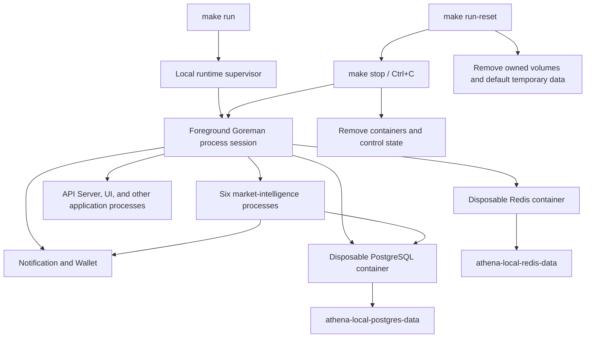

# Local Runtime Orchestration

## Scope

The local runtime owns foreground Procfile supervision, repository-owned process
cleanup, disposable PostgreSQL and Redis containers, persistent local data
volumes, and the distinction between ordinary stop and full reset. The default
Procfile includes six independent market-intelligence capability processes,
Athena Notification, Wallet, the broader Token processes, the UI, and the API
Server.

Application behavior remains inside each command and `internal` package.
Production Compose lifecycle is outside this capability, although production
must likewise use a PostgreSQL volume initialized with the current database set.

## Source Locations

| Concern | Source | Key symbols |
| --- | --- | --- |
| Command entry points | [Makefile](../../../Makefile) | `run`, `stop`, `run-reset` |
| Process and cleanup lifecycle | [hack/local-runtime.sh](../../../hack/local-runtime.sh) | `start_runtime`, `stop_runtime`, `reset_runtime`, `cleanup_athena_ports` |
| PostgreSQL persistence | [hack/start-postgres-with-password.sh](../../../hack/start-postgres-with-password.sh) | `postgres_config_fingerprint`, `ensure_postgres_volume` |
| PostgreSQL database initialization | [hack/postgres/init/00-databases.sql](../../../hack/postgres/init/00-databases.sql) | capability database creation |
| Redis persistence | [hack/start-redis-with-password.sh](../../../hack/start-redis-with-password.sh) | `ensure_redis_volume` |
| Process declarations | [Procfile](../../../Procfile) | six market-intelligence processes, `notification`, `wallet`, `postgres`, `redis`, application processes |
| Capability ports | [common/common.go](../../../common/common.go) | `DefaultPortWormMarkets`, `DefaultPortFIFAMarketDashboard`, `DefaultPortMarketRadar`, `DefaultPortSportsLive`, `DefaultPortSportsHistory`, `DefaultPortManagedOO` |

## Architecture

Goreman owns a dedicated process session, and every Procfile child group remains
inside that session. The repository records the controller PID, session-leader
PID, both Linux process start times, and repository root under
`.run/athena-local-runtime`. Container and volume labels establish resource
ownership independently from names.

The market-intelligence processes have the following independent runtime
boundaries:

| Process | Port | Owned PostgreSQL database | Local service dependencies |
| --- | ---: | --- | --- |
| `worm-markets` | 8084 | `worm_markets` | PostgreSQL; Notification when enabled |
| `fifa-market-dashboard` | 8090 | `fifa_market_dashboard` | PostgreSQL, Worm Markets gRPC, Wallet gRPC |
| `market-radar` | 8092 | None | Notification when enabled |
| `sports-live` | 8094 | `sports_live` | PostgreSQL; Notification when enabled |
| `sports-history` | 8104 | `sports_history` | PostgreSQL |
| `managed-oo` | 8106 | `managed_oo` | PostgreSQL; Notification when enabled |

Notification is active by default on port `8086`, and Wallet is active on port
`8088`. FIFA Market Dashboard calls Worm Markets and Wallet over gRPC; the
capability processes do not import one another's application implementations.
World Cup Corners is frontend-only and therefore has no Procfile process,
listener, or database.

## Runtime Flow

1. `make run` rejects a verified live supervisor and removes stale state only
   when the recorded processes no longer match their PIDs and start times.
2. It writes a filtered Procfile for `ATHENA_RUN_EXCLUDE`, cleans verified stale
   local containers and Athena listeners, configures the WSL Token WebSocket
   proxy, starts Goreman in a new session, and records its identity.
3. The Procfile starts all six capability commands as independent `go run`
   processes. It also starts Notification and Wallet, making the default
   notification-enabled settings and FIFA gRPC dependencies usable locally.
   Goreman supervises processes but does not merge their lifecycle or health.
4. PostgreSQL validates or creates `athena-local-postgres-data`, then its
   initialization scripts create `worm_markets`, `fifa_market_dashboard`,
   `sports_live`, `sports_history`, `managed_oo`, `notification`,
   `wallet`, `token`, `temporal`, and `temporal_visibility`. Each
   capability store connects to only its owned database and applies its own
   embedded migration when automatic migration is enabled.
5. Redis validates or creates `athena-local-redis-data`. Each run creates
   attached, labeled, `--rm` PostgreSQL and Redis containers. PostgreSQL mounts
   its complete data directory; Redis enables AOF under `/data`.
6. Foreground exit, `Ctrl+C`, or `make stop` first signals Goreman with
   `SIGINT`. After 20 seconds it escalates process groups in the runtime
   session to `SIGTERM`, then after 10 more seconds to `SIGKILL`. Verified
   stale Athena listeners and labeled containers are removed afterward.
   Volumes and default temporary business data remain.
7. `make run-reset` performs the same stop, then deletes the two owned volumes,
   default `/tmp/athena-local`, exact Procfile coverage directories, and local
   runtime control state. It does not start another run.
8. The ordered PostgreSQL initialization files are part of the volume
   fingerprint. Before the first local run with the current capability database
   set, an existing local volume must be cleared with `make run-reset`; the
   next `make run` creates the databases from a clean volume.

## State / Data

`athena-local-postgres-data` stores the complete PostgreSQL cluster, including
all capability databases. Its labels record Athena ownership, the `postgres`
component, and a SHA-256 fingerprint covering the image, initial user, initial
database, password, and ordered initialization-file paths and contents.

`athena-local-redis-data` stores Redis AOF data. Its labels record Athena
ownership and the `redis` component. Redis container settings can change on
the next run because the container is always recreated.

The supervisor state and filtered Procfile are transient control data under
`.run/athena-local-runtime`. Default SSH runtime data is under
`/tmp/athena-local`. Default coverage outputs use the exact directories in the
Procfile, including:

- `/tmp/coverage/athena-worm-markets`
- `/tmp/coverage/athena-fifa-market-dashboard`
- `/tmp/coverage/athena-market-radar`
- `/tmp/coverage/athena-sports-live`
- `/tmp/coverage/athena-sports-history`
- `/tmp/coverage/athena-managed-oo`

The reset allowlist also contains the exact default coverage directories for
the remaining Procfile processes. Custom paths outside that allowlist are never
removed.

## Configuration

| Setting | Behavior |
| --- | --- |
| `ATHENA_RUN_EXCLUDE` | Comma-separated Procfile process names omitted from the run. Any capability can be developed independently by excluding unrelated processes. |
| `ATHENA_RUN_PORT_CLEANUP` | Defaults to `true`; verified stale Athena listeners are stopped and foreign listeners block startup. |
| `ATHENA_RUN_DRY_RUN` | Prints the filtered Procfile without starting processes or cleaning resources. |
| `ATHENA_PROCFILE` | Overrides the source Procfile; the filtered copy remains repository-local control state. |
| `ATHENA_WORM_MARKETS_PORT`, `ATHENA_FIFA_MARKET_DASHBOARD_PORT`, `ATHENA_MARKET_RADAR_PORT`, `ATHENA_SPORTS_LIVE_PORT`, `ATHENA_SPORTS_HISTORY_PORT`, `ATHENA_MANAGED_OO_PORT` | Override the six local command ports passed by the Procfile. The same values are covered by stale-port cleanup. |
| Capability `ATHENA_*_POSTGRES_DSN` variables | Select the owned PostgreSQL database for Worm Markets, FIFA Market Dashboard, Sports Live, Sports History, and Managed OO. Market Radar has no DSN. |
| `ATHENA_NOTIFICATION_TELEGRAM_BOT_TOKEN`, `ATHENA_NOTIFICATION_TEST_TELEGRAM_CHAT_ID`, `ATHENA_NOTIFICATION_PROD_TELEGRAM_CHAT_ID` | Required by the default active Notification process. Local configuration must provide all three. |
| `ATHENA_POSTGRES_PORT`, `ATHENA_POSTGRES_IMAGE_TAG`, `POSTGRES_USER`, `POSTGRES_DB`, `POSTGRES_PASSWORD`, `ATHENA_POSTGRES_INIT_DIR` | Configure the disposable PostgreSQL container and its initialization fingerprint where applicable. |
| `ATHENA_REDIS_PORT`, `ATHENA_REDIS_IMAGE_TAG`, `REDIS_PASSWORD` | Configure the disposable Redis container. |

Container names, volume names, ownership labels, the state directory, and reset
targets are fixed local-runtime boundaries rather than user configuration.

## Invariants

- Only a supervisor whose session-leader PID, start time, command, process group,
  session, and working directory match recorded repository state can be
  signaled. The independently validated controller identity prevents a new run
  from racing the previous controller's cleanup.
- Port cleanup terminates only processes carrying an Athena binary marker and
  running from this repository; foreign listeners are never killed.
- Container and volume deletion requires matching Athena ownership and component
  labels.
- The six capabilities remain distinct Procfile processes and use distinct
  ports. Every stateful capability uses only its owned PostgreSQL database.
- Notification-enabled capabilities communicate through Notification gRPC.
  FIFA Market Dashboard communicates with Worm Markets and Wallet through gRPC.
- Ordinary stop removes containers and control state but never removes either
  data volume.
- Full reset never restarts services and never deletes broad or user-supplied
  filesystem paths.
- A PostgreSQL initialization fingerprint mismatch requires explicit full reset.

## Failure Recovery

A stale state file is discarded only when it no longer identifies the same live
process. A live but unverifiable PID stops lifecycle processing rather than
risking termination. Leftover labeled containers are safe to remove because all
durable service state is in named volumes.

PostgreSQL initialization drift fails before container creation and directs the
operator to `make run-reset`. This includes any change to the capability
database collection. An unowned container or volume with a reserved name also
fails with a manual remediation message. Missing resources make stop and reset
no-ops, while a volume still used by an unexpected container causes reset to
fail instead of forcing unrelated cleanup.

An unavailable Docker daemon is reported as a lifecycle failure rather than
being mistaken for missing resources; stop still completes verified process and
control-state cleanup. A missing Telegram setting causes the default
Notification process to fail startup; capability synchronization remains
process-specific, while notification sends cannot succeed until Notification is
available. Capability dependency and recovery semantics are documented in their
individual design documents.

## Observability

Lifecycle logs identify the Goreman PID, signal escalation, stale processes,
port ownership conflicts, container deletion, volume creation or deletion,
reset paths, excluded Procfile services, and ownership or fingerprint failures.
Goreman streams every capability, dependency, database, UI, and API Server log
in the foreground.

`ATHENA_RUN_DRY_RUN=true make run` is the non-mutating view of the effective
process set. The API Server's Service Status view checks the six independent
gRPC health services in addition to Notification, Wallet, and other registered
services. Process health does not replace capability-specific freshness or sync
status, which is described in each market-intelligence document.

## Change Checklist

- [ ] Recheck supervisor identity validation, process-session shutdown, and signal timing.
- [ ] Recheck the six capability ports, database ownership, and gRPC dependencies.
- [ ] Recheck shallow-stop and full-reset resource boundaries.
- [ ] Recheck container and volume ownership labels and PostgreSQL fingerprint inputs.
- [ ] Recheck default temporary and coverage paths and avoid broad or custom-path deletion.
- [ ] Recheck Procfile, database initialization, API Server status wiring, and design-index references.
