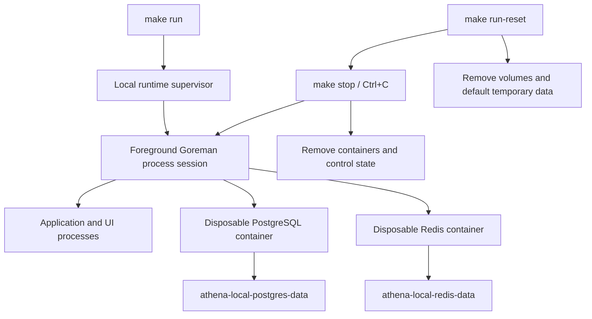

# Local Runtime Orchestration

## Scope

The local runtime owns foreground Procfile supervision, repository-owned process
cleanup, disposable PostgreSQL and Redis containers, persistent local data
volumes, and the distinction between ordinary stop and full reset. Application
service composition remains in the Procfile, while production Compose lifecycle
and application-level migration behavior are outside this capability.

## Source Locations

| Concern | Source | Key symbols |
| --- | --- | --- |
| Command entry points | [Makefile](../../../Makefile) | `run`, `stop`, `run-reset` |
| Process and cleanup lifecycle | [hack/local-runtime.sh](../../../hack/local-runtime.sh) | `start_runtime`, `stop_runtime`, `reset_runtime`, `stop_goreman` |
| PostgreSQL persistence | [hack/start-postgres-with-password.sh](../../../hack/start-postgres-with-password.sh) | `postgres_config_fingerprint`, `ensure_postgres_volume` |
| Redis persistence | [hack/start-redis-with-password.sh](../../../hack/start-redis-with-password.sh) | `ensure_redis_volume` |
| Process declarations | [Procfile](../../../Procfile) | `token-chain-processor`, `postgres`, `redis`, application processes |

## Architecture

Goreman owns a dedicated process session, and every Procfile child group remains
inside that session. The repository records the controller PID, session leader
PID, both Linux process start times, and the repository root under
`.run/athena-local-runtime`. Container and volume labels establish resource
ownership independently from names.

## Runtime Flow

1. `make run` rejects a verified live supervisor and removes stale state only
   when the recorded processes no longer match their PIDs and start times.
2. It writes a filtered Procfile for `ATHENA_RUN_EXCLUDE`, cleans verified stale
   local containers and Athena processes, configures the WSL Token WebSocket
   proxy, starts Goreman in a new session, and records its identity. Token chain
   discovery and validation run as the single `token-chain-processor` Procfile
   process with its health listener on port `8110`.
3. PostgreSQL and Redis validate or create their named volumes. Each `docker run`
   creates an attached, labeled, `--rm` container. PostgreSQL mounts its data
   directory; Redis enables AOF under `/data`.
4. Foreground exit, `Ctrl+C`, or `make stop` first signals Goreman with `SIGINT`.
   After 20 seconds it escalates every process group in the runtime session to
   `SIGTERM`, then after 10 more seconds to `SIGKILL`. Verified stale Athena
   listeners and labeled containers are removed afterward. Volumes and default
   temporary business data remain.
5. `make run-reset` performs the same stop, then deletes the two owned volumes,
   default `/tmp/athena-local`, the exact Procfile coverage directories, and
   remaining local runtime control state. It does not start another run.

## State / Data

`athena-local-postgres-data` stores the complete PostgreSQL data directory.
Its labels record Athena ownership, the `postgres` component, and a SHA-256
fingerprint covering the image, initial user, initial database, password, and
ordered initialization-file contents.

`athena-local-redis-data` stores Redis AOF data. Its labels record Athena
ownership and the `redis` component. Redis container settings can change on the
next run because the container is always recreated.

The supervisor state and filtered Procfile are transient control data under
`.run/athena-local-runtime`. Default SSH runtime data is under
`/tmp/athena-local`; default Go coverage outputs use the exact directories
declared in the Procfile, including
`/tmp/coverage/athena-token-chain-processor`.

## Configuration

| Setting | Behavior |
| --- | --- |
| `ATHENA_RUN_EXCLUDE` | Comma-separated Procfile process names omitted from the run. |
| `ATHENA_RUN_PORT_CLEANUP` | Defaults to `true`; verified stale Athena listeners are stopped and foreign listeners block startup. |
| `ATHENA_RUN_DRY_RUN` | Prints the filtered Procfile without starting or cleaning resources. |
| `ATHENA_PROCFILE` | Overrides the source Procfile; the filtered copy remains repository-local control state. |
| `ATHENA_POSTGRES_PORT`, `ATHENA_POSTGRES_IMAGE_TAG`, `POSTGRES_USER`, `POSTGRES_DB`, `POSTGRES_PASSWORD`, `ATHENA_POSTGRES_INIT_DIR` | Configure the disposable PostgreSQL container and its initialization fingerprint where applicable. |
| `ATHENA_REDIS_PORT`, `ATHENA_REDIS_IMAGE_TAG`, `REDIS_PASSWORD` | Configure the disposable Redis container. |

Container names, volume names, ownership labels, the state directory, and reset
targets are fixed local-runtime boundaries rather than user configuration.
Custom SSH or coverage paths outside the documented defaults are never removed
by reset.

## Invariants

- Only a supervisor whose session-leader PID, start time, command, process group,
  session, and working directory match the recorded repository state can be
  signaled.
  The independently validated controller identity prevents a new run from
  racing the previous controller's cleanup.
- Port cleanup terminates only processes carrying an Athena binary marker and
  running from this repository; foreign listeners are never killed.
- Container and volume deletion requires matching Athena ownership and component
  labels.
- Ordinary stop removes containers and control state but never removes either
  data volume.
- Full reset never restarts services and never deletes broad or user-supplied
  filesystem paths.
- A PostgreSQL initialization fingerprint mismatch requires explicit full reset.

## Failure Recovery

A stale state file is discarded only when it no longer identifies the same live
process. A live but unverifiable PID stops lifecycle processing rather than
risking termination. Leftover labeled containers are safe to remove because all
durable service state is in named volumes.

PostgreSQL configuration drift fails before container creation and directs the
operator to `make run-reset`. An unowned container or volume with a reserved name
also fails with a manual remediation message. Missing resources make stop and
reset no-ops, while a volume still used by an unexpected container causes reset
to fail instead of forcing unrelated cleanup. An unavailable Docker daemon is
reported as a lifecycle failure rather than being mistaken for missing
resources; stop still completes verified process and control-state cleanup.

## Observability

Lifecycle logs identify the Goreman PID, signal escalation, stale processes,
container deletion, volume creation or deletion, reset paths, excluded Procfile
services, and ownership/configuration failures. Goreman continues to stream all
application, PostgreSQL, Redis, and UI logs in the foreground.

## Change Checklist

- [ ] Recheck supervisor identity validation, process-session shutdown, and signal timing.
- [ ] Recheck shallow-stop and full-reset resource boundaries.
- [ ] Recheck container and volume ownership labels and PostgreSQL fingerprint inputs.
- [ ] Recheck default temporary paths and avoid broad or custom-path deletion.
- [ ] Recheck Makefile, Procfile, README, and design-index references.
