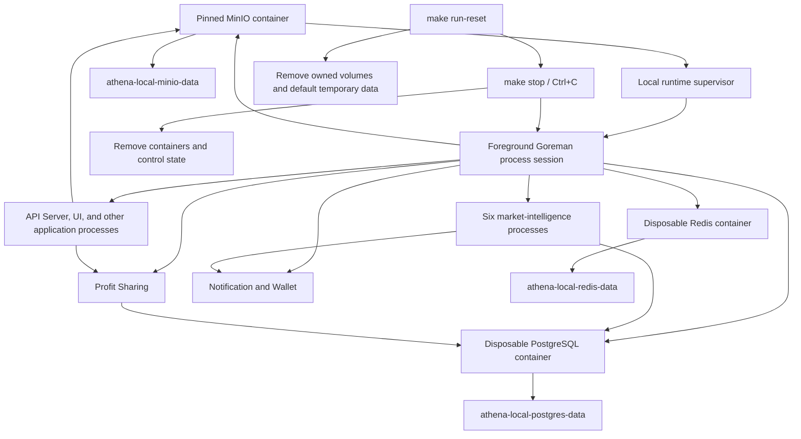

# Local Runtime Orchestration

## Scope

The local runtime owns foreground Procfile supervision, repository-owned process
cleanup, disposable PostgreSQL, Redis, and MinIO containers, persistent local
data volumes, and the distinction between ordinary stop and full reset. The
default Procfile includes six independent market-intelligence capability processes,
Profit Sharing, Athena Notification, Wallet, the broader Token processes, the
UI, and the API Server.

Application behavior remains inside each command and `internal` package.
Production Compose lifecycle is outside this capability, although production
must likewise use PostgreSQL and MinIO volumes. The hot-deploy path preserves
both volumes, idempotently initializes the private avatar bucket, and creates
only the missing `profit_sharing` database before running module migrations.

## Source Locations

| Concern | Source | Key symbols |
| --- | --- | --- |
| Command entry points | [Makefile](../../../Makefile) | `run`, `stop`, `run-reset` |
| Process and cleanup lifecycle | [hack/local-runtime.sh](../../../hack/local-runtime.sh) | `start_runtime`, `stop_runtime`, `reset_runtime`, `cleanup_athena_ports` |
| PostgreSQL persistence | [hack/start-postgres-with-password.sh](../../../hack/start-postgres-with-password.sh) | `postgres_config_fingerprint`, `ensure_postgres_volume` |
| PostgreSQL database initialization | [hack/postgres/init/00-databases.sql](../../../hack/postgres/init/00-databases.sql) | capability database creation |
| Preserved-volume production upgrade | [hack/prod-remote-deploy.sh](../../../hack/prod-remote-deploy.sh) | exact `profit_sharing` database readiness and private MinIO initialization |
| Redis persistence | [hack/start-redis-with-password.sh](../../../hack/start-redis-with-password.sh) | `ensure_redis_volume` |
| MinIO persistence and initialization | [hack/start-minio.sh](../../../hack/start-minio.sh), [deploy/minio/init-avatar-bucket.sh](../../../deploy/minio/init-avatar-bucket.sh) | `ensure_volume`, private avatar bucket and application policy |
| Process declarations | [Procfile](../../../Procfile) | six market-intelligence processes, `profit-sharing`, `notification`, `wallet`, `postgres`, `redis`, `minio`, application processes |
| Capability ports | [common/common.go](../../../common/common.go) | market-intelligence port constants and `DefaultPortProfitSharing` |
| Internal gRPC client lifecycle | [util/grpc/client.go](../../../util/grpc/client.go) | `ClientConnection`, `NewClientConnection`, `CheckHealth`, `Close` |
| API-hosted World Cup dataset | [internal/server/worldcupcorners/worldcupcorners.proto](../../../internal/server/worldcupcorners/worldcupcorners.proto), [internal/server/worldcupcorners/worldcupcorners.go](../../../internal/server/worldcupcorners/worldcupcorners.go) | `WorldCupCornersService`, `GetWorldCupCornersDataset` |
| API Server account-state schema | [internal/accountstate/store/migrations](../../../internal/accountstate/store/migrations), [internal/accountstate/store/sql_store.go](../../../internal/accountstate/store/sql_store.go) | access overrides, account profiles, preferences, `SQLStore` |

## Architecture

Goreman owns a dedicated process session, and every Procfile child group remains
inside that session. The repository records the controller PID, session-leader
PID, both Linux process start times, and repository root under
`.run/athena-local-runtime`. Container and volume labels establish resource
ownership independently from names.

The independently served capabilities have the following runtime boundaries:

| Process | Port | Owned PostgreSQL database | Local service dependencies |
| --- | ---: | --- | --- |
| `worm-markets` | 8084 | `worm_markets` | PostgreSQL; Notification when enabled |
| `fifa-market-dashboard` | 8090 | `fifa_market_dashboard` | PostgreSQL, Worm Markets gRPC, Wallet gRPC |
| `market-radar` | 8092 | None | Notification when enabled |
| `sports-live` | 8094 | `sports_live` | PostgreSQL; Notification when enabled |
| `sports-history` | 8104 | `sports_history` | PostgreSQL |
| `managed-oo` | 8106 | `managed_oo` | PostgreSQL; Notification when enabled |
| `profit-sharing` | 8108 | `profit_sharing` | PostgreSQL |

Notification is active by default on port `8086`, and Wallet is active on port
`8088`. FIFA Market Dashboard calls Worm Markets and Wallet over gRPC; the
capability processes do not import one another's application implementations.
The API Server owns unified account state in the default `athena` PostgreSQL
database. It must connect, validate, and load access state before opening its
listener; the same uncached store serves account profiles and preferences.
Login availability, the ten-module matrix, and reset behavior are documented in
[Account Access Control](../identity-access/account-access-control.md); profile
and preference defaults are documented in
[Account Profile and Preferences](../identity-access/account-profile-and-preferences.md).
Local process-to-process targets default to numeric loopback
`127.0.0.1:<port>`, avoiding resolver work for `localhost`. Production Compose
continues to supply `athena-*:port` service DNS targets and user-provided target
hostnames are passed to gRPC unchanged.

World Cup Corners is a read-only API Server capability. Its dataset is returned
by `GET /api/v1/world-cup-corners/dataset`, which explicitly requires World Cup
Corners `READ`, instead of being bundled in frontend JavaScript. It has no
separate Procfile process, listener, or database.

## Runtime Flow

1. `make run` rejects a verified live supervisor and removes stale state only
   when the recorded processes no longer match their PIDs and start times.
2. It writes a filtered Procfile for `ATHENA_RUN_EXCLUDE`, cleans verified stale
   local containers and Athena listeners, configures the WSL Token WebSocket
   proxy, starts Goreman in a new session, and records its identity.
3. The Procfile starts all six market-intelligence commands and Profit Sharing
   as independent `go run` processes. It also starts Notification and Wallet,
   making the default notification-enabled settings, FIFA dependencies, and
   authenticated Profit Sharing facade usable locally. API Server
   authentication defaults to enabled so Profit Sharing can resolve members by
   their configured Athena accounts.
   Goreman supervises processes but does not merge their lifecycle or health.
   Each internal clientset creates one nonblocking gRPC channel and one typed
   client, reuses that channel for business and health RPCs, reconnects in the
   background when its dependency is temporarily unavailable, and closes the
   channel at its owning process lifecycle boundary.
4. PostgreSQL validates or creates `athena-local-postgres-data`. Its default
   `POSTGRES_DB` is `athena`, and initialization scripts create `worm_markets`,
   `fifa_market_dashboard`, `sports_live`, `sports_history`, `managed_oo`,
   `profit_sharing`, `notification`, `wallet`, `token`, `temporal`, and
   `temporal_visibility`. Each
   capability store connects to only its owned database and applies its own
   embedded migration when automatic migration is enabled. The API Server
   likewise migrates the account-state schema and loads complete access
   aggregates from `athena`. Each persisted access aggregate is one
   `account_access_override` parent
   plus ten `account_module_access_override` children. The read-only,
   repeatable-read load rejects incomplete or invalid matrices, so dependency
   or validation failure prevents that process from serving.
5. Redis validates or creates `athena-local-redis-data`. MinIO validates or
   creates `athena-local-minio-data`, builds the repository-pinned MinIO and mc
   images when absent, starts the server on loopback ports 9000/9001, and runs
   the mc initializer in the server network namespace. The initializer creates
   the private avatar bucket, removes anonymous access, and attaches the
   bucket-scoped application policy. Each run creates attached, labeled,
   `--rm` PostgreSQL, Redis, and MinIO containers. PostgreSQL mounts its
   complete data directory; Redis enables AOF under `/data`; MinIO stores all
   object and IAM state under its `/data` volume.
6. Foreground exit, `Ctrl+C`, or `make stop` first signals Goreman with
   `SIGINT`. After 20 seconds it escalates process groups in the runtime
   session to `SIGTERM`, then after 10 more seconds to `SIGKILL`. Verified
   stale Athena listeners and labeled containers are removed afterward.
   Volumes and default temporary business data remain.
7. `make run-reset` performs the same stop, then deletes the three owned volumes,
   default `/tmp/athena-local`, exact Procfile coverage directories, and local
   runtime control state. It does not start another run.
8. The ordered PostgreSQL initialization files are part of the volume
   fingerprint. Before the first local run with the current capability database
   set, an existing local volume must be cleared with `make run-reset`; the
   next `make run` creates the databases from a clean volume.
9. A production hot deploy requires both external volumes, starts and waits for
   the existing PostgreSQL and MinIO services, reruns private-bucket
   initialization, attempts the exact `profit_sharing` database creation, and
   accepts a failed create only when connecting to that database succeeds. It
   then runs the normal migrations without resetting either retained volume.

## State / Data

`athena-local-postgres-data` stores the complete PostgreSQL cluster, including
all capability databases and the API Server's access, profile, and preference
rows in `athena`. Profit Sharing rounds, proposals, and ballots remain in the
independent `profit_sharing` database. An access parent stores the
ordinary-account login flag, optimistic revision, and update time; its ten
children store one level per product module.
Migration `000003_product_module_access` retains each parent login flag, creates
all ten children at `NONE`, and advances the parent revision and update time
once. The volume labels record Athena ownership, the `postgres` component, and
a SHA-256 fingerprint covering the image, initial user, initial database,
password, and ordered initialization-file paths and contents. Ordinary stop
retains the rows. Full reset deletes them, so ordinary accounts return to their
environment login baselines, `NONE` in all ten modules, and revision zero on
the next start; `admin` remains enabled with each module at its maximum
supported level.

`athena-local-redis-data` stores Redis AOF data. Its labels record Athena
ownership and the `redis` component. Redis container settings can change on
the next run because the container is always recreated.

`athena-local-minio-data` stores the private account-avatar bucket, image
objects, and MinIO IAM metadata. Its labels record Athena ownership and the
`minio` component. Ordinary restart reruns idempotent bucket, user, and policy
initialization against the retained data. The browser and API never use the
root credential; the API uses only the initialized bucket-scoped credential.

The supervisor state and filtered Procfile are transient control data under
`.run/athena-local-runtime`. Default SSH runtime data is under
`/tmp/athena-local`. Default coverage outputs use the exact directories in the
Procfile, including:

- `/tmp/coverage/athena-worm-markets`
- `/tmp/coverage/athena-fifa-market-dashboard`
- `/tmp/coverage/athena-market-radar`
- `/tmp/coverage/athena-sports-live`
- `/tmp/coverage/athena-sports-history`
- `/tmp/coverage/athena-managed-oo`
- `/tmp/coverage/athena-profit-sharing`

The reset allowlist also contains the exact default coverage directories for
the remaining Procfile processes. Custom paths outside that allowlist are never
removed.

## Configuration

| Setting | Behavior |
| --- | --- |
| `ATHENA_RUN_EXCLUDE` | Comma-separated Procfile process names omitted from the run. Any capability can be developed independently by excluding unrelated processes. |
| `ATHENA_RUN_PORT_CLEANUP` | Defaults to `true`; verified stale Athena listeners are stopped and foreign listeners block startup. |
| `ATHENA_RUN_DRY_RUN` | Prints the filtered Procfile without starting processes or cleaning resources. |
| `ATHENA_PROCFILE` | Overrides the source Procfile; the filtered copy remains repository-local control state. |
| `ATHENA_WORM_MARKETS_PORT`, `ATHENA_FIFA_MARKET_DASHBOARD_PORT`, `ATHENA_MARKET_RADAR_PORT`, `ATHENA_SPORTS_LIVE_PORT`, `ATHENA_SPORTS_HISTORY_PORT`, `ATHENA_MANAGED_OO_PORT`, `ATHENA_PROFIT_SHARING_PORT` | Override the independently served local command ports passed by the Procfile. The same values are covered by stale-port cleanup. |
| Internal `ATHENA_*_SERVER_ADDRESS` variables | Override dependency targets. Local command defaults use `127.0.0.1`; production Compose supplies service DNS targets and explicit values are not rewritten. |
| Capability `ATHENA_*_POSTGRES_DSN` variables | Select each capability-owned PostgreSQL database, including `ATHENA_PROFIT_SHARING_POSTGRES_DSN` for `profit_sharing`. Market Radar has no DSN. |
| `ATHENA_SERVER_POSTGRES_DSN` | Selects the API Server's `athena` database for access matrices, profiles, and preferences. The local default uses the shared PostgreSQL connection settings; production Compose supplies an explicit service DSN. |
| `ATHENA_SERVER_DISABLE_AUTH` | Defaults to `false` in the Procfile. Profit Sharing requires authenticated account identity and must not use the development auth bypass for normal local operation. |
| `ATHENA_NOTIFICATION_TELEGRAM_BOT_TOKEN`, `ATHENA_NOTIFICATION_TEST_TELEGRAM_CHAT_ID`, `ATHENA_NOTIFICATION_PROD_TELEGRAM_CHAT_ID` | Required by the default active Notification process. Local configuration must provide all three. |
| `ATHENA_POSTGRES_PORT`, `ATHENA_POSTGRES_IMAGE_TAG`, `POSTGRES_USER`, `POSTGRES_DB`, `POSTGRES_PASSWORD`, `ATHENA_POSTGRES_INIT_DIR` | Configure the disposable PostgreSQL container and its initialization fingerprint where applicable. |
| `ATHENA_REDIS_PORT`, `ATHENA_REDIS_IMAGE_TAG`, `REDIS_PASSWORD` | Configure the disposable Redis container. |
| `ATHENA_MINIO_API_PORT`, `ATHENA_MINIO_CONSOLE_PORT` | Configure the local loopback MinIO API and console bindings; defaults are `9000` and `9001`. |
| `ATHENA_MINIO_IMAGE`, `ATHENA_MINIO_MC_IMAGE` | Override the local names of repository-built images pinned to the configured MinIO and mc source commits. |
| `MINIO_ROOT_USER`, `MINIO_ROOT_PASSWORD` | Configure the local initialization administrator. Defaults are development-only values. |
| `ATHENA_ACCOUNT_AVATAR_S3_ENDPOINT`, `ATHENA_ACCOUNT_AVATAR_S3_REGION`, `ATHENA_ACCOUNT_AVATAR_S3_BUCKET`, `ATHENA_ACCOUNT_AVATAR_S3_ACCESS_KEY_ID`, `ATHENA_ACCOUNT_AVATAR_S3_SECRET_ACCESS_KEY`, `ATHENA_ACCOUNT_AVATAR_S3_PATH_STYLE` | Configure the API Server's private account-avatar S3 client. Procfile defaults target the local MinIO instance and bucket-scoped development credential. |
| `ATHENA_ACCOUNT_AVATAR_MAX_BYTES` | Limits accepted avatar bytes; defaults to and has a hard ceiling of 2 MiB. A lower positive limit is allowed; invalid or oversized values fall back to 2 MiB. |

Container names, volume names, ownership labels, the state directory, and reset
targets are fixed local-runtime boundaries rather than user configuration.

## Invariants

- Only a supervisor whose session-leader PID, start time, command, process group,
  session, and working directory match recorded repository state can be
  signaled. The independently validated controller identity prevents a new run
  from racing the previous controller's cleanup.
- Port cleanup terminates only processes carrying an Athena binary marker and
  running from this repository; foreign listeners are never killed.
- Container and volume deletion requires matching Athena ownership and component
  labels.
- The six market-intelligence capabilities and Profit Sharing remain distinct
  Procfile processes and use distinct ports. Every stateful capability uses
  only its owned PostgreSQL database.
- The API Server must load and validate complete parent-plus-ten-child access
  aggregates from the `athena` database before serving; it does not fall back
  to environment-only account state when that dependency fails.
- World Cup Corners data is served only through its explicit module `READ` rule
  at the API Server and is not embedded in the UI bundle.
- Notification-enabled capabilities communicate through Notification gRPC.
  FIFA Market Dashboard communicates with Worm Markets and Wallet through gRPC.
- Each clientset owns one channel for its configured target. Request paths and
  health checks reuse that channel and never close it per RPC.
- Ordinary stop removes containers and control state but never removes any of
  the three data volumes.
- Full reset never restarts services and never deletes broad or user-supplied
  filesystem paths.
- A PostgreSQL initialization fingerprint mismatch requires explicit full reset.

## Failure Recovery

A stale state file is discarded only when it no longer identifies the same live
process. A live but unverifiable PID stops lifecycle processing rather than
risking termination. Leftover labeled containers are safe to remove because all
durable service state is in named volumes.

PostgreSQL initialization drift fails before container creation and directs the
operator to `make run-reset`. This includes any change to the capability
database collection. An unowned container or volume with a reserved name also
fails with a manual remediation message. Missing resources make stop and reset
no-ops, while a volume still used by an unexpected container causes reset to
fail instead of forcing unrelated cleanup.

Missing pinned MinIO images trigger an explicit source build before container
startup. MinIO readiness or private-bucket initialization failure terminates
that Procfile process and is visible in the foreground log. Once the API has
valid static S3 configuration, a later MinIO outage affects avatar endpoints
without preventing unrelated API capabilities; the retained volume restores
objects and IAM state after restart. An unowned MinIO container or volume with
the reserved name is never removed automatically.

The production hot-deploy database step is idempotent. An already existing
`profit_sharing` database is accepted only after a successful direct connection;
readiness timeout, creation failure without an existing database, or connection
failure stops deployment before migrations or service recreation.

An unavailable Docker daemon is reported as a lifecycle failure rather than
being mistaken for missing resources; stop still completes verified process and
control-state cleanup. A missing Telegram setting causes the default
Notification process to fail startup; capability synchronization remains
process-specific, while notification sends cannot succeed until Notification is
available. Capability dependency and recovery semantics are documented in their
individual design documents.

An unavailable `athena` database prevents API Server startup. Once PostgreSQL
returns, process supervision can restart the API Server and its account-access
snapshot is reconstructed from the retained volume. A full reset intentionally
removes access overrides, profiles, and preferences together with the rest of
the local PostgreSQL cluster; the next start uses the environment login
baseline, all ten modules at `NONE`, revision-zero default profiles, and System
theme for ordinary accounts.

## Observability

Lifecycle logs identify the Goreman PID, signal escalation, stale processes,
port ownership conflicts, container deletion, volume creation or deletion,
reset paths, excluded Procfile services, pinned MinIO image builds and bucket
initialization, and ownership or fingerprint failures.
Goreman streams every capability, dependency, database, UI, and API Server log
in the foreground.

`ATHENA_RUN_DRY_RUN=true make run` is the non-mutating view of the effective
process set. The API Server's Service Status view checks every registered
capability clientset, including Profit Sharing. Process health does not replace
capability-specific freshness or sync status documented by each subsystem.

## Change Checklist

- [ ] Recheck supervisor identity validation, process-session shutdown, and signal timing.
- [ ] Recheck capability ports, database ownership, and gRPC dependencies, including Profit Sharing on `8108`.
- [ ] Recheck shallow-stop and full-reset resource boundaries.
- [ ] Recheck PostgreSQL, Redis, and MinIO container/volume ownership labels and PostgreSQL fingerprint inputs.
- [ ] Recheck account-state ownership, access/profile/preference reset defaults, and World Cup module-protected API hosting.
- [ ] Recheck default temporary and coverage paths and avoid broad or custom-path deletion.
- [ ] Recheck Procfile, database initialization, API Server status wiring, and design-index references.
