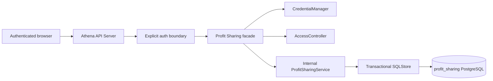

# Profit Sharing

## Scope

Profit Sharing owns reusable five-participant rounds for proposing a complete
responsibility and profit-allocation table, publishing every completed proposal
under a blind label, selecting another participant's proposal, and resolving
ties through runoff ballots. Each round is independent, so later rounds reuse
the same state machine and storage model without copying application code.

Athena Account Credentials and Account Access Control remain responsible for
login identity and current login availability. The API Server facade validates
the configured roster when a draft opens and injects trusted requester data;
the Profit Sharing process does not read the account catalog or account-access
database directly. Profit Sharing is not one of the product-module access
matrix entries.

## Source Locations

| Concern | Source | Key symbols |
| --- | --- | --- |
| Process command | [cmd/athena-profit-sharing/commands/athena-profit-sharing.go](../../../cmd/athena-profit-sharing/commands/athena-profit-sharing.go) | `NewCommand` |
| Internal gRPC runtime | [internal/profitsharing/server.go](../../../internal/profitsharing/server.go), [internal/profitsharing/service.go](../../../internal/profitsharing/service.go) | `Server`, `Service`, `roundToProto` |
| Internal RPC contract and client | [internal/profitsharing/profit_sharing.proto](../../../internal/profitsharing/profit_sharing.proto), [internal/profitsharing/apiclient/apiclient.go](../../../internal/profitsharing/apiclient/apiclient.go) | `ProfitSharingService`, `Clientset` |
| Transactional domain store | [internal/profitsharing/store/operations.go](../../../internal/profitsharing/store/operations.go), [internal/profitsharing/store/records.go](../../../internal/profitsharing/store/records.go), [internal/profitsharing/store/sql_store.go](../../../internal/profitsharing/store/sql_store.go) | `SQLStore`, `withTx`, `RoundSnapshot` |
| Durable schema and queries | [internal/profitsharing/store/migrations/000001_init.sql](../../../internal/profitsharing/store/migrations/000001_init.sql), [internal/profitsharing/store/queries/profit_sharing.sql](../../../internal/profitsharing/store/queries/profit_sharing.sql) | round, participant, proposal, ballot, and vote tables |
| Browser API contract | [internal/server/profitsharing/profitsharing.proto](../../../internal/server/profitsharing/profitsharing.proto) | `ProfitSharingService`, flattened `Round` |
| API facade and roster validation | [internal/server/profitsharing/profitsharing.go](../../../internal/server/profitsharing/profitsharing.go) | `Server`, `validateParticipants`, `projectRound` |
| Authentication boundary | [internal/server/authz.go](../../../internal/server/authz.go) | `administratorGRPCMethods`, `profitSharingAuthenticatedGRPCMethods` |
| API Server and health wiring | [internal/server/athena-server.go](../../../internal/server/athena-server.go), [internal/server/servicestatus/service_status.go](../../../internal/server/servicestatus/service_status.go) | `AthenaServerOpts.ProfitSharingClientset`, `newAthenaServiceSet`, `NewServer` |
| Migration and runtime wiring | [internal/migration/modules.go](../../../internal/migration/modules.go), [Procfile](../../../Procfile), [docker-compose.prod.yml](../../../docker-compose.prod.yml) | `profit-sharing`, port `8108`, database `profit_sharing` |

## Architecture

The public service contains no requester, administrator, or roster-validation
fields. The facade derives the requester from the authenticated context and
sets the internal `requester_account` and `requester_is_admin` fields. The
internal service treats those fields as trusted process-to-process metadata,
then repeats round membership, actor-role, phase, ownership, and ballot checks
at the domain boundary.

Administrator lifecycle methods are authorized by the API Server interceptor.
Round reads and participant mutations use a separate authenticated boundary;
they deliberately do not enter `moduleGRPCRules`. The domain service filters
round lists by membership, rejects non-members, and prevents the administrator
from proposing or voting.

The browser receives a flattened `Round` projection. Internally, summary,
participants, the requester's proposal, and the active ballot remain separate
messages. The facade combines them without weakening the visibility decisions
already made by `roundToProto`. Candidate proposal revisions are always `0` in
`VOTING` and `CLOSED`; an editable revision is returned only for the current
participant's own proposal during `COLLECTING` and in that participant's write
responses.

## Runtime Flow

1. `athena-profit-sharing` connects to the owned `profit_sharing` database,
   applies its embedded migration when automatic migration is enabled, starts
   the domain service, marks gRPC health as serving, and listens on port `8108`.
   API Server creates one reusable internal clientset and registers the public
   gRPC and HTTP gateway service.
2. An administrator creates a draft round. Creation may be intentionally blank;
   no first-round seed or implicit roster is installed. While the round remains
   `DRAFT`, the administrator may replace its slug, title, and participant
   definitions using the round revision as compare-and-swap input.
3. To open a draft, the facade first reads its current roster through the
   internal service. It requires exactly five distinct, non-administrator
   accounts. Every account must exist in `CredentialManager`, carry the `login`
   capability, and have `AccessController.LoginEnabled` at that point in time.
   The facade forwards the complete validated account set with the transition.
4. `OpenRound` locks the draft row and compares its revision. In the same SQL
   transaction it requires a title, display name and baseline responsibility
   for every participant, and exact set equality between the stored roster and
   the facade-validated accounts. It creates one UUID proposal and a five-row
   draft table for each participant, then changes the phase to `COLLECTING`.
5. During collection, a participant reads and edits only their own proposal.
   Each update replaces all five items and increments the proposal revision.
   Submission requires a non-empty responsibility and an explicit basis-point
   value for every participant, with a total of exactly `10000`. A submitted
   proposal can be reopened while collection is still active. From collection
   onward, the administrator can see submission status but not proposal
   contents before publication.
6. After all five proposals are submitted, the administrator publishes the
   round. The transaction assigns stable labels such as `Proposal A` after
   ordering the randomly generated UUIDs, creates ballot 1 with every proposal,
   and changes the phase to `VOTING`. Participants can now see every allocation
   and label, while author identities and live vote totals remain hidden.
7. The browser votes against `/ballots/current/vote`. The facade reads the
   active ballot number with the same requester identity and supplies it to the
   internal mutation. The transactional mutation rechecks that it is still the
   active open ballot, upserts one vote for that participant, and rejects a
   candidate authored by the voter. A ballot transition racing the facade read
   therefore fails rather than applying the vote to another ballot.
8. The administrator closes a ballot only after all five participants have
   voted. A unique highest tally closes the round and records the final proposal.
   A tie atomically closes the current ballot and creates the next ballot with
   only the tied proposals. Every participant votes again and the same close
   operation repeats until one proposal wins.
9. In `CLOSED`, `proposals` and `results` contain only the final active ballot's
   candidates and aggregate totals, including the winner. They do not expose a
   cross-ballot history or statistics for candidates eliminated in earlier
   ballots. Earlier phases expose neither candidate authors nor vote counts.
   Another round starts independently from step 2.
10. Shutdown marks the process health as not serving, gracefully stops gRPC,
    and closes its PostgreSQL pool.

## State / Data

The `profit_sharing` database is the sole durable owner of workflow state:

| Table | Durable responsibility |
| --- | --- |
| `profit_sharing_round` | Unique lowercase letter/number/hyphen slug, title, `draft` / `collecting` / `voting` / `closed` phase, round revision, active ballot, winner, and lifecycle timestamps. |
| `profit_sharing_participant` | Round-local Athena account, display name, stable display order, and baseline responsibility. |
| `profit_sharing_proposal` | One UUID proposal per round participant, draft/submitted status, stable anonymous label, proposal revision, author, and timestamps. |
| `profit_sharing_proposal_item` | One responsibility and nullable basis-point allocation per proposal and participant. |
| `profit_sharing_ballot` | Numbered open or closed ballots for a round. |
| `profit_sharing_ballot_candidate` | Candidate subset for each initial or runoff ballot. |
| `profit_sharing_vote` | One upsertable selection per ballot and voter, including the selected proposal author for database-level self-vote enforcement. |

Round and proposal revisions provide optimistic concurrency. Every lifecycle or
proposal mutation opens a transaction, locks the round and any affected ballot
or proposal rows, validates the complete precondition set, and commits all
related rows together. Reads assemble a requester-specific `RoundSnapshot` from
durable rows; there is no process-local workflow cache or background scheduler.

## Configuration

| Setting | Behavior |
| --- | --- |
| `ATHENA_PROFIT_SHARING_LISTEN_ADDRESS` | Profit Sharing listener address; defaults to `0.0.0.0`. |
| `ATHENA_PROFIT_SHARING_LISTEN_PORT` | Profit Sharing listener port; defaults to `8108`. The Procfile may supply the equivalent `--port` from `ATHENA_PROFIT_SHARING_PORT`. |
| `ATHENA_PROFIT_SHARING_POSTGRES_DSN` | PostgreSQL connection for the owned `profit_sharing` database. |
| `ATHENA_POSTGRES_AUTO_MIGRATE` | Enables embedded startup migration locally; production Compose disables it and uses `athena-migrate`. |
| `ATHENA_PROFIT_SHARING_SERVER_ADDRESS` | API Server internal gRPC target; defaults to `127.0.0.1:8108` and uses Compose service DNS in production. |
| `ATHENA_ACCOUNT_YEGE_*`, `ATHENA_ACCOUNT_LINGJIE_*`, `ATHENA_ACCOUNT_DONGMEI_*`, `ATHENA_ACCOUNT_DINGZHI_*`, `ATHENA_ACCOUNT_YUDIAN_*` | Repository account catalog entries for the five enabled, login-capable members. A draft roster still stores explicit account names and is not seeded from these settings. |
| `ATHENA_SERVER_DISABLE_AUTH` | Defaults to `false` in local and production orchestration. Normal Profit Sharing use requires authentication. |

## Invariants

- A round may be created blank, but only a draft is configurable and it cannot
  open until it has exactly five valid participant accounts plus complete round
  and participant metadata.
- The account set validated by API Server must exactly equal the set locked by
  the domain transaction. The Profit Sharing process never queries account
  infrastructure directly.
- One proposal belongs to each participant. A proposal always carries one item
  for every round participant; submission requires all responsibilities, all
  shares, and a basis-point total of `10000`.
- Collection exposes proposal contents only to their author. Voting exposes all
  proposal contents under blind labels. Author identity and ballot totals become
  visible only after the round closes. Candidate revisions remain hidden in
  voting and closed projections, and closed results describe only the final
  active ballot rather than ballot history.
- Only authenticated round participants can mutate proposals or votes. The
  administrator can manage lifecycle and read rounds but cannot propose or
  vote. A participant cannot vote for their own proposal.
- One current vote exists per participant and ballot. Closing requires votes
  from all five participants; a tie creates a runoff containing exactly the
  highest-tied candidates.
- Round and proposal compare-and-swap revisions, row locks, foreign keys,
  uniqueness constraints, and the database self-vote check remain aligned with
  the service-level rules.

## Failure Recovery

All multi-row mutations roll back on validation, query, cancellation, or commit
failure. Revision mismatches return `Aborted`; invalid lifecycle phases and
incomplete collection or voting return `FailedPrecondition`; malformed rosters
or proposals return `InvalidArgument`; membership and self-vote failures return
`PermissionDenied`.

The API facade's account validation and the domain transition are separate
process calls. The expected round revision and exact roster comparison prevent a
concurrent roster edit from opening with stale validation. Account availability
is a current snapshot rather than a distributed transaction; subsequent
requests still pass normal Athena authentication, so disabling login prevents
that account from continuing to act.

The internal gRPC client uses a reconnecting channel. Dependency failure leaves
durable state unchanged and appears as an unreachable Service Status entry or a
request error. Process restart reconstructs the service from PostgreSQL without
in-memory recovery work. Production hot deploy starts and checks PostgreSQL,
idempotently ensures only the `profit_sharing` database exists on a retained
volume, and runs its registered migration before recreating services.

## Observability

The standalone process publishes standard gRPC health. API Server includes the
clientset in `ListServiceStatuses` under `profit-sharing`, with a one-second
health deadline and `UNREACHABLE` error detail when the dependency cannot be
contacted. Startup logs include the process address and PostgreSQL migration
status. Round, proposal, ballot, and vote timestamps plus revisions provide the
durable diagnostic record; there is no separate workflow-specific metrics or
status endpoint.

## Change Checklist

- [ ] Recheck public versus internal RPC fields and authenticated identity injection.
- [ ] Recheck the four phases, administrator transitions, and participant-only mutations.
- [ ] Recheck five-account roster validation and its account-service dependency direction.
- [ ] Recheck proposal completeness, blind projection, self-vote rejection, tally visibility, and runoff behavior.
- [ ] Recheck transaction locks, revisions, constraints, database ownership, migrations, and port wiring.
- [ ] Recheck health registration, Service Status naming, and runtime documentation.
- [ ] Recheck source links and the [design index](../README.md).
