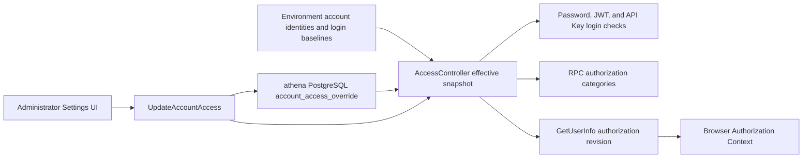

# Account Access Control

## Scope

This capability is the single authorization model for environment-defined local
accounts. It owns login availability, the hierarchical business-data access
level, durable administrator overrides, credential-time enforcement, protected
RPC classification, and the browser's authorization lifecycle.

Environment settings continue to own account existence and the startup baseline
for password hashes, credential capabilities, and configured API Keys.
`SettingsManager` holds thread-safe process-local password and API Key changes.
Business services own the data and operations reached after authorization.
Account creation and custom maintenance messages remain outside this boundary.
Credential expiry and revocation remain part of credential lifecycle rather
than a second authorization policy.

## Source Locations

| Concern | Source | Key symbols |
| --- | --- | --- |
| Environment identities and process-local credentials | [util/settings/accounts_env.go](../../../util/settings/accounts_env.go), [util/settings/accounts_manager.go](../../../util/settings/accounts_manager.go) | `parseAccountsFromRaw`, `GetAccountLoginDefaults`, `GetAccount`, `UpdateAccount`, `SettingsManager` |
| Effective access model | [internal/accountaccess/access.go](../../../internal/accountaccess/access.go), [internal/accountaccess/controller.go](../../../internal/accountaccess/controller.go) | `Access`, `DataAccess`, `Requirement`, `Controller`, `Authorize`, `Update` |
| Durable access store | [internal/accountaccess/store/sql_store.go](../../../internal/accountaccess/store/sql_store.go), [internal/accountaccess/store/queries/account_access_override.sql](../../../internal/accountaccess/store/queries/account_access_override.sql) | `SQLStore`, `ListAccountAccessOverrides`, `UpdateAccountAccessOverride` |
| Schema and migration wiring | [internal/accountaccess/store/migrations](../../../internal/accountaccess/store/migrations), [internal/migration/modules.go](../../../internal/migration/modules.go) | `account_access_override`, `account-access` |
| Account API | [internal/server/account/account.proto](../../../internal/server/account/account.proto), [internal/server/account/account.go](../../../internal/server/account/account.go) | `AccountAccess`, `AccountDataAccess`, `UpdateAccountAccess`, `toAPIAccount` |
| Authentication and authorization | [util/session/sessionmanager.go](../../../util/session/sessionmanager.go), [internal/server/authz.go](../../../internal/server/authz.go) | `AccountMaintenanceErr`, `VerifyLogin`, `Parse`, `administratorGRPCMethods`, `accountSelfServiceGRPCMethods`, `dataReadGRPCMethods`, `dataWriteGRPCMethods`, `authorizeGRPC` |
| Session authorization projection | [internal/server/session/session.proto](../../../internal/server/session/session.proto), [internal/server/session/session.go](../../../internal/server/session/session.go) | `GetUserInfoResponse`, `GetUserInfo` |
| Administration and browser enforcement | [ui/src/app/pages/settings.tsx](../../../ui/src/app/pages/settings.tsx), [ui/src/app/app.tsx](../../../ui/src/app/app.tsx), [ui/src/app/shared/services/requests.ts](../../../ui/src/app/shared/services/requests.ts) | `SettingsPage`, `AuthorizationCtx`, `isAccountMaintenanceError`, `isAccountDataAccessDeniedError` |
| Process wiring | [internal/server/athena-server.go](../../../internal/server/athena-server.go), [docker-compose.prod.yml](../../../docker-compose.prod.yml) | `NewServer`, `ATHENA_SERVER_POSTGRES_DSN` |

## Architecture

`SettingsManager` is the identity and credential source. Its account set and
startup values come from the environment, while password and API Key
self-service replace a copied account under its mutex for the current process.
It does not own an effective authorization snapshot. `accountaccess.Controller`
combines the immutable configured account set with complete PostgreSQL
overrides and is the only process-local source consulted for login and
business-data access.

Protected RPCs do not pass through a role hierarchy or resource/action policy.
Each method belongs directly to one of these boundaries:

| Boundary | Access rule | Representative operations |
| --- | --- | --- |
| Public | No credential required | login, captcha, logout, version, health, and non-sensitive authentication settings |
| Self-service | An authenticated account identity may target its own account | read own account, change own password, create or revoke own API Keys |
| Administrator | Built-in administrator only | list accounts, operate on another account, replace account access, Service Status, Etherscan probes, and gRPC reflection |
| Data read | `READ` or `READ_WRITE` | all market, sports, wallet, notification, Managed OO, Worm, FIFA, World Cup Corners, and Token queries |
| Data write | `READ_WRITE` | wallet secrets and imports, refreshes, scans, notification tests, FIFA edits, Token blocklist changes, and checkpoint updates |

The built-in `admin` account is always login-enabled and has `READ_WRITE` data
access. Its administrator identity additionally grants the administrator
boundary; no ordinary account can acquire that boundary by changing its data
level.

## Runtime Flow

1. API Server startup reads environment-defined identities and login baselines,
   connects to the `athena` PostgreSQL database, and applies the embedded
   `account-access` migration when automatic migration is enabled.
2. `NewController` starts ordinary accounts at their configured login baseline
   and `NONE`, fixes `admin` at enabled and `READ_WRITE`, then loads every
   durable override. Rows for unknown accounts and `admin` are ignored. Invalid
   persisted levels or revisions fail startup before the API listener opens.
3. The session manager, account service, Settings service, and authorization
   interceptors receive the same controller. Every protected JWT and API Key
   request resolves the current account and login flag before its RPC category
   is authorized.
4. An administrator loads Settings. Each ordinary account exposes its login
   control and `No access`, `Read only`, or `Read & write` data level; the
   administrator row is read-only. An ordinary member sees only its own current
   state and no access controls.
5. `PUT /api/v1/account/{name}/access` sends the complete `AccountAccess`,
   including its expected `revision`. `Controller.Update` serializes local
   updates, checks the current revision, commits the compare-and-swap database
   operation, and only then replaces the in-memory aggregate. The UI locks only
   that account row and replaces it with the returned `Account`.
6. Password login verifies the password before reading `login_enabled`. A valid
   password for a disabled account returns gRPC `Unavailable` and HTTP 503 with
   the exact text `系统维护中`; an invalid password remains the generic login
   error. The maintenance outcome does not increment brute-force failure state.
7. A disabled JWT or API Key returns the same maintenance error on its next
   protected request. Disabling does not revoke the credential, so enabling the
   account restores any otherwise valid, unexpired credential.
8. An authenticated identity may read and manage only its own account through
   self-service. An own-password update verifies the current password before
   replacing the in-memory hash and modification time. API Key creation and
   deletion replace the same account's in-memory token collection. These
   identity changes do not write `account_access_override`.
9. A logged-in `NONE` account may use self-service and public pages, but every
   business-data request returns `PermissionDenied`. `READ` permits business
   queries, including Token reads. `READ_WRITE` additionally permits all
   business mutations. Administrator-only operations remain unavailable at
   every ordinary data level.
10. `GetUserInfo` returns `administrator`, `data_access`, and
   `authorization_revision`. While the document is visible, the browser
   refreshes this projection every 15 seconds and when the window regains
   focus. A stable data-access denial also triggers one deduplicated refresh;
   unrelated 403 responses do not.
11. When the authorization revision or level changes, the browser invalidates
    pending request errors, cancels stale data work, clears business caches,
    closes write interactions, and remounts protected routes. A downgrade to
    `READ` keeps the page without write controls, a downgrade to `NONE` routes
    to `/user-info`, and an upgrade adds newly available navigation.
12. The exact maintenance response clears browser session caches and routes to
    `/login?reason=maintenance` without deleting the credential cookie. Normal
    401 and unrelated 503 responses retain their own handling.

The runtime uses one API Server instance. Its update mutex orders local writes;
there is no cross-instance notification or snapshot invalidation mechanism.

## State / Data

`account_access_override` stores one complete override per ordinary account in
the `athena` PostgreSQL database:

| Column | Meaning |
| --- | --- |
| `account_name` | Primary key matching an environment-defined account |
| `login_enabled` | Effective login availability when the override exists |
| `data_access` | Checked value `none`, `read`, or `read_write` |
| `revision` | Positive optimistic-concurrency version incremented by each committed replacement |
| `updated_at` | Timestamp of the latest committed replacement |

Absence of a row produces revision zero, the environment login baseline, and
`NONE` for an ordinary account. A row replaces that complete baseline; fields
are never merged independently. Rows have no foreign key because accounts are
environment identities. Unknown rows remain durable but do not enter the
effective map, and an `admin` row is never effective.

`Controller.access` is a mutex-protected process-local copy of every configured
account's effective aggregate. A database commit is the state transition;
memory becomes visible only afterward. JWTs and API Keys are not stored in this
table and are not mutated by an access change.

`SettingsManager.accounts` is separate process-local identity state. Its
copy-on-write update holds the manager mutex, so readers observe either the old
or new password/API Key collection. These runtime identity changes are not
durable and never alter the configured account set, login baseline, data level,
or access revision.

## Configuration

| Setting | Behavior |
| --- | --- |
| `ATHENA_SERVER_POSTGRES_DSN` | Selects the PostgreSQL connection for account access. The local default connects to database `athena` on `127.0.0.1`; production Compose supplies its service DSN. |
| `ATHENA_POSTGRES_AUTO_MIGRATE` | Defaults to `true` and controls embedded startup migration. Production disables it and runs the migration process first. |
| `ATHENA_ACCOUNT_*_ENABLED` | Defines only an ordinary account's login baseline. Configured ordinary accounts default to disabled when the value is absent. Data access always defaults to `NONE`. |
| `ATHENA_SERVER_DISABLE_AUTH` | Development-only process-wide bypass. Requests receive the built-in administrator identity and bypass both login and authorization enforcement. |

The `admin` login and data level are fixed. The maintenance text and access
levels are not configurable.

## Invariants

- Environment settings are the account registry and credential baseline. The
  account-access database cannot create an account or change its password,
  capabilities, or API Keys; self-service credential changes remain isolated
  in `SettingsManager` process memory.
- `Controller` is the only effective login and data-access authority.
- `admin` is always enabled, always `READ_WRITE`, and cannot be updated through
  the account-access API.
- `NONE < READ < READ_WRITE`; write access always includes read access.
- Administrator access is independent from the data hierarchy and cannot be
  granted to an ordinary account.
- Every non-public request authenticates against the current login aggregate,
  and every protected business request checks its current data level.
- The expected revision must match both the controller snapshot and the
  durable row before a replacement can commit.
- Persistence succeeds before the effective in-memory aggregate changes.
- Password validity is established before disabled state is disclosed.
- Only the stable account-maintenance tuple activates maintenance login UI;
  only the stable account-data reason activates authorization refresh.

## Failure Recovery

A connection, migration, override-load, validation, or controller-construction
failure prevents API Server startup. The process never serves with an
environment-only fallback after its persistent access dependency fails.

A stale expected revision returns the stable
`ACCOUNT_ACCESS_REVISION_CONFLICT` condition as gRPC `Aborted` and HTTP 409.
The administrator UI reloads the authoritative account and leaves its prior
control state unchanged. Any other store failure likewise leaves the controller
snapshot untouched. Both outcomes are safe to retry from a newly loaded
revision.

An ordinary restart reconstructs the controller from retained PostgreSQL data.
`make stop` retains overrides. `make run-reset` deletes the local PostgreSQL
volume, so the next start returns ordinary accounts to their environment login
baseline and `NONE`. Re-enabling or reauthorizing an account needs no token
repair because still-valid credentials are checked against the next snapshot.
Any process-local password or API Key changes are discarded by an API Server
restart, which reconstructs identity state from the environment baseline;
ordinary stop does not make those identity changes durable.

If the initial or periodic browser authorization request fails without a stable
maintenance or data-denial reason, the browser keeps an explicit retry/error
boundary and does not synthesize a less privileged state.

## Observability

Startup logs report the account-access PostgreSQL connection and migration
state. Invalid stored rows and dependency failures appear before listener
startup. Update and compare-and-swap failures travel through the standard gRPC
and gateway error path.

Disabled credentials are identifiable by gRPC `Unavailable`, HTTP 503, gRPC
code 14, and `系统维护中`. Data denials carry `ACCOUNT_DATA_ACCESS_DENIED` in
`google.rpc.ErrorInfo` under the `athena.account_access` domain; administrator
denials use `ACCOUNT_ADMIN_REQUIRED`, and revision conflicts use
`ACCOUNT_ACCESS_REVISION_CONFLICT`. The capability adds no dedicated metric or
health endpoint.

## Change Checklist

- [ ] Environment identities, login baselines, default `NONE`, and ignored-row semantics are current.
- [ ] Startup load remains fail-closed and precedes credential or listener construction.
- [ ] Every RPC remains in exactly one public, self-service, administrator, data-read, or data-write boundary.
- [ ] Full-row CAS, administrator protection, and persistence-before-memory ordering remain aligned.
- [ ] Password and API Key self-service remains mutex-protected, process-local, and separate from account-access persistence.
- [ ] Password, JWT, API Key, and `GetUserInfo` use the same effective controller snapshot.
- [ ] Maintenance 503, data 403, revision 409, and ordinary authentication errors remain distinguishable.
- [ ] Browser polling, focus refresh, cache invalidation, and route downgrade behavior remain current.
- [ ] Restart, reset, and credential restoration semantics are current.
- [ ] Source links and named symbols resolve to the implementation.
- [ ] The [design index](../README.md) contains the correct entry.
