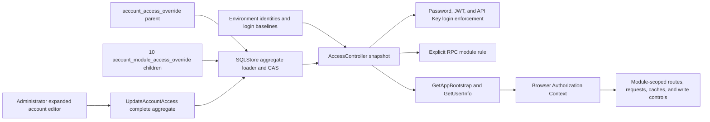

# Account Access Control

## Scope

Account Access Control is the single authorization model for environment-defined
local accounts. It owns account login availability, a complete product-module
access matrix, durable administrator overrides, credential-time enforcement,
explicit RPC authorization rules, account administration, and browser
authorization synchronization.

Environment settings remain the account registry and startup identity baseline:
they define names, password hashes, credential capabilities, configured API Keys,
and each ordinary account's default login flag. `SettingsManager` applies
thread-safe password and API Key changes for the running process. Business
services own the data and mutations reached after authorization. Account
creation, role assignment, resource/action policies, and configurable
maintenance messages are outside this capability.

## Source Locations

| Concern | Source | Key symbols |
| --- | --- | --- |
| Environment identities and process-local credentials | [util/settings/accounts_env.go](../../../util/settings/accounts_env.go), [util/settings/accounts_manager.go](../../../util/settings/accounts_manager.go) | `parseAccountsFromRaw`, `GetAccountLoginDefaults`, `GetAccount`, `UpdateAccount`, `SettingsManager` |
| Effective access model | [internal/accountaccess/access.go](../../../internal/accountaccess/access.go), [internal/accountaccess/controller.go](../../../internal/accountaccess/controller.go) | `Module`, `AccessLevel`, `Access`, `AllModules`, `MaxAccessLevel`, `Requirement`, `Controller` |
| Durable aggregate store | [internal/accountaccess/store/sql_store.go](../../../internal/accountaccess/store/sql_store.go), [internal/accountaccess/store/queries/account_access_override.sql](../../../internal/accountaccess/store/queries/account_access_override.sql) | `SQLStore`, `ListAccountAccessOverrides`, `UpdateAccountAccessOverride` |
| Schema and migration wiring | [internal/accountaccess/store/migrations](../../../internal/accountaccess/store/migrations), [internal/migration/modules.go](../../../internal/migration/modules.go) | `account_access_override`, `account_module_access_override`, `account-access` |
| Account API and canonical projection | [internal/server/account/account.proto](../../../internal/server/account/account.proto), [internal/server/account/account.go](../../../internal/server/account/account.go) | `AccountDataModule`, `AccountModuleAccess`, `AccountAccess`, `UpdateAccountAccess`, `ToAPIAccountAccess` |
| Authentication and explicit RPC rules | [util/session/sessionmanager.go](../../../util/session/sessionmanager.go), [internal/server/authz.go](../../../internal/server/authz.go) | `AccountMaintenanceErr`, `VerifyLogin`, `Parse`, `moduleGRPCRules`, `grpcModuleRule`, `authorizeGRPC` |
| Bootstrap and live session projection | [internal/server/appbootstrap/appbootstrap.go](../../../internal/server/appbootstrap/appbootstrap.go), [internal/server/session/session.go](../../../internal/server/session/session.go) | `GetAppBootstrap`, `GetUserInfo`, `ProjectUserInfo` |
| Browser module registry and authorization state | [ui/src/app/shared/access-modules.ts](../../../ui/src/app/shared/access-modules.ts), [ui/src/app/shared/account-access.ts](../../../ui/src/app/shared/account-access.ts), [ui/src/app/shared/context.ts](../../../ui/src/app/shared/context.ts), [ui/src/app/app.tsx](../../../ui/src/app/app.tsx) | `accountDataModules`, `moduleAccessLevels`, `AuthorizationCtx`, `access`, `canRead`, `canWrite` |
| Administration UI | [ui/src/app/pages/settings.tsx](../../../ui/src/app/pages/settings.tsx) | `SettingsPage`, `ResourceTable`, account access draft and expanded row |
| Request and cache invalidation | [ui/src/app/shared/services/requests.ts](../../../ui/src/app/shared/services/requests.ts), [ui/src/app/components/data.ts](../../../ui/src/app/components/data.ts) | `abortAuthorizationRequests`, `clearAsyncDataCache`, `isAccountMaintenanceError`, `isAccountDataAccessDeniedError` |
| Process wiring | [internal/server/athena-server.go](../../../internal/server/athena-server.go), [docker-compose.prod.yml](../../../docker-compose.prod.yml) | `NewServer`, `ATHENA_SERVER_POSTGRES_DSN` |

## Architecture

`accountaccess.Controller` is the only process-local source of effective login
and product access. Each ordinary account has one `Access` aggregate containing
`LoginEnabled`, a ten-entry `Modules` map, and `Revision`. The map is cloned at
controller boundaries so callers cannot mutate the shared snapshot.

The canonical matrix and maximum meaningful levels are:

| Module | Maximum | Public capability boundary |
| --- | --- | --- |
| `market_radar` | `READ` | Hot, realtime, mover, and status queries |
| `sports_live` | `READ` | Current sports and live-price queries |
| `sports_history` | `READ_WRITE` | History queries and manual refresh |
| `managed_oo` | `READ_WRITE` | Proposal/dispute queries and block scan |
| `worm_markets` | `READ` | Worm event and status APIs |
| `fifa_market_dashboard` | `READ_WRITE` | FIFA facade reads and event-config update |
| `world_cup_corners` | `READ` | Protected dataset query |
| `token` | `READ_WRITE` | Token catalog, research, policy, and chain operations |
| `wallet` | `READ_WRITE` | Wallet reads, secrets, creation, import, and alias update |
| `notifications` | `READ_WRITE` | Delivery reads and test send |

`NONE < READ < READ_WRITE` within one module. Read-only modules reject
`READ_WRITE`; administrator full access means the maximum shown above for every
module. A grant in one module never grants another module.

Protected RPCs use four direct boundaries:

| Boundary | Rule |
| --- | --- |
| Public | Login, captcha, logout, application bootstrap, version, and health do not require a credential. `GetUserInfo` is public optional authentication so it can project anonymous, authenticated, or maintenance state. |
| Authenticated account identity | An account may get its own account, verify and change its own password, and manage its own API Keys. Targeting another account requires administrator access. |
| Administrator | The built-in `admin` identity exclusively owns account listing and access replacement, Service Status, Etherscan probes, and gRPC reflection. |
| Product module | Every public business RPC has one explicit `moduleGRPCRules` entry containing a module and required `READ` or `READ_WRITE` level. |

An authenticated method absent from all boundaries fails closed. Wallet detail
normally requires Wallet `READ`; `reveal_secrets=true` raises that same method to
Wallet `READ_WRITE`. The FIFA public facade is authorized only by the FIFA
module even though its implementation calls Worm Markets and Wallet internally.
Token APIs all use the single Token module.

## Runtime Flow

1. API Server startup reads environment identities and login baselines,
   connects to the `athena` PostgreSQL database, and applies the embedded
   `account-access` migrations when automatic migration is enabled.
2. `NewController` assigns every ordinary account its environment login flag,
   all ten modules at `NONE`, and revision zero. It fixes `admin` at enabled and
   each module's maximum level, then loads persisted aggregates. Unknown account
   names and an `admin` override are ignored. A persisted ordinary account must
   have a positive revision and exactly one valid child row for every module;
   invalid or incomplete state prevents listener startup.
3. The session manager, account service, application-bootstrap service, and
   authorization interceptor share that controller. Password login, JWTs, and
   API Keys resolve the current login flag on every relevant request, and every
   protected business RPC then resolves its current module level.
4. The Account API always projects modules in canonical order. A
   `PUT /api/v1/account/{name}/access` body contains `loginEnabled`, expected
   `revision`, and the complete ten-entry `moduleAccess` matrix. Missing,
   duplicate, unspecified, or unknown modules, unknown levels, and
   `READ_WRITE` for a read-only module return `InvalidArgument` before storage.
5. `Controller.Update` rejects `admin`, clones and validates the full aggregate,
   serializes process-local writes, and compares the expected revision with its
   snapshot. `SQLStore.UpdateAccountAccessOverride` performs the durable CAS in
   one PostgreSQL transaction: expected revision zero creates the parent at
   revision one; a positive expectation updates only a parent at that revision
   and advances it once. The transaction then upserts all ten fixed child rows
   and commits. A parent CAS miss or statement failure rolls back both tables.
   Only a committed, revalidated aggregate replaces the controller snapshot.
6. Password login verifies the password before consulting `login_enabled`. A
   correct password for a disabled account returns gRPC `Unavailable` and HTTP
   503 with `系统维护中`; a wrong password remains a generic login failure. The
   maintenance outcome does not increment brute-force failure state.
7. A disabled JWT or API Key returns the same maintenance result on its next
   protected request. The credential is not revoked, so enabling the account
   restores any otherwise valid, unexpired credential.
8. A module denial occurs before its business service or API proxy is invoked.
   It returns gRPC `PermissionDenied` and HTTP 403 with stable reason
   `ACCOUNT_DATA_ACCESS_DENIED` plus `module`, `required_access`, and
   `effective_access` metadata. Administrator denial uses the separate
   `ACCOUNT_ADMIN_REQUIRED` reason.
9. Password and API Key self-service update a copied `SettingsManager` account
   under its mutex. Own-password changes still verify the current password.
   These process-local identity changes do not write the account-access tables
   and return to the environment baseline when API Server restarts.
10. `GetAppBootstrap` returns settings and the initial optional-authentication
    session projection. A valid enabled credential includes the complete
    `AccountAccess`; a valid disabled credential produces the in-band
    `ACCOUNT_MAINTENANCE` status with HTTP 200 and no user projection.
    `GetUserInfo` returns the same complete aggregate for post-login and live
    refreshes.
11. The browser initializes `AuthorizationCtx` from bootstrap, refreshes
    `GetUserInfo` at most every 15 seconds while visible, and refreshes on focus,
    visibility return, or a stable data-access denial. Refreshes are deduplicated;
    unrelated 403 responses do not trigger them.
12. Authorization Context exposes `access(module)`, `canRead(module)`, and
    `canWrite(module)`. Navigation, routes, page controls, requests, and caches
    all use the shared `accountDataModules` registry. A module reduced below
    `READ` aborts that module's requests, clears only that module's cache, and
    routes an active page to `/user-info`; Token also clears saved project return
    positions. A module reduced from `READ_WRITE` to `READ` aborts only writes,
    preserves the read page and read cache, and lets page effects destroy write
    drafts, confirmations, overlays, and sensitive Wallet state. Unchanged
    modules retain their requests and caches.
13. An exact maintenance 503 after bootstrap clears browser session state and
    business caches and routes to `/login?reason=maintenance` without deleting
    the credential cookie. Normal 401 and unrelated 503 responses retain their
    ordinary handling.

The runtime uses one API Server instance. Its update mutex orders local writes;
there is no cross-instance snapshot notification mechanism.

## Administration UI

Settings uses one account `ResourceTable`. On desktop, one account at a time is
opened through an expanded row. At widths up to 900 px, the compact account card
contains the same inline expansion. `admin` displays `Always enabled` and
`Full access`. An ordinary account viewing Settings sees only its own read-only
state.

An administrator edits one ordinary account as a complete draft containing the
login flag and all ten module levels. Only levels supported by a module are
offered. Switching accounts, collapsing the editor, or leaving with a dirty
draft requires discard confirmation. Save presents one summary confirmation
when it disables login, lowers module access, or grants a module
`READ_WRITE`, then sends one complete aggregate without optimistic row
replacement. A successful response replaces the account. A revision conflict
reloads authoritative state and discards the stale draft; another write failure
retains the draft for correction or retry.

## State / Data

One persisted override is a parent plus exactly ten children.

`account_access_override`:

| Column | Meaning |
| --- | --- |
| `account_name` | Primary key matching an environment-defined identity at runtime |
| `login_enabled` | Effective login availability for the persisted aggregate |
| `revision` | Positive aggregate CAS version, advanced once per committed replacement |
| `updated_at` | Parent replacement time |

`account_module_access_override`:

| Column | Meaning |
| --- | --- |
| `account_name` | Foreign key to the parent with cascade delete |
| `module` | One of the ten canonical module identifiers |
| `access_level` | `none`, `read`, or `read_write`, constrained by the module maximum |

The child primary key is `(account_name, module)`. Database constraints reject
unknown modules, unknown levels, and read-write values for read-only modules.
`SQLStore.ListAccountAccessOverrides` loads parents and children in one
read-only, repeatable-read transaction. It rejects nonpositive revisions,
duplicate parents, orphan or duplicate children, unknown modules, and any
aggregate that fails the complete ten-row validation before committing the
read transaction.

Accounts have no database foreign key to environment configuration. Unknown
persisted aggregates remain durable but do not enter the effective controller
map. Absence of a parent produces the ordinary account's environment login
baseline, all modules at `NONE`, and revision zero. Migration
`000003_product_module_access` retains each existing parent's login flag,
creates all ten children at `NONE`, and advances that aggregate's revision and
update time once. The current schema contains no aggregate-wide data level.

`Controller.access` is a mutex-protected, deep-copied process snapshot. The
database commit is the access state transition; memory changes afterward.
`SettingsManager.accounts` is a separate mutex-protected process identity store.
JWTs and API Keys are neither stored nor revoked by an access update.

The browser stores the complete active aggregate and derives module access from
it. Business caches contain responses, not authorization decisions, and are
tagged with their product module so a change can invalidate only the affected
scope.

## Configuration

| Setting | Behavior |
| --- | --- |
| `ATHENA_SERVER_POSTGRES_DSN` | Selects PostgreSQL database `athena` for the parent and child access tables. Local defaults use `127.0.0.1`; production Compose supplies its service DSN. |
| `ATHENA_POSTGRES_AUTO_MIGRATE` | Defaults to `true` and controls embedded startup migration. Production disables it and runs the migration process before API Server. |
| `ATHENA_ACCOUNT_*_ENABLED` | Defines only an ordinary account's login baseline. An omitted value defaults the ordinary account to disabled. Every module still defaults to `NONE`. |
| `ATHENA_SERVER_DISABLE_AUTH` | Development-only process-wide bypass. Requests and bootstrap use the built-in administrator identity with the maximum module matrix. |

The administrator baseline, module collection, maximum levels, maintenance
text, and access levels are implementation constants.

## Invariants

- Environment configuration is the account registry and credential baseline;
  access-table rows cannot create identities or change credentials.
- `Controller` is the only effective login and module-access authority.
- Every effective `Access` contains exactly the ten canonical modules.
- `admin` is always enabled, has every module's maximum, and cannot be updated.
- Access is independent by module. `READ_WRITE` includes `READ` only within the
  same module, and read-only modules never accept `READ_WRITE`.
- Administrator access cannot be granted through a module level.
- Every authenticated public method matches exactly one self-service,
  administrator, or explicit module rule; otherwise authorization fails closed.
- Persistence updates the parent and all ten children in one CAS transaction
  and succeeds before the controller snapshot changes.
- Password validity is established before disabled state is disclosed.
- Bootstrap and `GetUserInfo` project the same aggregate used by request-time
  authorization; neither projection replaces server enforcement.
- Only stable maintenance and data-denial tuples activate their specialized
  browser recovery flows.
- Module authorization changes invalidate only the affected browser scope;
  identity or maintenance changes clear the whole authenticated scope.

## Failure Recovery

A PostgreSQL connection, migration, aggregate-load, validation, or controller
construction failure prevents API Server from opening its listener. It never
serves an environment-only fallback after the persistent dependency fails.

A stale expected revision returns `ACCOUNT_ACCESS_REVISION_CONFLICT` as gRPC
`Aborted` and HTTP 409. A parent CAS miss or any child upsert failure rolls back
the transaction and leaves the controller snapshot unchanged. The administrator
reloads the current account before editing again.

An ordinary restart rebuilds effective state from environment identities and
the retained PostgreSQL aggregate. `make stop` preserves both access tables.
`make run-reset` removes the PostgreSQL volume, so ordinary accounts return to
their environment login flags, ten `NONE` levels, and revision zero; `admin`
returns to its fixed maximum matrix. Process-local password and API Key changes
also return to the environment baseline after API Server restart.

If bootstrap or authorization refresh fails without a stable maintenance or
data-denial reason, the browser keeps an explicit retry/error boundary instead
of inventing an access state. A newly granted module becomes available on the
next successful projection without replacing the credential.

## Observability

Startup logs report account-access PostgreSQL connection and migration state.
Incomplete aggregates, invalid values, and dependency failures are reported
before listener startup. CAS and transaction failures use the normal gRPC and
gateway error path.

Initial disabled credentials are visible as the `ACCOUNT_MAINTENANCE` bootstrap
status. Later maintenance uses gRPC `Unavailable`, HTTP 503, code 14, and
`系统维护中`. Module denials carry `ACCOUNT_DATA_ACCESS_DENIED` in
`google.rpc.ErrorInfo` under `athena.account_access`, together with module and
required/effective levels. Administrator denials use `ACCOUNT_ADMIN_REQUIRED`;
revision conflicts use `ACCOUNT_ACCESS_REVISION_CONFLICT`. No dedicated metric
or health endpoint is added.

## Change Checklist

- [ ] Environment identity baselines and the fixed administrator matrix are current.
- [ ] The canonical ten modules and their maximum levels match core, Proto, SQL, RPC rules, and frontend registry.
- [ ] Parent-plus-ten-child loading remains complete and fail-closed.
- [ ] Full-aggregate transactional CAS and persistence-before-memory ordering remain aligned.
- [ ] Every authenticated public RPC has one self-service, administrator, or explicit module rule.
- [ ] Password, JWT, API Key, bootstrap, and session refresh use the same controller snapshot.
- [ ] Settings row expansion, complete drafts, confirmations, conflicts, and responsive layout remain current.
- [ ] Fifteen-second refresh and module-scoped request, cache, route, and write-state cleanup remain current.
- [ ] Maintenance 503, module 403, administrator 403, revision 409, and ordinary authentication errors remain distinguishable.
- [ ] Restart, reset, and process-local credential recovery semantics are current.
- [ ] Source links and named symbols resolve to the implementation.
- [ ] The [design index](../README.md) contains the correct entry.
