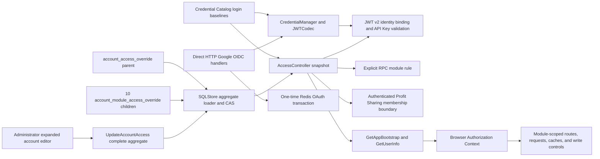

# Account Access Control

## Scope

Account Access Control is the single authorization model for environment-defined
local accounts. It owns account login availability, a complete product-module
access matrix, durable administrator overrides, credential-time enforcement,
explicit RPC authorization rules, account administration, and browser
authorization synchronization.

The one-shot `accountcredentials.Catalog` supplies the fixed account names and
each ordinary account's default login flag. `CredentialManager` and `JWTCodec`
own Google subject bindings, capabilities, API Keys, and Athena JWT v2 operations as
described in [Account Credentials](account-credentials.md); they do not own
effective access. Business services own the data and mutations reached after
authorization. Account creation, role assignment, resource/action policies,
and configurable maintenance messages are outside this capability. Durable
display names, avatars, tiers, and theme preferences belong to [Account Profile
and Preferences](account-profile-and-preferences.md).

## Source Locations

| Concern | Source | Key symbols |
| --- | --- | --- |
| Environment account registry and login baselines | [internal/accountcredentials/catalog.go](../../../internal/accountcredentials/catalog.go) | `Catalog`, `LoadCatalog`, `LoginDefaults` |
| Effective access model | [internal/accountaccess/access.go](../../../internal/accountaccess/access.go), [internal/accountaccess/controller.go](../../../internal/accountaccess/controller.go) | `Module`, `AccessLevel`, `Access`, `AllModules`, `MaxAccessLevel`, `Requirement`, `Controller` |
| Durable aggregate store | [internal/accountstate/store/sql_store.go](../../../internal/accountstate/store/sql_store.go), [internal/accountstate/store/queries/account_access_override.sql](../../../internal/accountstate/store/queries/account_access_override.sql) | `SQLStore`, `ListAccountAccessOverrides`, `UpdateAccountAccessOverride` |
| Schema and migration wiring | [internal/accountstate/store/migrations](../../../internal/accountstate/store/migrations), [internal/migration/modules.go](../../../internal/migration/modules.go) | `account_access_override`, `account_module_access_override`, `account-state` |
| Account API and canonical projection | [internal/server/account/account.proto](../../../internal/server/account/account.proto), [internal/server/account/account.go](../../../internal/server/account/account.go) | `AccountDataModule`, `AccountModuleAccess`, `AccountAccess`, `UpdateAccountAccess`, `ToAPIAccountAccess` |
| Google login and explicit authorization rules | [internal/googleoidc/handler.go](../../../internal/googleoidc/handler.go), [internal/googleoidc/store.go](../../../internal/googleoidc/store.go), [internal/accountcredentials/manager.go](../../../internal/accountcredentials/manager.go), [internal/accountcredentials/jwt_codec.go](../../../internal/accountcredentials/jwt_codec.go), [util/session/sessionmanager.go](../../../util/session/sessionmanager.go), [internal/server/authz.go](../../../internal/server/authz.go) | `Handler`, `TransactionStore`, `ResolveGoogleSubject`, `IssueGoogleLoginSession`, `JWTCodec`, `AccountMaintenanceErr`, `CreateGoogleLogin`, `Parse`, `moduleGRPCRules`, `grpcModuleRule`, `authorizeGRPC` |
| Bootstrap and live session projection | [internal/server/appbootstrap/appbootstrap.go](../../../internal/server/appbootstrap/appbootstrap.go), [internal/server/session/session.go](../../../internal/server/session/session.go) | `GetAppBootstrap`, `GetUserInfo`, `ProjectUserInfo` |
| Browser module registry and authorization state | [ui/src/app/shared/access-modules.ts](../../../ui/src/app/shared/access-modules.ts), [ui/src/app/shared/account-access.ts](../../../ui/src/app/shared/account-access.ts), [ui/src/app/shared/context.ts](../../../ui/src/app/shared/context.ts), [ui/src/app/app.tsx](../../../ui/src/app/app.tsx) | `accountDataModules`, `moduleAccessLevels`, `AuthorizationCtx`, `access`, `canRead`, `canWrite` |
| Administration UI | [ui/src/app/pages/admin-accounts.tsx](../../../ui/src/app/pages/admin-accounts.tsx) | `AdminAccountsPage`, `AccountAccessEditor` |
| Request and cache invalidation | [ui/src/app/shared/services/requests.ts](../../../ui/src/app/shared/services/requests.ts), [ui/src/app/components/data.ts](../../../ui/src/app/components/data.ts) | `abortAuthorizationRequests`, `clearAsyncDataCache`, `isAccountMaintenanceError`, `isAccountDataAccessDeniedError` |
| Sensitive write lifetime | [ui/src/app/shared/sensitive-write-scope.tsx](../../../ui/src/app/shared/sensitive-write-scope.tsx), [ui/src/app/pages/wallets.tsx](../../../ui/src/app/pages/wallets.tsx) | `SensitiveWriteScope`, `useSensitiveWriteLease`, `SensitiveTaskResult`, `WalletWriteSurface`, `SecretText` |
| Process wiring | [internal/server/athena-server.go](../../../internal/server/athena-server.go), [docker-compose.prod.yml](../../../docker-compose.prod.yml) | `NewServer`, `ATHENA_SERVER_POSTGRES_DSN` |

## Architecture

`accountaccess.Controller` is the only process-local source of effective login
and product access. Each ordinary account has one `Access` aggregate containing
`LoginEnabled`, a ten-entry `Modules` map, and `Revision`. The map is cloned at
controller boundaries so callers cannot mutate the shared snapshot.

The canonical matrix and maximum meaningful levels are:

| Module | Maximum | Public capability boundary |
| --- | --- | --- |
| `market_radar` | `READ` | Hot, realtime, mover, and status queries |
| `sports_live` | `READ` | Current sports and live-price queries |
| `sports_history` | `READ_WRITE` | History queries and manual refresh |
| `managed_oo` | `READ_WRITE` | Proposal/dispute queries and block scan |
| `worm_markets` | `READ` | Worm event and status APIs |
| `fifa_market_dashboard` | `READ_WRITE` | FIFA facade reads and event-config update |
| `world_cup_corners` | `READ` | Protected dataset query |
| `token` | `READ_WRITE` | Token catalog, research, policy, and chain operations |
| `wallet` | `READ_WRITE` | Wallet reads, secrets, creation, import, and alias update |
| `notifications` | `READ_WRITE` | Delivery reads and test send |

`NONE < READ < READ_WRITE` within one module. Read-only modules reject
`READ_WRITE`; administrator full access means the maximum shown above for every
module. A grant in one module never grants another module.

Public entry points and protected RPCs use five direct boundaries:

| Boundary | Rule |
| --- | --- |
| Public | Direct HTTP `/auth/google/login`, `/auth/google/callback`, and `/auth/logout`, plus application bootstrap, version, and health, do not pass through authenticated gRPC authorization. `GetUserInfo` is public optional authentication so it can project anonymous, authenticated, or maintenance state. |
| Authenticated account identity | An account may get its own account, change its own profile and preferences, and list/create/delete only its own API Keys. An administrator may get or change another account's profile but cannot manage that account's preferences or API Keys. |
| Administrator | The built-in `admin` identity exclusively owns account listing, tier and access replacement, Service Status, Etherscan probes, and gRPC reflection. |
| Product module | Every public business RPC has one explicit `moduleGRPCRules` entry containing a module and required `READ` or `READ_WRITE` level. |
| Profit Sharing | Every Profit Sharing RPC requires an enabled authenticated Athena account. Administrator lifecycle RPCs use the administrator boundary; member reads and writes pass the account identity to the Profit Sharing domain, which enforces round membership and rejects administrator proposal or vote mutations. |

An authenticated method absent from all boundaries fails closed. Wallet detail
normally requires Wallet `READ`; `reveal_secrets=true` raises that same method to
Wallet `READ_WRITE`. The FIFA public facade is authorized only by the FIFA
module even though its implementation calls Worm Markets and Wallet internally.
Token APIs all use the single Token module.

Opening a Profit Sharing round has an additional cross-capability precondition.
The API Server facade reads every configured participant account from
`CredentialManager`, requires `login` capability and a non-empty Google identity
binding, and requires current `AccessController.LoginEnabled`. It rejects
`admin`, duplicates, missing accounts, unbound accounts, and disabled accounts
before forwarding the validated account set to the Profit Sharing service. The
service compares that set with the complete draft-round participant roster in
its own transaction, avoiding any reverse dependency from Profit Sharing to
account infrastructure.

## Runtime Flow

1. API Server startup loads the immutable account credential catalog, copies
   its account seeds into `CredentialManager`, constructs `JWTCodec` from its
   signing key, and, when authentication is enabled, validates that every
   login-capable account has one unique Google subject and that `admin` retains
   its unique binding. It connects to the `athena` PostgreSQL database and
   applies the embedded `account-state` migrations when automatic migration is
   enabled.
2. `NewController` assigns every ordinary account its environment login flag,
   all ten modules at `NONE`, and revision zero. It fixes `admin` at enabled and
   each module's maximum level, then loads persisted aggregates. Unknown account
   names and an `admin` override are ignored. A persisted ordinary account must
   have a positive revision and exactly one valid child row for every module;
   invalid or incomplete state prevents listener startup.
3. The session manager, account service, application-bootstrap service, and
   authorization interceptor share that controller. SessionManager composes
   `CredentialManager` and `JWTCodec` with the controller: Google login issuance,
   Athena browser sessions, and API Keys resolve the current login flag on every
   relevant request, and every protected business RPC then resolves its current
   module level.
4. The Account API always projects modules in canonical order. A
   `PUT /api/v1/account/{name}/access` body contains `loginEnabled`, expected
   `revision`, and the complete ten-entry `moduleAccess` matrix. Missing,
   duplicate, unspecified, or unknown modules, unknown levels, and
   `READ_WRITE` for a read-only module return `InvalidArgument` before storage.
5. `Controller.Update` rejects `admin`, clones and validates the full aggregate,
   serializes process-local writes, and compares the expected revision with its
   snapshot. `SQLStore.UpdateAccountAccessOverride` performs the durable CAS in
   one PostgreSQL transaction: expected revision zero creates the parent at
   revision one; a positive expectation updates only a parent at that revision
   and advances it once. The transaction then upserts all ten fixed child rows
   and commits. A parent CAS miss or statement failure rolls back both tables.
   Only a committed, revalidated aggregate replaces the controller snapshot.
6. `/auth/google/callback` consumes its one-time Redis transaction, verifies the
   Google ID token, resolves the verified `sub` to one fixed Athena account, and
   calls `CreateGoogleLogin`. Session issuance requires current `login`
   capability, the same Google binding, and `LoginEnabled`; a disabled account
   returns the maintenance reason and receives no Athena cookie. Successful
   issuance creates a version-2 Athena JWT whose irreversible identity-binding
   claim is derived from the provider and current Google subject.
7. Every browser session and API Key must carry `athenaTokenVersion=2`, an
   Athena issuer, valid registered time claims, and a JTI. A login session must
   also carry an expiration and the current Google identity-binding digest; an
   API Key instead requires matching current process-local JTI metadata. A
   disabled credential returns the maintenance result on its next
   protected request. The credential is not revoked, so enabling the account
   restores any otherwise valid, unexpired credential.
8. A module denial occurs before its business service or API proxy is invoked.
   It returns gRPC `PermissionDenied` and HTTP 403 with stable reason
   `ACCOUNT_DATA_ACCESS_DENIED` plus `module`, `required_access`, and
   `effective_access` metadata. Administrator denial uses the separate
   `ACCOUNT_ADMIN_REQUIRED` reason.
9. API Key self-service uses typed `CredentialManager` operations whose target
   always comes from the authenticated identity. Each account has an independent
   lock, and API Key signing plus metadata insertion is one serialized operation
   using dependency-free `JWTCodec`. API Key metadata changes do not write the
   account-access tables and return to the environment baseline when API Server
   restarts.
10. `GetAppBootstrap` returns settings and the initial optional-authentication
    session projection. A valid enabled credential includes the complete
    `AccountAccess`; a valid disabled credential produces the in-band
    `ACCOUNT_MAINTENANCE` status with HTTP 200 and no user projection.
    `GetUserInfo` returns the same complete aggregate plus the current durable
    profile and preferences for post-login and live refreshes. Administrator
    account-list projections include profiles but never another account's
    preferences or API Key metadata.
11. The browser initializes `AuthorizationCtx` from bootstrap, refreshes
    `GetUserInfo` at most every 15 seconds while visible, and refreshes on focus,
    visibility return, or a stable data-access denial. Refreshes are deduplicated;
    unrelated 403 responses do not trigger them.
12. Authorization Context exposes `access(module)`, `canRead(module)`, and
    `canWrite(module)`. Navigation, routes, page controls, requests, and caches
    all use the shared `accountDataModules` registry. A module reduced below
    `READ` aborts that module's requests, clears only that module's cache, and
    routes an active page to `/account/access`; Token also clears saved project return
    positions. A module reduced from `READ_WRITE` to `READ` aborts only writes
    and preserves the read page and read cache. Ordinary pages destroy their
    own write drafts, confirmations, and overlays. Wallet places every create,
    reveal, backup, secret clipboard task, and secret-bearing state inside
    `SensitiveWriteScope`; permission loss unmounts that subtree in the same
    render, then its layout-effect cleanup invalidates the task generation and
    aborts tracked work. Late success and failure results are discarded and
    cannot restore state, publish notifications, or reload data. Standard
    `ABORTED` and `AbortError` failures are also discarded while a permission
    refresh is between global request cancellation and the React permission
    commit. Unchanged modules retain their requests, caches, and legitimate
    write surfaces.
13. An exact maintenance 503 after bootstrap clears browser session state and
    business caches and routes to `/login?reason=maintenance` without deleting
    the credential cookie. Normal 401 and unrelated 503 responses retain their
    ordinary handling.
14. Profit Sharing methods first establish the same current account identity.
    Administrator lifecycle actions are authorized at the interceptor. Member
    methods cross the explicit authenticated boundary and forward the requester
    account so the Profit Sharing service can enforce per-round membership,
    proposal ownership, and voting restrictions. `OpenRound` additionally
    validates the complete draft roster against current login capability,
    Google binding, and login access before the state-transition request leaves
    the API Server.

The runtime uses one API Server instance. Its update mutex orders local writes;
there is no cross-instance snapshot notification mechanism.

## Administration UI

`/admin/accounts` is an administrator-only list/detail workspace. The selected
ordinary account has one complete access draft containing the login flag and
all ten module levels. Only levels supported by a module are offered. The
built-in `admin` account displays its fixed enabled and maximum-access state.
At widths up to 900 px the list and detail become separate navigation steps.

Switching accounts or leaving with a dirty access draft requires discard
confirmation. Save presents one summary confirmation when it disables login,
lowers module access, or grants a module `READ_WRITE`, then sends one complete
aggregate without optimistic replacement. A successful response replaces the
account. A revision conflict reloads authoritative state and discards the stale
access draft; another write failure retains the draft for correction or retry.
The same administrator workspace may edit profile and display-only tier state,
but those values use the independent profile revision and never change access.

## State / Data

One persisted override is a parent plus exactly ten children.

`account_access_override`:

| Column | Meaning |
| --- | --- |
| `account_name` | Primary key matching an environment-defined identity at runtime |
| `login_enabled` | Effective login availability for the persisted aggregate |
| `revision` | Positive aggregate CAS version, advanced once per committed replacement |
| `updated_at` | Parent replacement time |

`account_module_access_override`:

| Column | Meaning |
| --- | --- |
| `account_name` | Foreign key to the parent with cascade delete |
| `module` | One of the ten canonical module identifiers |
| `access_level` | `none`, `read`, or `read_write`, constrained by the module maximum |

The child primary key is `(account_name, module)`. Database constraints reject
unknown modules, unknown levels, and read-write values for read-only modules.
`SQLStore.ListAccountAccessOverrides` loads parents and children in one
read-only, repeatable-read transaction. It rejects nonpositive revisions,
duplicate parents, orphan or duplicate children, unknown modules, and any
aggregate that fails the complete ten-row validation before committing the
read transaction.

Accounts have no database foreign key to environment configuration. Unknown
persisted aggregates remain durable but do not enter the effective controller
map. Absence of a parent produces the ordinary account's environment login
baseline, all modules at `NONE`, and revision zero. Migration
`000003_product_module_access` retains each existing parent's login flag,
creates all ten children at `NONE`, and advances that aggregate's revision and
update time once. The current schema contains no aggregate-wide data level.

`Controller.access` is a mutex-protected, deep-copied process snapshot. The
database commit is the access state transition; memory changes afterward.
`CredentialManager` is a separate process-local identity registry with one
lock per account, a fixed Google-subject lookup, and API Key metadata;
`JWTCodec` owns an immutable copy of the signing key. Login JWTs are bound to the
current Google subject digest, while API Keys remain independent of that
binding. Neither credential kind is stored or revoked by an access update.

The browser stores the complete active aggregate and derives module access from
it. Business caches contain responses, not authorization decisions, and are
tagged with their product module so a change can invalidate only the affected
scope. `SensitiveWriteScope` keys its lease by credential issuer, username,
administrator flag, and module; it deliberately excludes account revision so
an unrelated module update cannot remount a valid write surface. Wallet's
Create, Back Up, and Secret modals use `destroyOnHidden` for ordinary animated
closure, while loss of Wallet write access unmounts the complete portal subtree
without waiting for that animation. Wallet private keys and mnemonics use
explicit `SecretInput` or `SecretText` copy buttons; their only clipboard write
is the lease-wrapped `navigator.clipboard.writeText` task, so no component-level
copy helper can bypass permission-loss cancellation for those secrets.

## Configuration

| Setting | Behavior |
| --- | --- |
| `ATHENA_SERVER_POSTGRES_DSN` | Selects PostgreSQL database `athena` for the parent and child access tables. Local defaults use `127.0.0.1`; production Compose supplies its service DSN. |
| `ATHENA_POSTGRES_AUTO_MIGRATE` | Defaults to `true` and controls embedded startup migration. Production disables it and runs the migration process before API Server. |
| `ATHENA_ACCOUNT_*_ENABLED` | Defines only an ordinary account's login baseline. An omitted value defaults the ordinary account to disabled. Every module still defaults to `NONE`. |
| `ATHENA_ACCOUNT_<NAME>_GOOGLE_SUB`, `ATHENA_ADMIN_GOOGLE_SUB` | Bind each login-capable account to one stable Google identity. Authentication-enabled startup rejects empty required bindings and duplicate subjects. |
| `ATHENA_GOOGLE_OIDC_CLIENT_ID`, `ATHENA_GOOGLE_OIDC_CLIENT_SECRET` / `_FILE`, `ATHENA_GOOGLE_OIDC_REDIRECT_URI` | Configure the direct HTTP Google Authorization Code flow. The redirect URI is fixed at startup and is never inferred from request headers. |
| `ATHENA_JWT_SECRET` / `_FILE`, `ATHENA_SESSION_DURATION` | Configure Athena JWT v2 signing with a key of at least 32 bytes and the browser-session lifetime, which defaults to 24 hours. |
| Profit Sharing participant baselines | The repository environment config enables and Google-binds `YEGE`, `LINGJIE`, `DONGMEI`, `DINGZHI`, and `YUDIAN`; these accounts require no product-module grant to participate in a round. |
| `ATHENA_SERVER_DISABLE_AUTH` | Development-only process-wide bypass. Requests and bootstrap use the built-in administrator identity with the maximum module matrix. |

The administrator baseline, module collection, maximum levels, maintenance
text, and access levels are implementation constants.

## Invariants

- The startup credential catalog is the account registry and login baseline;
  access-table rows cannot create identities or change credentials.
- `Controller` is the only effective login and module-access authority.
- Every effective `Access` contains exactly the ten canonical modules.
- `admin` is always enabled, has every module's maximum, and cannot be updated.
- Access is independent by module. `READ_WRITE` includes `READ` only within the
  same module, and read-only modules never accept `READ_WRITE`.
- Administrator access cannot be granted through a module level.
- Every authenticated public method matches exactly one self-service,
  administrator, explicit module, or authenticated Profit Sharing rule;
  otherwise authorization fails closed.
- Profit Sharing participant access never derives from the ten-module matrix.
  The interceptor requires a current authenticated account and the domain owns
  round membership, proposal ownership, and vote eligibility.
- A draft round cannot open unless its complete, duplicate-free participant set
  resolves to enabled, login-capable, Google-bound, non-administrator Athena
  accounts.
- Persistence updates the parent and all ten children in one CAS transaction
  and succeeds before the controller snapshot changes.
- Every accepted Athena credential is JWT v2. Browser sessions must match the
  current Google identity-binding digest; API Keys must match current JTI
  metadata and do not change when a Google subject is rebound.
- Both browser sessions and API Keys consult current `LoginEnabled` and Redis
  revocation state on every protected request. Disabling access suspends rather
  than deletes an otherwise valid credential.
- Bootstrap and `GetUserInfo` project the same aggregate used by request-time
  authorization; neither projection replaces server enforcement.
- Only stable maintenance and data-denial tuples activate their specialized
  browser recovery flows.
- Module authorization changes invalidate only the affected browser scope;
  identity or maintenance changes clear the whole authenticated scope.
- Wallet secrets and the create/reveal/copy task lease exist only inside a
  mounted Wallet `READ_WRITE` sensitive scope. A discarded late task cannot
  restore secret state, notifications, or a data reload.

## Failure Recovery

When authentication is enabled, an invalid Google binding map or OIDC client
configuration prevents API Server listener startup. Redis or Google/JWKS
failure prevents a new OAuth transaction or callback from issuing a partial
session, but the API Server remains running and existing Athena JWT validation
does not contact Google.

A PostgreSQL account-state connection, migration, access aggregate-load,
validation, or controller
construction failure prevents API Server from opening its listener. It never
serves an environment-only fallback after the persistent dependency fails.

A stale expected revision returns `ACCOUNT_ACCESS_REVISION_CONFLICT` as gRPC
`Aborted` and HTTP 409. A parent CAS miss or any child upsert failure rolls back
the transaction and leaves the controller snapshot unchanged. The administrator
reloads the current account before editing again.

An ordinary restart rebuilds effective state from environment identities and
the retained PostgreSQL aggregate. `make stop` preserves both access tables.
`make run-reset` removes the PostgreSQL volume, so ordinary accounts return to
their environment login flags, ten `NONE` levels, and revision zero; `admin`
returns to its fixed maximum matrix. Process-local API Key metadata changes
also return to the environment baseline after API Server restart. Google
bindings are rebuilt directly from the environment catalog.

If bootstrap or authorization refresh fails without a stable maintenance or
data-denial reason, the browser keeps an explicit retry/error boundary instead
of inventing an access state. A newly granted module becomes available on the
next successful projection without replacing the credential.

## Observability

Startup logs report account-state PostgreSQL connection and migration state.
Incomplete aggregates, invalid values, and dependency failures are reported
before listener startup. CAS and transaction failures use the normal gRPC and
gateway error path.

Initial disabled credentials are visible as the `ACCOUNT_MAINTENANCE` bootstrap
status. Later maintenance uses gRPC `Unavailable`, HTTP 503, code 14, and
`系统维护中`. Module denials carry `ACCOUNT_DATA_ACCESS_DENIED` in
`google.rpc.ErrorInfo` under `athena.account_access`, together with module and
required/effective levels. Administrator denials use `ACCOUNT_ADMIN_REQUIRED`;
revision conflicts use `ACCOUNT_ACCESS_REVISION_CONFLICT`. No dedicated metric
or health endpoint is added. Google login failures are logged by stable stage
and reason without authorization codes, Google tokens, Athena JWTs, or client
secrets; login counters retain only success/failure status.

## Change Checklist

- [ ] Credential Catalog identity baselines and the fixed administrator matrix are current.
- [ ] The canonical ten modules and their maximum levels match core, Proto, SQL, RPC rules, and frontend registry.
- [ ] Parent-plus-ten-child loading remains complete and fail-closed.
- [ ] Full-aggregate transactional CAS and persistence-before-memory ordering remain aligned.
- [ ] Every authenticated public RPC has one self-service, administrator, or explicit module rule.
- [ ] Google OIDC, CredentialManager, JWTCodec v2, bootstrap, and session refresh compose the same controller snapshot.
- [ ] Administrator account list/detail, complete access drafts, confirmations, conflicts, and responsive layout remain current.
- [ ] Fifteen-second refresh and module-scoped request, cache, route, and sensitive write-state cleanup remain current.
- [ ] Maintenance 503, module 403, administrator 403, revision 409, and ordinary authentication errors remain distinguishable.
- [ ] Google rebinding, API Key metadata, restart, reset, and process-local credential recovery semantics are current.
- [ ] Source links and named symbols resolve to the implementation.
- [ ] The [design index](../README.md) contains the correct entry.
