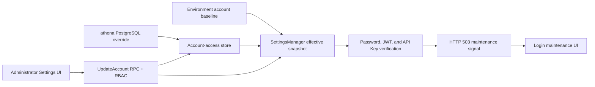

# Account Availability

## Scope

This capability controls whether an environment-defined local account may use
Athena. It owns the durable enabled-state override, the administrator update
API, the effective in-memory account snapshot, disabled-account authentication
semantics, and the corresponding Settings and login UI behavior.

Account creation, password and capability configuration, RBAC role design,
token revocation, and custom maintenance messages remain outside this boundary.
Environment configuration continues to define which accounts exist and their
baseline properties.

## Source Locations

| Concern | Source | Key symbols |
| --- | --- | --- |
| Environment baseline and effective snapshot | [util/settings/manager.go](../../../util/settings/manager.go), [util/settings/accounts_manager.go](../../../util/settings/accounts_manager.go) | `NewSettingsManagerFromEnv`, `ApplyAccountEnabledOverrides`, `SetAccountEnabled` |
| Durable override store | [internal/accountaccess/store/sql_store.go](../../../internal/accountaccess/store/sql_store.go) | `SQLStore`, `NewSQLStoreSource`, `ListAccountEnabledOverrides`, `SetAccountEnabled` |
| Schema and queries | [internal/accountaccess/store/migrations/000001_init.sql](../../../internal/accountaccess/store/migrations/000001_init.sql), [internal/accountaccess/store/queries/account_enabled_override.sql](../../../internal/accountaccess/store/queries/account_enabled_override.sql) | `account_enabled_override`, `UpsertAccountEnabledOverride` |
| API contract and handler | [internal/server/account/account.proto](../../../internal/server/account/account.proto), [internal/server/account/account.go](../../../internal/server/account/account.go) | `UpdateAccountRequest`, `AccountService.UpdateAccount`, `Server.UpdateAccount` |
| Authentication and maintenance error | [util/session/sessionmanager.go](../../../util/session/sessionmanager.go), [internal/server/session/session.go](../../../internal/server/session/session.go) | `AccountMaintenanceErr`, `VerifyLogin`, `Parse`, `AuthFuncOverride` |
| Authentication and RBAC boundary | [internal/server/athena-server.go](../../../internal/server/athena-server.go), [internal/server/authz.go](../../../internal/server/authz.go) | `NewServer`, `Authenticate`, `getClaims`, `authorizeGRPC` |
| Administrator and login UI | [ui/src/app/pages/settings.tsx](../../../ui/src/app/pages/settings.tsx), [ui/src/app/pages/login.tsx](../../../ui/src/app/pages/login.tsx), [ui/src/app/shared/services/requests.ts](../../../ui/src/app/shared/services/requests.ts) | `SettingsPage`, `LoginPage`, `isAccountMaintenanceError` |
| Migration and production wiring | [internal/migration/modules.go](../../../internal/migration/modules.go), [docker-compose.prod.yml](../../../docker-compose.prod.yml) | `account-access`, `ATHENA_SERVER_POSTGRES_DSN` |

## Architecture

The environment is authoritative for account existence, password hashes,
capabilities, and the baseline `enabled` value. PostgreSQL stores only an
enabled override keyed by account name. The API Server combines those inputs
into one mutex-protected `SettingsManager` snapshot used by every credential
verification path.

`AccountService.UpdateAccount` is protected by the existing
`accounts/update/{name}` RBAC rule. The built-in administrator has that grant;
the method is deliberately absent from account self-service authorization.
The handler also rejects the built-in `admin` name so an administrator cannot
disable the only recovery account through this API.

## Runtime Flow

1. API Server startup loads the environment account baseline and initializes
   the transient server settings.
2. `NewSQLStoreSource` connects to the `athena` PostgreSQL database and applies
   the embedded `account-access` migration when automatic migration is enabled.
3. Startup reads every persisted override before constructing the session
   manager. `ApplyAccountEnabledOverrides` applies only rows whose account still
   exists and ignores any row for `admin`.
4. An administrator opens Settings. The UI lists the effective account state
   and renders a login-access switch for every non-administrator account.
   Disabling requires confirmation; enabling applies immediately.
5. `UpdateAccount` serializes updates, verifies that the target exists, writes
   the PostgreSQL override, and only then changes the in-memory snapshot. Its
   response is the effective `Account` used to replace the corresponding UI
   row without an optimistic update.
6. Password login validates the password before consulting `enabled`. A valid
   password for a disabled account returns gRPC `Unavailable` with the exact
   message `系统维护中`; an invalid password remains the generic login failure.
   A maintenance result is not recorded in the Redis brute-force counters.
7. JWT web sessions and Bearer API Keys resolve their account on every
   protected request. `Parse` returns the same maintenance error when that
   account is disabled, and `getClaims` preserves it instead of converting it
   to `Unauthenticated`.
8. `GetUserInfo` propagates the maintenance error so a browser refresh detects
   disabled state. Login, captcha, and logout remain public even when the
   request carries a disabled cookie, allowing the browser to sign in as an
   administrator.
9. The web client recognizes maintenance only when HTTP status 503, gRPC code
   14, and the exact message all match. It clears session-scoped UI caches,
   keeps the credential cookie intact, and routes to
   `/login?reason=maintenance`. Re-enabling therefore restores any otherwise
   valid, unexpired, unrevoked credential.
10. Process shutdown closes the account-access pool through
    `AthenaServer.Close`. A graceful in-process server restart reuses the same
    process-lifetime store and effective snapshot.

The current runtime has one API Server instance. The update mutex establishes
the write order inside that instance; there is no cross-instance snapshot
invalidation mechanism.

## State / Data

`account_enabled_override` is durable state in the `athena` PostgreSQL
database. `account_name` is its primary key, `enabled` is the overriding value,
and `updated_at` records the most recent successful upsert. Absence of a row
means the environment baseline applies.

Rows are not foreign-keyed to environment accounts because those accounts are
not database entities. An override left behind after an account is removed is
retained but ignored. An `admin` row is also ignored. If a matching account is
configured again later, its retained non-admin override becomes effective on
the next API Server start.

The effective account map is process-local state protected by the existing
`SettingsManager` read/write mutex. Database commit precedes its mutation, so
the state transition becomes visible to authentication only after persistence
succeeds. Tokens are not deleted or revoked when availability changes.

## Configuration

| Setting | Behavior |
| --- | --- |
| `ATHENA_SERVER_POSTGRES_DSN` | Selects the PostgreSQL connection for account availability state. When absent locally, the shared PostgreSQL helper connects to database `athena` on `127.0.0.1` using the standard PostgreSQL settings. |
| `ATHENA_POSTGRES_AUTO_MIGRATE` | Defaults to `true`; controls embedded account-access migration at API Server startup. Production Compose sets it to `false` and runs migrations separately. |
| `ATHENA_ADMIN_ENABLED`, `ATHENA_ACCOUNT_*_ENABLED` | Define baseline enabled state. The bundled production environment and the local workspace environment set every configured ordinary account to `false`; `admin` remains enabled by default. A matching persisted non-admin override takes precedence. |
| `ATHENA_SERVER_DISABLE_AUTH` | Existing development-only global bypass. It continues to present requests as the local administrator and bypasses availability enforcement with the rest of authentication. |

The maintenance text is fixed in code and is not configurable.

## Invariants

- Environment settings define the account set; the database never creates an
  account or changes its password, capabilities, or token collection.
- A persisted non-admin override takes precedence over the environment enabled
  value, while a missing override falls back to that value.
- The `admin` account cannot be changed by `UpdateAccount` and never consumes a
  database override.
- Only callers granted `accounts/update/{name}` can reach the update handler;
  there is no same-account self-service exception.
- Persistence succeeds before the effective snapshot changes.
- Password validity is established before disabled state is disclosed.
- Disabled-account login does not increment brute-force failure state.
- Every local JWT and API Key verification consults the current effective
  snapshot; disabling does not alter the credential itself.
- Only the exact 503/code-14/message tuple activates the browser maintenance
  flow. Ordinary 401 and unrelated 503 responses retain their existing paths.

## Failure Recovery

Failure to connect, migrate, or load overrides stops API Server construction,
so the server never starts with an environment-only snapshot that could admit
a persistently disabled account. Production runs the migration command before
starting the API Server because automatic migration is disabled there.

An update-store failure returns an error and leaves the in-memory state
unchanged. The UI keeps the prior switch value and reports the request failure.
The update can be retried safely because the database operation is an upsert.

An ordinary API Server restart reloads the overrides from PostgreSQL. Local
`make stop` and the production container lifecycle retain PostgreSQL data. A
local `make run-reset` or removal of the production PostgreSQL volume deletes
the overrides, after which environment defaults apply. Re-enabling an account
allows still-valid credentials to pass their next verification without a
special recovery operation.

## Observability

Startup logs report the account-access PostgreSQL connection and migration
state. Connection or override-load failures appear as startup failures before
the API listener becomes available. Update failures travel through the normal
gRPC/gateway error path.

Disabled credentials are externally observable as gRPC `Unavailable`, HTTP
503, gRPC code 14, and the fixed maintenance message. Login request metrics use
the existing success/failure counter; Redis brute-force state remains unchanged
for the maintenance outcome. This capability adds no dedicated health endpoint
or metric.

## Change Checklist

- [ ] Environment baseline, PostgreSQL override precedence, and ignored-row semantics are current.
- [ ] Startup load remains fail-closed and precedes session-manager construction.
- [ ] Update authorization, `admin` protection, and persistence-before-memory ordering remain aligned.
- [ ] Password, JWT, API Key, and `GetUserInfo` maintenance paths return the same stable signal.
- [ ] Public login, captcha, and logout paths still permit administrator recovery.
- [ ] Browser maintenance detection remains exact and preserves ordinary 401/503 behavior.
- [ ] Restart, reset, and credential restoration semantics are current.
- [ ] Source links and named symbols resolve to the implementation.
- [ ] The [design index](../README.md) contains the correct entry.
