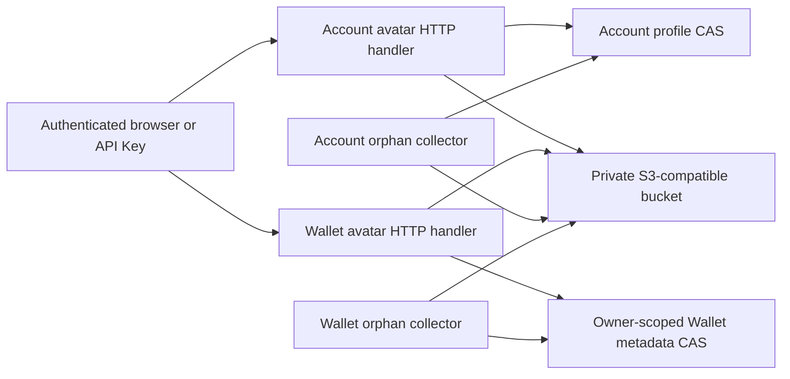

# Account and Wallet Avatar Storage

> 设计状态：已实现

## Scope

Account and Wallet Avatar Storage owns shared image validation, private
S3-compatible object storage, authenticated native HTTP delivery, replacement
compensation, and orphan collection for account-profile and custodial-wallet
avatars. It also owns the pinned MinIO server/client images and the local and
production volume lifecycle.

[Account Profile and Preferences](account-profile-and-preferences.md) owns the
account-profile revision and avatar metadata reference. [Wallet Ownership and
Custody](wallet-ownership.md) owns wallet avatar kind, preset, uploaded-object
metadata, and Wallet revision. The API Server owns their deliberately different
authorization rules: an account avatar is readable or writable by its owner or
an administrator, while a wallet avatar is always restricted to the exact
wallet owner with no administrator bypass. Wallet-avatar GET accepts either
Wallet `READ` or Worm Trading `READ`; every wallet-avatar mutation remains
exclusive to Wallet `READ_WRITE`. The browser never receives S3 credentials,
endpoint, bucket name, or object key.

## Source Locations

| Concern | Source | Key symbols |
| --- | --- | --- |
| S3-compatible adapter | [internal/accountavatar/store.go](../../../internal/accountavatar/store.go) | `Config`, `Store`, `Object`, `ObjectInfo`, `Put`, `Get`, `Stat`, `Delete`, `List` |
| Shared image validation | [internal/avatarimage/image.go](../../../internal/avatarimage/image.go) | `Validate`, `Image`, `DefaultMaxBytes`, `MaxDimension`, `MaxPixels` |
| Account HTTP resource | [internal/server/accountavatarhttp/handler.go](../../../internal/server/accountavatarhttp/handler.go), [internal/server/accountavatarhttp/garbage_collector.go](../../../internal/server/accountavatarhttp/garbage_collector.go) | `Handler.Upload`, `Handler.Download`, `Handler.Delete`, `RunGarbageCollector` |
| Wallet HTTP resource | [internal/server/walletavatarhttp/handler.go](../../../internal/server/walletavatarhttp/handler.go), [internal/server/walletavatarhttp/garbage_collector.go](../../../internal/server/walletavatarhttp/garbage_collector.go) | `Handler.Upload`, `Handler.Download`, `Handler.Delete`, `DeleteObjectBestEffort`, `RunGarbageCollector` |
| Authentication and process wiring | [internal/server/account_avatar.go](../../../internal/server/account_avatar.go), [internal/server/wallet_avatar.go](../../../internal/server/wallet_avatar.go) | `newPrivateAvatarStore`, `authenticateAccountAvatarHTTP`, `authenticateWalletAvatarHTTP`, route registration |
| Browser realm-bound presentation | [ui/src/app/shared/services/requests.ts](../../../ui/src/app/shared/services/requests.ts), [ui/src/app/shared/account-presentation.tsx](../../../ui/src/app/shared/account-presentation.tsx), [ui/src/app/member/pages/wallets.tsx](../../../ui/src/app/member/pages/wallets.tsx), [ui/src/app/member/pages/worm-trading.tsx](../../../ui/src/app/member/pages/worm-trading.tsx), [ui/src/app/member/pages/worm-trading-execution-preview.tsx](../../../ui/src/app/member/pages/worm-trading-execution-preview.tsx) | `realmBoundResourceURL`, `AccountAvatar`, uploaded Wallet and Worm avatar rendering |
| Pinned object-store images | [deploy/minio/Dockerfile.server](../../../deploy/minio/Dockerfile.server), [deploy/minio/Dockerfile.mc](../../../deploy/minio/Dockerfile.mc) | MinIO commit `9e49d5e7a648`, mc commit `7394ce0dd2a8` |
| Private bucket initialization | [deploy/minio/init-avatar-bucket.sh](../../../deploy/minio/init-avatar-bucket.sh) | bucket creation, anonymous-access removal, application IAM policy |
| Local runtime | [internal/devruntime/infrastructure.go](../../../internal/devruntime/infrastructure.go), [instance lifecycle](../development-runtime/local-runtime-orchestration.md) | pinned image bootstrap, per-instance persistent volume, dynamic loopback ports, exact stop/reset ownership |
| Production runtime | [docker-compose.prod.yml](../../../docker-compose.prod.yml), [hack/prod-remote-deploy.sh](../../../hack/prod-remote-deploy.sh) | `minio`, `minio-init`, `PROD_MINIO_VOLUME` |

## Architecture

`accountavatar.Store` is a narrow AWS SDK v2 adapter targeting one fixed private
bucket with static bucket-scoped credentials and configurable path-style
addressing. `newPrivateAvatarStore` validates the common configuration and is
used to construct the account and wallet handlers. Client construction performs
no startup network probe, so object-store availability remains isolated from
non-avatar APIs.

Both handlers use `avatarimage.Validate`, but their metadata and authorization
are independent. Account routes accept a canonical target account UUID and use
Account Center profile CAS. Wallet routes accept only a positive wallet ID,
derive the authenticated account UUID, and invoke trusted owner-scoped Wallet
metadata methods. Wallet-avatar reads require Wallet `READ` or Worm Trading
`READ`; writes require Wallet `READ_WRITE`. Neither route accepts an object key
or owner UUID from public input.

Interactive browser API requests attach
`X-Athena-Application-Realm: member|admin`. Authentication-enabled servers use
it to select the exact HttpOnly `athena.token.member` or `athena.token.admin`
cookie; loopback disabled-auth selects the matching isolated development
identity. Direct `` requests cannot attach that header, so `AccountAvatar`,
Wallet, Worm Trading, and Worm execution preview pass Athena-owned relative
uploaded-avatar URLs through `realmBoundResourceURL`, which adds
`athenaRealm=member|admin` and leaves external resources unchanged. Header and
query values must agree when both are present. A realm selects a credential
slot but does not change avatar ownership or module authorization. API Key
bearers are authenticated directly and do not require a realm header or query.

## Runtime Flow

1. MinIO starts against its named `/data` volume. The one-shot mc image waits
   for readiness, creates the configured bucket, removes anonymous access,
   creates or updates the application user, and attaches a bucket-scoped
   list/get/put/delete policy. Repeated initialization is idempotent.
2. API Server startup validates endpoint, region, bucket, access key, secret
   key, endpoint URL, path-style setting, and maximum upload bytes, then
   constructs both avatar handlers. Missing or malformed configuration prevents
   startup; MinIO reachability is not probed.
3. Both multipart upload resources limit the complete request and image bytes,
   inspect image configuration before pixel allocation, and fully decode the
   image. JPEG, PNG, and structurally valid non-animated WebP are accepted up to
   2 MiB, 4,096 pixels on either edge, and at most 16,000,000 total pixels. WebP
   extended-canvas dimensions must match its VP8 or VP8L frame. SVG, GIF,
   animated WebP, truncated content, and content-type-only claims are rejected.
4. `PUT /api/v1/account/{id}/avatar` requires multipart `file` and
   `expectedRevision`. After owner-or-administrator authorization, it verifies
   the profile revision, writes a candidate under
   `objects/<sha256(account UUID)>/<random UUID>`, and commits key, content type,
   ETag, and size through profile CAS.
5. `PUT /api/v1/wallets/{id}/avatar` requires Wallet `READ_WRITE` and multipart
   `file` plus `expectedRevision`. It first resolves the wallet through the
   authenticated owner UUID, writes a candidate under
   `wallet-avatars/<sha256(owner UUID)>/<random UUID>`, and commits uploaded-
   object metadata through Wallet revision CAS. The commit clears any preset.
6. After an ambiguous metadata update, each handler re-reads its durable
   reference with an independent bounded context. A committed candidate is
   preserved and returned; a confirmed unreferenced candidate is deleted best
   effort; an unreconcilable candidate remains for grace-period collection.
   Successful replacement commits first and then deletes the prior object best
   effort.
7. `GET /api/v1/account/{id}/avatar` repeats account owner-or-administrator
   authorization and resolves the current profile reference.
   `GET /api/v1/wallets/{id}/avatar` requires Wallet `READ` or Worm Trading
   `READ`, exact owner lookup, and an uploaded-object reference. The alternative
   read grant allows the owner-scoped Worm Trading wallet summary to render its
   avatar without granting Wallet list, detail, or mutation access. Both stream
   persisted content type, size, ETag, `nosniff`, and private revalidation cache
   headers; matching `If-None-Match` returns 304. Missing wallet image bytes are
   presented by the UI as the deterministic default avatar. Frontend API reads
   use the realm header; browser-rendered AccountAvatar, Wallet, Worm page, and
   Worm preview images use the `athenaRealm` query. Missing, duplicate, invalid,
   or disagreeing realm selection fails authentication before object lookup and
   never falls back to the other realm cookie. API Key reads require neither
   transport.
8. Account-avatar deletion clears the profile reference through profile CAS. Wallet
   avatar reset requires Wallet `READ_WRITE`, clears uploaded metadata and any
   preset through Wallet CAS, and returns the deterministic default state.
   Setting a Wallet preset through the public Wallet API likewise replaces an
   upload reference and triggers best-effort object cleanup.
9. Separate collectors run once when the API Server context starts and then
   every 24 hours. Each loads its own durable references, lists only its object
   prefix, and deletes unreferenced objects after a 24-hour grace period. A
   reference-load or listing failure stops that collection pass without deleting
   anything.
10. Ordinary local stop stops the instance-owned MinIO container and retains its volume.
    Reset requires the instance to be stopped and deletes only its owned MinIO volume. Production hot deploy
    retains the configured external volume, while a full fresh deployment owns
    its complete new object state.

## State / Data

The private bucket contains validated original bytes in two disjoint key spaces:

- account avatars: `objects/<sha256(account UUID)>/<random UUID>`;
- wallet avatars: `wallet-avatars/<sha256(owner UUID)>/<random UUID>`.

Object names contain no username, display name, wallet address, source file
name, or extension. S3 supplies content type, content length, ETag, and last-
modified time. The same bucket and application credential serve both prefixes,
but neither HTTP authorization policy uses object-key structure as proof of
ownership.

PostgreSQL metadata is the live-reference source of truth. Account references
are committed in `account_profile`; wallet references are committed in the
owner-scoped `wallets` row and are mutually exclusive with an avatar preset. An
object-store write alone is only a candidate. MinIO data lives in
a namespace-qualified persistent volume locally (inspect `make runtime-status INSTANCE=<name>`) and `PROD_MINIO_VOLUME` in production.

Avatar metadata exposes an Athena relative API URL, not a storage URL. The
current frontend entry binds that relative resource to its realm only while
rendering it. The persisted profile or Wallet row does not store
`athenaRealm`, and external or browser-owned image URLs remain byte-for-byte
unchanged.

## Configuration

| Setting | Behavior |
| --- | --- |
| `ATHENA_ACCOUNT_AVATAR_S3_ENDPOINT` | Required HTTP(S) S3 endpoint with no credentials, query, fragment, or path; local default is `http://127.0.0.1:9000`, production uses `http://minio:9000`. |
| `ATHENA_ACCOUNT_AVATAR_S3_REGION` | Signing and MinIO region; defaults to `us-east-1`. |
| `ATHENA_ACCOUNT_AVATAR_S3_BUCKET` | Private bucket shared by account and wallet avatar prefixes; defaults to `athena-account-avatars`. |
| `ATHENA_ACCOUNT_AVATAR_S3_ACCESS_KEY_ID` | Required bucket-scoped application access key. |
| `ATHENA_ACCOUNT_AVATAR_S3_SECRET_ACCESS_KEY` | Required bucket-scoped application secret key. |
| `ATHENA_ACCOUNT_AVATAR_S3_PATH_STYLE` | Selects AWS SDK path-style addressing; defaults to `true`. |
| `ATHENA_ACCOUNT_AVATAR_MAX_BYTES` | Upload byte limit shared by both surfaces; defaults to and cannot exceed 2 MiB. Lower positive values are accepted; invalid or oversized values fall back to 2 MiB. |
| `MINIO_ROOT_USER`, `MINIO_ROOT_PASSWORD` | Initialization-only administrator credential; production password is required and generated by `prod-reset-secrets`. |
| `ATHENA_MINIO_API_PORT`, `ATHENA_MINIO_CONSOLE_PORT` | Local loopback bindings; default to `9000` and `9001`. Production exposes neither port to the host. |
| `ATHENA_MINIO_IMAGE`, `ATHENA_MINIO_MC_IMAGE` | Optional local overrides for the repository-built pinned images. |
| `PROD_MINIO_VOLUME` | External production volume name; defaults to `athena-prod-minio-data`. |

The repository images build MinIO Server from commit
`9e49d5e7a648f00e26f2246f4dc28e6b07f8c84a` and mc from commit
`7394ce0dd2a80935aded936b09fa12cbb3cb8096`. The server commit is the
[official `RELEASE.2025-10-15T17-29-55Z` release](https://github.com/minio/minio/releases/tag/RELEASE.2025-10-15T17-29-55Z).

## Invariants

- The browser and public metadata APIs never receive the MinIO endpoint,
  credentials, bucket, or durable object key.
- The bucket has no anonymous policy; the application user is limited to bucket
  location, listing, and object get/put/delete.
- Account-avatar access allows the matching account UUID or persisted
  administrator. Wallet-avatar access always requires exact owner UUID and never
  grants an administrator bypass.
- Wallet avatar reads require Wallet `READ` or Worm Trading `READ`; uploads,
  preset replacement, and reset require Wallet `READ_WRITE`. API Keys may use
  these safe metadata operations when their account entitlements allow them and
  do not require an application realm.
- Interactive frontend avatar uploads, deletes, and header-capable reads carry
  `X-Athena-Application-Realm`; direct browser image GETs carry `athenaRealm`.
- The only accepted realm values are `member` and `admin`. Header/query
  disagreement fails authentication, and the selected realm never grants
  avatar access or permits fallback to the opposite HttpOnly cookie.
- `AccountAvatar`, Wallet, Worm Trading, and Worm execution preview bind only
  Athena-owned relative private resources; external, `data:`, and `blob:` URLs
  are not modified.
- Stored bytes have passed format, animation, byte, edge-dimension, at-most
  16,000,000-pixel, and full-decode validation.
- A PostgreSQL CAS is the live-reference commit point. Compensation and
  collection never intentionally delete a currently referenced object.
- Ordinary stop and production hot deploy retain their exact named MinIO
  volume. Explicit reset and full deployment replace the complete object state.

## Failure Recovery

Invalid or missing S3 configuration fails API startup before the listener
opens. MinIO unavailability after construction does not affect Wallet listing,
remark or preset edits, private-key reveal, Account Center metadata, or other
API capabilities. Avatar reads and writes return an unavailable or not-found
response as appropriate; wallet presentation falls back to its deterministic
default.

An interactive request with no valid application realm, or with mismatched
header and query values, is rejected before private-object resolution. It does
not inspect the opposite realm's cookie. This failure does not apply to a valid
API Key bearer, which is authenticated without realm selection.

A failed candidate write leaves PostgreSQL unchanged. A failed metadata update
is reconciled before compensation so an ambiguous commit does not cause a live
object to be deleted. Failed old-object cleanup is logged and repaired by the
prefix-specific collector after the grace period. The Compose health check
still gates initial private-bucket setup, and repeated initialization reconstructs
IAM from retained MinIO state.

## Observability

MinIO logs are available from the exact container recorded by the local instance runtime and retained by Compose in
production. Lifecycle logs identify image builds, volume creation/removal,
readiness failure, and private-bucket initialization. Avatar handler logs use
account UUID and, for wallet operations, wallet ID when diagnosing storage,
streaming, reconciliation, or cleanup. They exclude usernames, wallet addresses,
image bytes, object credentials, and private keys. Each collector reports
reference/list failures, per-object deletion failures, and deletion/scanned
counts when it removes objects.

## Change Checklist

- [ ] Shared store configuration and image validation match both handlers.
- [ ] Account owner-or-administrator and Wallet exact-owner policies remain distinct.
- [ ] Wallet-avatar GET preserves the Wallet-READ-or-Worm-Trading-READ rule while every mutation remains Wallet `READ_WRITE`.
- [ ] Both CAS, candidate reconciliation, replacement, and reset flows remain ordered as documented.
- [ ] Private delivery, ETag behavior, and cache headers remain current.
- [ ] Prefix-specific collectors protect referenced and grace-period objects.
- [ ] MinIO images, IAM policy, volume lifecycle, and configuration remain aligned.
- [ ] Source links and named symbols resolve to the implementation.
- [ ] The [design index](../README.md) contains the correct entry.
