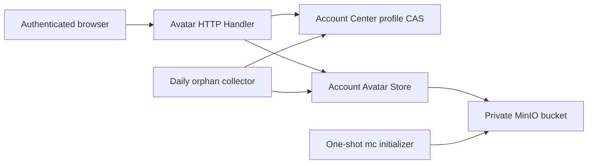

# Account Avatar Storage

## Scope

Account Avatar Storage owns image validation, private S3-compatible object
storage, authenticated same-origin delivery, replacement compensation, and
orphan collection for account profile avatars. It also owns the pinned MinIO
server/client images and the local and production volume lifecycle.

[Account Profile and Preferences](account-profile-and-preferences.md) owns the
durable profile revision and avatar metadata reference. Authentication and the
self-or-administrator policy remain server responsibilities. The browser never
receives S3 credentials, a MinIO endpoint, a bucket name, or an object key.

## Source Locations

| Concern | Source | Key symbols |
| --- | --- | --- |
| S3-compatible adapter | [internal/accountavatar/store.go](../../../internal/accountavatar/store.go) | `Config`, `Store`, `Object`, `ObjectInfo`, `Put`, `Get`, `Stat`, `Delete`, `List` |
| HTTP upload and delivery | [internal/server/accountavatarhttp/handler.go](../../../internal/server/accountavatarhttp/handler.go) | `Handler`, `Upload`, `Download`, `Delete` |
| Image validation | [internal/server/accountavatarhttp/image.go](../../../internal/server/accountavatarhttp/image.go) | `validateImage`, `inspectWebP` |
| Orphan recovery | [internal/server/accountavatarhttp/garbage_collector.go](../../../internal/server/accountavatarhttp/garbage_collector.go) | `RunGarbageCollector`, `collectGarbage` |
| Authentication and process wiring | [internal/server/account_avatar.go](../../../internal/server/account_avatar.go) | `newAccountAvatarHandler`, `authenticateAccountAvatarHTTP`, `registerAccountAvatarHandlers` |
| Pinned object-store images | [deploy/minio/Dockerfile.server](../../../deploy/minio/Dockerfile.server), [deploy/minio/Dockerfile.mc](../../../deploy/minio/Dockerfile.mc) | MinIO commit `9e49d5e7a648`, mc commit `7394ce0dd2a8` |
| Private bucket initialization | [deploy/minio/init-avatar-bucket.sh](../../../deploy/minio/init-avatar-bucket.sh) | bucket creation, anonymous-access removal, application IAM policy |
| Local runtime | [hack/start-minio.sh](../../../hack/start-minio.sh), [hack/local-runtime.sh](../../../hack/local-runtime.sh) | pinned image bootstrap, `athena-local-minio-data`, stop/reset ownership checks |
| Production runtime | [docker-compose.prod.yml](../../../docker-compose.prod.yml), [hack/prod-remote-deploy.sh](../../../hack/prod-remote-deploy.sh) | `minio`, `minio-init`, `PROD_MINIO_VOLUME` |

## Architecture

`accountavatar.Store` is a narrow AWS SDK v2 adapter. Construction validates
all required settings and creates a static-credential, S3-compatible client
with configurable path-style addressing. It deliberately performs no startup
network probe. Every object operation targets one fixed private bucket and
never sets a public ACL.

The HTTP handler accepts only a canonical target account UUID, never username
or an object key. It authenticates through the normal session/bearer boundary
and allows the matching UUID or an account whose persisted role is
administrator. It resolves the durable object key from Account Center before
reading MinIO.

## Runtime Flow

1. MinIO starts against its named `/data` volume. The one-shot mc image waits
   for readiness, creates the configured bucket, removes anonymous access,
   creates or updates the application user, and attaches a bucket-scoped
   list/get/put/delete policy. The API process receives only that application
   credential. The pinned server replaces an existing policy/user with the
   submitted definition, and the pinned mc treats an already-attached policy
   as a successful no-op, making repeated initializer runs idempotent.
2. API Server startup validates the endpoint, region, bucket, access key,
   secret key, and endpoint URL. Missing or malformed configuration prevents
   startup. Client construction does not require MinIO to be reachable.
3. `PUT /api/v1/account/{id}/avatar` parses `{id}` as a canonical UUID and
   accepts multipart fields `file` and
   `expectedRevision`. It limits the complete request, reads at most the
   configured image limit plus one byte, inspects image configuration before
   allocation, verifies an extended WebP canvas against its VP8/VP8L frame
   header, and then fully decodes the pixels to reject truncated or corrupt
   content. It accepts JPEG, PNG, or structurally valid non-animated WebP up to
   4096 pixels per dimension and 16,777,216 total pixels while retaining the
   original bytes for storage.
4. The handler verifies the current profile revision, writes a candidate under
   `objects/<sha256(account_id)>/<uuid>`, and commits its key, content type, ETag,
   and size with profile CAS. After an update error it re-reads the durable
   profile with an independent bounded context: a candidate that was committed
   despite an ambiguous database response is preserved and returned, a
   confirmed unreferenced candidate is deleted best effort, and an
   unreconcilable candidate is left for grace-period collection. A successful
   replacement commits first and then best-effort deletes the previous object.
5. `GET /api/v1/account/{id}/avatar?v=<profile revision>` reads the current
   profile reference and streams that object with its persisted content type,
   size, ETag, `nosniff`, and a private cache policy that requires authenticated
   revalidation on every reuse. A matching `If-None-Match` returns 304 without
   streaming the body. `Vary: Cookie, Authorization` separates credential
   contexts within the browser cache.
6. `DELETE /api/v1/account/{id}/avatar?expectedRevision=<revision>` clears
   the profile reference with CAS and then deletes the old object best effort.
   Deleting an already empty avatar returns the unchanged profile.
7. Garbage collection runs once when its server context starts and then every
   24 hours. It loads all durable avatar references, lists `objects/`, and
   deletes unreferenced objects only after a 24-hour grace period.
8. Ordinary local stop removes the MinIO container but retains its volume.
   `make run-reset` removes the owned MinIO volume. Production hot deploy
   requires and preserves the external volume, reruns the idempotent bucket
   initializer, and recreates application services. Full deploy/destroy removes
   the volume together with PostgreSQL.

## State / Data

The private bucket contains validated original image bytes. Object names carry
no display name, username, file name, or extension: the account component is a
SHA-256 digest of the canonical account UUID and the final component is a random
UUID. S3 metadata supplies content type, content length, ETag, and last-modified
time.

PostgreSQL is the reference source of truth. An object becomes live only when
its metadata is committed in `account_profile`; an object-store write alone is
a candidate. The 24-hour orphan grace period protects candidates while the
profile transaction or compensation is in flight. MinIO state lives in
`athena-local-minio-data` locally and the external `PROD_MINIO_VOLUME` in
production.

## Configuration

| Setting | Behavior |
| --- | --- |
| `ATHENA_ACCOUNT_AVATAR_S3_ENDPOINT` | Required HTTP(S) S3 endpoint with no credentials, query, fragment, or path; local default is `http://127.0.0.1:9000`, production uses `http://minio:9000`. |
| `ATHENA_ACCOUNT_AVATAR_S3_REGION` | Signing and MinIO region; defaults to `us-east-1`. |
| `ATHENA_ACCOUNT_AVATAR_S3_BUCKET` | Private bucket; defaults to `athena-account-avatars`. |
| `ATHENA_ACCOUNT_AVATAR_S3_ACCESS_KEY_ID` | Required bucket-scoped application access key. |
| `ATHENA_ACCOUNT_AVATAR_S3_SECRET_ACCESS_KEY` | Required bucket-scoped application secret key. |
| `ATHENA_ACCOUNT_AVATAR_S3_PATH_STYLE` | Selects AWS SDK path-style addressing; defaults to `true`. |
| `ATHENA_ACCOUNT_AVATAR_MAX_BYTES` | Upload byte limit; defaults to and cannot exceed 2 MiB. Lower values are accepted; a non-positive or oversized value falls back to 2 MiB. |
| `MINIO_ROOT_USER`, `MINIO_ROOT_PASSWORD` | Initialization-only administrator credential; production password is required and generated by `prod-reset-secrets`. |
| `ATHENA_MINIO_API_PORT`, `ATHENA_MINIO_CONSOLE_PORT` | Local loopback bindings; default to `9000` and `9001`. Production exposes neither port to the host. |
| `ATHENA_MINIO_IMAGE`, `ATHENA_MINIO_MC_IMAGE` | Optional local overrides for the repository-built pinned images. |
| `PROD_MINIO_VOLUME` | External production volume name; defaults to `athena-prod-minio-data`. |

The repository images build MinIO Server from commit
`9e49d5e7a648f00e26f2246f4dc28e6b07f8c84a` and mc from commit
`7394ce0dd2a80935aded936b09fa12cbb3cb8096`. The server commit is the
[official `RELEASE.2025-10-15T17-29-55Z` release](https://github.com/minio/minio/releases/tag/RELEASE.2025-10-15T17-29-55Z).

## Invariants

- The browser and profile API never receive the MinIO endpoint, credentials,
  bucket, or durable object key.
- The bucket has no anonymous policy; the application user is limited to
  bucket location, listing, and object get/put/delete for that bucket.
- An authenticated caller can address only the avatar whose UUID matches the
  session unless its persisted role is administrator. Username is not a routing
  concept. Object delivery always starts from the current profile, and cached
  bytes cannot be reused after a credential change without revalidation.
- Stored bytes have passed format, animation, size, and dimension validation.
  SVG, GIF, animated WebP, and content-type-only claims are rejected.
- A profile CAS is the live-reference commit point. Compensation and garbage
  collection never delete a currently referenced object.
- Ordinary stop and hot deploy retain the named MinIO volume. Reset, full
  deployment, and destroy remove only their exact configured volume.

## Failure Recovery

Invalid or missing S3 configuration fails API startup before the listener
opens. MinIO unavailability after construction does not affect unrelated API
capabilities: avatar reads and writes map storage failures to HTTP 503 and the
UI can fall back to an initial-based avatar.

A failed candidate write leaves PostgreSQL unchanged. A failed profile update
is reconciled against PostgreSQL before compensation, so an ambiguous commit
never causes a live object to be deleted; inability to re-read leaves the
candidate for the collector. Failed old-object or explicit-delete cleanup is
logged and later repaired by the grace-period collector. An object
missing behind a committed reference returns 404 and remains diagnosable from
the profile metadata and storage logs.

The Compose health check gates the one-shot initializer. Local or production
initialization failure stops the dependent API startup instead of silently
using root credentials or a public bucket. MinIO restart reconstructs IAM and
object state from the retained volume; the initializer is safe to rerun.

## Observability

MinIO logs are streamed by Goreman locally and retained by Compose in
production. Lifecycle logs identify image builds, volume creation/removal,
readiness failure, and successful private-bucket initialization. Avatar HTTP
logs include the account UUID for storage or streaming failures but never log
username, image bytes, or credentials. Garbage collection logs load/list
failures, per-object delete failures, and deleted/scanned counts when it removes
objects.

## Change Checklist

- [ ] Store methods and HTTP handlers preserve the private fixed-bucket boundary.
- [ ] Upload validation, object metadata, profile CAS, and compensation remain ordered as documented.
- [ ] Authenticated delivery, ETag behavior, and cache headers remain current.
- [ ] Garbage collection protects referenced and grace-period objects.
- [ ] MinIO/mc commits, application policy, image names, and health checks remain aligned.
- [ ] Local stop/reset and production deploy/hot-deploy/destroy preserve their volume boundaries.
- [ ] Configuration names and defaults match server, Procfile, Compose, initialization, and secret reset wiring.
- [ ] Source links and named symbols resolve to the implementation.
- [ ] The [design index](../README.md) contains the correct entry.
