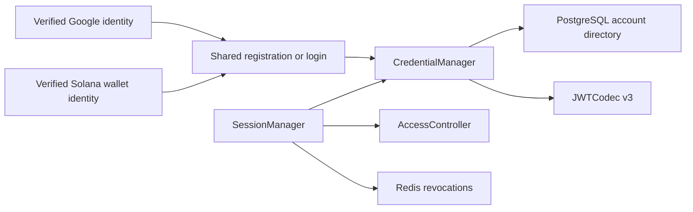

# Account Credentials

## Scope

Account Credentials owns Athena's stable UUID account identity, immutable public
username, permanent single-provider login binding, persistent API Key metadata,
and Athena JWT v3 format. Google OIDC and Solana-wallet signatures prove browser
identities at their protocol boundaries; business APIs accept only Athena
cookies or Athena bearer credentials.

[Google OIDC Login](google-oidc-login.md) and [Solana Wallet
Authentication](solana-wallet-authentication.md) own provider verification.
The shared anonymous username-registration boundary is implemented by
`authregistration`. [Account Access Control](account-access-control.md) owns
current login, API Key, Profit Sharing, module, and administrator authorization.
Username is identity presentation, not an authorization key or editable display
name.

## Source Locations

| Concern | Source | Key symbols |
| --- | --- | --- |
| Identity and API Key types | [internal/accountcredentials/types.go](../../../internal/accountcredentials/types.go) | `Account`, `Token`, `IdentityProvider`, `NormalizeIdentitySubject`, `NormalizeExternalIdentity`, `HasExternalIdentity` |
| Username policy | [internal/accountcredentials/username.go](../../../internal/accountcredentials/username.go) | `ValidateUsername`, `ErrUsernameInvalid`, `MinUsernameLength`, `MaxUsernameLength` |
| Runtime credential registry | [internal/accountcredentials/manager.go](../../../internal/accountcredentials/manager.go) | `CredentialManager`, `GetByIdentity`, `UsernameAvailable`, `RegisterExternalAccount`, `IssueLoginSession`, `IssueAPIKey`, `ValidateCredential` |
| JWT signing configuration | [internal/accountcredentials/config.go](../../../internal/accountcredentials/config.go) | `LoadJWTSigningKey` |
| JWT v3 codec | [internal/accountcredentials/jwt_codec.go](../../../internal/accountcredentials/jwt_codec.go) | `JWTCodec`, `TokenVersion`, `Issue`, `Parse` |
| Durable account adapter | [internal/accountstate/store/sql_store.go](../../../internal/accountstate/store/sql_store.go) | `ListCredentialAccounts`, `GetCredentialAccountByIdentity`, `RegisterExternalAccount`, `RecordLogin`, `EnsureDevelopmentAdministrator` |
| Schema and generated-query sources | [internal/accountstate/store/migrations/000001_init.sql](../../../internal/accountstate/store/migrations/000001_init.sql), [internal/accountstate/store/queries/account_directory.sql](../../../internal/accountstate/store/queries/account_directory.sql), [internal/accountstate/store/queries/account_api_key.sql](../../../internal/accountstate/store/queries/account_api_key.sql) | `athena_account`, `account_api_key`, `GetAccountByIdentity`, `CreateOrdinaryAccount`, `CreateAdministratorAccount` |
| Shared registration boundary | [internal/authregistration/types.go](../../../internal/authregistration/types.go), [internal/authregistration/handler.go](../../../internal/authregistration/handler.go) | `Identity`, `Backend`, `Handler`, `Begin`, `Registration`, `UsernameAvailability` |
| Session validation and revocation | [util/session/sessionmanager.go](../../../util/session/sessionmanager.go), [util/session/state.go](../../../util/session/state.go) | `SessionManager`, `CreateExternalLogin`, `Parse`, `ParseLoginForRevocation`, `UserStateStorage` |
| Account and Session API projections | [internal/server/account/account.proto](../../../internal/server/account/account.proto), [internal/server/session/session.proto](../../../internal/server/session/session.proto) | `Account.id`, `Account.username`, `Account.identity`, `GetUserInfoResponse.accountId` |
| Process wiring | [internal/server/athena-server.go](../../../internal/server/athena-server.go) | `NewServer`, `Authenticate`, `developmentAccountID` |

## Architecture

`account_id` is the only internal identity key. It is a canonical UUID used by
JWT subjects, permissions, API Keys, profile state, Wallet ownership, and
Profit Sharing relationships. `username` is permanent public presentation
metadata and preserves the casing selected during registration. Public UI
normally displays `@username`; it does not use the value to locate credentials
or infer administrator status.

Every normal account has exactly one immutable `(identity_provider,
identity_subject)` binding. Google uses its stable OIDC `sub`; Solana wallet
authentication uses the canonical base58 encoding of the 32-byte public key.
The same person authenticating through both providers receives two unrelated
account UUIDs. No merge, secondary binding, rebind, transfer, or recovery path
exists.

PostgreSQL is authoritative. `CredentialManager` loads a process-local registry
keyed by UUID plus a provider-and-subject-to-UUID index, and publishes a
registered account only after the complete database aggregate commits. The
current single-API-Server topology requires no cross-instance cache invalidation.

`JWTCodec` is a stateless HS256 boundary. `SessionManager` combines a verified
v3 token with the current account record, current access snapshot, durable API
Key membership or external identity binding, and Redis revocation state on every
request.

## Runtime Flow

1. Startup loads all durable accounts and API Key metadata. An empty account
   directory is valid in normal authentication mode; no administrator or
   ordinary account is seeded by the migration.
2. A cryptographically verified but unknown Google subject or Solana address
   remains outside PostgreSQL until the browser submits an acceptable username
   through the shared registration handler. `RegisterExternalAccount` then
   creates identity, access, nine module rows, profile, and preferences in one
   transaction. Ordinary accounts start Pending. Only a server-marked Google
   administrator candidate can create the single fixed administrator aggregate.
3. Registration first rechecks the same provider and subject. Concurrent
   submissions converge on the first committed UUID and username. A
   case-insensitive username collision or a second administrator is rejected by
   PostgreSQL uniqueness constraints; identities from different providers never
   converge.
4. A known provider and subject resolve directly to the original UUID and locked
   username. Successful login updates `last_login_at`; Google also refreshes its
   verified-email audit field. Login cannot change provider, subject, username,
   role, profile, or preferences.
5. Athena signs a login token with a fresh UUID JTI, expiry, and digest of the
   persisted provider and subject. API Key creation signs a fresh JTI and inserts
   bearer-free metadata before returning the bearer to its creator.
6. Parsing accepts only HS256, issuer `athena`, valid registered time claims, a
   non-empty JTI, `athenaTokenVersion=3`, and a subject shaped as
   `<canonical-account-uuid>:login` or `<canonical-account-uuid>:apiKey`.
7. Both credential kinds require current `LoginEnabled`. Login sessions require
   the current external identity-binding digest. API Keys require current
   `APIKeyEnabled` and an unexpired JTI still present in `account_api_key`. Redis
   revocation is checked last.
8. Deleting an API Key commits metadata deletion before removing it from the
   registry. Disabling API Key access pauses retained keys; re-enabling restores
   undeleted and unexpired keys. Logout clears and revokes only the Athena login
   session.
9. With authentication disabled, startup explicitly creates or reuses one UUID
   `development` identity named `local-admin`. Requests receive that UUID in
   synthetic claims. Normal authentication startup rejects a persisted
   development identity, so changing modes requires a clean account-state
   database.

## State / Data

`athena_account` stores:

- `account_id UUID PRIMARY KEY DEFAULT gen_random_uuid()`;
- immutable `username`, `identity_provider`, `identity_subject`, and
  `administrator` role;
- mutable Google-only `verified_email` and login audit timestamps.

The schema enforces case-insensitive username uniqueness, uniqueness of the
provider-and-subject pair, and at most one administrator. Google identities
require a non-empty subject and verified email. Solana identities require an
empty verified email, a canonical address that decodes to exactly 32 bytes, and
`administrator=false`. The isolated development identity has no external
subject or email.

`ValidateUsername` requires 3–42 ASCII letters, digits, periods, or hyphens;
requires at least one alphanumeric character; and does not trim, case-fold, or
rewrite the stored value. It rejects 40-byte `0x` wallet-address forms and a
checked-in safety list after lowercasing and removing periods and hyphens. The
exact lowercase username `admin` is permitted only for an administrator
candidate. Username cannot be changed, transferred, aliased, or used to derive
role.

`account_api_key` is keyed by `(account_id, display_id)` and gives every JTI
global uniqueness. It stores issue and optional expiry times, never the bearer.
Every login JWT contains `athenaIdentityBinding`, the hexadecimal SHA-256 digest
of the provider string, a zero-byte separator, and its subject. Google subjects,
generic identity-subject fields, binding digests, JTIs, and bearer values do not
enter public Account or Session APIs. The safe Account identity projection
exposes only the verified Google email or, deliberately, the public Solana
address appropriate to the viewer.

## Configuration

| Setting | Behavior |
| --- | --- |
| `ATHENA_JWT_SECRET` / `ATHENA_JWT_SECRET_FILE` | Supplies the HS256 key. It must contain at least 32 bytes. If omitted outside production, startup generates a process-lifetime key, so restart invalidates credentials. |
| `ATHENA_SESSION_DURATION` | Controls login-session lifetime; the default is 24 hours. |
| `ATHENA_SERVER_DISABLE_AUTH` | Enables the loopback-only development identity and skips external-login configuration. It does not enable a password path. |

Google client, public-origin, and administrator-candidate configuration are
documented in [Google OIDC Login](google-oidc-login.md). Phantom desktop login
adds no App ID, client secret, RPC endpoint, callback, per-wallet variable, or
other environment setting. UUIDs, usernames, identity bindings, roles,
entitlements, and API Key metadata are database state.

## Invariants

- A canonical account UUID, never username, email, or wallet address, identifies
  an account in credentials and downstream relationships.
- Provider plus subject is the permanent external identity key. Google email is
  never a lookup key; wallet software brand is not an identity provider value.
- Google and Solana identities cannot merge or act as secondary credentials for
  one account.
- Username is case-insensitively unique, public, immutable, and authorization-
  neutral; `administrator` is the sole role fact.
- A Solana-wallet identity can never be administrator. At most one Google
  administrator exists, but zero administrators is a valid normal startup state.
- Registration publishes runtime identity only after the complete PostgreSQL
  aggregate commits.
- Every accepted signed credential is Athena v3 and passes current login,
  credential membership or binding, and revocation checks.
- API Key bearer values, Google tokens, wallet signatures, and private keys are
  never persisted by Account Credentials.

## Failure Recovery

A database failure during registration, login audit, API Key insertion, or API
Key deletion leaves the associated runtime registry change unpublished.
Provider-and-subject uniqueness makes same-identity registration converge;
username and administrator uniqueness reject competing identities without
merging them.

If account creation commits but later ticket completion or cookie issuance
fails, the verified provider identity still owns the committed account. A fresh
provider login follows the known-identity path and can issue a session without
choosing another username. Rotating the JWT secret invalidates all cookies and
API Keys. Revocation state fails closed until its initial Redis snapshot loads;
pending local revocations remain effective while Redis persistence retries.

## Observability

Credential and registration logs identify provider, operation stage, and
account UUID when one exists. Authorization codes, Google tokens, external
subjects, wallet signatures and messages, Athena JWTs, client secrets,
identity-binding values, API Key JTIs, and bearer values are excluded from logs
and metrics. External identity providers are not part of API Server health.

## Change Checklist

- [ ] UUID identity, immutable username, single-provider binding, and role boundaries remain current.
- [ ] Registration and API Key commit/publication ordering remain current.
- [ ] JWT v3 claims and mutable credential checks remain current.
- [ ] Public projections still exclude private identity and bearer material.
- [ ] Configuration, failure recovery, and source links match the code.
- [ ] The [design index](../README.md) contains the current summary.
