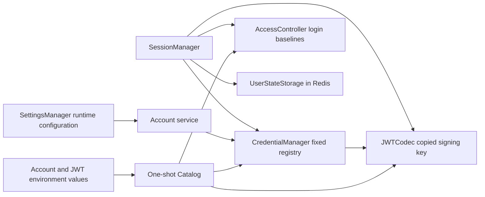

# Account Credentials

## Scope

Account Credentials owns the process-local registry for environment-defined
accounts, password and capability validation, API Key metadata and lifecycle,
and HMAC JWT encoding and decoding. It provides typed credential operations to
the Account and Session services without exposing password hashes through API
projections.

[Account Access Control](account-access-control.md) separately owns whether an
account may log in and which product modules it may use. [Account Profile and
Preferences](account-profile-and-preferences.md) owns durable presentation and
theme state. Redis-backed login
rate limiting and session-token revocation belong to `SessionManager` and
`UserStateStorage`. Runtime application settings, browser authorization, and
durable account creation are outside this capability. Password and API Key
mutations are deliberately process-local and do not create or alter access
overrides.

## Source Locations

| Concern | Source | Key symbols |
| --- | --- | --- |
| Environment catalog | [internal/accountcredentials/catalog.go](../../../internal/accountcredentials/catalog.go) | `Catalog`, `LoadCatalog`, `LoginDefaults` |
| Account registry and typed mutations | [internal/accountcredentials/manager.go](../../../internal/accountcredentials/manager.go), [internal/accountcredentials/types.go](../../../internal/accountcredentials/types.go) | `CredentialManager`, `PasswordVerification`, `IssueLoginSession`, `Account`, `Capability`, `Token` |
| JWT signing and parsing | [internal/accountcredentials/jwt_codec.go](../../../internal/accountcredentials/jwt_codec.go) | `JWTCodec`, `ParsedToken`, `ClaimsIssuer`, `Issue`, `Parse` |
| Login, token validation, and revocation composition | [util/session/sessionmanager.go](../../../util/session/sessionmanager.go) | `SessionManager`, `VerifyLogin`, `VerifyToken`, `Parse` |
| Account self-service API | [internal/server/account/account.go](../../../internal/server/account/account.go) | `ChangePassword`, `ListTokens`, `CreateToken`, `DeleteToken` |
| Immutable runtime settings projection | [util/settings/manager.go](../../../util/settings/manager.go), [internal/server/settings/settings.go](../../../internal/server/settings/settings.go) | `SettingsManager`, `Projector` |
| Process wiring | [internal/server/athena-server.go](../../../internal/server/athena-server.go) | `NewServer` |
| Deployment account catalog | [.env.prod](../../../.env.prod) | `ATHENA_ACCOUNT_YEGE_*`, `ATHENA_ACCOUNT_LINGJIE_*`, `ATHENA_ACCOUNT_DONGMEI_*`, `ATHENA_ACCOUNT_DINGZHI_*`, `ATHENA_ACCOUNT_YUDIAN_*` |

## Architecture

The catalog is a startup transfer object. It parses the fixed account registry,
initial credential state, each ordinary account's login default, and JWT key
material once. `CredentialManager` takes ownership of cloned account seeds and
then exposes immutable views plus explicit password and API Key operations.
The account-name map is fixed after construction. Every account entry has its
own `RWMutex`, so mutations for one account are serialized without blocking
credential work for another account.

`JWTCodec` is stateless after construction. It owns a private copy of one
non-empty HMAC key and performs JWT signing and verified parsing without
calling Settings, CredentialManager, AccessController, Redis, or service code.
`SessionManager` composes this cryptographic boundary with current credentials,
the current access snapshot, login throttling, and token revocation. The codec
does not make authorization decisions.

`SettingsManager` owns only immutable application and Help configuration. It
does not contain accounts, login defaults, or JWT key material, and collection
values returned to consumers are defensive copies.

The repository deployment catalog includes five enabled ordinary login
identities used as Profit Sharing participants: `YEGE`, `LINGJIE`, `DONGMEI`,
`DINGZHI`, and `YUDIAN`. Each account has its own bcrypt hash and credential
epoch. They remain ordinary accounts; the built-in `admin` identity is separate.

## Runtime Flow

1. API Server startup reads application settings and loads the account
   credential catalog from environment variables and secret-file inputs.
2. The loader creates the built-in `admin` seed and ordinary account seeds,
   parses credential fields, and records login defaults separately from the
   credentials. Ordinary accounts default to disabled. If the administrator
   password hash is absent, startup generates a transient password and hash. If
   the JWT key is absent, startup generates a transient key. Both are logged as
   restart-sensitive startup values.
3. `JWTCodec` copies the generated or configured signing key.
   `CredentialManager` clones the catalog's account seeds into a fixed map of
   per-account entries and retains that pure codec only for atomic API Key
   issuance. `AccessController` independently consumes a copy of the login
   defaults.
4. Password login reads the account under its entry read lock and verifies the
   password hash. Success returns an opaque `PasswordVerification` containing
   private account and password-version fields; callers cannot inspect the
   hash. `SessionManager` then consults current login availability and the
   immutable `login` capability. This ordering prevents disabled state from
   disclosing whether an incorrect password names a real account.
5. `CreateVerifiedLogin` passes that proof to `IssueLoginSession`, which takes
   the same account's read lock and signs only if the current password hash is
   still the one that was verified. A concurrent password replacement therefore
   cannot issue a new session from a stale password proof.
6. Every login session and API Key captures the account password modification
   time as RFC3339Nano claim `athenaCredentialEpoch`. Parsing verifies the HS256
   algorithm, signature, issuer, and registered time claims, then
   `SessionManager` resolves the subject and capability. It checks current
   login availability before validating current capability, API Key membership,
   exact credential-epoch equality, and Redis revocation state.
7. API Key issuance accepts either an omitted ID, which becomes a generated UUID,
   or a caller ID of 1-64 ASCII letters, digits, dots, underscores, and hyphens
   beginning with a letter or digit. The Account API then obtains the current
   authenticated account's write lock, checks the `apiKey` capability and
   token-ID uniqueness, creates one issue timestamp, signs the JWT through the
   dependency-free codec, and appends matching token metadata. The new key is
   returned only after the in-memory entry is updated. The restricted alphabet
   keeps every ID stable as the final segment of the revocation route.
8. API Key deletion removes its metadata under the same account write lock. A
   subsequent request using that JWT fails because its `jti` no longer exists
   in the account's current token metadata.
9. Password replacement hashes and validates the proposed password before the
   credential commit where possible, then updates the password hash and
   modification time through the typed manager operation. Every token carrying
   the previous epoch is rejected, including changes within the same second.
10. Server shutdown discards all process-local credential mutations. A restart
   reconstructs CredentialManager and JWTCodec from the current environment.

CredentialManager never invokes caller callbacks and never calls Settings,
AccessController, Redis, or transport code while holding an account lock. A
pure JWT signing call is the only nested dependency: login signing runs under
the read lock that revalidates its password proof, while API Key signing runs
under the write lock so token metadata and the returned signed value form one
serialized issuance operation.

## State / Data

Each account entry contains a password hash, optional password modification
time, a cloned capability set, and cloned API Key metadata. API Key metadata
contains the unique token ID plus issue and optional expiry timestamps; it does
not contain the returned bearer value. Public account views include only the
name-independent capability and token metadata needed by the Account API.

Account names and capabilities are environment-defined for the process
lifetime. Password changes, generated API Keys, and deletions modify only the
entry in memory. They are not written to the PostgreSQL account-access tables
or Redis. A durable account-state update changes neither credentials nor JWTs.
API Key metadata is available only from the explicit current-account
`ListTokens` operation; administrator account projections never include it.

The JWT key exists only in the catalog transfer and the codec's private byte
copy during normal operation. Login-session and API Key JWTs use issuer
`athena`; the subject encodes the account and credential capability, and
`athenaCredentialEpoch` is the exact password modification-time snapshot or an
empty string when no epoch exists. API Keys also carry the metadata ID as
`jti`. API Key expiration is present in both the JWT claims and its public
metadata when requested.

## Configuration

| Setting | Behavior |
| --- | --- |
| `ATHENA_ADMIN_PASSWORD_HASH` / `_FILE` | Defines the built-in administrator password hash. Absence generates a transient administrator password for this process. |
| `ATHENA_ADMIN_PASSWORD_MTIME` | Defines the administrator password modification time used for token invalidation. |
| `ATHENA_ADMIN_TOKENS` | Defines administrator API Key metadata at startup. Metadata alone does not bypass capability validation. |
| `ATHENA_ACCOUNT_<NAME>_PASSWORD_HASH`, `_PASSWORD_MTIME`, `_CAPABILITIES`, and `_TOKENS` | Define each ordinary account's initial credentials and `login` / `apiKey` capabilities. |
| `ATHENA_ACCOUNT_<NAME>_ENABLED` | Supplies the ordinary account's login baseline to Account Access Control; it is not credential state. Omission defaults to disabled. |
| Repository Profit Sharing accounts | `YEGE`, `LINGJIE`, `DONGMEI`, `DINGZHI`, and `YUDIAN` are configured with `login` capability and enabled baselines in the local and production environment files. |
| `ATHENA_SECRET_accounts.<NAME>.*` | Supplies account password, modification time, and token metadata through the process secret map. |
| `ATHENA_JWT_SECRET` / `_FILE` | Defines the HMAC key copied into `JWTCodec`. Absence generates a transient key and invalidates configured JWT continuity across restart. |

The Account API's password regular expression and login-session duration remain
immutable runtime settings rather than account credential state.

## Invariants

- The account registry is fixed at startup; runtime operations cannot add or
  remove an identity.
- Password hashes and JWT key bytes do not appear in public account views.
- Returned views, capabilities, token metadata, timestamps, and signing key
  inputs are copied across ownership boundaries.
- All mutations of one account are ordered by that account's write lock;
  different accounts do not share a credential mutation lock.
- No account lock encloses Settings, AccessController, Redis, transport, or
  caller-provided code.
- A login JWT is issued under the account read lock only when its opaque
  password proof still matches the current password hash.
- API Key signing and metadata insertion either both succeed or leave the
  account unchanged. Duplicate IDs never create a second metadata entry.
- Current capability, API Key membership, exact credential epoch, login
  availability, expiry, and revocation are checked on every applicable token
  request. Token validity never relies on second-resolution `iat` comparison.
- Password changes and API Key list/create/delete operations always derive the
  target from the authenticated identity. Administrators cannot mutate another
  account's process-local credentials.
- Access disablement suspends an otherwise valid credential without revoking
  it; enabling the account restores it if all credential checks still pass.

## Failure Recovery

Invalid required catalog values, inability to generate the transient
administrator password or JWT key, or an empty codec key prevents API Server
listener startup.

Password hashing, JWT signing, missing-account, missing-capability,
duplicate-token, and missing-token failures do not partially mutate an account.
A password replacement between verification and login issuance makes the
opaque proof invalid, returns the generic login failure, and signs no token.
An abort or downstream response failure after successful API Key issuance does
not expose a half-written registry entry: the metadata is already committed in
memory, and the Account API can list or delete it by ID.

Redis failure affects rate limiting and session revocation according to
`SessionManager`; it does not corrupt CredentialManager. PostgreSQL account-state
failure prevents access startup or access replacement but cannot mutate
credentials. Restart is the recovery boundary for all process-local changes.
When a transient JWT key is regenerated, tokens from the previous process are
cryptographically invalid by design.

## Observability

Startup logs report the loaded account names and environment-source hints. A
generated administrator password or JWT key emits a warning explaining its
transient lifetime. Account service logs identify successful own-password
changes without logging hashes or bearer tokens.

Credential failures use existing gRPC and gateway errors. Login deliberately
collapses missing accounts and invalid passwords into the generic
authentication result. Disabled accounts and module authorization retain the
stable reasons documented in [Account Access Control](account-access-control.md).
No dedicated credential health endpoint or metric is added; login request
counters remain owned by the session service.

## Change Checklist

- [ ] Environment parsing, Catalog ownership, and startup-generated values are current.
- [ ] CredentialManager views and per-account locking match the implementation.
- [ ] Opaque password verification and login issuance remain ordered against password replacement.
- [ ] JWTCodec owns only copied signing material and pure JWT operations.
- [ ] Every local JWT carries and validates the exact RFC3339Nano credential epoch.
- [ ] Password and API Key mutation atomicity and restart behavior are current.
- [ ] Session validation composes credentials, access, expiry, and revocation in the documented order.
- [ ] SettingsManager remains free of credentials, login defaults, and JWT keys.
- [ ] Source links and named symbols resolve to the implementation.
- [ ] The [design index](../README.md) contains the correct entry.
