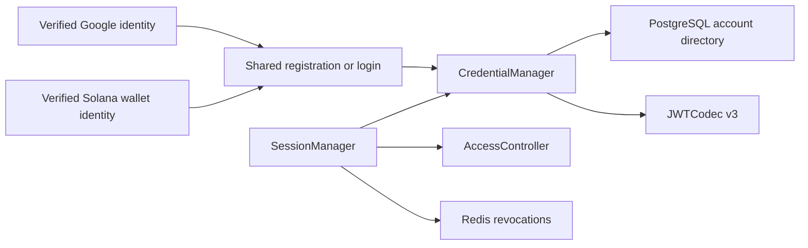

# Account Credentials

## Scope

Account Credentials owns Athena's stable UUID account identity, immutable public
username, permanent realm-scoped single-provider login binding, persistent API
Key metadata, Athena JWT v3 format, and the typed server-side projection of the
credential that authenticated each request. Google OIDC and Solana-wallet
signatures prove browser identities at their protocol boundaries; business APIs
accept only Athena cookies or Athena bearer credentials.

[Google OIDC Login](google-oidc-login.md) and [Solana Wallet
Authentication](solana-wallet-authentication.md) own provider verification.
The shared anonymous username-registration boundary is implemented by
`authregistration`. [Account Access Control](account-access-control.md) owns
current login, API Key, Profit Sharing, module, and administrator authorization.
Username is identity presentation, not an authorization key or editable display
name.

## Source Locations

| Concern | Source | Key symbols |
| --- | --- | --- |
| Identity, capability, application realm, development role, and API Key types | [internal/accountcredentials/types.go](../../../internal/accountcredentials/types.go) | `Account`, `Token`, `Capability`, `AuthenticatedCredential`, `ApplicationRealm`, `ParseApplicationRealm`, `Account.ApplicationRealm`, `DevelopmentRole`, `Account.DevelopmentRole`, `IsInteractiveLogin` |
| Username policy | [internal/accountcredentials/username.go](../../../internal/accountcredentials/username.go) | `ValidateUsername`, `ErrUsernameInvalid`, `MinUsernameLength`, `MaxUsernameLength` |
| Runtime credential registry | [internal/accountcredentials/manager.go](../../../internal/accountcredentials/manager.go) | `CredentialManager`, `GetByIdentity`, `UsernameAvailable`, `RegisterExternalAccount`, `IssueLoginSession`, `IssueAPIKey`, `ValidateCredential` |
| JWT signing configuration | [internal/accountcredentials/config.go](../../../internal/accountcredentials/config.go) | `LoadJWTSigningKey` |
| JWT v3 codec | [internal/accountcredentials/jwt_codec.go](../../../internal/accountcredentials/jwt_codec.go) | `JWTCodec`, `TokenVersion`, `Issue`, `Parse` |
| Durable account adapter | [internal/accountstate/store/sql_store.go](../../../internal/accountstate/store/sql_store.go) | `ListCredentialAccounts`, `GetCredentialAccountByIdentity`, `RegisterExternalAccount`, `RecordLogin`, `EnsureDevelopmentAccount` |
| Schema and generated-query sources | [internal/accountstate/store/migrations/000001_init.sql](../../../internal/accountstate/store/migrations/000001_init.sql), [internal/accountstate/store/queries/account_directory.sql](../../../internal/accountstate/store/queries/account_directory.sql), [internal/accountstate/store/queries/account_api_key.sql](../../../internal/accountstate/store/queries/account_api_key.sql) | `athena_account`, `account_api_key`, external-account creation, `GetDevelopmentMember`, `CreateDevelopmentMember`, administrator development queries |
| Shared registration boundary | [internal/authregistration/types.go](../../../internal/authregistration/types.go), [internal/authregistration/handler.go](../../../internal/authregistration/handler.go) | `Identity`, `Backend`, `Handler`, `Begin`, `Registration`, `UsernameAvailability` |
| Session validation, typed context, and revocation | [util/session/sessionmanager.go](../../../util/session/sessionmanager.go), [util/session/credential.go](../../../util/session/credential.go), [util/session/state.go](../../../util/session/state.go) | `SessionManager`, `AuthenticateToken`, `WithAuthenticatedCredential`, `AuthenticatedCredentialFromContext`, `ParseLoginForRevocation`, `UserStateStorage` |
| Account and Session API projections | [internal/server/account/account.proto](../../../internal/server/account/account.proto), [internal/server/session/session.proto](../../../internal/server/session/session.proto) | `Account.id`, `Account.username`, `Account.identity`, `GetUserInfoResponse.accountId` |
| Member-only API Key browser boundary | [ui/src/app/member/security-service.ts](../../../ui/src/app/member/security-service.ts), [ui/src/app/member/pages/account-security.tsx](../../../ui/src/app/member/pages/account-security.tsx), [ui/src/app/member/services.ts](../../../ui/src/app/member/services.ts) | `MemberSecurityService`, `AccountSecurityPage`, member-only service construction |
| Realm transport, process wiring, and production guard | [internal/server/application_realm.go](../../../internal/server/application_realm.go), [cmd/athena-server/commands/athena-server.go](../../../cmd/athena-server/commands/athena-server.go), [internal/server/athena-server.go](../../../internal/server/athena-server.go), [hack/prod-remote-deploy.sh](../../../hack/prod-remote-deploy.sh), [docker-compose.prod.yml](../../../docker-compose.prod.yml) | `applicationRealmFromIncomingContext`, `authenticateRealmLoginCookie`, `developmentAccountIDs`, production disabled-auth rejection |

## Architecture

`account_id` is the only internal identity key. It is a canonical UUID used by
JWT subjects, permissions, API Keys, profile state, Wallet ownership, and
Profit Sharing relationships. `username` is permanent public presentation
metadata and preserves the casing selected during registration. Public UI
normally displays `@username`; it does not use the value to locate credentials
or infer administrator status.

Every normal account has exactly one immutable `(identity_provider,
identity_subject, application_realm)` binding. The realm is derived from the
persisted `administrator` fact: `false` is `member` and `true` is `admin`.
Google uses its stable OIDC `sub`; Solana wallet authentication uses the
canonical base58 encoding of the 32-byte public key and is fixed to `member`.
The same Google subject may therefore own one member account and the single
administrator account. Those personas have different UUIDs and globally unique
usernames, and all profile, preference, access, API Key, Wallet, and business
data remains independently keyed by its persona UUID. The same person using two
providers likewise receives unrelated UUIDs. No merge, secondary binding,
rebind, transfer, or recovery path exists.

PostgreSQL is authoritative. `CredentialManager` loads a process-local registry
keyed by UUID plus a provider-subject-realm-to-UUID index, and publishes a
registered account only after the complete database aggregate commits. The
current single-API-Server topology requires no cross-instance cache invalidation.

`JWTCodec` is a stateless HS256 boundary. `SessionManager` combines a verified
v3 token with the current account record, current access snapshot, durable API
Key membership or external identity binding, and Redis revocation state on every
request. Successful validation produces an `AuthenticatedCredential` carrying
the server-resolved account UUID, capability, JTI, identity binding, and current
access revision. Middleware attaches this typed value to the request context;
security-sensitive handlers do not infer credential kind from browser headers.

The browser exposes API Key metadata and issue/revoke commands only through the
member application's `MemberSecurityService` and lazy `AccountSecurityPage`.
The administrator registry does not construct that service, and the fixed
administrator aggregate keeps `APIKeyEnabled=false`. Self-profile commands and
administrator account-directory commands use separate facades.

## Runtime Flow

1. Startup loads all durable accounts and API Key metadata. An empty account
   directory is valid in normal authentication mode; no administrator or
   ordinary account is seeded by the migration.
2. A cryptographically verified but unknown Google subject or Solana address in
   an explicit application realm remains outside PostgreSQL until the browser
   submits an acceptable username through the shared registration handler.
   `RegisterExternalAccount` creates identity, access, ten module rows, profile,
   and preferences in one transaction. Member accounts start Pending. The admin
   realm accepts only the configured verified Google email and can create only
   the single fixed administrator aggregate; the same email entering through
   the member realm remains an ordinary member persona.
3. Registration first rechecks the same provider, subject, and realm. Concurrent
   submissions for that tuple converge on the first committed UUID and username.
   A case-insensitive username collision or a second administrator is rejected
   by PostgreSQL uniqueness constraints. Different realms or providers never
   converge.
4. A known provider, subject, and realm resolve directly to the original UUID
   and locked username. Successful login updates `last_login_at`; Google also
   refreshes its verified-email audit field. Login cannot change provider,
   subject, username, role, profile, or preferences.
5. Athena signs a login token with a fresh UUID JTI, expiry, and digest of the
   persisted realm, provider, and subject. API Key creation signs a fresh JTI
   and inserts bearer-free metadata before returning the bearer to its creator.
6. Parsing accepts only HS256, issuer `athena`, valid registered time claims, a
   non-empty JTI, `athenaTokenVersion=3`, and a subject shaped as
   `<canonical-account-uuid>:login` or `<canonical-account-uuid>:apiKey`.
7. Both credential kinds require current `LoginEnabled`. Login sessions require
   the current external identity-binding digest. API Keys require current
   `APIKeyEnabled` and an unexpired JTI still present in `account_api_key`. Redis
   revocation is checked last. Successful validation creates a typed credential
   with the current access revision and attaches it beside claims.
8. Boundaries that explicitly require human interaction call
   `IsInteractiveLogin`; login and isolated loopback development credentials
   qualify, while API Keys do not. Wallet creation, import, reauthentication,
   and private-key reveal use this distinction independently of module level.
   Worm Trading wallet-summary, balance, connection-state, open-position, and
   in-flight-request reads, including uploaded-wallet-avatar GET, accept either
   login sessions or enabled API Keys after current Worm Trading `READ`
   authorization and exact Wallet ownership checks. The native full-account
   Worm connection inventory requires an interactive credential, Worm Trading
   `READ_WRITE`, and owner scope but no Worm lease or Origin header. Native Worm
   connect, reconnect, and disconnect require the same interactive
   credential plus exact origin and a separate five-minute Worm management
   lease; API Keys cannot enter either management flow.
9. Deleting an API Key commits metadata deletion before removing it from the
   registry. Disabling API Key access pauses retained keys; re-enabling restores
   undeleted and unexpired keys. Only the member registry constructs these
   commands; an administrator cannot request them. Logout selects exactly the
   current realm's browser cookie, parses the signed login shape, resolves the
   token account's persisted realm, and revokes the JTI only when both realms
   agree. A token copied into the opposite cookie slot is cleared from that slot
   but cannot revoke the other persona's session. Member logout also clears the
   member-only wallet-secret and Worm-credential lease cookies; admin logout
   leaves the member session and its leases untouched.
10. With authentication disabled, startup explicitly creates or reuses both
    UUID `development` identities. Realm `member` maps to `local-user` with
    maximum member access; realm `admin` maps to `local-admin` with only explicit
    administrator capability. Each request must declare its realm and receives
    the corresponding UUID in synthetic claims plus a typed `development`
    credential, so both applications are usable in one local process without
    restarting or reconfiguring the server. Normal authentication startup
    rejects any persisted development identity, so changing to external
    authentication requires a clean account-state database.

## State / Data

`athena_account` stores:

- `account_id UUID PRIMARY KEY DEFAULT gen_random_uuid()`;
- immutable `username`, `identity_provider`, `identity_subject`, and
  `administrator` role;
- mutable Google-only `verified_email` and login audit timestamps.

The schema enforces case-insensitive global username uniqueness, uniqueness of
`(identity_provider, identity_subject, administrator)`, and at most one
administrator. Google identities require a non-empty subject and verified
email. One Google `sub` may occupy both boolean values, producing independent
member and admin rows, but it cannot occupy either value twice. Solana
identities require an empty verified email, a canonical address that decodes to
exactly 32 bytes, and `administrator=false`. The two isolated development
shapes have no external subject or email. The ordinary shape is exactly
`local-user` with `administrator=false`; the administrator shape is exactly
`local-admin` with `administrator=true`. Both rows coexist in a disabled-auth
development database and the request realm selects which UUID is injected. The
single-administrator unique constraint still prevents `local-admin` from
coexisting with a Google administrator.

`ValidateUsername` requires 3–42 ASCII letters, digits, periods, or hyphens;
requires at least one alphanumeric character; and does not trim, case-fold, or
rewrite the stored value. It rejects 40-byte `0x` wallet-address forms and a
checked-in safety list after lowercasing and removing periods and hyphens. The
exact lowercase username `admin` is permitted only when registration's explicit
realm is `admin`. Username cannot be changed, transferred, aliased, or used to
derive role.

`account_api_key` is keyed by `(account_id, display_id)` and gives every JTI
global uniqueness. It stores issue and optional expiry times, never the bearer.
Every login JWT contains `athenaIdentityBinding`, the hexadecimal SHA-256 digest
of realm, provider, and subject separated by zero bytes. A login token therefore
cannot move between two personas backed by the same Google subject. Google
subjects, generic identity-subject fields, binding digests, JTIs, and bearer
values do not enter public Account or Session APIs. The safe Account identity
projection exposes only the verified Google email or, deliberately, the public
Solana address appropriate to the viewer.

Browser sessions use two deployment-root cookie slots:
`athena.token.member` for the member realm and `athena.token.admin` for the
administrator realm. Authenticated requests declare `member` or `admin` through
`X-Athena-Application-Realm`; browser GET resources that cannot attach a custom
header use the validated `athenaRealm` query transport. The server reads only
the selected cookie and verifies that the token's persisted account role maps
back to the same realm. Realm selection therefore cannot reinterpret a member
credential as administrator authority.

`AuthenticatedCredential` is request-local state, not a public model or durable
record. Its access revision is reloaded during token authentication, so a lease
or sensitive operation can bind to the authorization snapshot that actually
admitted the request. Its capability is derived from the verified JWT subject
shape, never from whether the request arrived through an Authorization header
or Cookie header.

## Configuration

| Setting | Behavior |
| --- | --- |
| `ATHENA_JWT_SECRET` / `ATHENA_JWT_SECRET_FILE` | Supplies the HS256 key. It must contain at least 32 bytes. If omitted outside production, startup generates a process-lifetime key, so restart invalidates credentials. |
| `ATHENA_SESSION_DURATION` | Controls login-session lifetime; the default is 24 hours. |
| `ATHENA_SERVER_DISABLE_AUTH` | Enables both loopback-only development identities and skips external-login configuration. Each request realm selects `local-user` or `local-admin`. The production deployment rejects true and Compose fixes false; this setting does not enable a password path. |

Google client, public-origin, and administrator allowlist configuration are
documented in [Google OIDC Login](google-oidc-login.md). Phantom desktop login
adds no App ID, client secret, RPC endpoint, callback, per-wallet variable, or
other environment setting. UUIDs, usernames, identity bindings, roles,
entitlements, and API Key metadata are database state.

## Invariants

- A canonical account UUID, never username, email, or wallet address, identifies
  an account in credentials and downstream relationships.
- Provider plus subject plus application realm is the permanent external
  identity key. Google email is never a lookup key; wallet software brand is not
  an identity provider value.
- One verified Google subject may own independent member and administrator
  personas. Their UUIDs, usernames, access, profile, preferences, API Keys,
  Wallets, and business data never merge or inherit from each other.
- Google and Solana identities cannot merge or act as secondary credentials for
  one account.
- Username is case-insensitively unique, public, immutable, and authorization-
  neutral; `administrator` is the sole role fact.
- A Solana-wallet identity can never be administrator. At most one Google
  administrator exists, but zero administrators is a valid normal startup state.
- Registration publishes runtime identity only after the complete PostgreSQL
  aggregate commits.
- Every accepted signed credential is Athena v3 and passes current login,
  credential membership or binding, and revocation checks.
- Sensitive handlers distinguish login, API Key, and isolated development
  credentials through the typed authenticated context, never client headers.
- API Key UI and commands exist only in the member dependency graph; the
  administrator aggregate and service registry expose neither.
- A disabled-auth server contains both `local-user` and `local-admin`; the
  explicit request realm selects exactly one, and its role and access still pass
  through the same authorization controller as an externally authenticated
  account.
- Member and administrator cookies coexist. Authentication, session issuance,
  and logout operate only on the declared realm. Logout verifies the selected
  token's persisted account realm before JTI revocation; member logout
  additionally clears member-sensitive leases, while admin logout never clears
  them.
- API Keys may read owner-scoped Worm activity but cannot list the Worm
  management inventory, obtain a sensitive lease, manage a Worm connection,
  invoke Wallet's challenge signer, or receive a Worm HMAC credential.
- API Key bearer values, Google tokens, wallet signatures, and private keys are
  never persisted by Account Credentials. Worm challenges, signatures, API
  keys, and secrets are also absent from this state.

## Failure Recovery

A database failure during registration, login audit, API Key insertion, or API
Key deletion leaves the associated runtime registry change unpublished.
Provider-subject-realm uniqueness makes same-persona registration converge;
username and administrator uniqueness reject competing identities without
merging them.

If account creation commits but later ticket completion or cookie issuance
fails, the verified provider identity still owns the committed account. A fresh
provider login follows the known-identity path and can issue a session without
choosing another username. Rotating the JWT secret invalidates all cookies and
API Keys. Revocation state fails closed until its initial Redis snapshot loads;
pending local revocations remain effective while Redis persistence retries.
Failure to load the current access snapshot prevents typed credential creation;
sensitive handlers never continue with stale or header-inferred capability.

## Observability

Credential and registration logs identify provider, operation stage, and
account UUID when one exists. Authorization codes, Google tokens, external
subjects, wallet signatures and messages, Athena JWTs, client secrets,
identity-binding values, Worm credential challenges and HMAC material, API Key
JTIs, and bearer values are excluded from logs and metrics. External identity
providers are not part of API Server health.

## Change Checklist

- [ ] UUID identity, immutable username, single-provider binding, and role boundaries remain current.
- [ ] Registration and API Key commit/publication ordering remain current.
- [ ] JWT v3 claims and mutable credential checks remain current.
- [ ] Typed credential capability and access-revision projection remain current.
- [ ] API-Key Worm reads, interactive lease-free management inventory, and lease-bound credential mutations remain distinct.
- [ ] Public projections still exclude private identity and bearer material.
- [ ] Realm-aware identity lookup, binding digest, and dual cookie selection remain current.
- [ ] The two disabled-auth identities and request-realm selection remain current.
- [ ] Configuration, failure recovery, and source links match the code.
- [ ] The [design index](../README.md) contains the current summary.
