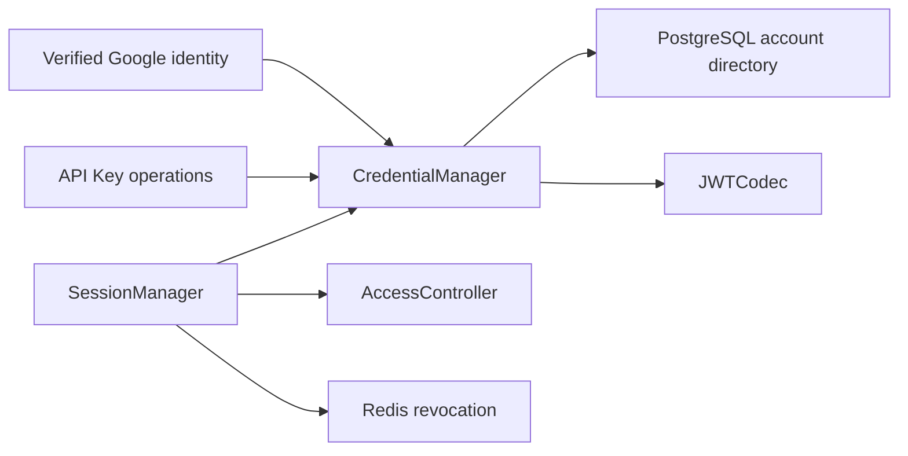

# Account Credentials

## Scope

Account Credentials owns Athena's durable account identities, permanent Google
subject bindings, persistent API Key metadata, and Athena JWT v2 encoding. The
browser never presents a Google token to a business API: Google proves an
identity once, then Athena issues and validates its own cookie or bearer JWT.

[Google OIDC Login](google-oidc-login.md) owns the browser protocol and just-in-
time account provisioning. [Account Access Control](account-access-control.md)
owns login, API Key, Profit Sharing, and module entitlements. [Account Profile
and Preferences](account-profile-and-preferences.md) owns user-visible profile
and theme data. Redis revocation is composed by `SessionManager` and does not
replace the durable API Key registry.

## Source Locations

| Concern | Source | Key symbols |
| --- | --- | --- |
| Identity and token types | [internal/accountcredentials/types.go](../../../internal/accountcredentials/types.go) | `Account`, `Token`, `Capability`, `HasGoogleBinding`, `IsValidAPIKeyDisplayID` |
| Durable runtime registry | [internal/accountcredentials/manager.go](../../../internal/accountcredentials/manager.go) | `CredentialManager`, `ResolveOrProvisionGoogleAccount`, `RecordGoogleLogin`, `IssueGoogleLoginSession`, `IssueAPIKey`, `ValidateCredential`, `DeleteAPIKey` |
| JWT signing configuration | [internal/accountcredentials/config.go](../../../internal/accountcredentials/config.go) | `LoadJWTSigningKey` |
| JWT v2 codec | [internal/accountcredentials/jwt_codec.go](../../../internal/accountcredentials/jwt_codec.go) | `JWTCodec`, `TokenVersion`, `Issue`, `Parse` |
| Durable account and API Key adapter | [internal/accountstate/store/sql_store.go](../../../internal/accountstate/store/sql_store.go) | `SQLStore`, `ListCredentialAccounts`, `ResolveOrProvisionGoogleAccount`, `RecordGoogleLogin`, `CreateAPIKeyMetadata`, `DeleteAPIKeyMetadata` |
| Schema and generated queries | [internal/accountstate/store/migrations/000001_init.sql](../../../internal/accountstate/store/migrations/000001_init.sql), [internal/accountstate/store/queries/account_directory.sql](../../../internal/accountstate/store/queries/account_directory.sql), [internal/accountstate/store/queries/account_api_key.sql](../../../internal/accountstate/store/queries/account_api_key.sql) | `athena_account`, `account_api_key` |
| Session validation and revocation | [util/session/sessionmanager.go](../../../util/session/sessionmanager.go), [util/session/state.go](../../../util/session/state.go) | `SessionManager`, `CreateGoogleLogin`, `Parse`, `ParseLoginForRevocation`, `UserStateStorage` |
| API Key self-service | [internal/server/account/account.go](../../../internal/server/account/account.go), [internal/server/account/account.proto](../../../internal/server/account/account.proto) | `ListTokens`, `CreateToken`, `DeleteToken` |
| Process wiring | [internal/server/athena-server.go](../../../internal/server/athena-server.go) | `NewServer`, `Authenticate`, `getClaims` |

## Architecture

PostgreSQL is the identity and API Key commit point. `CredentialManager` loads a
process-local read-through registry at startup and publishes a newly provisioned
account only after its database transaction commits. The current deployment has
one API Server, so no cross-instance invalidation channel is required.

`JWTCodec` has no database, Google, Redis, or authorization dependency. It owns
only HS256 signing and verified parsing. `SessionManager` composes the parsed
credential with current account entitlements, current binding or API Key JTI
membership, and Redis revocation state on every protected request.

## Runtime Flow

1. Startup loads the JWT signing key, opens the account-state database, loads all
   accounts and API Key metadata, and builds account-name and Google-subject
   indexes. The migration always contains the fixed, initially unbound `admin`
   row; ordinary accounts are created by verified OIDC callbacks.
2. An unknown verified Google subject is resolved or provisioned in PostgreSQL.
   Ordinary accounts use an immutable `user-<UUID>` name. The configured
   administrator email may atomically claim the unbound `admin`; after that,
   only its persisted subject identifies the administrator.
3. A successful login is signed as an Athena JWT v2 only after current login
   access is allowed. The durable record then receives the current verified
   email and `last_login_at`. Email changes never change account identity or
   profile display state.
4. API Key creation signs a bearer with a fresh UUID JTI and then inserts its
   metadata in PostgreSQL. The bearer is returned only after that transaction
   commits. Metadata contains the display ID, JTI, issue time, and optional
   expiry, never the bearer JWT.
5. JWT parsing accepts only issuer `athena`, HS256, valid registered time claims,
   `athenaTokenVersion=2`, a non-empty JTI, and a subject of
   `<account>:login` or `<account>:apiKey`. Login tokens additionally require an
   expiry and current Google identity-binding digest.
6. Request authentication requires `LoginEnabled` for both token types. Login
   sessions require current binding equality; API Keys require
   `APIKeyEnabled` and durable JTI membership. Redis revocation is then checked.
7. Deleting an API Key commits the metadata deletion before removing it from the
   runtime registry. The bearer fails its next request. Disabling API Key access
   pauses all retained keys; re-enabling restores unexpired, undeleted keys.
8. Logout clears the browser cookie and revokes a cryptographically valid login
   JTI. It does not sign out the user's global Google session.

## State / Data

`athena_account` stores the immutable account name, unique nullable
`google_subject`, mutable verified email, fixed administrator flag, creation and
update times, and last successful login time. Only the unclaimed administrator
may have a null subject. Ordinary account names are UUID-derived and cannot
contain `:` because that delimiter is reserved by JWT subjects.

`account_api_key` is owned by an account foreign key. Display IDs are unique per
account and JTIs are globally unique. A display ID contains 1–64 ASCII letters,
digits, dots, underscores, or hyphens and begins with a letter or digit. Reusing
a deleted display ID creates a new JTI and cannot revive the former bearer.

Every login JWT contains `athenaIdentityBinding`, the hexadecimal SHA-256 digest
of `google`, a zero-byte separator, and the persisted Google subject. Raw
subjects, identity-binding values, JWT JTIs, and bearer values are private and
never appear in the public Account or Session API.

Redis stores login revocations as `revoked-token|<jti>`. OAuth transaction state
uses a separate namespace and adapter.

## Configuration

| Setting | Behavior |
| --- | --- |
| `ATHENA_JWT_SECRET` / `ATHENA_JWT_SECRET_FILE` | Supplies the HS256 key. A configured key must contain at least 32 bytes. A missing key outside production produces a transient process key and invalidates credentials after restart. |
| `ATHENA_SESSION_DURATION` | Controls browser-session lifetime; the default is 24 hours. |
| `ATHENA_SERVER_DISABLE_AUTH` | Enables the loopback-only development administrator bypass and skips Google configuration. It does not create a password login path. |

Google client configuration and `ATHENA_ADMIN_GOOGLE_EMAIL` are documented in
[Google OIDC Login](google-oidc-login.md). Account names, subjects, entitlements,
and API Key metadata are database state.

## Invariants

- Google `sub`, not email, is the durable external identity key.
- Exactly one fixed `admin` exists and no API can promote, delete, transfer, or
  rebind it.
- An ordinary account is published to runtime only after its account, access,
  ten-module matrix, and initial profile commit atomically.
- API Key bearer values and Google tokens are never persisted.
- Every accepted JWT is Athena v2 and passes current login access, credential
  membership or binding, and revocation checks.
- API Key access is independent from Google login binding and Profit Sharing.
- Profile, avatar, theme, tier, and display name are never overwritten by a
  later Google login.

## Failure Recovery

Database failure during provisioning, audit update, API Key insertion, or API
Key deletion leaves the runtime snapshot unchanged and returns an error. A
subject uniqueness race or concurrent administrator claim is resolved inside
the store by locking and conflict re-read; one subject creates at most one
account, and a different subject cannot take an already claimed administrator.

Rotating `ATHENA_JWT_SECRET` invalidates all existing browser sessions and API
Keys. A Redis outage prevents new OAuth transactions and may delay revocation
persistence, but it does not delete durable accounts or API Key metadata.

## Observability

Credential and OIDC failures log an operation stage and Athena account name when
available. Authorization codes, Google tokens, Athena JWTs, client secrets,
identity-binding values, and API Key JTIs are excluded from logs and metrics.
Google availability is not part of the API Server health check.

## Change Checklist

- [ ] Durable identity and API Key transaction boundaries remain current.
- [ ] JWT v2 claims and mutable access checks remain current.
- [ ] Public projections still exclude Google subjects and bearer secrets.
- [ ] Configuration, recovery, and source links match the implementation.
- [ ] The [design index](../README.md) contains the current summary.
