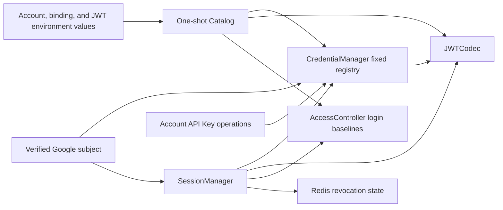

# Account Credentials

## Scope

Account Credentials owns Athena's fixed, environment-defined account registry,
the one-to-one Google subject binding attached to each login identity, account
capabilities, process-local API Key metadata and lifecycle, and Athena JWT v2
encoding and decoding. It exposes typed credential operations without exposing
Google subjects, signing material, or bearer values through public account
projections.

[Google OIDC Login](google-oidc-login.md) owns the browser authorization flow,
Google protocol validation, and short-lived OAuth transactions. [Account
Access Control](account-access-control.md) owns current login availability and
product-module authorization. `SessionManager` composes those access decisions
with credential validation and Redis-backed revocation. [Account Profile and
Preferences](account-profile-and-preferences.md) owns durable display state;
Google profile data does not update it. Durable account creation and Google
token storage are outside this capability.

## Source Locations

| Concern | Source | Key symbols |
| --- | --- | --- |
| Environment catalog and binding validation | [internal/accountcredentials/catalog.go](../../../internal/accountcredentials/catalog.go) | `Catalog`, `LoadCatalog`, `ValidateGoogleBindings`, `LoginDefaults` |
| Credential types and API Key display-ID validation | [internal/accountcredentials/types.go](../../../internal/accountcredentials/types.go) | `Account`, `Capability`, `Token`, `HasGoogleBinding`, `IsValidAPIKeyDisplayID` |
| Fixed registry and typed issuance | [internal/accountcredentials/manager.go](../../../internal/accountcredentials/manager.go) | `CredentialManager`, `ResolveGoogleSubject`, `IssueGoogleLoginSession`, `IssueAPIKey`, `ValidateCredential`, `DeleteAPIKey` |
| Athena JWT v2 codec | [internal/accountcredentials/jwt_codec.go](../../../internal/accountcredentials/jwt_codec.go) | `JWTCodec`, `TokenVersion`, `Issue`, `Parse`, `ParsedToken` |
| Access and revocation composition | [util/session/sessionmanager.go](../../../util/session/sessionmanager.go), [util/session/state.go](../../../util/session/state.go) | `SessionManager`, `CreateGoogleLogin`, `Parse`, `ParseLoginForRevocation`, `UserStateStorage` |
| API Key self-service | [internal/server/account/account.go](../../../internal/server/account/account.go), [internal/server/account/account.proto](../../../internal/server/account/account.proto) | `ListTokens`, `CreateToken`, `DeleteToken` |
| Login-availability projection | [internal/server/settings/settings.go](../../../internal/server/settings/settings.go) | `Projector.Project` |
| Process wiring | [internal/server/athena-server.go](../../../internal/server/athena-server.go) | `NewServer`, `Authenticate`, `getClaims` |
| Deployment account catalog | [.env.prod](../../../.env.prod) | `ATHENA_ACCOUNT_<NAME>_*`, `ATHENA_ADMIN_*`, `ATHENA_JWT_SECRET` |

## Architecture

`Catalog` is a one-shot startup transfer object. It parses account seeds,
ordinary-account login baselines, administrator metadata, and JWT signing
material, then hands defensive copies to runtime owners. The account registry
is fixed for the process lifetime. Login baselines are copied into
`AccessController`; they are not credential state.

`CredentialManager` owns one immutable account-name map and one immutable
Google-subject lookup map. Each account record has its own `RWMutex`, so API
Key mutations for one account do not serialize credential work for every other
account. Google subjects and capabilities do not have runtime mutation APIs.

`JWTCodec` owns a private copy of the HMAC key and performs only local signing
and verified parsing. It does not call Google, Redis, account access, or service
code. `SessionManager` is the composition boundary that applies current access,
current credential state, and revocation after cryptographic parsing.

## Runtime Flow

1. `LoadCatalog` creates the built-in `admin` seed and discovers ordinary
   accounts from recognized `ATHENA_ACCOUNT_<NAME>_*` variables. Ordinary
   accounts default to disabled login when `_ENABLED` is omitted; `admin` has a
   fixed enabled baseline and the `login` capability.
2. When authentication is enabled, `ValidateGoogleBindings` runs before the
   listener opens. Every login-capable account must have a non-empty Google
   subject, every non-empty subject must be unique, and `admin` must retain its
   own login capability and unique binding. Disabled-auth development mode
   skips this validation because it projects the built-in administrator
   identity directly.
3. `JWTCodec` copies the catalog signing key. `CredentialManager` clones every
   seed into a per-account record and builds the verified-subject-to-account
   lookup. No Google network operation occurs at this boundary.
4. After the OIDC handler verifies an external ID token,
   `ResolveGoogleSubject` selects the internal Athena account using only the
   Google `sub`. `SessionManager.CreateGoogleLogin` checks the account's current
   `login` capability, configured binding, and `AccessController.LoginEnabled`.
5. `IssueGoogleLoginSession` holds that account's read lock while it rechecks
   the verified subject and signs the session. The JWT carries a SHA-256
   identity-binding digest derived from the provider name and current subject,
   never the raw Google subject.
6. API Key creation derives the account from the authenticated request. Under
   that account's write lock, `IssueAPIKey` checks the `apiKey` capability and
   display-identifier uniqueness, creates an independent random UUID JTI and
   one issue timestamp, signs the JWT, and appends matching metadata. An omitted
   display ID becomes a UUID; a supplied ID must
   contain 1–64 ASCII letters, digits, dots, underscores, or hyphens and begin
   with a letter or digit. Signing and metadata insertion are therefore one
   serialized operation. The bearer value is returned only in the creation
   response.
7. `JWTCodec.Parse` accepts only HS256 credentials issued by `athena`, validates
   registered time claims, requires `athenaTokenVersion=2` and a JTI, and parses
   `<account>:<capability>`. Login tokens additionally require expiration and
   an identity binding. It replaces the downstream `sub` claim with the plain
   internal account name after credential routing is complete.
8. Before an authentication-enabled server begins serving, its first Redis
   revocation scan must complete. Logout adds the JTI to a local pending set
   before writing Redis; pending entries are retried until Redis contains them
   or their session expires. `SessionManager.Parse` then loads current
   access on every request, rejects a disabled account, validates the current
   capability plus either login binding or API Key membership, and checks the
   initialized revocation snapshot. The same path authenticates browser cookies
   and bearer API Keys.
9. Logout uses `ParseLoginForRevocation`, which still requires a valid HS256
   signature, Athena issuer, v2 token version, registered time claims, login
   subject capability, identity binding, JTI, and expiration. It intentionally
   does not consult current login availability, the current Google binding,
   credential metadata, or Redis revocation state, so a disabled or rebound
   account's signed session can still be added to the revocation set.
10. API Key deletion removes its metadata under the account write lock. The key
   fails its next request even without a separate Redis revocation entry because
   current JTI membership is mandatory. Reusing the deleted display ID creates
   a fresh random JTI, so it cannot make the old bearer valid again.
11. Shutdown discards process-local API Key changes. Restart rebuilds the
    registry from environment values. Changing a Google subject while retaining
    the JWT key invalidates that account's existing login sessions through the
    identity-binding comparison; it does not invalidate API Keys whose metadata
    remains configured.

## State / Data

Each account record contains one raw Google subject, a cloned capability list,
and cloned API Key metadata. Metadata contains the user-visible ID, a globally
unique private JTI, issue time, and optional expiry; it never contains the
bearer JWT. Startup and runtime issuance use the same display-ID validator:
1–64 ASCII letters, digits, dots, underscores, or hyphens, beginning with a
letter or digit. Startup also rejects duplicate display IDs within an account,
empty or duplicate JTIs across the catalog, invalid metadata times, and metadata
attached to an account without `apiKey` capability. The separate Google lookup
maps a subject to exactly one internal account after authentication-enabled
startup validation. Public Account API projections include capabilities and
never include a Google subject. API Key metadata is exposed separately only by
the authenticated current-account `ListTokens` operation; that projection
contains the display ID and times, not the private JTI.

API Key metadata and mutations are process-local. They are not written to
PostgreSQL or Redis. `AccessController` retains login availability separately,
and PostgreSQL profile, preference, and access rows cannot create a credential
identity.

Every current local credential uses issuer `athena`, subject
`<athena-account>:login` or `<athena-account>:apiKey`, integer claim
`athenaTokenVersion=2`, `iat`, `nbf`, and a non-empty `jti`. Login sessions also
require `exp` and `athenaIdentityBinding`. API Keys may omit `exp` and do not
depend on the Google binding. The binding is the hexadecimal SHA-256 digest of
`google`, a zero-byte separator, and the current subject.

Redis stores revocations under `revoked-token|<jti>`. Synchronization removes
only that exact prefix and treats the complete non-empty remainder as an opaque
JTI, so delimiter characters inside a JTI do not alter revocation identity.

The catalog briefly owns the loaded signing key and gives `JWTCodec` a private
byte copy. A configured key must contain at least 32 bytes. If no key is
configured, startup generates a transient 32-byte key; credentials cannot
survive a restart that generates a different key.

## Configuration

| Setting | Behavior |
| --- | --- |
| `ATHENA_ACCOUNT_<NAME>_GOOGLE_SUB` | Binds one ordinary Athena account to one stable Google subject. It is required when that account has `login` capability and authentication is enabled. |
| `ATHENA_ACCOUNT_<NAME>_CAPABILITIES` | Accepts the deduplicated `login` and `apiKey` capabilities. Unsupported values are ignored with a warning. |
| `ATHENA_ACCOUNT_<NAME>_TOKENS` | Supplies JSON API Key metadata (`id`, `jti`, `iat`, optional `exp`) for one ordinary account at process startup. Display IDs use the same 1–64-character ASCII rule as runtime issuance and must be unique per account; JTIs must be globally unique. |
| `ATHENA_ACCOUNT_<NAME>_ENABLED` | Supplies the ordinary account's login baseline to Account Access Control. Omission defaults to disabled. |
| `ATHENA_ADMIN_GOOGLE_SUB` | Binds the fixed `admin` account. Authentication-enabled startup requires it. |
| `ATHENA_JWT_SECRET` / `_FILE` | Supplies an HMAC key of at least 32 bytes copied into `JWTCodec`. Outside production Compose, absence creates a transient key and removes credential continuity across restart. Production Compose requires the value and removes it from every container except `athena-server`. |
| `ATHENA_SESSION_DURATION` | Controls login-session lifetime through runtime settings; the default is 24 hours. It does not change API Key expiration. |
| `ATHENA_SERVER_DISABLE_AUTH` | Skips Google-binding and OIDC startup requirements and projects the fixed local administrator identity for development, but only on a loopback listen address. |

Google client settings and redirect validation are documented in [Google OIDC
Login](google-oidc-login.md).

## Invariants

- The environment catalog is the only account identity source; runtime APIs and
  database rows cannot add or remove accounts.
- Authentication-enabled startup has a non-empty, one-to-one Google binding for
  every login-capable account and a distinct fixed administrator binding.
- Email address, Google display name, and Google avatar are not identity keys and
  never update Athena account state.
- Google subjects, JWT keys, and bearer values never appear in public account
  projections or API Key metadata.
- Login signing rechecks the verified subject under the account read lock.
- API Key signing and metadata insertion either both succeed or leave the
  account unchanged. Duplicate display IDs never create a second entry, every
  issuance has a fresh UUID JTI, and a deleted bearer cannot revive when its
  former display ID is reused.
- Every accepted local JWT is version 2, has a valid HMAC backed by at least a
  32-byte signing key, issuer, time claims,
  subject capability, and JTI, and passes current access, credential, and
  revocation checks.
- Logout accepts only a cryptographically valid, unexpired Athena v2 login JWT
  with the required login structure before revoking its JTI; mutable account,
  binding, metadata, and prior-revocation state cannot prevent that cleanup.
- A Google rebind invalidates login credentials through the binding digest but
  does not couple API Key validity to Google identity.
- Access disablement suspends an otherwise valid login session or API Key
  without deleting it. Re-enablement restores it if every other check still
  passes.
- Different accounts do not share a credential mutation lock, and no account
  lock encloses Google, Redis, PostgreSQL, access-controller, or transport work.

## Failure Recovery

Malformed or duplicate API Key metadata, invalid enabled flags, an invalid
Google binding map when authentication is enabled, or a configured JWT signing
key shorter than 32 bytes prevents the API listener from opening. A missing JWT
key is handled by generating a transient key and warning that credentials will
not survive restart.

JWT signing, missing account or capability, duplicate API Key ID, and missing
API Key deletion failures do not partially mutate the account record. A Google
subject mismatch between callback verification and session issuance signs no
login token. Deleting API Key metadata is the process-local commit point for
invalidating that key.

An access-store failure fails the request before credential acceptance. On a
fresh authentication-enabled process, Redis revocation synchronization retries
without opening the application servers until its first complete scan succeeds.
Credential validation also remains fail-closed if invoked before that point.
After initialization, a Redis write or synchronization failure leaves the last
process-local snapshot intact. Pending logout revocations remain locally denied
and are retried until persisted or expired. Background resynchronization cannot
modify the credential registry. Production Redis uses AOF on a dedicated
external volume, so ordinary container replacement and hot deployment preserve
unexpired revocation keys. Restart reconstructs configured API Key metadata and
Google bindings, while a changed or transient signing key cryptographically
invalidates credentials issued by the previous process.

## Observability

Catalog startup logs report the loaded account names and the count of matching
environment variables. A generated transient JWT key emits a restart-lifetime
warning. Unsupported capabilities and invalid metadata identify the relevant
configuration key.

Credential and access failures use the normal gRPC, gateway, or authentication
error paths. Disabled credentials use the stable Account Access Control
maintenance result. Google protocol-stage logging and login success/failure
signals are documented in [Google OIDC Login](google-oidc-login.md). No
credential-specific health endpoint exists.

## Change Checklist

- [ ] Catalog parsing, account discovery, login baselines, and binding validation match the implementation.
- [ ] CredentialManager lookup, per-account locking, API Key mutations, and login issuance are current.
- [ ] JWT version, claims, subject routing, identity binding, and registered-claim validation are current.
- [ ] Session validation composes access, credentials, and revocation in the implemented order.
- [ ] Google rebind, API Key deletion, restart, and transient-key behavior remain accurate.
- [ ] Public account projections exclude Google subjects, signing material, and bearer values.
- [ ] Source links and named symbols resolve to the implementation.
- [ ] The [design index](../README.md) contains the correct entry.
