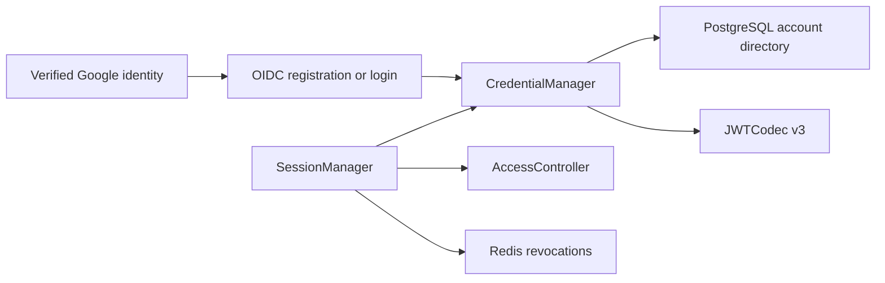

# Account Credentials

## Scope

Account Credentials owns Athena's stable UUID account identity, immutable public
username, permanent Google subject binding, persistent API Key metadata, and
Athena JWT v3 format. Google proves a browser identity at the OIDC boundary;
business APIs accept only Athena cookies or Athena bearer credentials.

[Google OIDC Login](google-oidc-login.md) owns OAuth state and anonymous
username registration. [Account Access Control](account-access-control.md) owns
current login, API Key, Profit Sharing, module, and administrator authorization.
[Account Profile and Preferences](account-profile-and-preferences.md) owns the
mutable display name and theme. Username is identity presentation, not an
authorization key and not the editable display name.

## Source Locations

| Concern | Source | Key symbols |
| --- | --- | --- |
| Identity and API Key types | [internal/accountcredentials/types.go](../../../internal/accountcredentials/types.go) | `Account`, `Token`, `CanonicalAccountID`, `IdentityProviderGoogle`, `IdentityProviderDevelopment` |
| Username policy | [internal/accountcredentials/username.go](../../../internal/accountcredentials/username.go) | `ValidateUsername`, `ErrUsernameInvalid`, `MinUsernameLength`, `MaxUsernameLength` |
| Runtime credential registry | [internal/accountcredentials/manager.go](../../../internal/accountcredentials/manager.go) | `CredentialManager`, `GetByGoogleSubject`, `UsernameAvailable`, `RegisterGoogleAccount`, `IssueGoogleLoginSession`, `IssueAPIKey`, `ValidateCredential` |
| JWT signing configuration | [internal/accountcredentials/config.go](../../../internal/accountcredentials/config.go) | `LoadJWTSigningKey` |
| JWT v3 codec | [internal/accountcredentials/jwt_codec.go](../../../internal/accountcredentials/jwt_codec.go) | `JWTCodec`, `TokenVersion`, `Issue`, `Parse` |
| Durable account adapter | [internal/accountstate/store/sql_store.go](../../../internal/accountstate/store/sql_store.go) | `ListCredentialAccounts`, `RegisterGoogleAccount`, `RecordGoogleLogin`, `EnsureDevelopmentAdministrator`, `CreateAPIKeyMetadata` |
| Schema and generated-query sources | [internal/accountstate/store/migrations/000001_init.sql](../../../internal/accountstate/store/migrations/000001_init.sql), [internal/accountstate/store/queries/account_directory.sql](../../../internal/accountstate/store/queries/account_directory.sql), [internal/accountstate/store/queries/account_api_key.sql](../../../internal/accountstate/store/queries/account_api_key.sql) | `athena_account`, `account_api_key`, `CreateOrdinaryAccount`, `CreateAdministratorAccount` |
| Session validation and revocation | [util/session/sessionmanager.go](../../../util/session/sessionmanager.go), [util/session/state.go](../../../util/session/state.go) | `SessionManager`, `CreateGoogleLogin`, `Parse`, `ParseLoginForRevocation`, `UserStateStorage` |
| Account and Session API projections | [internal/server/account/account.proto](../../../internal/server/account/account.proto), [internal/server/session/session.proto](../../../internal/server/session/session.proto) | `Account.id`, `Account.username`, `GetUserInfoResponse.accountId`, `GetUserInfoResponse.username` |
| Process wiring | [internal/server/athena-server.go](../../../internal/server/athena-server.go) | `NewServer`, `Authenticate`, `developmentAccountID` |

## Architecture

`account_id` is the only internal identity key. It is a canonical UUID used by
JWT subjects, permissions, API Keys, profile state, Wallet ownership, and
Profit Sharing relationships. `username` is permanent public presentation
metadata and preserves the casing selected during registration. Public UI
normally displays `@username`; it does not use the value to locate credentials
or infer administrator status.

PostgreSQL is authoritative. `CredentialManager` loads a process-local registry
keyed by UUID plus a Google-subject-to-UUID index, and publishes a registered
account only after the complete database aggregate commits. The current
single-API-Server topology requires no cross-instance cache invalidation.

`JWTCodec` is a stateless HS256 boundary. `SessionManager` combines a verified
v3 token with the current account record, current access snapshot, durable API
Key membership or Google binding, and Redis revocation state on every request.

## Runtime Flow

1. Startup loads all durable accounts and API Key metadata. An empty account
   directory is valid in normal OIDC mode; no administrator or ordinary account
   is seeded by the migration.
2. A verified but unknown Google subject remains outside PostgreSQL until the
   browser submits an acceptable username. `RegisterGoogleAccount` then creates
   the identity, access head, ten module rows, profile, and preferences in one
   database statement. Ordinary accounts start Pending. An administrator
   candidate creates the single `administrator=true` aggregate with fixed
   administrator access.
3. Registration first rechecks an existing subject. Concurrent submissions for
   the same subject converge on its first committed UUID and username. A
   case-insensitive username collision or a second administrator is rejected by
   PostgreSQL uniqueness constraints.
4. A known Google subject resolves directly to its original UUID and locked
   username. Successful login updates only `verified_email`, `updated_at`, and
   `last_login_at`; it cannot change the username, role, profile, or preferences.
5. Athena signs a login token with a fresh UUID JTI, an expiry, and the digest of
   the persisted Google subject. API Key creation signs a fresh JTI and inserts
   bearer-free metadata before returning the bearer to its creator.
6. Parsing accepts only HS256, issuer `athena`, valid registered time claims, a
   non-empty JTI, `athenaTokenVersion=3`, and a subject shaped as
   `<canonical-account-uuid>:login` or `<canonical-account-uuid>:apiKey`.
7. Both credential kinds require current `LoginEnabled`. Login sessions require
   the current Google identity-binding digest. API Keys require current
   `APIKeyEnabled` and an unexpired JTI still present in `account_api_key`. Redis
   revocation is checked last.
8. Deleting an API Key commits metadata deletion before removing it from the
   registry. Disabling API Key access pauses retained keys; re-enabling restores
   undeleted and unexpired keys. Logout clears and revokes only the Athena login
   session.
9. With authentication disabled, startup explicitly creates or reuses one UUID
   `development` identity named `local-admin`. Requests receive that UUID in
   synthetic claims. Normal OIDC startup rejects a persisted development
   identity, so changing modes requires a clean account-state database.

## State / Data

`athena_account` stores:

- `account_id UUID PRIMARY KEY DEFAULT gen_random_uuid()`;
- immutable `username`, `identity_provider`, Google subject, and
  `administrator` role;
- mutable verified email and login audit timestamps.

The schema enforces case-insensitive username uniqueness with
`LOWER(username)`, Google-subject uniqueness, and at most one administrator.
Normal Google identities require a non-empty subject and verified email. The
isolated development identity has neither.

`ValidateUsername` requires 3–42 ASCII letters, digits, periods, or hyphens;
requires at least one alphanumeric character; and does not trim, case-fold, or
rewrite the stored value. It rejects 40-byte `0x` wallet-address forms and a
checked-in safety list after lowercasing and removing periods and hyphens. The
exact lowercase username `admin` is permitted only for an administrator
candidate. Username cannot be changed, transferred, aliased, or used to derive
role.

`account_api_key` is keyed by `(account_id, display_id)` and gives every JTI
global uniqueness. It stores issue and optional expiry times, never the bearer.
Every login JWT contains `athenaIdentityBinding`, the hexadecimal SHA-256 digest
of `google`, a zero-byte separator, and the subject. Google subjects, binding
digests, JTIs, and bearer values do not enter public Account or Session APIs.

## Configuration

| Setting | Behavior |
| --- | --- |
| `ATHENA_JWT_SECRET` / `ATHENA_JWT_SECRET_FILE` | Supplies the HS256 key. It must contain at least 32 bytes. If omitted outside production, startup generates a process-lifetime key, so restart invalidates credentials. |
| `ATHENA_SESSION_DURATION` | Controls login-session lifetime; the default is 24 hours. |
| `ATHENA_SERVER_DISABLE_AUTH` | Enables the loopback-only development identity and skips Google configuration. It does not enable a password path. |

Google client and administrator-candidate configuration are documented in
[Google OIDC Login](google-oidc-login.md). UUIDs, usernames, Google bindings,
roles, entitlements, and API Key metadata are database state, not per-user
environment variables.

## Invariants

- A canonical account UUID, never username or email, identifies an account in
  credentials and downstream relationships.
- Google `sub`, never email, is the permanent external identity key.
- Username is case-insensitively unique, public, immutable, and authorization-
  neutral; `administrator` is the sole role fact.
- At most one administrator exists, but zero administrators is a valid normal
  startup state.
- Registration publishes runtime identity only after the complete PostgreSQL
  aggregate commits.
- Every accepted signed credential is Athena v3 and passes current login,
  credential membership or binding, and revocation checks.
- API Key bearer values and Google tokens are never persisted.
- Profile, avatar, theme, tier, display name, username, and role are not changed
  by a later Google login.

## Failure Recovery

A database failure during registration, login audit, API Key insertion, or API
Key deletion leaves the associated runtime registry change unpublished. Subject
uniqueness makes same-subject registration converge; username and administrator
uniqueness reject competing identities without merging them.

If account creation commits but later cookie issuance fails, the Google subject
still owns the committed account. A fresh Google login follows the known-subject
path and can issue a session without choosing another username. Rotating the JWT
secret invalidates all cookies and API Keys. Revocation state fails closed until
its initial Redis snapshot loads; pending local revocations remain effective
while Redis persistence retries.

## Observability

Credential and registration logs identify operation stage and account UUID when
one exists. Username is safe presentation data but is not needed as a credential
key. Authorization codes, Google tokens and subjects, Athena JWTs, client
secrets, identity-binding values, API Key JTIs, and bearer values are excluded
from logs and metrics. Google is not part of API Server health.

## Change Checklist

- [ ] UUID identity, immutable username, and role boundaries remain current.
- [ ] Registration and API Key commit/publication ordering remain current.
- [ ] JWT v3 claims and mutable credential checks remain current.
- [ ] Public projections still exclude Google subjects and bearer secrets.
- [ ] Configuration, failure recovery, and source links match the code.
- [ ] The [design index](../README.md) contains the current summary.
