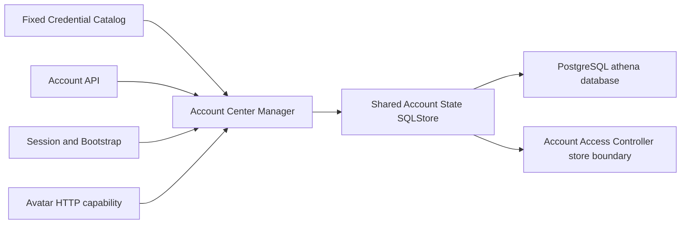

# Account Profile and Preferences

## Scope

Account Profile and Preferences owns durable display names, display-only
Standard/Pro tiers, private avatar object references, and the cross-device
System/Light/Dark theme choice for the fixed environment account catalog. It
provides uncached reads and independent optimistic-concurrency boundaries for
profile and preference state.

[Account Credentials](account-credentials.md) owns process-local passwords and
API Keys. [Account Access Control](account-access-control.md) owns login and
product-module authorization. The avatar object store, upload validation,
private binary delivery, and orphan collection are separate from this
capability; this capability commits only the avatar object metadata reference.

## Source Locations

| Concern | Source | Key symbols |
| --- | --- | --- |
| Domain state and validation | [internal/accountcenter/types.go](../../../internal/accountcenter/types.go) | `Profile`, `Preferences`, `AvatarMetadata`, `Tier`, `ThemeMode` |
| Uncached application boundary | [internal/accountcenter/manager.go](../../../internal/accountcenter/manager.go) | `Manager`, `GetProfile`, `UpdateDisplayName`, `UpdateTier`, `ReplaceAvatar`, `DeleteAvatar`, `UpdatePreferences` |
| Shared PostgreSQL adapter | [internal/accountstate/store/sql_store.go](../../../internal/accountstate/store/sql_store.go) | `SQLStore`, `GetProfile`, `UpdateProfile`, `GetPreferences`, `UpdatePreferences` |
| Schema and queries | [internal/accountstate/store/migrations](../../../internal/accountstate/store/migrations), [internal/accountstate/store/queries/account_center.sql](../../../internal/accountstate/store/queries/account_center.sql) | `account_profile`, `account_preferences`, profile and preference CAS queries |
| API projection and mutations | [internal/server/account/account.go](../../../internal/server/account/account.go), [internal/server/account/account.proto](../../../internal/server/account/account.proto) | `ToAPIAccountProfile`, `ToAPIAccountPreferences`, `UpdateAccountProfile`, `UpdateAccountTier`, `UpdateAccountPreferences` |
| Session projection | [internal/server/session/session.go](../../../internal/server/session/session.go), [internal/server/appbootstrap/appbootstrap.go](../../../internal/server/appbootstrap/appbootstrap.go) | `ProjectUserInfo`, `GetAppBootstrap` |
| Process wiring | [internal/server/athena-server.go](../../../internal/server/athena-server.go) | `NewServer`, `accountStateStore`, `accountCenter` |

## Architecture

`Manager` receives the configured account names once at startup. Database rows
cannot introduce an identity: every public manager operation first requires a
name from that fixed set. The manager has no cache, background snapshot, or
cross-instance notification. Each read reaches PostgreSQL through the shared
account-state store, so successful writes are visible to another API instance
on its next read.

The profile and preferences are independent aggregates. A profile update can
change a display name, tier, or avatar reference and advances only the profile
revision. A theme update advances only the preferences revision. Tier is
presentation metadata and is never consulted by authentication or
authorization.

## Runtime Flow

1. API Server startup loads the fixed credential catalog, connects the shared
   account-state store, applies its single migration stream when enabled, and
   constructs `Manager` with every configured account name. Profile and
   preference rows are not loaded eagerly.
2. A profile read queries `account_profile`. Absence projects display name equal
   to username, tier `standard`, no avatar, and revision zero. A preferences
   read queries `account_preferences`; absence projects theme `system` and
   revision zero.
3. A display-name mutation trims surrounding Unicode whitespace, requires 1–80
   Unicode characters, and rejects control characters. A tier or theme mutation
   rejects unspecified and unknown enum values before persistence.
4. The manager reads the current aggregate and compares its revision with the
   client's expected revision. It changes only the requested field while
   retaining all other current fields, then submits the complete aggregate to
   `SQLStore`.
5. Expected revision zero uses `INSERT ... ON CONFLICT DO NOTHING` and commits
   revision one. A positive expectation uses one conditional `UPDATE` and
   advances the revision exactly once. A miss at either boundary returns the
   aggregate-specific stable conflict error. The PostgreSQL statement is the
   commit point; there is no later memory publication step.
6. `ReplaceAvatar` and `DeleteAvatar` use the same profile CAS. The avatar
   subsystem reads the previous profile, performs its object lifecycle, and
   calls these methods to atomically replace or clear only the durable object
   reference.
7. `GetUserInfo` and authenticated bootstrap read the current profile and
   preferences on every projection. Account administration reads profiles for
   its account list but never receives another account's preferences.

## State / Data

`account_profile` stores one optional aggregate per configured account:

| Column group | Meaning |
| --- | --- |
| `account_name` | Primary key; it has no database foreign key to environment configuration |
| `display_name` | Trimmed 1–80-character public presentation name |
| `account_tier` | `standard` or `pro`; display-only |
| `avatar_object_key`, `avatar_content_type`, `avatar_etag`, `avatar_size_bytes` | Either one complete private-object reference or the all-empty no-avatar state |
| `revision` | Positive profile CAS version |
| `created_at`, `updated_at` | Persistence timestamps |

`account_preferences` stores `account_name`, theme `system|light|dark`, an
independent positive revision, and persistence timestamps. Missing rows are
intentional revision-zero defaults, not startup errors.

The API profile exposes a same-origin avatar URL only when object metadata is
present. It never exposes the object key, ETag, content type, or size. The
session projection contains only the current account's preferences. Profit
Sharing display-name snapshots remain domain-local and do not consume this
global profile.

## Configuration

| Setting | Behavior |
| --- | --- |
| `ATHENA_SERVER_POSTGRES_DSN` | Selects the shared `athena` PostgreSQL database for access, profile, and preference state. |
| `ATHENA_POSTGRES_AUTO_MIGRATE` | Defaults to `true`; controls the single embedded account-state migration stream. Production runs that stream in the migration process. |

Tier values, theme values, display-name limits, and revision conflict reasons
are implementation constants rather than runtime configuration.

## Invariants

- Durable rows cannot create identities; only names in the startup credential
  catalog are addressable.
- Username is immutable. Display name may be duplicated and never changes
  credentials, access, or Profit Sharing snapshots.
- Tier never grants login, administrator, module, or credential capability.
- Profile and preferences revisions are independent and each committed mutation
  advances exactly one revision once.
- Profile updates preserve fields outside the requested operation; preference
  updates cannot change another account's theme.
- An avatar reference is either wholly absent or contains a key, supported
  content type, ETag, and positive byte size.
- Account and administrator projections do not contain API Key metadata or
  another account's preferences.

## Failure Recovery

Missing PostgreSQL configuration, connection failure, or migration failure
prevents listener startup because account-state is required. A database failure
during a later profile or preference read fails that request; the service does
not invent a persisted value after a dependency error.

Stale profile updates return `ACCOUNT_PROFILE_REVISION_CONFLICT`; stale theme
updates return `ACCOUNT_PREFERENCES_REVISION_CONFLICT`. Both use gRPC `Aborted`,
HTTP 409, and `athena.account_center` ErrorInfo. Database constraints reject an
invalid durable aggregate. A restart preserves committed rows and reconstructs
only the uncached manager; removing the local PostgreSQL volume through
`make run-reset` restores revision-zero defaults.

## Observability

Startup logs report the shared account-state connection and migration status.
Profile and preference database failures use the normal gRPC/gateway error
path. Stable conflict reasons identify which aggregate must be reloaded. No
dedicated cache, health endpoint, or metric exists for this capability.

## Change Checklist

- [ ] The fixed catalog remains the only identity source.
- [ ] Profile and preference defaults, validation, and independent revisions match the domain and SQL constraints.
- [ ] Every field-specific mutation preserves unrelated fields and uses CAS.
- [ ] Tier remains display-only and preferences remain current-account-only.
- [ ] Session, bootstrap, account administration, and avatar metadata projections remain aligned.
- [ ] Account-state migration, sqlc queries, and SQLStore implement both access and account-center boundaries.
- [ ] Conflict reasons, reset behavior, and observability remain current.
- [ ] Source links and named symbols resolve to the implementation.
- [ ] The [design index](../README.md) contains the correct entry.
