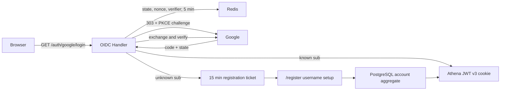

# Google OIDC Login

## Scope

Google OIDC Login owns Athena's browser Authorization Code flow, PKCE, one-time
OAuth transactions, Google ID-token verification, anonymous username setup for
unknown subjects, administrator candidacy, and Athena session-cookie issuance.
Any Google identity with a fully verified ID token and
`email_verified=true` may start registration. Business-data admission remains a
separate Athena authorization decision.

[Account Credentials](account-credentials.md) owns UUID accounts, immutable
usernames, Google bindings, and JWT v3. [Account Access
Control](account-access-control.md) owns Pending, Active, and Blocked behavior.
Google refresh tokens, profile synchronization, Workspace allowlists, password
fallback, and global Google logout are outside this capability.

## Source Locations

| Concern | Source | Key symbols |
| --- | --- | --- |
| Client and administrator-candidate configuration | [internal/googleoidc/config.go](../../../internal/googleoidc/config.go) | `Config`, `LoadConfigFromEnv`, `defaultReturnTo` |
| OAuth and registration Redis state | [internal/googleoidc/store.go](../../../internal/googleoidc/store.go) | `TransactionStore`, `Create`, `Consume`, `CreateRegistration`, `ClaimRegistration`, `CompleteRegistration`, `registrationTTL` |
| Native HTTP handlers | [internal/googleoidc/handler.go](../../../internal/googleoidc/handler.go) | `Handler`, `Login`, `Callback`, `Registration`, `UsernameAvailability`, `ValidateReturnTo` |
| Durable registration and lookup | [internal/accountcredentials/manager.go](../../../internal/accountcredentials/manager.go), [internal/accountstate/store/sql_store.go](../../../internal/accountstate/store/sql_store.go) | `GetByGoogleSubject`, `UsernameAvailable`, `RegisterGoogleAccount`, `RecordGoogleLogin` |
| Session cookie and logout | [util/http/http.go](../../../util/http/http.go), [internal/server/logout/logout.go](../../../internal/server/logout/logout.go) | `SetTokenCookie`, `Handler.ServeHTTP` |
| Anonymous browser surfaces | [ui/src/app/pages/login.tsx](../../../ui/src/app/pages/login.tsx), [ui/src/app/pages/register.tsx](../../../ui/src/app/pages/register.tsx), [ui/src/app/shared/services/registration-service.ts](../../../ui/src/app/shared/services/registration-service.ts) | `LoginPage`, `RegisterPage`, `RegistrationService` |
| Route wiring | [internal/server/athena-server.go](../../../internal/server/athena-server.go), [ui/src/app/app.tsx](../../../ui/src/app/app.tsx) | `newHTTPServer`, `RegistrationBootstrap`, `AppEntry` |

## Architecture

All protocol and registration endpoints are native HTTP handlers, not gRPC
RPCs. `NewHandler` constructs the OAuth configuration and remote-key verifier
without contacting Google. JWKS is fetched and cached only while verifying a
callback, so an IdP outage does not stop startup or invalidate existing Athena
sessions.

The unknown-subject boundary is deliberate: the callback stores the verified
identity in Redis but creates no PostgreSQL row and signs no Athena token. The
browser chooses its permanent username through a separate, ticket-bound page
that does not initialize the authenticated application shell.

## Runtime Flow

1. Authentication-enabled startup validates the Google client ID, client
   secret, exact callback URI, and `ATHENA_ADMIN_GOOGLE_EMAIL`. It performs no
   Google network request. Disabled-auth loopback development registers none of
   the Google handlers.
2. `GET /auth/google/login` validates `returnTo`, generates independent 32-byte
   state and nonce values plus a PKCE S256 verifier, and stores
   `{nonce, verifier, returnTo, createdAt}` in Redis for five minutes. A
   HttpOnly, SameSite=Lax state cookie binds the callback to the browser.
   Creation is limited in the same Redis script to 20 starts per hashed client
   address and 120 deployment-wide in a one-minute window.
3. Athena redirects to Google with scopes `openid email`,
   `prompt=select_account`, nonce, and the PKCE challenge. It neither requests
   offline access nor stores a refresh token.
4. `GET /auth/google/callback` clears the state cookie and atomically consumes
   the Redis transaction before exchange. It checks opaque-state shape, browser
   cookie equality, freshness, and the server-stored return target. Every
   callback outcome therefore makes the state unusable for replay.
5. The original verifier and fixed redirect URI exchange the code. The ID token
   must pass signature, Google issuer, client audience, expiry, issue-time,
   nonce, non-empty subject, and verified non-empty email checks.
6. A known subject resolves its persisted UUID and immediately enters the login
   path. Subject lookup happens before administrator-email comparison, so an
   existing ordinary account cannot become administrator when its email changes.
7. An unknown subject receives a random 15-minute registration ticket containing
   subject, verified email, validated return target, creation time, random CSRF
   secret, and a server-computed administrator-candidate flag. The Redis key is
   a SHA-256 digest of the opaque ticket ID. Athena writes only that ID to a
   HttpOnly, SameSite=Strict registration cookie and redirects to `/register`.
8. `GET /auth/google/registration` requires the cookie and returns only
   provider, verified email, administrator flag, expiry, and CSRF token.
   `GET /auth/google/registration/username-availability?username=...` uses the
   same ticket and returns only `available`, `invalid`, or `unavailable`. The UI
   waits 400 ms, aborts superseded checks, and treats this result as advisory.
9. `POST /auth/google/registration` accepts JSON `username` and `csrfToken`,
   validates both, then acquires a one-minute, owner-token-protected Redis claim.
   The database unique constraints remain the final username and administrator
   decision. The complete account aggregate commits before it is published to
   runtime.
10. After registration commits, the credential manager has published the
    identity and `RegisterCommittedAccountAccess` loads and publishes its
    durable access aggregate. `CompleteRegistration` then removes the ticket
    and its matching claim only when the ticket still exists and the caller
    still owns that claim. Athena clears the registration cookie, signs a v3
    login token, records the verified email and last-login time, writes the
    HttpOnly Athena cookie, and returns `/account/access` as the safe redirect.
    A registration ticket cannot mint a second session.
11. `DELETE /auth/google/registration` validates the CSRF header, atomically
    deletes the ticket and any submission claim, clears the cookie, and returns
    a fresh Google login URL. The UI uses this path for “Use another Google
    account.”
12. `/auth/logout` revokes and clears only the Athena login credential. It never
    attempts to log the browser out of the global Google session.

## State / Data

OAuth and registration state is transient Redis data. OAuth state has a five-
minute lifetime and is atomically read-and-deleted. Registration state has a
15-minute lifetime; submission claims serialize one ticket for up to one minute
and are released only by their owner after retryable failure. Successful
completion deletes both keys.

The state cookie is scoped to `/auth/google`, SameSite=Lax, HttpOnly, and Secure
for HTTPS deployments. The registration cookie is scoped to
`/auth/google/registration`, SameSite=Strict, HttpOnly, and likewise Secure in
production. Every response from these handlers is `Cache-Control: no-store` and
`Referrer-Policy: no-referrer`.

`ValidateReturnTo` accepts at most 2,048 bytes and only a same-origin absolute
path beginning with one `/`. It rejects external origins, `//`, backslashes,
control characters, malformed escapes, and `/login` or `/register` loops. Only
the server-stored value survives the callback; successful first registration
always enters `/account/access`.

Google access and ID tokens exist only in callback memory. The registration API
never returns subject, ticket ID, Google token, JTI, or Athena token. Verified
email is mutable audit data and the one-time administrator candidate selector;
it is never an account lookup key or JWT subject.

## Configuration

| Setting | Behavior |
| --- | --- |
| `ATHENA_GOOGLE_OIDC_CLIENT_ID` | Required Google Web OAuth client ID and ID-token audience. |
| `ATHENA_GOOGLE_OIDC_CLIENT_SECRET` | Direct secret input, intended for local development. A non-empty direct value takes precedence. |
| `ATHENA_GOOGLE_OIDC_CLIENT_SECRET_FILE` | Secret-file input. Production mounts a `0600` file read-only only into `athena-server`. |
| `ATHENA_GOOGLE_OIDC_REDIRECT_URI` | Exact `/auth/google/callback` URI. Production requires HTTPS; HTTP is accepted only on `localhost`. It is never inferred from request headers. |
| `ATHENA_ADMIN_GOOGLE_EMAIL` | Required candidate email. Comparison trims surrounding whitespace and ignores case, without Gmail dot or alias normalization. It cannot alter an existing subject or replace an administrator. |
| `ATHENA_SESSION_DURATION` | Athena login-session lifetime; default 24 hours. |
| `ATHENA_SERVER_DISABLE_AUTH` | Skips OIDC and administrator-email requirements for the loopback-only development identity. |

The Google consent audience must be External and Published to admit arbitrary
verified Google users. Google's Testing state admits only configured test users.
Local and production use separate Web application clients with separately
registered exact callback URIs.

## Invariants

- An unknown verified subject produces only a registration ticket until a
  username transaction commits.
- Subject lookup precedes email-based administrator candidacy.
- Administrator role is derived only from the server ticket and persisted role;
  the browser cannot submit it.
- Username availability is advisory; PostgreSQL case-insensitive uniqueness is
  final.
- OAuth state and successful registration tickets are one-time and browser-
  bound.
- Email is never a durable identity key, relationship key, or JWT subject.
- Google tokens, subjects, registration IDs, and Athena credentials stay out of
  public responses and browser storage.
- Google availability is not a startup, readiness, or existing-session
  dependency.

## Failure Recovery

Missing, expired, mismatched, or replayed OAuth state returns
`google_state_invalid`; cancellation returns `google_cancelled`; exchange, JWKS,
Redis, or transient callback dependency failure returns `google_unavailable`;
invalid identity claims or administrator conflict return `google_not_allowed`;
and a disabled known account returns `maintenance`. None writes an Athena
cookie.

Registration uses stable reasons `username_invalid`, `username_unavailable`,
`registration_expired`, `registration_unavailable`, `google_not_allowed`, and
`maintenance`. Validation and uniqueness failures release the ticket claim so
the same browser can retry. A successful database registration is durable even
if later Redis completion, audit, or cookie issuance fails. Because the subject
is then known, a new Google flow recovers through ordinary login without
creating another account or changing username.

Same-subject database conflicts converge on the existing UUID. A username race
allows one identity to commit; the other retains its ticket and chooses another
name. A second administrator candidate cannot displace the persisted role.

## Observability

Login and registration counters retain success/failure signals. Structured logs
include stable stage and reason values and the account UUID only after one
exists. Email and subject are not metric labels. Authorization codes, Google
tokens, Athena JWTs, client secrets, registration ticket IDs, and CSRF secrets
are never logged. Health checks do not probe Google.

## Change Checklist

- [ ] State, nonce, PKCE, callback, and return-target checks remain current.
- [ ] Unknown-subject ticket and username-registration ordering remain current.
- [ ] Registration cookie, CSRF, claim, and one-time consumption semantics remain current.
- [ ] Administrator candidacy and subject-first identity rules remain current.
- [ ] Public/browser boundaries still exclude Google tokens and subjects.
- [ ] The [design index](../README.md) contains the current summary.
