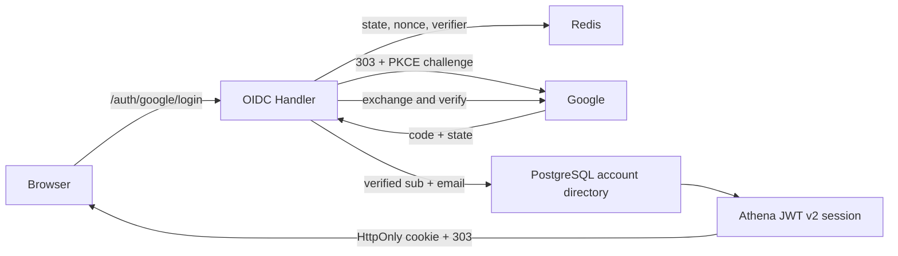

# Google OIDC Login

## Scope

Google OIDC Login owns Athena's browser Authorization Code flow, PKCE, one-time
state and nonce transactions, Google ID-token verification, just-in-time account
resolution or creation, administrator bootstrap, and issuance of the Athena
session cookie. Any Google account with a fully verified ID token and
`email_verified=true` may register; admission to business data is a separate
Athena authorization decision.

[Account Credentials](account-credentials.md) owns durable identities and
Athena JWTs. [Account Access Control](account-access-control.md) owns Pending,
Active, and Blocked access. Google refresh tokens, Google profile synchronization,
domain allowlists, password fallback, and global Google logout are outside this
capability.

## Source Locations

| Concern | Source | Key symbols |
| --- | --- | --- |
| Client and administrator bootstrap configuration | [internal/googleoidc/config.go](../../../internal/googleoidc/config.go) | `Config`, `LoadConfigFromEnv` |
| One-time Redis transactions | [internal/googleoidc/store.go](../../../internal/googleoidc/store.go) | `TransactionStore`, `Create`, `Consume`, `transactionTTL` |
| Login and callback HTTP handlers | [internal/googleoidc/handler.go](../../../internal/googleoidc/handler.go) | `Handler`, `NewHandler`, `Login`, `Callback`, `ValidateReturnTo` |
| Durable identity resolution | [internal/accountcredentials/manager.go](../../../internal/accountcredentials/manager.go), [internal/accountstate/store/sql_store.go](../../../internal/accountstate/store/sql_store.go) | `ResolveOrProvisionGoogleAccount`, `RecordGoogleLogin` |
| Athena cookie and logout | [util/http/http.go](../../../util/http/http.go), [internal/server/logout/logout.go](../../../internal/server/logout/logout.go) | `SetTokenCookie`, `Handler.ServeHTTP` |
| Browser entry and error presentation | [ui/src/app/pages/login.tsx](../../../ui/src/app/pages/login.tsx) | `LoginPage`, `loginReasonAlerts` |
| Route wiring | [internal/server/athena-server.go](../../../internal/server/athena-server.go) | `NewServer`, `newHTTPServer` |

## Architecture

The handlers are native HTTP endpoints rather than gRPC RPCs. `NewHandler`
constructs fixed OAuth and OIDC verifier configuration without contacting
Google. Remote signing keys are fetched and cached only when a callback verifies
an ID token, so an IdP outage does not stop the API Server or existing sessions.

## Runtime Flow

1. Authentication-enabled startup validates the client ID, client secret,
   exact redirect URI, and `ATHENA_ADMIN_GOOGLE_EMAIL`. It does not contact
   Google. Disabled-auth loopback development registers no Google handler.
2. `GET /auth/google/login` validates `returnTo`, creates independent random
   state and nonce values plus a PKCE S256 verifier, and writes
   `{nonce, verifier, returnTo, createdAt}` to Redis for five minutes. A short
   HttpOnly, SameSite=Lax state cookie binds the callback to the browser. The
   same Redis operation bounds starts to 20 per hashed client address and 120
   deployment-wide in each one-minute window before creating state.
3. Athena redirects with scopes `openid email`, `prompt=select_account`, nonce,
   and the PKCE challenge. It does not request offline access.
4. `GET /auth/google/callback` clears the state cookie and atomically consumes
   the Redis record before performing exchange or identity work. State, browser
   cookie, freshness, and the server-stored return target are checked. A replay
   cannot reuse the consumed transaction.
5. The original verifier and fixed redirect URI exchange the authorization
   code. The ID token must pass signature, Google issuer, client audience,
   expiry, issue-time, nonce, non-empty subject, and verified non-empty email
   checks.
6. Resolution first looks up the persisted Google subject. If unknown and the
   verified email equals the configured administrator email after trimming and
   case folding, the transaction attempts to claim the unbound `admin`. Every
   other unknown identity atomically creates `user-<UUID>` with login enabled,
   API Key and Profit Sharing disabled, all ten modules at `NONE`, and an initial
   profile display name derived from the verified email.
7. Existing subject lookup always wins. A user does not become administrator
   merely because its email later matches the bootstrap email. Once `admin` is
   bound, its subject is permanent and the configuration cannot replace it.
8. After the provisioning transaction commits, the runtime credential and
   access snapshots learn the account. Current login access is checked, Athena
   signs a v2 session with a fresh JTI, and successful-login audit fields are
   updated. Only then is the HttpOnly Athena cookie returned.
9. The 303 destination is the server-stored `returnTo`; the default is
   `/account/access`. The SPA reloads bootstrap from the Athena cookie and never
   stores a Google token.
10. `/auth/logout` clears and revokes only the Athena session. It does not call
    a Google logout endpoint.

## State / Data

Redis transaction keys contain only state, nonce, PKCE verifier, validated
return target, and creation time. State is 32 random bytes encoded as unpadded
base64url. The state cookie contains only the opaque state and is scoped to the
Google auth path.

`ValidateReturnTo` accepts at most 2,048 bytes and only a same-origin absolute
path beginning with one `/`. It rejects `//`, absolute origins, backslashes,
control characters, malformed encodings, and `/login` loops. The callback never
accepts a new redirect target from its query.

Google access and ID tokens exist only in callback memory. The durable external
identifier is the verified subject; verified email is mutable audit data and
the one-time administrator bootstrap selector, not an account lookup key.

## Configuration

| Setting | Behavior |
| --- | --- |
| `ATHENA_GOOGLE_OIDC_CLIENT_ID` | Required Google Web OAuth client ID and ID-token audience. |
| `ATHENA_GOOGLE_OIDC_CLIENT_SECRET` | Direct secret for local development; a non-empty direct value takes precedence. |
| `ATHENA_GOOGLE_OIDC_CLIENT_SECRET_FILE` | Secret file input. Production mounts a `0600` file read-only only into `athena-server`. |
| `ATHENA_GOOGLE_OIDC_REDIRECT_URI` | Exact `/auth/google/callback` URI. Production requires HTTPS; HTTP is accepted only on `localhost`. It is never inferred from request headers. |
| `ATHENA_ADMIN_GOOGLE_EMAIL` | Required bootstrap email while authentication is enabled. Comparison trims surrounding whitespace and ignores case; it does not normalize Gmail dots or aliases. It cannot rebind a claimed administrator. |
| `ATHENA_SESSION_DURATION` | Athena session lifetime, default 24 hours. |
| `ATHENA_SERVER_DISABLE_AUTH` | Skips OIDC and administrator-email requirements for the loopback-only development bypass. |

The Google OAuth consent audience must be **External** and the app must be
published for arbitrary Google users. Google's Testing state admits only listed
test users and therefore does not implement open registration. Local and
production environments use separate Web application clients with exact
redirect URIs.

## Invariants

- Every fully verified Google identity can provision exactly one ordinary
  Athena account without preconfigured subject data.
- Subject lookup precedes email-based administrator bootstrap.
- Email is never a JWT subject, unique account key, or ordinary-account lookup.
- All protocol validation and durable provisioning finish before an Athena
  cookie is written.
- Each OAuth transaction is one-time and bound to the initiating browser.
- Google tokens, authorization codes, client secrets, subjects, and Athena JWTs
  are not persisted in OAuth state or browser storage.
- Google availability is not a startup, readiness, or existing-session
  dependency.

## Failure Recovery

Missing, expired, mismatched, or replayed state returns
`google_state_invalid`. User cancellation returns `google_cancelled`. Google
exchange or JWKS failure, Redis failure, and account database failure return
`google_unavailable`. Invalid verified identity claims or a conflicting
administrator claim return `google_not_allowed`. Disabled accounts use the
existing `maintenance` result. None of these paths writes an Athena cookie.

Concurrent callbacks rely on the subject unique constraint and administrator
row lock. A conflict is re-read after rollback/commit so the same subject
converges on one account; a different subject cannot steal `admin`.

## Observability

Login counters preserve success and failure signals. Structured logs include a
stable failure stage and may include verified identity data for restricted
security diagnosis, but email and subject are not metric labels. Authorization
codes, Google tokens, Athena JWTs, and client secrets are never logged. Health
checks do not probe Google.

## Change Checklist

- [ ] State, nonce, PKCE, callback, and return-target checks remain current.
- [ ] Provisioning and administrator-claim transaction semantics remain current.
- [ ] Google configuration and published External audience guidance remain current.
- [ ] Public/browser boundaries still exclude Google tokens and subjects.
- [ ] The [design index](../README.md) contains the current summary.
