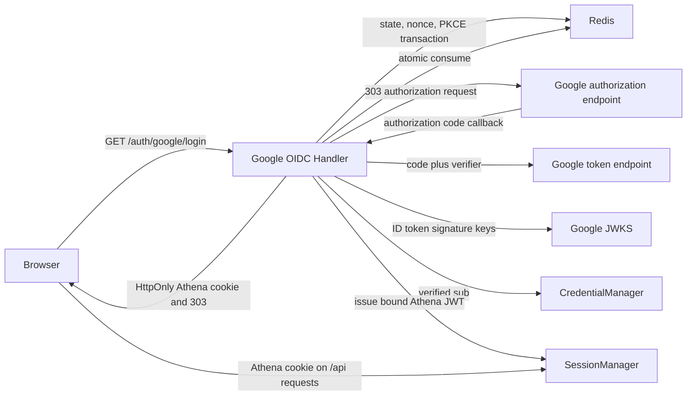

# Google OIDC Login

## Scope

Google OIDC Login owns Athena's browser-based Google Authorization Code flow,
PKCE, state and nonce generation, one-time Redis transaction storage, Google ID
token verification, fixed-subject account resolution, and creation of the
Athena authentication cookie. Google proves the external identity; Athena
continues to issue and validate its own JWT for every application request.

[Account Credentials](account-credentials.md) owns the fixed Google-subject
bindings and Athena JWT codec. [Account Access Control](account-access-control.md)
owns whether the resolved account may currently log in. Google account
provisioning, domain-wide admission, Google profile synchronization, refresh
token persistence, business-request use of Google tokens, and global Google
logout are outside this capability.

## Source Locations

| Concern | Source | Key symbols |
| --- | --- | --- |
| Client configuration and redirect validation | [internal/googleoidc/config.go](../../../internal/googleoidc/config.go) | `Config`, `LoadConfigFromEnv` |
| One-time OAuth transactions and admission bounds | [internal/googleoidc/store.go](../../../internal/googleoidc/store.go) | `TransactionStore`, `Create`, `Consume`, `transactionTTL`, `transactionGlobalRateLimit`, `transactionClientRateLimit` |
| Authorization and callback HTTP flow | [internal/googleoidc/handler.go](../../../internal/googleoidc/handler.go) | `Handler`, `NewHandler`, `Login`, `Callback`, `ValidateReturnTo` |
| Subject mapping and session issuance | [internal/accountcredentials/manager.go](../../../internal/accountcredentials/manager.go), [util/session/sessionmanager.go](../../../util/session/sessionmanager.go) | `ResolveGoogleSubject`, `IssueGoogleLoginSession`, `CreateGoogleLogin` |
| Athena cookie creation | [util/http/http.go](../../../util/http/http.go) | `SetTokenCookie` |
| Local session logout | [internal/server/logout/logout.go](../../../internal/server/logout/logout.go) | `Handler.ServeHTTP` |
| HTTP route and startup wiring | [internal/server/athena-server.go](../../../internal/server/athena-server.go) | `NewServer`, `newHTTPServer` |
| Browser entry and failure presentation | [ui/src/app/pages/login.tsx](../../../ui/src/app/pages/login.tsx) | `LoginPage`, `loginReasonAlerts` |
| Protocol dependencies | [go.mod](../../../go.mod) | `github.com/coreos/go-oidc/v3`, `golang.org/x/oauth2` |
| Production authentication boundary | [docker-compose.prod.yml](../../../docker-compose.prod.yml), [.env.prod](../../../.env.prod) | `google-oidc-client-secret`, `ATHENA_GOOGLE_OIDC_*`, `x-without-auth-secrets` |

## Architecture

`Handler` is a native HTTP boundary rather than a gRPC service. It owns only
the Google protocol and browser redirects. `TransactionStore` is a separate
Redis adapter from session revocation, so OAuth state does not expand the
revocation interface.

`NewHandler` constructs a fixed OAuth client configuration and a CoreOS OIDC
verifier backed by `RemoteKeySet`. Construction performs no provider discovery
or JWKS request. The verifier fetches and caches Google signing keys when an ID
token must first be verified. Google token exchange and key retrieval use
15-second network bounds. After callback validation, Athena discards the Google
OAuth token response and hands only the verified subject to local credential
and session components.

## Runtime Flow

1. When authentication is enabled, API Server startup first validates all
   account bindings, loads the fixed Google client configuration, creates the
   transaction store from the server Redis client, and constructs `Handler`.
   Missing or invalid local configuration fails before the listener opens, but
   startup does not contact Google. Disabled-auth development mode creates no
   handler and registers no Google routes.
2. `GET /auth/google/login` validates and bounds `returnTo`, generates
   independent 32-byte random state and nonce values, and creates an OAuth PKCE
   verifier. One Redis Lua operation enforces fixed one-minute limits of 20
   starts per normalized client address and 120 starts deployment-wide, then writes
   `{nonce, verifier, returnTo, createdAt}` with `SET NX` and a five-minute TTL.
   Client addresses are normalized and hashed before becoming rate-key suffixes.
3. The login response writes `athena.google.state` as an HttpOnly,
   SameSite=Lax cookie scoped to `/auth/google`, with the same five-minute
   lifetime. `Secure` follows the validated redirect scheme. The handler sends
   a 303 redirect to Google's authorization endpoint with scopes `openid email`,
   the S256 challenge, nonce, and `prompt=select_account`. It does not request
   offline access.
4. `GET /auth/google/callback` immediately clears the state cookie, requires a
   query state that decodes to exactly 32 bytes of unpadded base64url data, and
   atomically reads and deletes the matching Redis transaction through one Lua
   operation. It revalidates the server-side return target, compares state and
   cookie in constant time, and rejects stale or implausibly future transaction
   timestamps. Every consumed callback, including a failed one, makes the
   transaction unavailable for replay.
5. Google `access_denied` becomes the stable cancellation result. Any other
   authorization error or missing code fails the transaction. A valid code is
   exchanged using the original PKCE verifier and the configured redirect URI;
   the returned response must contain an ID token.
6. The OIDC verifier checks the signature against Google's remote key set,
   either official Google issuer spelling, audience against the configured
   client ID, and expiry. The handler repeats the issuer allowlist, requires
   non-zero issue and expiry times, rejects an issue time more than one minute
   in the future, requires a non-empty `sub`, compares the ID-token nonce with
   the transaction nonce, decodes claims, and requires `email_verified=true`.
7. `CredentialManager.ResolveGoogleSubject` maps the verified `sub` to one
   internal Athena account. Email is available only for the unmapped-identity
   audit log and does not participate in lookup. No Google name, email, or
   avatar is written to Athena profile state.
8. The handler generates a UUID JTI and asks `SessionManager.CreateGoogleLogin`
   to recheck the current binding, `login` capability, and `LoginEnabled` state.
   `CredentialManager` signs an Athena JWT v2 containing the current identity
   binding. `SetTokenCookie` writes the Athena token as an HttpOnly,
   SameSite=Lax cookie, using `Secure` for an HTTPS Google redirect
   configuration.
9. A successful callback records the success signal and sends a 303 to the
   transaction's validated `returnTo`. The SPA reloads its normal bootstrap and
   user-info projections from the Athena cookie. Subsequent API requests do not
   send, store, or validate a Google access token or ID token.
10. `/auth/logout` first expires every received Athena authentication-cookie
    chunk, then revokes the JTI of a valid, unexpired Athena v2 login JWT. Its
    logout-only parser verifies the HS256 signature, issuer, registered time
    claims, login capability, identity
    binding, JTI, and expiration without consulting current login availability,
    Google binding, API Key metadata, or Redis revocation state. A session can
    therefore still be revoked after its account is disabled or rebound. Empty,
    malformed, expired, and otherwise invalid cookie values skip revocation but
    still complete the same 303 redirect without exposing credentials or JTIs.
    Logout does not redirect to Google or terminate the user's Google browser
    session.

## State / Data

Redis transaction keys use prefix `google-oidc-transaction|` followed by the
opaque state. The JSON value contains only nonce, PKCE verifier, validated
return target, and UTC creation time. `SET NX` prevents an accidental state
collision, the key TTL is five minutes, and `Consume` deletes before returning
the value. Fixed-window global and hashed-client rate keys expire after one
minute and bound anonymous transaction creation. OAuth transactions are
independent from `revoked-token|<jti>` session state.

The state cookie contains only the opaque state. It is not an Athena session
and is cleared on every GET callback path. The browser does not receive nonce
or PKCE verifier values from Athena after the authorization redirect.

`ValidateReturnTo` defaults to `/account/profile`. It accepts at most 2,048
bytes and only a same-origin URI whose path begins with one slash. Validation
applies both before and after percent-decoding and rejects empty input,
network-path `//` values, external absolute URIs, backslashes, control
characters, malformed URIs, and `/login` or any descendant login path. The
validated value is stored server-side and revalidated after atomic consumption;
the callback cannot replace it and tampered Redis state cannot create an
external redirect.

Google OAuth and ID tokens exist only in callback-local memory. The durable
identity key is the configured Google `sub`; the resulting browser credential
is the independently signed Athena JWT documented in [Account Credentials](account-credentials.md).

## Configuration

| Setting | Behavior |
| --- | --- |
| `ATHENA_GOOGLE_OIDC_CLIENT_ID` | Required authentication-enabled Google Web OAuth client ID and expected ID-token audience. |
| `ATHENA_GOOGLE_OIDC_CLIENT_SECRET` | Direct client secret input, intended for local development. A non-empty direct value takes precedence over `_FILE`. |
| `ATHENA_GOOGLE_OIDC_CLIENT_SECRET_FILE` | File containing the client secret. Production deployment installs it for container UID/GID 999 with mode `0600`, and Compose mounts it only into `athena-server` at `/run/secrets/google-oidc-client-secret`. |
| `ATHENA_GOOGLE_OIDC_REDIRECT_URI` | Required absolute callback URI without user information, alternate escaped path spelling, an empty or non-empty query marker, or fragment. Its path must be exactly `/auth/google/callback`. HTTPS is mandatory except for an HTTP URI whose hostname is `localhost`. |
| `ATHENA_ACCOUNT_<NAME>_GOOGLE_SUB`, `ATHENA_ADMIN_GOOGLE_SUB` | Supply the unique stable subjects resolved after ID-token verification. |
| `ATHENA_SESSION_DURATION` | Sets the Athena login-session expiry; it defaults to 24 hours. |
| `ATHENA_SERVER_DISABLE_AUTH` | Skips Google configuration and binding validation, omits the Google HTTP routes, and uses the development administrator bypass. Startup accepts the bypass only on a loopback listen address. |
| API Server Redis client | Stores and atomically consumes OAuth transactions; the login flow has no in-memory fallback. |

The redirect URI is fixed at startup and is also passed unchanged to the code
exchange. It is never inferred from `Host`, `X-Forwarded-Host`, or other request
headers. Local process defaults select
`http://localhost:4000/auth/google/callback`; production must supply its exact
externally registered HTTPS URI.

Production Compose explicitly clears Google client, redirect, subject, JWT, and
Redis authentication inputs from every non-server business container. The
client-secret file is mounted only into `athena-server`. Production Compose
always enables authentication; the development-only disabled-auth bypass is not
accepted by the production deployment path. Local production previews pass the
selected `PROD_ENV_FILE` through `ATHENA_COMPOSE_ENV_FILE`, so interpolation and
container environment injection use the same source file.

## Invariants

- Google identity mapping uses only a verified, non-empty `sub`; email and
  other profile claims never select or create an Athena account.
- Every authorization request has independent random state, nonce, and PKCE
  verifier values, and every Redis transaction can be consumed at most once.
- A callback cannot supply or override its own return target, and consumed
  server state is revalidated before every browser redirect.
- ID-token signature, audience, time, issuer, nonce, subject, and verified-email
  checks all complete before an Athena credential is issued.
- No Google token, client secret, authorization code, or Athena JWT is persisted
  in the OAuth transaction or used as a log field by the handler.
- Login and callback responses disable referrer propagation and caching; the
  production callback proxy disables access logging of its sensitive query.
- Google network availability is not an API Server startup or health-check
  dependency.
- Google tokens are not accepted for business APIs; every later request uses
  Athena's versioned local credential and current authorization state.
- Login capability, Google binding, and login availability are rechecked at
  Athena session issuance rather than trusted from the earlier redirect.
- Logout accepts only a cryptographically valid Athena v2 login token, remains
  possible after mutable account-state changes, clears received authentication
  cookies even when parsing fails, affects only Athena state, and never
  terminates the user's global Google session.

## Failure Recovery

Invalid client settings or identity bindings fail closed before the API Server
listener opens. Google signing keys are not prefetched, so a later Google or
JWKS outage does not terminate the process or invalidate an already issued
Athena session.

Redis storage failure or admission-rate rejection during transaction creation
or consumption produces `google_unavailable` and no partial Athena session.
There is no fallback transaction store. A missing, expired, already consumed, malformed, or
browser-mismatched state, an invalid stored transaction, or a stale timestamp
produces `google_state_invalid`. The caller must begin a new authorization
transaction.

User cancellation produces `google_cancelled`. An unmapped subject, invalid
post-verification identity claim, unverified email, or local issuance denial
produces `google_not_allowed`; a disabled account uses `maintenance`.
Authorization response failure, code exchange failure, a missing ID token,
signature/key/time, issuer, or audience verification failure, random generation
failure, and cookie creation failure produce `google_unavailable`. Every classified flow failure
redirects to the login page without issuing or replacing an Athena cookie and
with only its stable reason and optional validated return target.

The transaction is consumed before code exchange and token verification, so a
retry of the same callback is intentionally rejected. If the Athena cookie was
successfully committed but the final redirect is not followed, reopening
Athena recovers through ordinary bootstrap. Existing Athena requests continue
without contacting Redis's OAuth transaction keys or any Google endpoint.

## Observability

Each failed flow writes a structured warning with stable `stage` and `reason`
fields and, when present, only the dependency error's Go type. A verified but
unmapped identity additionally logs the verified email and Google subject for
administrator diagnosis. Successful login logs `stage=complete` and the
resolved Athena account. The handler does not log dependency error text,
callback codes, Google token values, Athena JWTs, or client secrets.

Both native OAuth handlers return `Cache-Control: no-store` and
`Referrer-Policy: no-referrer`. The production Nginx callback location disables
access logging because the authorization code and state arrive in the request
query before application logging policy can take effect.

The handler reports `success` or `failure` through `SessionManager`'s optional
login-metrics boundary; the call is a no-op when no metrics registry is
attached. Email and subject are not metric labels. The API Server health check
reports only local server availability and does not probe Google, JWKS, or the
OAuth transaction store.

The browser maps `google_cancelled`, `google_not_allowed`,
`google_state_invalid`, `google_unavailable`, and `maintenance` to stable login
alerts. Protocol details remain in server logs rather than redirects.

## Change Checklist

- [ ] Configuration validation, exact redirect URI, and disabled-auth behavior match the implementation.
- [ ] State, nonce, PKCE generation, cookie binding, transaction TTL, and atomic consumption are current.
- [ ] Code exchange and ID-token signature, audience, time, issuer, nonce, subject, and email verification remain aligned.
- [ ] Subject mapping, local access checks, Athena JWT issuance, cookie flags, and redirects match runtime behavior.
- [ ] Google tokens remain callback-local and are absent from business requests and durable state.
- [ ] Failure reasons, retry semantics, logs, health behavior, and login signals are current.
- [ ] Source links and named symbols resolve to the implementation.
- [ ] The [design index](../README.md) contains the correct entry.
