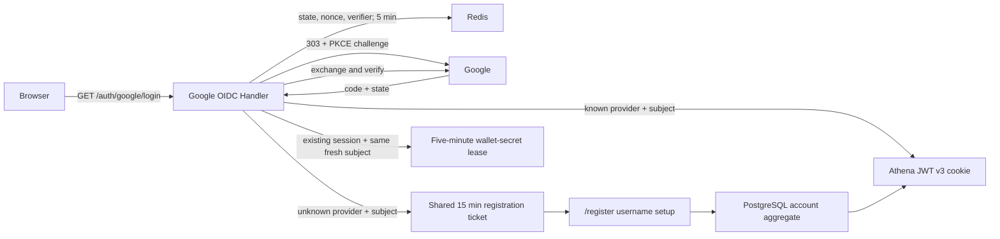

# Google OIDC Login

## Scope

Google OIDC Login owns Athena's browser Authorization Code flow, PKCE, one-time
OAuth transactions, Google ID-token verification, administrator candidacy, and
the handoff of a verified Google identity to either Athena session issuance or
shared anonymous username registration. Any Google identity with a fully
verified ID token and `email_verified=true` may start registration.
The same OIDC client and callback also provide an independent fresh proof for
wallet private-key reveal; that state machine is bound to an existing Athena
login and issues a short wallet-secret lease rather than another login session.

[Account Credentials](account-credentials.md) owns UUID accounts, immutable
usernames, external identity bindings, and JWT v3. The provider-neutral
registration resource in `authregistration` owns username setup for unknown
Google and Solana identities. [Account Access Control](account-access-control.md)
owns Pending, Active, and Blocked behavior. Google refresh tokens, profile
synchronization, Workspace allowlists, password fallback, and global Google
logout are outside this capability.

## Source Locations

| Concern | Source | Key symbols |
| --- | --- | --- |
| Client and administrator-candidate configuration | [internal/googleoidc/config.go](../../../internal/googleoidc/config.go) | `Config`, `LoadConfigFromEnv` |
| One-time OAuth state | [internal/googleoidc/store.go](../../../internal/googleoidc/store.go) | `TransactionStore`, `Create`, `Consume`, `transactionTTL` |
| Google HTTP flow | [internal/googleoidc/handler.go](../../../internal/googleoidc/handler.go) | `Handler`, `Login`, `Callback` |
| Wallet-secret reauthentication | [internal/googleoidc/wallet_secret_reauth.go](../../../internal/googleoidc/wallet_secret_reauth.go), [internal/googleoidc/wallet_secret_store.go](../../../internal/googleoidc/wallet_secret_store.go) | `WalletSecretReauthentication`, `walletSecretReauthentication.callback`, `walletSecretTransactionStore` |
| Wallet-secret provider-state limits | [internal/walletsecret/state_rate_limit.go](../../../internal/walletsecret/state_rate_limit.go) | `CreateRateLimitedState` |
| Shared registration state and HTTP resource | [internal/authregistration/store.go](../../../internal/authregistration/store.go), [internal/authregistration/handler.go](../../../internal/authregistration/handler.go) | `Store`, `Handler`, `Begin`, `Registration`, `UsernameAvailability`, `ValidateReturnTo` |
| Durable identity and session boundary | [internal/accountcredentials/manager.go](../../../internal/accountcredentials/manager.go), [util/session/sessionmanager.go](../../../util/session/sessionmanager.go) | `GetByIdentity`, `RegisterExternalAccount`, `CreateExternalLogin` |
| Session cookie and logout | [util/http/http.go](../../../util/http/http.go), [internal/server/logout/logout.go](../../../internal/server/logout/logout.go) | `SetTokenCookie`, `Handler.ServeHTTP` |
| Anonymous browser surfaces | [ui/src/app/pages/login.tsx](../../../ui/src/app/pages/login.tsx), [ui/src/app/pages/register.tsx](../../../ui/src/app/pages/register.tsx), [ui/src/app/shared/services/registration-service.ts](../../../ui/src/app/shared/services/registration-service.ts) | `LoginPage`, `RegisterPage`, `RegistrationService` |
| Route wiring | [internal/server/athena-server.go](../../../internal/server/athena-server.go), [ui/src/app/app.tsx](../../../ui/src/app/app.tsx) | `newHTTPServer`, `AppEntry`, `RegistrationBootstrap` |

## Architecture

All protocol and registration endpoints are native HTTP handlers, not gRPC
RPCs. `NewHandler` constructs the OAuth configuration and remote-key verifier
without contacting Google. JWKS is fetched and cached only while verifying a
callback, so an IdP outage does not stop startup or invalidate existing Athena
sessions.

The unknown-subject boundary is provider-neutral after verification: the OIDC
handler gives a verified `authregistration.Identity` to the shared registration
handler. PostgreSQL receives no row and Athena signs no token until the browser
submits its permanent username. The registration page does not initialize the
authenticated application shell.

Wallet-secret state is a separate `ws.` namespace handled before normal callback
processing. It reuses the code-exchange and ID-token verification primitive but
does not enter identity lookup, registration, login audit, or Athena cookie
issuance. [Wallet Secret Reauthentication](wallet-secret-reauthentication.md)
owns the resulting lease and native private-key boundary.

## Runtime Flow

1. Authentication-enabled startup validates the Google client ID, client
   secret, exact callback URI, and `ATHENA_ADMIN_GOOGLE_EMAIL`. It performs no
   Google network request. Disabled-auth loopback development registers none of
   the external authentication handlers.
2. `GET /auth/google/login` validates `returnTo`, generates independent 32-byte
   state and nonce values plus a PKCE S256 verifier, and stores
   `{nonce, verifier, returnTo, createdAt}` in Redis for five minutes. A
   HttpOnly, SameSite=Lax state cookie binds the callback to the browser.
   The Redis script atomically limits creation to 20 starts per hashed client
   identity and 120 deployment-wide in each one-minute window.
3. Athena redirects to Google with scopes `openid email`,
   `prompt=select_account`, nonce, and the PKCE challenge. It neither requests
   offline access nor stores a refresh token.
4. `GET /auth/google/callback` clears the state cookie and atomically consumes
   the Redis transaction before exchange. It checks opaque-state shape, browser
   cookie equality, freshness, and the server-stored return target. Every
   callback outcome therefore makes the state unusable for replay.
5. The original verifier and fixed redirect URI exchange the code. The ID token
   must pass signature, Google issuer, client audience, expiry, issue-time,
   nonce, non-empty subject, and verified non-empty email checks.
6. A known `(google, sub)` binding resolves its persisted UUID and immediately
   enters the external-login path. Identity lookup happens before
   administrator-email comparison, so an existing ordinary account cannot
   become administrator when its email changes.
7. An unknown subject becomes a server-verified `google` identity. The server
   compares its verified email with `ATHENA_ADMIN_GOOGLE_EMAIL`, then calls
   `authregistration.Handler.Begin`. The resulting 15-minute ticket contains
   provider, subject, verified email, validated return target, creation time,
   random CSRF secret, and server-computed administrator-candidate flag.
8. Athena writes only the opaque ticket ID to the shared HttpOnly,
   SameSite=Strict `athena.registration` cookie and redirects to `/register`.
   Registration reads and writes use `GET|POST|DELETE /auth/registration`; the
   advisory check is
   `GET /auth/registration/username-availability?username=...`. Registration
   traffic remains provider-neutral after identity verification.
9. Registration validates username and CSRF, acquires a short owner-token-
   protected Redis claim, then commits the complete PostgreSQL account aggregate
   before publishing its credential and access snapshots. Database unique
   constraints remain the final username and administrator decision.
10. The shared handler consumes the ticket, clears its cookie, signs a v3 login
    token through `CreateExternalLogin`, updates verified email and last-login
    audit data, writes the HttpOnly Athena cookie, and returns
    `/account/access`. A registration ticket cannot mint a second session.
11. Deleting a Google registration validates the CSRF header and atomically
    removes the ticket only when no submission claim is active. A concurrent
    submission wins with `409 registration_unavailable`; otherwise deletion
    clears the cookie and returns a fresh
    `/auth/google/login?returnTo=...` URL for account selection.
12. A logged-in Google account may start
    `GET /auth/wallet-secrets/google?returnTo=/wallet`. Athena creates an
    independent five-minute Redis transaction and state cookie bound to account
    UUID, Session JTI digest, access revision, PKCE verifier, nonce, and safe
    return path. One Redis Lua operation atomically enforces the wallet-secret
    global and authenticated-account creation limits and writes the transaction,
    then Athena redirects with `prompt=select_account` and `max_age=0`.
13. The shared callback recognizes the `ws.` state, atomically consumes that
    transaction, repeats the current login and access bindings, and calls
    `exchangeAndVerify` with the transaction creation time. The ID token must
    contain a fresh `auth_time`, and its stable `sub` must equal the same
    persisted Google binding. Success issues only a fixed five-minute
    wallet-secret lease and returns to the saved path.
14. `/auth/logout` revokes and clears the Athena login credential and clears the
    wallet-secret lease cookie. It never attempts to log the browser out of the
    global Google session.

## State / Data

OAuth and registration state is transient Redis data. OAuth state has a
five-minute lifetime and is atomically read-and-deleted. Shared registration
state has a 15-minute lifetime; submission claims serialize one ticket for up to
one minute and are released only by their owner after retryable failure.
Successful completion deletes both keys.

Wallet-secret Google state is an additional five-minute, single-use Redis
transaction. It stores no Google token or raw JTI. Its dedicated state cookie is
HttpOnly, SameSite=Lax, Secure in production, and scoped to `/auth/google`, so
the existing callback can validate the browser binding. Its success and failure
responses use the wallet-secret no-store policy.

Google and Solana wallet-secret provider states share a dedicated fixed-window
Redis budget of 120 creations globally and 20 per authenticated account per
minute. These counters do not reuse primary-login counters. The account counter
key contains a SHA-256 digest rather than the raw account UUID, and the counter
checks and transaction write are one atomic operation.

The OAuth state cookie is scoped to `/auth/google`, SameSite=Lax, HttpOnly, and
Secure for HTTPS deployments. The shared registration cookie is scoped to
`/auth/registration`, SameSite=Strict, HttpOnly, and likewise Secure in
production. Handler responses are non-cacheable and use a no-referrer policy.

`authregistration.ValidateReturnTo` accepts at most 2,048 bytes and only a
same-origin absolute path beginning with one `/`. It rejects external origins,
`//`, backslashes, control characters, malformed escapes, and `/login` or
`/register` loops. Only the server-stored value survives the callback;
successful first registration always enters `/account/access`.

Google access and ID tokens exist only in callback memory. Public registration
responses never return the Google subject, ticket ID, Google token, JTI, or
Athena token. Verified email is mutable audit and presentation data plus the
one-time administrator candidate selector; it is never an account lookup key or
JWT subject. The same provider-neutral response may deliberately project a
Solana identity as its public `solanaAddress`.

## Configuration

| Setting | Behavior |
| --- | --- |
| `ATHENA_GOOGLE_OIDC_CLIENT_ID` | Required Google Web OAuth client ID and ID-token audience. |
| `ATHENA_GOOGLE_OIDC_CLIENT_SECRET` | Direct secret input, intended for local development. A non-empty direct value takes precedence. |
| `ATHENA_GOOGLE_OIDC_CLIENT_SECRET_FILE` | Secret-file input. Production mounts a `0600` file read-only only into `athena-server`. |
| `ATHENA_GOOGLE_OIDC_REDIRECT_URI` | Exact `/auth/google/callback` URI. Production requires HTTPS; HTTP is accepted only on `localhost`. It is never inferred from request headers. Its scheme and authority also define the trusted SIWS origin. |
| `ATHENA_ADMIN_GOOGLE_EMAIL` | Required candidate email. Comparison trims surrounding whitespace and ignores case, without Gmail dot or alias normalization. It cannot alter an existing subject or replace an administrator. |
| `ATHENA_SESSION_DURATION` | Athena login-session lifetime; default 24 hours. |
| `ATHENA_SERVER_DISABLE_AUTH` | Skips external authentication and administrator-email requirements for the loopback-only development identity. |

The Google consent audience must be External and Published to admit arbitrary
verified Google users. Google's Testing state admits only configured test users.
Local and production use separate Web application clients with separately
registered exact callback URIs. The configured redirect origin is also the
fixed domain/URI authority for Solana wallet messages; request `Host` and
Forwarded headers never select either trust boundary.
Wallet-secret Google reauthentication adds no client, callback, or secret
setting; it reuses this verified configuration and keeps a distinct Redis state
namespace and browser cookie. Its shared wallet-secret rate counters are also
separate from primary Google login counters.

## Invariants

- An unknown verified subject produces only a shared registration ticket until
  a username transaction commits.
- Provider plus subject lookup precedes email-based administrator candidacy.
- Administrator role is derived only from the Google server ticket and
  persisted role; the browser cannot submit it and Solana cannot claim it.
- Username availability is advisory; PostgreSQL case-insensitive uniqueness is
  final.
- OAuth state and successful registration tickets are one-time and browser-
  bound.
- Wallet-secret Google state is independent from primary login, is bound to the
  current account/JTI/access revision, and can issue only a wallet-secret lease.
- Fresh wallet proof requires the same persisted Google `sub` and an `auth_time`
  fresh relative to the reauthentication transaction.
- Wallet-secret transaction creation is atomically rate-limited in the shared
  wallet-secret namespace, with no raw account UUID in its counter key.
- Email is never a durable identity key, relationship key, or JWT subject.
- Google and Solana provider identities remain permanently separate accounts.
- Google tokens, subjects, registration IDs, and Athena credentials stay out of
  public responses and browser storage.
- Google availability is not a startup, readiness, or existing-session
  dependency.

## Failure Recovery

Missing, expired, mismatched, or replayed OAuth state returns
`google_state_invalid`; cancellation returns `google_cancelled`; exchange, JWKS,
Redis, or transient callback dependency failure returns `google_unavailable`;
invalid identity claims or administrator conflict return `google_not_allowed`;
and a disabled known account returns `maintenance`. None writes an Athena
cookie.

Shared registration uses `username_invalid`, `username_unavailable`,
`registration_expired`, `registration_unavailable`, `google_not_allowed`, and
`maintenance`. Validation and uniqueness failures release the ticket claim so
the browser can retry. A successful database registration is durable even if a
later Redis completion, audit, or cookie issuance fails. Because the subject is
then known, a new Google flow recovers through ordinary login without creating
another account or changing username.

Same-provider-and-subject conflicts converge on the existing UUID. A username
race allows one identity to commit; the other retains its ticket and chooses
another name. A second administrator candidate cannot displace the persisted
role.

Wallet reauthentication maps missing, expired, replayed, stale-session, or
wrong-subject state to `WALLET_REAUTH_REQUIRED`; a missing login maps to
`WALLET_LOGIN_SESSION_REQUIRED`; and Redis, rate-budget exhaustion, exchange, or
JWKS unavailability maps to `WALLET_REAUTH_UNAVAILABLE`. None replaces the
Athena login cookie or returns a private key.

## Observability

Login and registration counters retain success/failure signals. Structured logs
include provider, stable stage and reason values, and account UUID only after it
exists. Email and subject are not metric labels. Authorization codes, Google
tokens, Athena JWTs, client secrets, registration ticket IDs, and CSRF secrets
are never logged. Wallet-secret state, Session JTIs, and lease values are also
excluded. Health checks do not probe Google.

## Change Checklist

- [ ] State, nonce, PKCE, callback, and return-target checks remain current.
- [ ] Unknown-subject handoff uses the shared registration resource.
- [ ] Registration cookie, CSRF, claim, and one-time consumption semantics remain current.
- [ ] Administrator candidacy and subject-first identity rules remain current.
- [ ] Public/browser boundaries still exclude Google tokens and subjects.
- [ ] Wallet-secret transaction creation retains its independent atomic global
      and account rate limits.
- [ ] Wallet-secret state, fresh `auth_time`, same-subject, and lease-only behavior remain current.
- [ ] The [design index](../README.md) contains the current summary.
