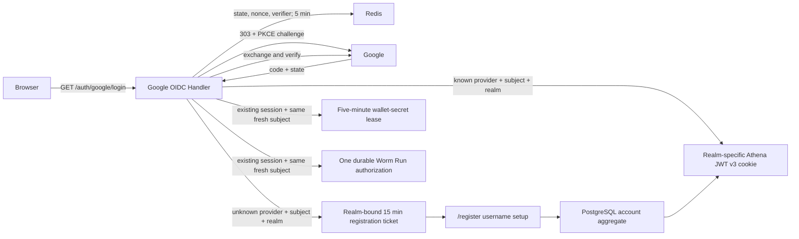

# Google OIDC Login

> 设计状态：已实现

## Scope

Google OIDC Login owns Athena's browser Authorization Code flow for both
frontend realms, PKCE, one-time OAuth transactions, Google ID-token
verification, administrator entry allowlisting, and the handoff of a verified
Google identity to either Athena session issuance or shared anonymous username
registration. Any Google identity with a fully verified ID token and
`email_verified=true` may start member registration. Administrator registration
additionally requires the configured verified email before Athena creates a
ticket or session. Google is the only provider offered by the administrator
login page; the member login also offers Phantom.
The same OIDC client and callback also provide independent fresh proofs for
wallet private-key reveal, Worm API-credential management, and one immutable
Worm live-execution Run. The first two state machines issue separate short
leases. Execution proof instead persists an exact Run/plan/Session/access
authorization and never issues another login session or reusable lease.

[Account Credentials](account-credentials.md) owns UUID accounts, immutable
usernames, external identity bindings, and JWT v3. The provider-neutral
registration resource in `authregistration` owns username setup for unknown
Google and Solana identities. [Account Access Control](account-access-control.md)
owns Pending, Active, and Blocked behavior. Google refresh tokens, profile
synchronization, Workspace allowlists, password fallback, and global Google
logout are outside this capability.

## Source Locations

| Concern | Source | Key symbols |
| --- | --- | --- |
| Client, callback, and administrator allowlist configuration | [internal/googleoidc/config.go](../../../internal/googleoidc/config.go) | `Config`, `LoadConfigFromEnv(baseHRef)` |
| One-time OAuth state | [internal/googleoidc/store.go](../../../internal/googleoidc/store.go) | `TransactionStore`, `Create`, `Consume`, `transactionTTL` |
| Google HTTP flow | [internal/googleoidc/handler.go](../../../internal/googleoidc/handler.go) | `Handler`, `Login`, `Callback` |
| Wallet-secret reauthentication | [internal/googleoidc/wallet_secret_reauth.go](../../../internal/googleoidc/wallet_secret_reauth.go), [internal/googleoidc/wallet_secret_store.go](../../../internal/googleoidc/wallet_secret_store.go) | `WalletSecretReauthentication`, `walletSecretReauthentication.callback`, `walletSecretTransactionStore` |
| Worm-credential reauthentication | [internal/googleoidc/worm_credential_reauth.go](../../../internal/googleoidc/worm_credential_reauth.go), [internal/googleoidc/worm_credential_store.go](../../../internal/googleoidc/worm_credential_store.go) | `WormCredentialReauthentication`, `wormCredentialReauthentication.callback`, `wormCredentialTransactionStore` |
| Worm execution authorization | [internal/googleoidc/worm_execution_authorization.go](../../../internal/googleoidc/worm_execution_authorization.go), [internal/googleoidc/worm_execution_store.go](../../../internal/googleoidc/worm_execution_store.go), [internal/server/worm_execution_authorization.go](../../../internal/server/worm_execution_authorization.go) | `WormExecutionAuthorization`, `wex.` state, exact Run command/session binding, durable authorizer callback |
| Wallet-secret provider-state limits | [internal/walletsecret/state_rate_limit.go](../../../internal/walletsecret/state_rate_limit.go) | `CreateRateLimitedState` |
| Shared registration state and HTTP resource | [internal/authregistration/store.go](../../../internal/authregistration/store.go), [internal/authregistration/handler.go](../../../internal/authregistration/handler.go) | `Store`, `Handler`, `Begin`, `Registration`, `ValidateReturnTo`, `DeploymentPath`, `AdministratorDefaultReturnTo` |
| Durable identity and session boundary | [internal/accountcredentials/manager.go](../../../internal/accountcredentials/manager.go), [util/session/sessionmanager.go](../../../util/session/sessionmanager.go) | `GetByIdentity`, `RegisterExternalAccount`, `CreateExternalLogin` |
| Session cookie and logout | [util/http/http.go](../../../util/http/http.go), [internal/server/logout/logout.go](../../../internal/server/logout/logout.go) | `SetTokenCookie`, `Handler.ServeHTTP` |
| Anonymous browser surfaces | [ui/src/app/member/pages/login.tsx](../../../ui/src/app/member/pages/login.tsx), [ui/src/app/admin/login.tsx](../../../ui/src/app/admin/login.tsx), [ui/src/app/member/pages/register.tsx](../../../ui/src/app/member/pages/register.tsx), [ui/src/app/shared/services/registration-service.ts](../../../ui/src/app/shared/services/registration-service.ts) | member `LoginPage`, `AdminLoginPage`, shared `RegisterPage`, `RegistrationService` |
| Route wiring | [internal/server/athena-server.go](../../../internal/server/athena-server.go), [ui/src/app/member/app.tsx](../../../ui/src/app/member/app.tsx), [ui/src/app/admin/app.tsx](../../../ui/src/app/admin/app.tsx) | `newHTTPServer`, member/admin login and registration bootstrap boundaries |

## Architecture

All protocol and registration endpoints are native HTTP handlers, not gRPC
RPCs. `NewHandler` constructs the OAuth configuration and remote-key verifier
without contacting Google. JWKS is fetched and cached only while verifying a
callback, so an IdP outage does not stop startup or invalidate existing Athena
sessions.

The unknown-subject boundary is provider-neutral after verification: the OIDC
handler gives a verified `authregistration.Identity` to the shared registration
handler. That identity carries the server-restored application realm, and the
realm remains in the registration ticket, durable lookup, audit, session issue,
cookie selection, and return routing. PostgreSQL receives no row and Athena
signs no token until the browser submits its permanent username. The
registration page does not initialize the authenticated application shell.

The durable identity key is `(google, sub, realm)`, represented in PostgreSQL by
`(identity_provider, identity_subject, administrator)`. One Google subject may
therefore have a member persona and the single administrator persona. They have
independent UUIDs, globally distinct usernames, profiles, access,
API Keys, Wallets, and business data. Entering the member login with the
configured administrator email still resolves or creates only the ordinary
member persona; email never causes a member-realm login to switch personas.

Wallet-secret state is a separate `ws.` namespace handled before normal callback
processing. It reuses the code-exchange and ID-token verification primitive but
does not enter identity lookup, registration, login audit, or Athena cookie
issuance. [Wallet Secret Reauthentication](wallet-secret-reauthentication.md)
owns the resulting lease and native private-key boundary.

Wallet-secret, Worm-credential, and Worm-execution Google callbacks are
member-only. A full-page provider redirect cannot retain the request realm
header. Each scoped state namespace identifies a server-held member-only
transaction, so its callback restores the fixed `member` realm before
authenticating `athena.token.member`. It never selects or mutates the
administrator session.

Worm-credential state is a separate `wc.` namespace with its own five-minute
transaction and cookie. It proves the member's persisted Google subject before
issuing only the Worm management lease; it does not issue a login session or a
wallet-secret lease.

Worm execution uses a third callback-owned `wex.` namespace. It reuses PKCE,
nonce, `exchangeAndVerify`, `prompt=select_account`, `max_age=0`, and stable-
subject/fresh-`auth_time` checks, but stores Run ID, command ID, expected
revision, account, Session-JTI digest, access revision, and safe Run-detail
return path in a separate single-use Redis transaction. Completion invokes the
Run authorizer and redirects; it does not create a Worm credential lease,
change the Athena cookie, or start the Run.

## Runtime Flow

1. Authentication-enabled startup validates the Google client ID, client
   secret, exact callback URI, and `ATHENA_ADMIN_GOOGLE_EMAIL`. It performs no
   Google network request. Disabled-auth loopback development registers none of
   the external authentication handlers.
2. The member `/login` and administrator `/admin/login` pages both start
   `GET /auth/google/login` with exact `athenaRealm=member|admin` and a
   realm-local `returnTo`. The handler validates both, generates independent
   32-byte state and nonce values plus a PKCE S256 verifier, and stores
   `{nonce, verifier, returnTo, realm, createdAt}` in Redis for five minutes. A
   realm-specific HttpOnly, SameSite=Lax state cookie binds the callback to the
   browser. A second HttpOnly entry cookie records only `member` or `admin`, so
   a callback that cannot recover Redis state still returns to the initiating
   realm's login surface.
   The Redis script atomically limits creation to 20 starts per hashed client
   identity and 120 deployment-wide in each one-minute window.
3. Athena redirects to Google with scopes `openid email`,
   `prompt=select_account`, nonce, and the PKCE challenge. It neither requests
   offline access nor stores a refresh token.
4. `GET /auth/google/callback` atomically consumes the Redis transaction before
   exchange and, once its realm is known, clears the matching realm state cookie
   plus the entry cookie. It checks opaque-state shape, transaction realm,
   browser cookie equality, freshness, and the server-stored realm-local return
   target. Every consumed callback therefore makes the state unusable for
   replay. If a well-formed state cannot be consumed, an exact constant-time
   match against the realm-specific state cookies selects the failure surface
   and clears only that failed slot; the shared entry cookie is only a routing
   fallback. A malformed callback clears neither realm's in-progress state.
   None of these failure routes selects a login-session cookie.
5. The original verifier and fixed redirect URI exchange the code. The ID token
   must pass signature, Google issuer, client audience, expiry, issue-time,
   nonce, non-empty subject, and verified non-empty email checks.
6. A known `(google, sub, realm)` binding resolves its persisted UUID and
   immediately enters that persona's external-login path. A member binding is
   never returned for an admin lookup or vice versa. Identity lookup happens
   before administrator-email comparison, so an existing member persona cannot
   become administrator when its email changes.
7. An unknown tuple becomes a server-verified `google` identity carrying the
   transaction realm. For `admin`, the server compares its verified email with
   `ATHENA_ADMIN_GOOGLE_EMAIL`; a mismatch returns `google_not_allowed` before
   any registration ticket or Athena session is issued. For `member`, no
   administrator allowlist check occurs, including when the verified email is
   the configured administrator email. An admitted identity enters
   `authregistration.Handler.Begin`. The resulting 15-minute ticket contains
   provider, subject, verified email, realm, validated realm-local return target,
   creation time, and random CSRF secret.
8. Athena writes only the opaque ticket ID to the provider-neutral HttpOnly,
   SameSite=Strict `athena.registration` cookie and redirects to
   `/register?athenaRealm=member|admin`. The query preserves only the anonymous
   page's restart destination if the ticket expires; the server-held ticket
   remains authoritative for registration and session issuance.
   Registration reads and writes use `GET|POST|DELETE /auth/registration`; the
   advisory check is
   `GET /auth/registration/username-availability?username=...`. Registration
   traffic remains provider-neutral after identity verification.
9. Registration validates username and CSRF, acquires a short owner-token-
   protected Redis claim, then commits the complete PostgreSQL account aggregate
   before publishing its credential and access snapshots. Database unique
   constraints remain the final username and administrator decision.
10. The shared handler consumes the ticket, clears its cookie, signs a v3 login
    token through `CreateExternalLogin`, updates the realm-matched identity's
    verified email and last-login audit data, and writes the realm-specific
    HttpOnly cookie. `admin` resumes its validated `/admin/*` target or uses
    `/admin/accounts`; `member` resumes a validated non-admin target or uses
    `/account/access`.
    A registration ticket cannot mint a second session.
11. Deleting a Google registration validates the CSRF header and atomically
    removes the ticket only when no submission claim is active. A concurrent
    submission wins with `409 registration_unavailable`; otherwise deletion
    clears the cookie and returns a fresh realm-bearing
    `/auth/google/login?athenaRealm=...&returnTo=...` URL for account selection.
12. A logged-in Google member account may start
    `GET /auth/wallet-secrets/google?athenaRealm=member&returnTo=/wallet`.
    Athena creates an independent five-minute Redis transaction and state cookie
    bound to account UUID, Session JTI digest, access revision, PKCE verifier,
    nonce, and safe return path. One Redis Lua operation atomically enforces the
    wallet-secret global and authenticated-account creation limits and writes
    the transaction, then Athena redirects with `prompt=select_account` and
    `max_age=0`.
13. The shared callback recognizes the `ws.` state, atomically consumes that
    transaction, restores the fixed member realm, repeats the current member
    login and access bindings, and calls `exchangeAndVerify` with the transaction
    creation time. The ID token must contain a fresh `auth_time`, and its stable
    `sub` must equal the same persisted member Google binding. Success issues
    only a fixed five-minute wallet-secret lease and returns to the saved path.
14. A Google-backed member may start
    `GET /auth/worm-trading/google?athenaRealm=member&returnTo=/worm-trading`.
    Athena creates independent `wc.` state bound to the member account, Session,
    access revision, provider, and safe return. Its callback restores `member`,
    consumes state before exchange, and requires the same stable `sub` and fresh
    `auth_time`; success issues only the fixed Worm credential-management lease.
15. A Google-backed interactive Worm Trading `READ_WRITE` member may start
    `GET /auth/worm-trading/executions/google?athenaRealm=member` with canonical
    `runId` and `commandId`, positive `expectedRevision`, and a Run-detail return
    path. The server verifies the current Run is authorizable, writes a separate
    five-minute `wex.` PKCE/nonce transaction bound to the account, SHA-256
    Session-JTI digest, and access revision, and applies its own fixed-minute
    120-global/20-account creation budget.
16. The callback consumes `wex.` state before exchange, restores the member
    realm, repeats current member login, provider, account, Session, and access
    checks, and requires the same persisted Google `sub` plus fresh `auth_time`.
    The verified callback records proof kind `GOOGLE` against the exact Run and
    frozen plan digest through a revisioned command. It stores no Google token
    in the Run, issues no lease, and redirects without starting execution.
17. `/auth/logout` requires the current application realm, clears only that
    cookie slot, and revokes its JTI only after the signed token account's
    persisted realm matches the selected slot. Member logout also clears the
    wallet-secret and Worm-credential lease cookies; admin logout preserves the
    member login and both member leases. It never attempts to log the browser
    out of the global Google session.

## State / Data

OAuth and registration state is transient Redis data. OAuth state includes the
application realm, has a five-minute lifetime, and is atomically
read-and-deleted. Registration state embeds an `Identity` whose realm is
authoritative for lookup, username policy, account creation, cookie selection,
and return routing. It has a 15-minute lifetime; submission claims serialize one
ticket for up to one minute and are released only by their owner after retryable
failure. Successful completion deletes both keys.

Wallet-secret Google state is an additional five-minute, single-use Redis
transaction. It stores no Google token or raw JTI. Its dedicated state cookie is
HttpOnly, SameSite=Lax, Secure in production, and scoped to the deployment-
relative `/auth/google` path, so the existing callback can validate the browser
binding. Its success and failure responses use the wallet-secret no-store
policy.

Worm-credential Google state is another five-minute, single-use Redis
transaction under the `wc.` namespace with its own state cookie. It stores the
member account, Session-JTI digest, access revision, return target, and OIDC
protocol material, never a Google token or raw JTI. Its only success result is a
Worm credential-management lease.

Worm execution Google state is another five-minute, single-use Redis
transaction and dedicated HttpOnly, SameSite=Lax state cookie scoped to the
deployment-relative `/auth/google` path. It stores protocol material plus
Run/command/revision, account, Session-JTI digest, access revision, and return
path, never a Google token. The transaction is not the durable authorization:
completion stores only proof kind and the verified bindings in Worm Trading
PostgreSQL. The browser retains only `{runId}` in execution-specific
`sessionStorage` across the redirect.

Wallet-secret and Worm-credential Google and Solana provider states share a
dedicated fixed-window Redis budget of 120 creations globally and 20 per
authenticated account per minute. These counters do not reuse primary-login
counters. The account counter key contains a SHA-256 digest rather than the raw
account UUID, and the counter checks and transaction write are one atomic
operation.

The OAuth state and entry cookies are scoped to the deployment-relative
`/auth/google` path, SameSite=Lax, HttpOnly, and Secure for HTTPS deployments.
Primary state cookie names are realm-specific; the entry cookie contains only
the initiating realm and exists solely for failure routing when the
authoritative Redis transaction is unavailable. The registration cookie is
scoped to the deployment-relative `/auth/registration` path, SameSite=Strict,
HttpOnly, and likewise Secure in production. Handler responses are non-cacheable
and use a no-referrer policy.

Successful primary login and registration write `athena.token.member` or
`athena.token.admin` according to the server-held realm. Both cookies may coexist
at the deployment root. Subsequent authenticated requests explicitly select a
realm, and the server reads only the corresponding cookie and verifies the
persisted role. A callback cannot overwrite the other realm's session.

`authregistration.ValidateReturnTo` accepts at most 2,048 bytes and only a
same-origin absolute path beginning with one `/`. It rejects external origins,
`//`, backslashes, control characters, malformed escapes, decoded `.` or `..`
path segments, and `/login`,
`/admin/login`, or `/register` loops. Only the server-stored value survives the
callback. The registration handler chooses the result from the ticket's
server-held realm and return target; the browser cannot claim administrator
routing.

Return targets remain logical paths relative to Athena's deployment root.
Server-issued HTTP redirects and Cookie paths apply the configured base href;
registration and Phantom JSON `redirectTo` fields keep the logical path so the
browser applies the deployment base exactly once.

Google access and ID tokens exist only in callback memory. Public registration
responses never return the Google subject, ticket ID, Google token, JTI, or
Athena token. Verified email is mutable audit and presentation data plus the
admin-entry registration allowlist input; it is never an account lookup key or
JWT subject. The same provider-neutral response may deliberately project a
Solana identity as its public `solanaAddress`.

## Configuration

| Setting | Behavior |
| --- | --- |
| `ATHENA_GOOGLE_OIDC_CLIENT_ID` | Required Google Web OAuth client ID and ID-token audience. |
| `ATHENA_GOOGLE_OIDC_CLIENT_SECRET` | Direct secret input, intended for local development. A non-empty direct value takes precedence. |
| `ATHENA_GOOGLE_OIDC_CLIENT_SECRET_FILE` | Secret-file input. Production mounts a `0600` file read-only only into `athena-server`. |
| `ATHENA_GOOGLE_OIDC_REDIRECT_URI` | Exact deployment-relative `/auth/google/callback` URI. Its path must include the configured Athena base href. Production requires HTTPS; HTTP is accepted only on `localhost`. It is never inferred from request headers. Its scheme and authority also define the trusted SIWS origin. |
| `ATHENA_ADMIN_GOOGLE_EMAIL` | Required verified email permitted to create the administrator persona through the admin realm. Comparison trims surrounding whitespace and ignores case, without Gmail dot or alias normalization. It does not restrict member-realm registration, alter an existing subject, or replace an administrator. |
| `ATHENA_SESSION_DURATION` | Athena login-session lifetime; default 24 hours. |
| `ATHENA_SERVER_DISABLE_AUTH` | Skips external authentication and administrator-email requirements while creating both loopback-only development identities, selected per request realm. |

The Google consent audience must be External and Published to admit arbitrary
verified Google users. Google's Testing state admits only configured test users.
Local and production use separate Web application clients with separately
registered exact callback URIs. The configured redirect origin is also the
fixed domain/URI authority for Solana wallet messages; request `Host` and
Forwarded headers never select either trust boundary.
Wallet-secret Google reauthentication adds no client, callback, or secret
setting; it reuses this verified configuration and keeps a distinct Redis state
namespace and browser cookie. Its shared wallet-secret rate counters are also
separate from primary Google login counters.
Worm execution Google proof likewise adds no client or callback setting. Its
transaction and 120-global/20-account fixed-minute counters use a third Redis
namespace and are not shared with primary login or either sensitive lease.

## Invariants

- An unknown verified provider-subject-realm tuple produces only a realm-bound
  registration ticket until a username transaction commits.
- Provider plus subject plus realm lookup precedes the admin-entry email check.
  An unbound, non-allowlisted admin identity receives `google_not_allowed`
  before ticket or session issuance.
- Administrator role is derived only from the server-held `admin` realm and
  persisted role; the browser cannot alter a ticket's realm and Solana cannot
  claim it. The administrator email in the member realm remains ordinary.
- Admin registration returns to `/admin/*`; member registration returns only to
  a non-admin target. Known-account login preserves only a validated target in
  its own realm and each frontend applies its role guard. Both realms share the
  callback but use separate deployment-root login cookies.
- Username availability is advisory; PostgreSQL case-insensitive uniqueness is
  final.
- OAuth state and successful registration tickets are one-time and browser-
  bound.
- Wallet-secret Google state is independent from primary login, is bound to the
  current account/JTI/access revision, and can issue only a wallet-secret lease.
- Every scoped Google proof callback restores the member realm before login
  cookie authentication and cannot select the administrator cookie.
- Scoped Google proof success and failure return targets are constrained to the
  member application and cannot redirect into `/admin/*`.
- Fresh wallet proof requires the same persisted Google `sub` and an `auth_time`
  fresh relative to the reauthentication transaction.
- Wallet-secret transaction creation is atomically rate-limited in the shared
  wallet-secret namespace, with no raw account UUID in its counter key.
- Worm execution Google state is single-use, exact-Run/command/revision/account/
  Session/access bound, separately rate-limited, and can create only a durable
  authorization for the Run's already-frozen plan digest.
- Google execution proof never issues a login or Worm-management lease, changes
  frozen execution intent, acquires a coordinator, or starts a Step.
- Email is never a durable identity key, relationship key, or JWT subject.
- Google and Solana provider identities remain permanently separate accounts.
- Google tokens, subjects, registration IDs, and Athena credentials stay out of
  public responses and browser storage.
- Google availability is not a startup, readiness, or existing-session
  dependency.

## Failure Recovery

Missing, expired, mismatched, or replayed OAuth state returns
`google_state_invalid`; cancellation returns `google_cancelled`; exchange, JWKS,
Redis, or transient callback dependency failure returns `google_unavailable`;
invalid identity claims, a non-allowlisted unbound admin identity, or
administrator conflict return `google_not_allowed`;
and a disabled known account returns `maintenance`. None writes an Athena
cookie.

Shared registration uses `username_invalid`, `username_unavailable`,
`registration_expired`, `registration_unavailable`, `google_not_allowed`, and
`maintenance`. Validation and uniqueness failures release the ticket claim so
the browser can retry. A successful database registration is durable even if a
later Redis completion, audit, or cookie issuance fails. Because the subject is
then known, a new Google flow recovers through ordinary login without creating
another account or changing username.

Same-provider-subject-realm conflicts converge on the existing UUID. A username
race allows one identity to commit; the other retains its ticket and chooses
another name. A second administrator identity cannot displace the persisted
role. A member persona with the same Google subject remains independent.

Wallet reauthentication maps missing, expired, replayed, stale-session, or
wrong-subject state to `WALLET_REAUTH_REQUIRED`; a missing login maps to
`WALLET_LOGIN_SESSION_REQUIRED`; and Redis, rate-budget exhaustion, exchange, or
JWKS unavailability maps to `WALLET_REAUTH_UNAVAILABLE`. None replaces the
Athena login cookie or returns a private key.

Worm execution proof maps missing or stale login to
`WORM_EXECUTION_LOGIN_SESSION_REQUIRED`, rejected/expired/replayed/stale Run
state to `WORM_EXECUTION_AUTHORIZATION_REQUIRED`, and Redis, rate-budget,
exchange, or JWKS failure to `WORM_EXECUTION_AUTHORIZATION_UNAVAILABLE`. It
creates no partial authorization, starts no Worm mutation, and never falls back
to the general credential-management lease.

## Observability

Login and registration counters retain success/failure signals. Structured logs
include provider, stable stage and reason values, and account UUID only after it
exists. Email and subject are not metric labels. Authorization codes, Google
tokens, Athena JWTs, client secrets, registration ticket IDs, and CSRF secrets
are never logged. Wallet-secret state, Session JTIs, and lease values are also
excluded. Health checks do not probe Google.
Execution-proof logs contain only provider and bounded stage/reason. They
exclude Run proof state, raw Session JTI, OIDC code/token, plan contents,
coordinator token, Worm JWT, transaction, and signature.

## Change Checklist

- [ ] State, nonce, PKCE, callback, and return-target checks remain current.
- [ ] Unknown-subject handoff uses the shared registration resource.
- [ ] Registration cookie, CSRF, claim, and one-time consumption semantics remain current.
- [ ] Realm-bound transaction/ticket state, admin allowlisting, and realm-aware identity rules remain current.
- [ ] Member and administrator login, registration, and return-target routing remain isolated.
- [ ] Dual login cookies, current-realm logout, and member-realm scoped callbacks remain current.
- [ ] Public/browser boundaries still exclude Google tokens and subjects.
- [ ] Wallet-secret transaction creation retains its independent atomic global
      and account rate limits.
- [ ] Wallet-secret state, fresh `auth_time`, same-subject, and lease-only behavior remain current.
- [ ] Worm execution `wex.` state, independent rate limits, exact Run/session/access binding, fresh same-subject proof, and no-lease/no-start behavior remain current.
- [ ] The [design index](../README.md) contains the current summary.
