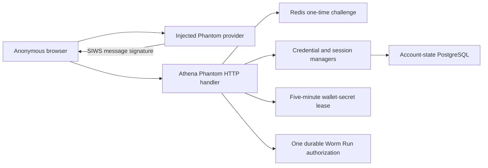

# Solana Wallet Authentication

## Scope

Solana Wallet Authentication is a member-application identity provider. It is
offered at `/login` and participates in the shared `/register` username flow;
the administrator application exposes Google only and never loads, connects,
or signs through Phantom.

Solana Wallet Authentication lets an anonymous browser prove control of one
Solana public key through the injected Phantom extension and then enter Athena's
UUID account lifecycle. It owns the server-generated Sign-In With Solana
(SIWS) message, one-time Redis challenge, Ed25519 verification, and the handoff
to shared username registration or Athena session issuance.
For a logged-in Solana account, the same SIWS construction also provides an
independent fresh proof before custodial private-key reveal. That address-free
flow uses the account's persisted identity subject and issues only a five-minute
wallet-secret lease.
The same persisted-address boundary also authorizes one immutable Worm live-
execution Run. That SIWS statement binds Run ID and plan SHA-256, discloses the
Worm transaction trust model, and records durable Run authorization rather than
issuing a general trading lease or starting execution.

This capability never handles a private key, mnemonic, transaction, balance,
or RPC request. The custodial [Wallet Ownership](wallet-ownership.md) subsystem
remains separate. Google OIDC is an independent login provider, and identities
from the two providers create separate Athena accounts.

## Source Locations

| Concern | Source | Key symbols |
| --- | --- | --- |
| HTTP flow, deployment paths, and SIWS verification | [internal/phantomauth/handler.go](../../../internal/phantomauth/handler.go) | `Handler`, `NewHandler`, `Challenge`, `Verify`, `deploymentPath`, `siwsMessageWithStatement`, `validOrigin` |
| Wallet-secret SIWS proof | [internal/phantomauth/wallet_secret_reauth.go](../../../internal/phantomauth/wallet_secret_reauth.go), [internal/phantomauth/wallet_secret_store.go](../../../internal/phantomauth/wallet_secret_store.go) | `WalletSecretChallenge`, `WalletSecretVerify`, `walletSecretChallengeStore` |
| Worm execution SIWS proof | [internal/phantomauth/worm_execution_authorization.go](../../../internal/phantomauth/worm_execution_authorization.go), [internal/phantomauth/worm_execution_store.go](../../../internal/phantomauth/worm_execution_store.go), [internal/server/worm_execution_authorization.go](../../../internal/server/worm_execution_authorization.go) | `WormExecutionChallenge`, `WormExecutionVerify`, authoritative descriptor load, Run/plan disclosure and durable authorizer |
| Wallet-secret provider-state limits | [internal/walletsecret/state_rate_limit.go](../../../internal/walletsecret/state_rate_limit.go) | `CreateRateLimitedState` |
| One-time challenge and rate state | [internal/phantomauth/store.go](../../../internal/phantomauth/store.go) | `challengeStore`, `Create`, `Consume`, `challengeTTL`, `challengeGlobalRateLimit`, `challengeClientRateLimit` |
| Shared username registration | [internal/authregistration/handler.go](../../../internal/authregistration/handler.go), [internal/authregistration/store.go](../../../internal/authregistration/store.go), [internal/authregistration/types.go](../../../internal/authregistration/types.go) | `Handler.Begin`, `Registration`, `UsernameAvailability`, `Store`, `Identity` |
| Durable identity and session | [internal/accountcredentials/manager.go](../../../internal/accountcredentials/manager.go), [util/session/sessionmanager.go](../../../util/session/sessionmanager.go), [internal/server/external_auth_backend.go](../../../internal/server/external_auth_backend.go) | `GetByIdentity`, `RegisterExternalAccount`, `IssueLoginSession`, `CreateExternalLogin`, `externalAuthBackend` |
| Public route wiring | [internal/server/athena-server.go](../../../internal/server/athena-server.go) | `newHTTPServer`, `/auth/phantom/*`, `/auth/registration*` |
| Member-browser integration | [ui/src/app/member/pages/login.tsx](../../../ui/src/app/member/pages/login.tsx), [ui/src/app/member/app.tsx](../../../ui/src/app/member/app.tsx), [ui/src/app/member/pages/register.tsx](../../../ui/src/app/member/pages/register.tsx) | member `LoginPage`, `PhantomProvider`, shared `RegisterPage` |

## Architecture

The browser connection reveals a public key but does not authenticate it.
Athena creates the exact SIWS message server-side and accepts the wallet only
after verifying its Ed25519 signature. The server records the provider as
`solana_wallet`: a signature proves control of a Solana key, not the brand of
software that produced it. The current UI deliberately exposes only Phantom's
injected desktop provider.

Every `/auth/*`, `/register`, and return path in this document is a logical path
relative to Athena's deployment root. The handler applies the configured base
href to server-issued HTTP redirects and to login, Wallet-secret,
Worm-credential, and Worm-execution transient Cookie paths. JSON `redirectTo`
values remain logical paths; the browser applies the deployment base exactly
once. An administrator application path never introduces an `/admin/auth`
prefix.

Every verified address is an independent external identity. It cannot be
merged with a Google account, bound as a second credential, or used to recover
another account. Athena account UUID remains the only key for authorization,
API Keys, profiles, Wallet ownership, and Profit Sharing relationships.

The wallet-secret branch is available only after an Athena login cookie and
Wallet `READ_WRITE` authorization. It obtains the Solana address from the
durable account binding, never a challenge request, and leaves the primary
Athena session unchanged. [Wallet Secret
Reauthentication](wallet-secret-reauthentication.md) owns the lease and reveal
boundary.

The execution branch is separately routed under
`/auth/worm-trading/executions/{runId}/solana`. It accepts no address or plan
contents from the browser. Before creating a challenge, the API Server loads the
owner-scoped Run at the expected revision and obtains its immutable plan digest.
The persisted login address signs a statement naming both. Completion records
proof kind `PHANTOM` against that Run; it neither creates a Worm credential-
management lease nor asks Phantom to sign a transaction.

## Runtime Flow

1. The member `/login` page detects `window.phantom.solana.isPhantom`, calls `connect()`,
   and obtains a candidate base58 public key. A missing extension or rejected
   request remains a browser-local login error.
2. `POST /auth/phantom/challenge` accepts JSON `{address, returnTo}` and validates
   the exact request origin, canonical public key, content type, body size, and
   safe return target. It generates a 16-byte random lowercase-hex nonce and a
   five-minute SIWS message whose domain and URI come from the configured Google
   redirect origin, never request host headers. The message includes the address,
   `Version: 1`, `Chain ID: solana:mainnet`, nonce, issue time, and expiration.
   Its signed statement explicitly says that the proof is only for Athena login
   and triggers no blockchain transaction or network fee.
   The challenge-store Lua script atomically limits creation to 20 per hashed
   client identity and 120 deployment-wide in each one-minute window.
3. Redis stores the address, exact message bytes, nonce, safe return path, issue
   time, and expiry behind an opaque identifier. The identifier is written only
   to a Secure-in-production, HttpOnly, SameSite=Strict challenge cookie.
4. Phantom signs the UTF-8 message without creating a blockchain transaction.
   The browser aborts if the connected account changes before verification and
   submits only the raw-base64url signature.
5. `POST /auth/phantom/verify` first requires the exact Origin and a valid
   challenge cookie, then atomically consumes the challenge. After that point,
   invalid JSON, freshness, message binding, or signature cannot be retried. It
   reconstructs the exact message from the saved address, nonce, origin, and
   times and compares it with the stored text. It then requires canonical raw-
   base64url for exactly 64 signature bytes, decodes exactly 32 public-key bytes,
   and verifies the saved UTF-8 message with Ed25519.
6. A known ordinary identity passes current login-access checks and receives an Athena
   JWT cookie plus the saved return path. An unknown address receives only a
   shared 15-minute registration ticket and is sent to `/register`.
7. Username submission creates the complete Pending account aggregate. Only
   after PostgreSQL commit and runtime publication does Athena consume the
   registration ticket and issue a login cookie.
8. For private-key access, the logged-in browser posts an empty object to
   `/auth/wallet-secrets/solana/challenge`. Athena repeats login and Wallet
   `READ_WRITE` authorization, loads the persisted identity address, and creates
   a separate five-minute SIWS message bound to account UUID, Session JTI
   digest, and access revision. One Redis Lua operation atomically enforces the
   wallet-secret global and authenticated-account creation limits and writes the
   challenge. Its statement explicitly authorizes custodial key reveal only and
   states that no transaction or network fee is involved.
9. `/auth/wallet-secrets/solana/verify` validates exact Origin and the dedicated
   challenge cookie, atomically consumes the challenge, repeats the current
   login/session/access/address bindings, reconstructs the exact message, and
   verifies the canonical raw-base64url Ed25519 signature. Success issues only a
   fixed five-minute wallet-secret lease, not a new Athena session.
10. A logged-in Phantom account with Worm Trading `READ_WRITE` starts
    `POST /auth/worm-trading/executions/{runId}/solana/challenge` with a command
    UUID, expected Run revision, and safe return path. Athena derives the
    persisted login address, SHA-256 Session-JTI digest, access revision, and
    authoritative plan digest. It atomically rate-limits and stores a separate
    five-minute challenge.
11. The exact SIWS statement identifies the Run and plan SHA-256 and says that
    Athena will sign the original transactions returned by Worm. It also states
    that the 10-USDC per-order limit is Athena's requested funds maximum, not a
    cryptographic on-chain spending limit. Phantom signs only this identity
    message. `/solana/verify` consumes the challenge, repeats account, Session,
    access, address, Run and plan bindings, verifies the raw-base64url 64-byte
    Ed25519 signature, and persists Run authorization without starting it.

## State / Data

The five-minute challenge is transient Redis state. It contains the canonical
address, exact message, validated return path, nonce, issue time, and expiry.
The opaque identifier is hashed into the Redis key and sent only as the
`athena.phantom.challenge` HttpOnly cookie scoped to the deployment-relative
`/auth/phantom` path. It is single-use even when verification fails; the
response contains only message and expiry.

Challenge rate counters share Redis but are separate from challenge state. The
client key is a SHA-256 digest of the canonical client network address; neither
the raw client address nor wallet identity becomes a Redis rate-key suffix or
metric label.

The shared 15-minute registration ticket contains provider, identity subject,
verified email, administrator-candidate flag, return path, CSRF secret, and
creation time. Solana tickets always have an empty email and a false
administrator candidate. The registration handler derives `solanaAddress` from
the server-held subject for the anonymous setup response. PostgreSQL stores the
canonical address as the `solana_wallet` identity subject; Account and Session
APIs expose it through the provider-specific `solanaAddress` projection only to
the account owner or administrators. Successful Solana registration always
creates an ordinary member account and returns to `/account/access`.

Wallet-secret SIWS state uses a separate hashed Redis key and
`athena.wallet-secret.solana.challenge` HttpOnly, SameSite=Strict cookie scoped
to the deployment-relative `/auth/wallet-secrets/solana` path. The server record
contains the persisted address, exact message, nonce, account UUID, Session JTI
digest, access revision, and exact five-minute issue/expiry interval. It accepts
no address in the public request and is single-use even when later signature
verification fails.

Solana and Google wallet-secret provider states share a dedicated fixed-window
Redis budget of 120 creations globally and 20 per authenticated account per
minute. These counters do not reuse primary-login counters. The account counter
key contains a SHA-256 digest rather than the raw account UUID, and the counter
checks and challenge write are one atomic operation.

Worm execution SIWS state uses its own hashed Redis key and
`athena.worm-execution.solana.challenge` HttpOnly, SameSite=Strict cookie scoped
to the deployment-relative `/auth/worm-trading/executions` path. Its five-minute
record includes persisted address, exact disclosure message,
nonce, Run/command/expected revision, account, Session-JTI digest, access
revision, immutable plan digest, safe return path, and issue/expiry times. Its
own 120-global/20-account fixed-minute counters are atomic and keyed by an
account digest. The record is single use and is not the durable Run
authorization; no signature is stored.

## Configuration

Phantom desktop-extension login adds no App ID, client secret, callback, RPC,
or per-wallet environment variable. Authentication-enabled startup already
requires an exact `ATHENA_GOOGLE_OIDC_REDIRECT_URI`; its scheme and authority
provide the trusted SIWS URI and domain. Local injection works at the existing
`http://localhost:4000` origin, while production uses HTTPS and Secure cookies.
Wallet-secret SIWS adds no Phantom, Solana RPC, or environment configuration; it
reuses the same fixed public origin and Redis dependency.
Worm execution SIWS likewise reuses that origin and Redis. Its route, cookie,
state namespace, disclosure statement, and counters are independent from login
and both lease-producing proof flows.

## Invariants

- A Phantom connection alone is never authentication; a fresh verified
  signature is required.
- Every challenge and registration ticket is browser-bound, short-lived, and
  one-time. After Origin and Cookie binding succeeds, every verification attempt
  consumes its challenge. The public address is not accepted again during
  verification.
- Wallet-secret challenge creation derives its address only from the persisted
  current-account identity and binds proof to the current login JTI and access
  revision.
- Wallet-secret challenge creation is atomically rate-limited in the shared
  wallet-secret namespace, with no raw account UUID in its counter key.
- Google and Solana identities never resolve to or create the same account.
- A Solana identity can never create or become the administrator.
- The administrator login and bundle never expose or initialize Phantom.
- The address is permanent and cannot be replaced, recovered, or transferred.
- Wallet signatures and opaque challenge identifiers never enter an Athena JWT
  or public response. The SIWS message and expiry are the only public challenge
  projection.
- Solana login never changes Wallet records or grants any business entitlement.
- Wallet-secret SIWS issues only a scoped lease and never creates or refreshes
  the Athena login session.
- Worm execution challenge creation accepts no address, plan, market, Wallet,
  side, or funds from the browser. It loads the exact owner Run and binds the
  persisted address, Run/command/revision, plan digest, Session JTI, and access
  revision before message construction.
- Worm execution SIWS authorizes only that frozen Run. It never signs a Solana
  transaction, issues a login or Worm-management lease, starts a coordinator,
  or initiates an order.
- The Run/plan SIWS message always contains the Worm transaction trust and
  requested-funds-versus-on-chain-spend disclosure.

## Failure Recovery

Missing or rejected Phantom prompts leave server state unchanged except for a
challenge that expires naturally. Redis failure or challenge-rate exhaustion
prevents challenge creation and returns `phantom_unavailable`; Redis failure
also prevents consumption. Invalid origin, cookie, time, address, replay, or
signature fails closed and never issues a cookie. Database failure after a
valid signature can create neither a partial registration nor a session.

If account creation commits but the registration ticket or cookie step fails,
the address is already durable; repeating wallet authentication follows the
known-identity path. Disconnecting Phantom after login does not revoke the
Athena session. A lost wallet has no recovery path; an administrator may only
disable the old Athena account.

Wallet-secret challenge or lease Redis failure and wallet-secret rate-budget
exhaustion return `WALLET_REAUTH_UNAVAILABLE`; missing, expired, replayed,
stale-session, wrong-address, or invalid-signature state returns
`WALLET_REAUTH_REQUIRED`; and a missing interactive login returns
`WALLET_LOGIN_SESSION_REQUIRED`. Failure never falls back to a client-supplied
address, administrator role, or primary login challenge.

Worm execution challenge/state Redis failure, rate exhaustion, or dependency
failure returns `WORM_EXECUTION_AUTHORIZATION_UNAVAILABLE`; a missing Session
returns `WORM_EXECUTION_LOGIN_SESSION_REQUIRED`; expired, replayed, stale,
wrong-address, invalid-signature, Run-revision, or plan-binding failure returns
`WORM_EXECUTION_AUTHORIZATION_REQUIRED`. No failure records partial Run
authorization, reuses a lease, or begins a Worm mutation.

## Observability

Existing login counters record success or failure. Structured logs include the
provider and bounded failure stage, plus account UUID only after resolution.
They exclude signatures, SIWS messages, challenge identifiers, identity
subjects, Athena JWTs, Session JTIs, wallet-secret lease values, and high-
cardinality metric labels. Phantom and Solana RPC are absent from health checks
because the server calls neither service.
Execution-proof logs add only bounded provider/stage/reason. They exclude the
SIWS message and signature, challenge identifier, raw Session JTI, plan
contents, coordinator token, Worm JWT, and transaction material.

## Change Checklist

- [ ] SIWS origin, exact-message verification, and one-time consumption remain current.
- [ ] Solana address canonicalization and Ed25519 lengths remain enforced.
- [ ] Unknown identities still use shared registration without partial accounts.
- [ ] Google, administrator, Wallet, and business-entitlement boundaries remain isolated.
- [ ] Browser support and configuration accurately describe desktop injected Phantom only.
- [ ] Wallet-secret challenge creation retains its independent atomic global and
      account rate limits.
- [ ] Wallet-secret proof remains address-free, current-session-bound, and lease-only.
- [ ] Worm execution SIWS remains address-free, exact-Run/plan/session/access bound, separately rate-limited, disclosure-complete, and no-lease/no-start.
- [ ] The [design index](../README.md) contains the current entry.
