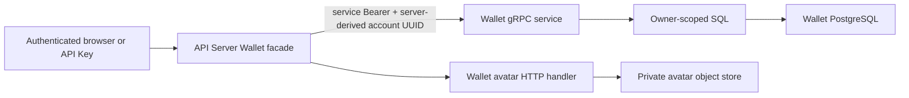

# Wallet Ownership and Custody

## Scope

Wallet Ownership and Custody owns Athena-managed EVM and Solana keypairs,
UUID-account ownership, bounded atomic batch creation and import, optional
single-wallet remark input with persistently non-empty wallet remarks, avatar
metadata, encrypted private-key persistence, and the safe Wallet API
projection. Every wallet belongs to exactly one account. Application
administrators have no cross-user Wallet read or write path and no own-account
Wallet path: their fixed access aggregate gives Wallet `NONE`, and the
administrator application constructs no Wallet service or route.

[Wallet Secret Reauthentication](wallet-secret-reauthentication.md) owns the
independent browser proofs required before a stored private key is revealed or
a Worm API credential is managed.
[Account Credentials](account-credentials.md) owns the login/API Key distinction
and account UUID. [Account and Wallet Avatar Storage](account-avatar-storage.md) documents
the shared private S3-compatible storage boundary and image validation used by
both account and wallet avatars. Worm Trading owns Solana balance and Worm
position reads plus its owner-scoped summary projection; it consumes only safe
Wallet metadata selected by the API Server. Assets position Cash Out repeats an
owner-scoped Wallet lookup for the submitted Wallet ID, requires Solana type and
canonical address, and then uses Worm Trading's HMAC credential; Wallet does not
reveal or sign anything for that Close. Assets batch Cash Out fully pages the
same owner-scoped Solana inventory, preserves its display order for up to 100
selected Wallets, and forwards only safe presentation metadata; neither batch
building nor any child Close calls a Wallet signer. Worm execution-preview creation
also resolves every selected Wallet through this owner-scoped safe boundary and
freezes only its ID, address, remark, and avatar presentation; preview building
does not ask Wallet to reveal or sign anything. Wallet additionally owns two
separate purpose-bound signing surfaces: the general internal service signs the
exact official Worm API-credential challenge, while
`WormExecutionSignerService` signs the exact Worm Web sign-in message and
Solana transaction supplied by a durable live Run. The latter has its own
Bearer and cannot reveal a private key or call Wallet CRUD. It validates the
owner, Wallet, stored and derived address, Run/Step/intent binding, transaction
digest, supported Solana serialization, required signer slot, and resulting
signature. By design it does not inspect Worm's programs, accounts,
instructions, or actual spend. Caller-selected transfers, mnemonics, wallet
deletion, and blockchain RPC calls remain outside this capability.

## Source Locations

| Concern | Source | Key symbols |
| --- | --- | --- |
| Public safe API | [internal/server/wallet/wallet.proto](../../../internal/server/wallet/wallet.proto), [internal/server/wallet/wallet.go](../../../internal/server/wallet/wallet.go) | `WalletService`, `BatchCreateWallets`, `BatchImportWallets`, `UpdateWalletRemark`, `UpdateWalletAvatarPreset` |
| Trusted internal API and custody service | [internal/wallet/wallet.proto](../../../internal/wallet/wallet.proto), [internal/wallet/server.go](../../../internal/wallet/server.go), [internal/wallet/service.go](../../../internal/wallet/service.go), [internal/wallet/keys.go](../../../internal/wallet/keys.go), [internal/wallet/worm_execution_signer.go](../../../internal/wallet/worm_execution_signer.go) | service Bearer dispatch, `RevealWalletPrivateKey`, `SignWormAuthChallenge`, `WormExecutionSignerService`, execution sign-in/transaction signing, key normalization, owner-scoped avatar metadata methods |
| Durable state | [internal/wallet/store/migrations/000001_init.sql](../../../internal/wallet/store/migrations/000001_init.sql), [internal/wallet/store/queries/wallets.sql](../../../internal/wallet/store/queries/wallets.sql), [internal/wallet/store/sql_store.go](../../../internal/wallet/store/sql_store.go) | `wallets`, `SQLStore.CreateWallets`, owner predicates, optimistic revision updates |
| Shared safe model | [pkg/apis/application/v1alpha1/wallet_types.go](../../../pkg/apis/application/v1alpha1/wallet_types.go) | `WalletItem`, `WalletStatus` |
| Public JSON and Swagger generation | [internal/server/wallet/wallet.proto](../../../internal/server/wallet/wallet.proto), [hack/generate-proto.sh](../../../hack/generate-proto.sh), [assets/swagger.json](../../../assets/swagger.json) | Wallet camelCase JSON tags, Wallet-only Swagger normalization |
| Private avatar HTTP boundary | [internal/server/wallet_avatar.go](../../../internal/server/wallet_avatar.go), [internal/server/walletavatarhttp/handler.go](../../../internal/server/walletavatarhttp/handler.go) | upload, authenticated delivery, reset, compensation, garbage collection |
| Owner-scoped Worm Trading projection, preview/Cash-Out resolution, and management | [internal/server/wormtrading/wormtrading.proto](../../../internal/server/wormtrading/wormtrading.proto), [internal/server/wormtrading](../../../internal/server/wormtrading), [internal/server/worm_connection.go](../../../internal/server/worm_connection.go), [internal/server/worm_execution_plans.go](../../../internal/server/worm_execution_plans.go), [internal/server/worm_position_cash_outs.go](../../../internal/server/worm_position_cash_outs.go), [internal/server/worm_position_cash_out_batches.go](../../../internal/server/worm_position_cash_out_batches.go) | `ListWalletBalances`, `ListWalletTradingActivity`, `TradingWalletSummary`, `listWormWalletConnections`, `resolveWormExecutionPlanWallets`, `resolveOwnedPositionCashOutWallet`, `resolveOwnedPositionCashOutBatchWallets`, `completeWormConnection` |
| Browser management surface | [ui/src/app/member/pages/wallets.tsx](../../../ui/src/app/member/pages/wallets.tsx), [ui/src/app/shared/services/wallet-service.ts](../../../ui/src/app/shared/services/wallet-service.ts) | card grid, detail drawer, create/import, remark/avatar updates, secret backup/reveal |
| Process configuration | [cmd/athena-wallet/commands/athena_wallet.go](../../../cmd/athena-wallet/commands/athena_wallet.go), [internal/wallet/apiclient](../../../internal/wallet/apiclient) | `ATHENA_WALLET_ENCRYPTION_KEY`, general internal token, independent Worm execution-signer token and clientset |

## Architecture

The public protobuf never accepts an owner UUID, role, ciphertext, object key,
or secret-reveal flag. The API Server derives the authenticated account UUID,
adds it only to the trusted internal request, and its Wallet clientset attaches
the configured service Bearer to every RPC. The Wallet process validates that
credential with a fixed-size constant-time comparison before every non-health
RPC. Internal SQL then repeats the owner predicate for list, get, update, avatar
metadata, and private-key retrieval. Missing and foreign-owner rows therefore
have the same not-found result.

`WalletItem` is safe metadata only: ID, wallet type, address, remark, source,
avatar presentation, revision, and timestamps. Private keys appear only in the
one-time successful batch-create response or the separately protected native
HTTP reveal response. Import never echoes submitted material.

Public Worm Trading balance and activity reads accept no browser-supplied owner
UUID or wallet address. The API Server derives the authenticated account UUID, lists that owner's
Solana wallets through the internal Wallet API, and reduces each item to wallet
ID, address, remark, and avatar presentation before attaching SOL/USDC balances,
Worm connection state, open positions, and in-flight requests. These paths
require Worm Trading `READ` but do not grant the public Wallet list or detail
APIs. The internal activity call carries the derived owner only to join active
Cash-Out and Run conflicts into safe per-position actions.

The native position-Cash-Out create path accepts one Wallet ID and HMAC position
pubkey only after an interactive Worm Trading `READ_WRITE` request. The API
Server calls owner-scoped `GetWallet`, requires the returned row to be that
exact ID, Solana type, and canonical address, and forwards only the derived
owner, ID, address, and position pubkey to Worm Trading. Worm Trading then reads
the position and submits Close with its separate HMAC credential. This path
never calls private-key reveal, `SignWormAuthChallenge`, or
`WormExecutionSignerService`; Phantom proof signs the persisted login identity,
which is independent from the selected custodial Wallet.

The batch create path accepts only unique Wallet IDs. It fully pages
owner-scoped `ListWallets(SOLANA)` in authoritative display order, rejects any
missing selection, and forwards at most 100 ID/address/presentation snapshots.
Worm Trading then freezes provider positions and creates each HMAC child Close;
Wallet performs no reveal, credential challenge, Web sign-in, transaction
signature, balance read, or Close.

The native Worm connection inventory applies the same server-derived owner and
fixed Solana filter across pages of at most 100 wallets. It is restricted to an
interactive Worm Trading `READ_WRITE` credential, accepts only pagination from
the browser, and sends ordered wallet ID/address references to Worm Trading for
store-backed connection projection. It requires no Worm lease or Origin header
because it does not prepare a challenge, sign, decrypt a key, or mutate either
service. API Keys cannot use this management inventory.

The Execution Preview page reuses that inventory for selection, then POSTs only
ordered Wallet IDs. `resolveWormExecutionPlanWallets` performs owner-scoped
`GetWallet` calls with a concurrency limit of eight, requires every row to be a
canonical Solana Wallet, preserves request order, rejects duplicate IDs and
addresses, and forwards only safe presentation snapshots to Worm Trading.
Worm Trading independently requires each Wallet to have a connected active
credential before it can complete a preview. Neither the inventory nor preview
creation invokes `RevealWalletPrivateKey` or `SignWormAuthChallenge`.
An interactive `READ` user can inspect a direct owner plan Review without
loading this `READ_WRITE` inventory or initiating Wallet resolution.

Each connection mutation performs an owner-scoped `GetWallet` before it prepares
any challenge or revocation. The API Server may then call the internal
`SignWormAuthChallenge` RPC with its service Bearer, server-derived account UUID,
wallet ID, stored address, nonce, and exact challenge message. Wallet repeats
owner lookup, requires a Solana wallet, verifies the expected address, accepts
only `Create Worm API credential | Wallet: {stored_address} | Nonce: {nonce}`,
decrypts and verifies the stored keypair, and returns only an Ed25519 signature
and SHA-256 message digest, with no address field. The challenge signer is not
projected through the public Wallet API or Swagger and cannot sign caller-
selected content.

Live execution reaches a distinct `WormExecutionSignerService` client surface
from Worm Trading, never from the browser or API Server. Its independent Bearer
is checked before dispatch and is accepted only for
`SignWormWebSignInMessage` and `SignWormPositionRequestTransaction`. Both RPCs
repeat the owner-scoped Wallet lookup and exact address/key derivation. The
sign-in RPC additionally validates Worm's fixed message shape and digest. The
transaction RPC binds Run UUID, durable Step UUID, intent digest, numeric
request ID, and transaction digest, then parses legacy or v0 serialization and
signs only when the Wallet is a required signer. It chooses the single finalize
representation from signature completeness. The deliberate Worm trust model
does not add program, account, instruction, or spending-policy inspection.

Wallet HTTP JSON uses the reviewed camelCase field names, including
`walletType`, `privateKeys`, `privateKey`, `avatarPresetId`,
`expectedRevision`, and `pageSize`. Gogo JSON tags make the standard Gateway
decoder authoritative for request and response bodies. Swagger generation
applies the same Wallet-only naming projection, documents revisions as JSON
integers, and removes the path `id` from PATCH body schemas; protobuf field
names remain snake_case on the wire.

The member create form supplies a count from one through ten. The import form
uses a visible, non-persistent monospace text area, trims each physical line,
ignores blank lines, retains source-line positions for safe indexed errors, and
sends the remaining one-to-ten strings as `privateKeys`. A batch shares one
wallet type and avatar. The remark field remains available for one item and is
cleared and disabled for larger batches. A successful create opens a
non-dismissible, scrollable in-memory backup list with per-item copy controls,
one-line-per-key bulk copy, and one acknowledgement covering every returned
key. It offers no plaintext download. Import success clears the form and
reloads safe state without rendering submitted keys.

The Wallet service stores ciphertext but never depends on account role.
Application administrator status is deliberately absent from its contract.
Infrastructure operators that possess PostgreSQL contents and the Wallet master
encryption key remain outside the application-admin isolation boundary because
this is a server-custodied design.

## Runtime Flow

1. `ListWallets` and `GetWallet` require Wallet `READ`. The API Server supplies
   the credential's account UUID; the Wallet service returns only matching rows.
   Optional type/query filters and pagination operate inside that owner scope.
   Worm Trading balance and activity listing separately require Worm Trading
   `READ` and use the same trusted owner-scoped internal list with a fixed Solana
   filter; they expose only `TradingWalletSummary` rather than the complete
   `WalletItem`. The interactive Worm Trading `READ_WRITE` connection inventory
   pages the same safe Solana projection without granting the public Wallet list
   API or requiring a Worm management lease.
2. `BatchCreateWallets` requires a login-session credential plus Wallet
   `READ_WRITE`. One request selects one wallet type and one shared optional
   avatar preset and creates between one and ten wallets. A one-wallet request
   may supply an empty or trimmed 1–50-rune remark; a larger request must leave
   the remark empty. The service validates the complete request, generates all
   random secp256k1 or Ed25519 keypairs, encrypts their canonical private-key
   text, and commits them atomically. The ordered response pairs each safe item
   with the private key that produced it and is returned only after commit.
3. `BatchImportWallets` has the same credential, wallet-type, shared-avatar,
   remark, size, and atomicity requirements. It accepts one to ten private-key
   strings in order. EVM accepts a 32-byte hexadecimal scalar with optional
   `0x`. Solana accepts canonical Base58, a JSON byte array, or hexadecimal for
   a 32-byte seed or verified 64-byte keypair. The service validates and
   canonicalizes every key and rejects duplicate derived addresses before
   opening the transaction. Its ordered response contains only safe items and
   never echoes submitted keys.
4. Each batch opens one transaction and acquires one advisory lock scoped to the
   owner UUID and wallet type. It reads the committed owner/type wallet count
   once and inserts every item in request order. An empty remark is assigned
   `EVM-<n>` for EVM or `SOL-<n>` for Solana, with `<n>` equal to the prior
   committed count plus the item's one-based batch position. A committed
   custom-remark wallet participates in later counts, so default names describe
   creation order within that owner/type scope rather than the number of
   previously generated defaults. The lock, count, naming, all inserts, and
   commit share the transaction; no partial batch is durable and remarks remain
   non-unique.
5. EVM addresses are displayed with EIP-55 checksum casing and indexed through
   lowercase `address_key`. Solana addresses and duplicate keys use canonical
   Base58. Duplicate `(owner, wallet_type, address_key)` inserts return already
   exists without exposing another record.
6. Remark and preset updates require Wallet `READ_WRITE` and an exact positive
   `expectedRevision`. Remark updates continue to require a trimmed 1–50-rune
   value and never invoke default-name allocation. Setting a preset clears
   uploaded-object metadata; an empty preset selects the deterministic default.
   The committed revision is advanced atomically.
7. Wallet avatar upload validates the owner and revision before storing a
   candidate under `wallet-avatars/<sha256(account UUID)>/<random UUID>`. The
   metadata CAS is the live-reference commit point. Replacement commits before
   the previous object is deleted best effort. Reset clears both preset and
   upload metadata and restores the deterministic default.
8. Uploaded-avatar delivery repeats authentication and owner lookup before
   streaming. GET accepts Wallet `READ` or Worm Trading `READ`, allowing either
   the Wallet page or an owner-scoped Worm Trading summary to render the same
   uploaded object. Upload, preset replacement, and reset remain exclusive to
   Wallet `READ_WRITE`. Presets and deterministic defaults are rendered from
   bundled UI definitions; only uploaded avatars use the authenticated endpoint.
   A daily collector deletes unreferenced wallet-avatar objects only after a
   24-hour grace period.
9. `RevealWalletPrivateKey` exists only on the authenticated internal service.
   The native API Server HTTP handler calls it after login-only authorization and
   a valid wallet-secret lease; the Wallet service additionally requires the
   shared internal Bearer. Public gRPC and Swagger do not expose this RPC.
10. `SignWormAuthChallenge` also exists only on the authenticated internal
   service. The native Worm connection handler calls it only after interactive
   login, Worm Trading `READ_WRITE`, exact-origin, Worm-only lease, and owner-
   scoped Solana Wallet checks. Wallet independently repeats owner, type,
   address, exact-message, decrypted-key, and derived-address verification.
   The private key never leaves Wallet, and the challenge never reaches the
   browser; only signature and digest return to the API Server for comparison
   and Worm Trading verification.
11. Execution-preview creation requires an interactive Worm Trading
    `READ_WRITE` request and exact origin. For each ordered Wallet ID, the API
    Server calls owner-scoped `GetWallet`, verifies Solana type and canonical
    address, and snapshots only safe fields. The later asynchronous preview
    worker reads balances and existing Worm exposure through Worm Trading's
    own adapters and credentials. Wallet receives no estimate, market, plan,
    draft, transaction, or signing request.
12. A separately authorized live Run may call the capability-scoped execution
    signer. Worm Trading supplies the server-frozen owner, Wallet ID/address,
    Run and Step UUIDs, intent digest, and either Worm's exact sign-in message or
    returned position-request transaction. Wallet decrypts the key only for the
    current call, validates every binding, signs and self-verifies, and returns
    only the bounded signature/finalize payload plus digests and signer
    metadata. Neither signer RPC creates a Solana RPC request or submits a
    transaction.
13. An Assets Cash-Out create calls owner-scoped `GetWallet` once for the
    submitted positive Wallet ID and current account. The API Server requires
    an exact Solana row and canonical address before forwarding it to Worm
    Trading with the HMAC position pubkey. Worm Trading fresh-reads and freezes
    the provider position, then later uses only its HMAC credential for the
    whole-position Close. Google, Phantom, or development proof binds the
    operation identity; it does not ask the selected custody Wallet to reveal or
    sign. A missing, foreign, non-Solana, mismatched, or malformed Wallet fails
    before the operation or Close can proceed.
14. Assets batch creation accepts up to 100 unique Wallet IDs and fully pages
    the current account's Solana inventory. The API Server preserves the
    inventory display order, rejects every unresolved ID, and forwards safe
    ID/address/presentation snapshots only. The later batch build, HMAC Close,
    and confirmed-USDC reads are owned by Worm Trading and do not call Wallet.

## State / Data

`wallets` has a positive `BIGSERIAL` ID, non-null UUID `owner_account_id`,
`wallet_type` restricted to `EVM` or `SOLANA`, canonical display and lookup
addresses, non-null 1–50-rune remark, source (`created` or `imported`), encrypted
private key, mutually exclusive preset/upload avatar metadata, positive
revision, and timestamps. A single-item create/import may omit the remark, and
multi-item batches always do; the transaction resolves every empty value before
insertion, so `WalletItem.remark` and every durable row remain non-empty.
Default-name allocation uses no counter table or remark uniqueness constraint;
it derives each suffix from the committed owner/type wallet count and batch
position while holding the transaction-scoped advisory lock. A
check constraint requires uploaded object key, content type, ETag, and positive
size to be either complete or all empty. A preset and upload cannot coexist.

The table contains no chain, business-purpose type, system-wallet flag,
nullable owner, mnemonic, derivation path, or repository seed. There is no
ownership transfer or delete operation. The current-state migration is intended
for an empty development deployment; schema replacement requires a complete
data reset.

Execution-plan Wallet rows live in the separate Worm Trading database. They
copy safe Wallet presentation and ordered identity plus later connection and
balance observations; they do not contain Wallet ciphertext, revision, private
key, or a new ownership authority. Because Wallet ownership is immutable and
the API Server resolved the current owner before plan creation, that snapshot
cannot be used to discover or claim a different account's Wallet.

Live-execution Wallet snapshots also live in Worm Trading and remain copies of
the safe preview identity; they do not establish ownership. Run/Step/intent and
transaction digests are request-time signer bindings, not Wallet database
columns.

Position-Cash-Out rows likewise live only in Worm Trading. They freeze the
API-Server-resolved Wallet ID/address and the current HMAC credential version
beside provider-derived position identity; those fields are operation evidence,
not a second ownership source. Fresh proof binds the login Session and operation
intent, while the selected custodial Wallet's ciphertext and revision remain in
Wallet and no Cash-Out signer record is created there.

Private-key canonical forms are `0x` plus 64 lowercase hexadecimal digits for
EVM and Base58 of the complete 64-byte Ed25519 keypair for Solana. Ciphertext is
produced by the existing scrypt-derived AES-GCM utility using the process master
key. Plaintext is held only for the current batch-create/import/reveal/sign call and
must not enter logs, metrics, durable audit records, safe models, or avatar
state. Neither Worm signer persists a challenge, transaction, signature,
signed transaction, Run binding, or digest in the Wallet database.

## Configuration

| Setting | Behavior |
| --- | --- |
| `ATHENA_WALLET_POSTGRES_DSN` | Wallet-owned PostgreSQL database. |
| `ATHENA_WALLET_ENCRYPTION_KEY` | Required server-side passphrase for private-key encryption/decryption. |
| `ATHENA_WALLET_INTERNAL_AUTH_TOKEN` | Required shared service Bearer, at least 32 bytes. It must be identical in the Wallet and API Server processes and is never accepted from browser clients. |
| `ATHENA_WALLET_WORM_EXECUTION_SIGNER_TOKEN` | Independent capability Bearer, at least 32 bytes, supplied only to Wallet and Worm Trading. Wallet refuses to start when it equals the general internal token; the API Server and unrelated services explicitly receive an empty value. |
| `ATHENA_WALLET_LISTEN_ADDRESS` / `--address` | Internal Wallet gRPC bind address; defaults to `127.0.0.1`. Production Compose explicitly uses `0.0.0.0` inside its private network. |
| `ATHENA_WALLET_SERVER_ADDRESS` | API Server internal Wallet target. |
| `ATHENA_ACCOUNT_AVATAR_S3_*` | Shared private S3-compatible bucket and application credential used for account and wallet avatar objects. |
| `ATHENA_ACCOUNT_AVATAR_MAX_BYTES` | Upload limit shared by both avatar surfaces; default and maximum 2 MiB. |

## Invariants

- Every wallet has exactly one canonical UUID owner and is reachable only
  through that owner predicate.
- Administrator role never bypasses wallet ownership.
- Every non-health Wallet internal RPC requires the configured service Bearer;
  caller-supplied owner IDs alone are never a trust boundary.
- API Keys may read safe metadata and, with Wallet `READ_WRITE`, update remark
  and avatar state; they cannot create, import, or reveal private keys. Worm
  Trading `READ` permits the same account's Solana summary, balances, Worm
  activity, connection state, and uploaded-avatar GET without granting other
  Wallet operations. API Keys cannot list the Worm management inventory, invoke
  the Worm challenge signer, or manage a connection.
- Batch create/import require login or isolated development-session capability,
  contain one wallet type, and contain between one and ten items.
- A single-item create/import remark may be omitted, empty, or whitespace-only;
  a multi-item batch rejects a supplied non-empty remark. Every persisted safe
  item still has a non-empty remark. A supplied single-item remark is trimmed
  and limited to 50 runes, while remark updates require an explicit trimmed
  1–50-rune value.
- Every batch, including a single custom-remark item, holds the owner-and-wallet-
  type advisory lock through all inserts. Empty-remark items allocate from one
  committed count in batch order; committed custom-remark wallets therefore
  consume positions in later counts. EVM and Solana scopes allocate `EVM-<n>`
  and `SOL-<n>` independently, and duplicate remark text remains allowed.
- Public safe models never contain owner UUID, ciphertext, object key, private
  key, mnemonic, or role.
- A successful batch create reveals every canonical private key once in result
  order; import never echoes submitted keys.
- Every mutation uses optimistic revision control.
- External Solana login identity and Athena-managed Solana wallets remain
  independent; neither automatically creates or claims the other.
- `SignWormAuthChallenge` is exact-purpose only: owner, Solana type, stored and
  expected address, nonce, message, decrypted keypair, and derived address must
  all agree before signing.
- The execution-signer Bearer is different from the general Wallet Bearer and
  authorizes only the two registered `WormExecutionSignerService` methods.
  Possession of it does not authorize private-key reveal, Wallet CRUD, avatar
  access, or the credential-management challenge signer.
- Live-execution signing is owner-, Wallet-, Run-, Step-, intent-, request-, and
  transaction-digest-bound. Wallet must parse the transaction, find the stored
  Solana key in a required signer slot, and self-verify its signature before it
  returns a finalize representation.
- The execution signer intentionally trusts the transaction returned by Worm.
  It does not validate program IDs, instruction bodies, account metas, or
  actual spend. The Run's at-most-10-USDC `funds` value constrains Athena's Open
  request, not the on-chain transaction cryptographically.
- Execution-preview Wallet selection is interactive, owner-scoped, Solana-only,
  ordered, and safe-metadata-only. Preview building cannot call Wallet secret
  reveal or either signing path.
- Position Cash Out resolves one current-account Wallet ID through owner-scoped
  `GetWallet`, requires exact Solana type/address, and forwards no ciphertext or
  private key. Its HMAC Close and provider proof cannot call reveal,
  `SignWormAuthChallenge`, or either execution-signer RPC.
- A Phantom Cash-Out proof uses the account's persisted external login address,
  not the selected custodial Wallet, and signs only an identity statement with
  no transaction or fee.

## Failure Recovery

Missing or shorter-than-32-byte internal authentication configuration prevents
both the Wallet service and API Server Wallet client from starting. A missing or
mismatched RPC Bearer returns unauthenticated before any Wallet handler executes;
standard gRPC health checks remain credential-free.

Invalid batch fields and imported key material fail before SQL. Key generation,
encryption, canonicalization, or intra-batch duplicate failure returns no
partial item or secret. The owner/type advisory lock, count, default-name
assignment, and all inserts share one transaction, so concurrent batches
receive distinct committed suffix ranges while an existing-address conflict or
failed insert rolls back the whole batch without consuming a suffix. A missing,
timed-out, 5xx, or structurally incomplete client response is treated as an
unknown write outcome rather than an automatic retry; the browser reloads safe
wallet state, and an already committed wallet can use the existing
reauthenticated reveal path. Decryption failure returns no partial secret.
PostgreSQL transaction failure preserves the previous remark/avatar revision.

Worm challenge validation fails before decrypting the key. A decryption,
keypair, derived-address, signing, or response-validation failure returns no
signature and cannot fall back to arbitrary signing or private-key reveal.

Execution-sign-in and transaction validation likewise fail before returning
signing material. A missing or foreign Wallet, binding mismatch, malformed or
unsupported Solana transaction, absent required signer slot, digest mismatch,
key mismatch, or failed signature self-verification returns no partial
signature or signed transaction. The caller cannot fall back to the general
Wallet Bearer, switch finalize representations, or ask Wallet to submit or
retry a Worm mutation.

An unavailable, missing, foreign-owned, non-Solana, mismatched, duplicated, or
malformed Wallet causes execution-plan creation to fail before the durable plan
is accepted. Once creation succeeds, preview-worker failures remain in Worm
Trading and do not cause a Wallet secret operation or mutate the Wallet row.

The same unavailable, missing, foreign-owned, non-Solana, or mismatched Wallet
causes Cash-Out creation to fail before a durable authorized mutation exists.
A later Wallet address or pre-dispatch Worm credential-version mismatch fails
fresh preflight without asking Wallet to sign or revealing its key. After a
Close is dispatched, provider reconciliation remains entirely in Worm Trading
and cannot fall back to a Wallet signing or secret-reveal path. It may use the
latest active HMAC credential only for an exact read of the same frozen Wallet
address; this does not grant Wallet authority or permit another Close.

Avatar object-store failure affects only avatar upload or delivery. Wallet
listing, metadata editing, and secret access remain available, and the UI falls
back to the deterministic avatar. Candidate-write ambiguity is reconciled
against durable metadata before compensation; unresolved candidates remain for
grace-period collection. Garbage collection fails closed when either reference
loading or object listing fails.

## Observability

Wallet service status and gRPC health expose process lifecycle. Logs may include
wallet ID, wallet type, operation stage, and account UUID. They exclude private
keys, ciphertext, encryption keys, the Wallet internal Bearer, avatar bytes, object credentials, external
identity subjects, Session JTIs, wallet-secret or Worm lease values, Worm
challenge messages, nonces, signatures, and message digests.
Execution-preview responses may expose the same safe ID, address, remark, and
avatar presentation already used by Worm Trading, but never Wallet revision,
owner UUID, source, ciphertext, private key, signature, or transaction material.
Live-execution logs and projections may additionally identify a Run, Step,
request ID, signer slot, transaction version, and non-secret digest. They never
contain the Worm JWT, sign-in message, raw or signed transaction, private key,
signature bytes, finalize payload, or execution-signer Bearer.
Position-Cash-Out projections may identify the same safe Wallet ID/address and
the exact HMAC position pubkey, but never Wallet revision/source/ciphertext,
private key, external-identity signature, HMAC credential/header, or raw Close
response. Wallet logs receive no Cash-Out signing request because none exists.

## Change Checklist

- [ ] Public and internal Wallet contracts preserve the safe/secret boundary.
- [ ] Every durable query and mutation remains owner scoped without role bypass.
- [ ] Key canonicalization, encryption, duplicate constraints, and remark rules remain current.
- [ ] Avatar validation, CAS, compensation, private delivery, and collection remain current.
- [ ] Batch create/import/reveal credential restrictions match API Server authorization.
- [ ] Worm Trading summary reads, interactive management inventory, and the uploaded-avatar GET alternative remain owner scoped without broadening Wallet writes.
- [ ] The Worm challenge signer remains internal, owner scoped, Solana-only, exact-message-bound, and unavailable to API Keys.
- [ ] Execution-preview Wallet resolution remains owner-scoped, Solana-only, ordered, safe-metadata-only, and free of reveal or signing calls.
- [ ] Position-Cash-Out Wallet resolution remains current-account, exact-ID, Solana-only, canonical-address, and free of every Wallet secret/signing path.
- [ ] The independent execution-signer token reaches only Wallet and Worm Trading, differs from the general Wallet token, and exposes only its two purpose-bound RPCs.
- [ ] Live signing keeps Run/Step/intent/request/transaction bindings, required-signer validation, signature self-verification, and the documented Worm transaction trust boundary aligned with the implementation.
- [ ] Batch-create UI secret state remains memory-only, requires one explicit
      all-keys backup acknowledgement, and is cleared on completion, route,
      account, or permission change.
- [ ] Configuration, reset guidance, and source links match the implementation.
- [ ] The [design index](../README.md) contains the current summary.
