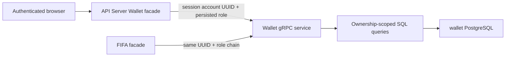

# Wallet Ownership

## Scope

Wallet Ownership defines which UUID account may list, read, create, import,
rename, or reveal each Athena Wallet record. User wallets belong to one stable
`owner_account_id`; repository-defined operational wallets are explicitly
`system_owned` and have no account owner. Username, display name, email, Google
subject, and Solana login address never identify a wallet owner.

This document covers the public API Server facade, the trusted internal Wallet
contract, durable ownership predicates, and UI labels. Key generation,
chain-specific address derivation, and cryptographic implementation remain in
the Wallet service. [Account Credentials](account-credentials.md) owns account
UUID and role, while [FIFA Market Dashboard](../market-intelligence/fifa-market-dashboard.md)
describes a downstream consumer of scoped Wallet listings. [Solana Wallet
Authentication](solana-wallet-authentication.md) proves control of an external
login address and is deliberately separate from this custodial Wallet model.

## Source Locations

| Concern | Source | Key symbols |
| --- | --- | --- |
| Public Wallet contract | [internal/server/wallet/wallet.proto](../../../internal/server/wallet/wallet.proto) | `ListWalletsRequest`, `GetWalletRequest`, create/import/update requests |
| API Server identity facade | [internal/server/wallet/wallet.go](../../../internal/server/wallet/wallet.go) | `Server`, `requester`, Wallet RPC forwarding methods |
| Internal trusted contract | [internal/wallet/wallet.proto](../../../internal/wallet/wallet.proto) | `requester_account_id`, `requester_administrator` |
| Ownership enforcement and secret handling | [internal/wallet/service.go](../../../internal/wallet/service.go) | `walletRequester`, `requireWalletRequester`, `ListWallets`, `getWalletRecord`, `storeWalletMaterial` |
| Durable adapter and query predicates | [internal/wallet/store/sql_store.go](../../../internal/wallet/store/sql_store.go), [internal/wallet/store/queries/wallets.sql](../../../internal/wallet/store/queries/wallets.sql) | `WalletRecord`, `CreateWallet`, `ListWallets`, `GetWallet`, `UpdateWalletAlias` |
| Current schema and system wallets | [internal/wallet/store/migrations/000001_init.sql](../../../internal/wallet/store/migrations/000001_init.sql) | `wallet_private_keys`, ownership check, partial unique indexes |
| Shared response model | [pkg/apis/application/v1alpha1/wallet_types.go](../../../pkg/apis/application/v1alpha1/wallet_types.go) | `WalletItem.OwnerAccountID`, `WalletItem.SystemOwned`, `WalletDetail` |
| Module authorization | [internal/server/authz.go](../../../internal/server/authz.go) | Wallet `moduleGRPCRules`, `walletSecretsRequested` |
| Browser service and labels | [ui/src/app/shared/services/wallet-service.ts](../../../ui/src/app/shared/services/wallet-service.ts), [ui/src/app/pages/wallets.tsx](../../../ui/src/app/pages/wallets.tsx) | `WalletItem`, `WalletService`, `WalletsPage`, Owner column |
| Process configuration | [cmd/athena-wallet/commands/athena_wallet.go](../../../cmd/athena-wallet/commands/athena_wallet.go) | `NewCommand`, `ATHENA_WALLET_ENCRYPTION_KEY` |

## Architecture

The public Wallet protobuf contains no requester UUID or administrator field.
The API Server reads account UUID from session claims, reads role from
`AccessController`, and overwrites every internal request with those values.
The Wallet service canonicalizes the UUID before any query. A browser therefore
cannot choose another owner, set an administrator flag, or obtain system
visibility by supplying JSON fields.

The Wallet database is separate from account-state and cannot use a cross-
database foreign key. Trust is established at the API Server facade and carried
over the internal gRPC boundary. SQL repeats the ownership predicate for list,
get, and alias updates. FIFA uses the same requester pair already derived from
its authenticated public request and keeps its holdings cache separated by both
UUID and role.

A Phantom sign-in never creates, imports, looks up, or claims a Wallet record.
The Solana public key stored as an external identity subject is not copied into
`owner_account_id` and grants no Wallet module permission. Conversely, an
Athena-managed Solana wallet and its private key cannot authenticate a browser.

## Runtime Flow

1. The API Server first applies Wallet module authorization. Status, list, and
   non-secret detail require Wallet `READ`; create, import, alias update, and
   `reveal_secrets=true` require Wallet `READ_WRITE`. Persisted administrators
   satisfy module requirements through the role boundary.
2. The facade derives `(account_id, administrator)` from authenticated server
   state and forwards it only on the internal request. Missing or malformed UUID
   is rejected as unauthenticated by the Wallet service.
3. Listing and counting use identical SQL predicates. An ordinary requester sees
   only rows with `system_owned=false` and matching `owner_account_id`. An
   administrator sees all account-owned and system-owned rows. Chain, type,
   query, page, and page-size filters apply inside that visible set.
4. Get and alias update use the same predicate. A row outside the caller's
   visible set is returned as not found, avoiding a separate existence oracle.
   Secret decryption occurs only after scoped row retrieval and the API Server's
   write-level check.
5. Create and import always write `system_owned=false` and the requester's UUID
   as owner, including when the requester is administrator. They never create a
   system-owned wallet. Private key and optional mnemonic are encrypted before
   insertion.
6. The current schema seeds two operational Solana Worm Position records with
   `system_owned=true` and null owner. Only an administrator can list, read,
   rename, or reveal them.
7. API responses include `ownerAccountId` and `systemOwned` but no requester role
   field. The browser Owner column renders `System` for a system wallet, `You`
   when the owner UUID equals the current session UUID, and `Member account` for
   another account visible to an administrator. It does not expose the UUID or
   perform per-row account-directory lookups; username is not substituted into
   ownership logic.

## State / Data

`wallet_private_keys` stores nullable `owner_account_id UUID` and non-null
`system_owned BOOLEAN`. A check constraint permits exactly two shapes:

- account owned: `system_owned=false`, non-null owner UUID;
- system owned: `system_owned=true`, null owner.

The table also stores chain, wallet type, canonical address key, alias,
encrypted private-key bytes, optional encrypted mnemonic, source, derivation
path, and timestamps. Partial unique indexes enforce address uniqueness per
account for account-owned rows and per chain for system-owned rows. Separate
owner and system indexes keep visibility queries deterministic.

The protobuf response model exposes owner UUID and system flag alongside safe
wallet metadata. Secret fields are populated only on an explicitly authorized
detail read. There is no wallet delete or ownership-transfer operation.

## Configuration

| Setting | Behavior |
| --- | --- |
| `ATHENA_WALLET_POSTGRES_DSN` | Connection to the Wallet-owned PostgreSQL database. |
| `ATHENA_WALLET_ENCRYPTION_KEY` | Required passphrase used to derive the key that encrypts/decrypts private key and mnemonic material. |
| `ATHENA_WALLET_LISTEN_ADDRESS` / `--address` | Internal gRPC bind address; default shared Wallet address. |
| `--port` | Internal gRPC port; default 8088. |
| `ATHENA_POSTGRES_AUTO_MIGRATE` | Applies the embedded current schema for local runtime when enabled. |
| `ATHENA_WALLET_SERVER_ADDRESS` | API Server or FIFA internal Wallet gRPC target. |

Ownership has no username, email, subject, administrator-name, or per-account
environment variable.

## Invariants

- Every non-system wallet has exactly one canonical UUID owner; every system
  wallet has no owner.
- Public clients cannot submit requester UUID or role.
- Role comes from persisted account access, never username or request input.
- Ordinary access is restricted to exact owner UUID and excludes system wallets.
- System wallets are visible and manageable only to administrators.
- New create/import operations always create account-owned rows.
- External wallet authentication never creates a row, supplies an owner UUID,
  imports key material, or grants Wallet access.
- Module authorization and row ownership are both required; either boundary may
  deny an operation.
- Private key and mnemonic plaintext are neither stored nor returned by list
  operations.

## Failure Recovery

Invalid requester identity fails before SQL. Out-of-scope records behave as not
found. Encryption failure leaves PostgreSQL unchanged; insert uniqueness or SQL
failure returns without exposing generated material beyond the current request.
Decryption failure returns an internal error and does not return partial secret
text.

The Wallet database retains ownership independently of account-state service
availability. The local current-state reset removes both databases together so
account-owned UUIDs cannot outlive their account directory. Temporary internal
gRPC failure leaves durable Wallet rows unchanged and clients reconnect through
their reusable channels.

## Observability

Wallet service status and standard gRPC health report process lifecycle, not
account-state reachability. Operational logs may include wallet row ID, chain,
and account UUID but must not log private keys, mnemonics, encryption keys,
external identity subjects, Phantom signatures, or Athena credentials. FIFA
holding warnings include the UUID and administrator boolean that define the
cache/visibility scope.

## Change Checklist

- [ ] Public requests remain free of requester identity and role fields.
- [ ] API Server and FIFA derive and forward canonical UUID plus persisted role.
- [ ] List, count, get, alias, create, import, and secret reveal preserve ownership predicates.
- [ ] System-wallet constraints, seed rows, and administrator-only visibility remain current.
- [ ] Solana login identity and custodial Wallet ownership remain isolated.
- [ ] UI Owner labels use System/You/Member account without exposing UUID or using username as ownership identity.
- [ ] Configuration, failure behavior, and source links remain current.
- [ ] The [design index](../README.md) contains the correct entry.
