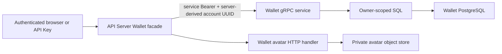

# Wallet Ownership and Custody

## Scope

Wallet Ownership and Custody owns Athena-managed EVM and Solana keypairs,
UUID-account ownership, required wallet remarks, avatar metadata, encrypted
private-key persistence, and the safe Wallet API projection. Every wallet
belongs to exactly one account. Application administrators have no cross-user
Wallet read or write path; their role only gives them module access and they may
manage wallets owned by their own account UUID.

[Wallet Secret Reauthentication](wallet-secret-reauthentication.md) owns the
additional browser proof required before a stored private key is revealed.
[Account Credentials](account-credentials.md) owns the login/API Key distinction
and account UUID. [Account and Wallet Avatar Storage](account-avatar-storage.md) documents
the shared private S3-compatible storage boundary and image validation used by
both account and wallet avatars. Balances, transactions, signing, transfers,
mnemonics, wallet deletion, and blockchain RPC calls are outside this
capability.

## Source Locations

| Concern | Source | Key symbols |
| --- | --- | --- |
| Public safe API | [internal/server/wallet/wallet.proto](../../../internal/server/wallet/wallet.proto), [internal/server/wallet/wallet.go](../../../internal/server/wallet/wallet.go) | `WalletService`, `CreateWallet`, `ImportWallet`, `UpdateWalletRemark`, `UpdateWalletAvatarPreset` |
| Trusted internal API and custody service | [internal/wallet/wallet.proto](../../../internal/wallet/wallet.proto), [internal/wallet/server.go](../../../internal/wallet/server.go), [internal/wallet/service.go](../../../internal/wallet/service.go), [internal/wallet/keys.go](../../../internal/wallet/keys.go) | service Bearer interceptor, `RevealWalletPrivateKey`, key normalization, owner-scoped avatar metadata methods |
| Durable state | [internal/wallet/store/migrations/000001_init.sql](../../../internal/wallet/store/migrations/000001_init.sql), [internal/wallet/store/queries/wallets.sql](../../../internal/wallet/store/queries/wallets.sql), [internal/wallet/store/sql_store.go](../../../internal/wallet/store/sql_store.go) | `wallets`, owner predicates, optimistic revision updates |
| Shared safe model | [pkg/apis/application/v1alpha1/wallet_types.go](../../../pkg/apis/application/v1alpha1/wallet_types.go) | `WalletItem`, `WalletStatus` |
| Public JSON and Swagger generation | [internal/server/wallet/wallet.proto](../../../internal/server/wallet/wallet.proto), [hack/generate-proto.sh](../../../hack/generate-proto.sh), [assets/swagger.json](../../../assets/swagger.json) | Wallet camelCase JSON tags, Wallet-only Swagger normalization |
| Private avatar HTTP boundary | [internal/server/wallet_avatar.go](../../../internal/server/wallet_avatar.go), [internal/server/walletavatarhttp/handler.go](../../../internal/server/walletavatarhttp/handler.go) | upload, authenticated delivery, reset, compensation, garbage collection |
| Browser management surface | [ui/src/app/pages/wallets.tsx](../../../ui/src/app/pages/wallets.tsx), [ui/src/app/shared/services/wallet-service.ts](../../../ui/src/app/shared/services/wallet-service.ts) | card grid, detail drawer, create/import, remark/avatar updates, secret backup/reveal |
| Process configuration | [cmd/athena-wallet/commands/athena_wallet.go](../../../cmd/athena-wallet/commands/athena_wallet.go), [internal/wallet/apiclient](../../../internal/wallet/apiclient) | `ATHENA_WALLET_ENCRYPTION_KEY`, `ATHENA_WALLET_INTERNAL_AUTH_TOKEN`, authenticated Wallet gRPC client |

## Architecture

The public protobuf never accepts an owner UUID, role, ciphertext, object key,
or secret-reveal flag. The API Server derives the authenticated account UUID,
adds it only to the trusted internal request, and its Wallet clientset attaches
the configured service Bearer to every RPC. The Wallet process validates that
credential with a fixed-size constant-time comparison before every non-health
RPC. Internal SQL then repeats the owner predicate for list, get, update, avatar
metadata, and private-key retrieval. Missing and foreign-owner rows therefore
have the same not-found result.

`WalletItem` is safe metadata only: ID, wallet type, address, remark, source,
avatar presentation, revision, and timestamps. Private keys appear only in the
one-time create response or the separately protected native HTTP reveal
response. Import never echoes submitted material.

Wallet HTTP JSON uses the reviewed camelCase field names, including
`walletType`, `privateKey`, `avatarPresetId`, `expectedRevision`, and
`pageSize`. Gogo JSON tags make the standard Gateway decoder authoritative for
request and response bodies. Swagger generation applies the same Wallet-only
naming projection, documents revisions as JSON integers, and removes the path
`id` from PATCH body schemas; protobuf field names remain snake_case on the
wire.

The Wallet service stores ciphertext but never depends on account role.
Application administrator status is deliberately absent from its contract.
Infrastructure operators that possess PostgreSQL contents and the Wallet master
encryption key remain outside the application-admin isolation boundary because
this is a server-custodied design.

## Runtime Flow

1. `ListWallets` and `GetWallet` require Wallet `READ`. The API Server supplies
   the credential's account UUID; the Wallet service returns only matching rows.
   Optional type/query filters and pagination operate inside that owner scope.
2. `CreateWallet` requires a login-session credential plus Wallet
   `READ_WRITE`. It validates a trimmed 1–50-rune remark and optional fixed
   avatar preset, generates a random secp256k1 or Ed25519 keypair, encrypts the
   canonical private-key text, and commits the wallet. The private key is
   returned once beside the safe item.
3. `ImportWallet` has the same credential and metadata requirements. EVM accepts
   one 32-byte hexadecimal scalar with optional `0x`. Solana accepts canonical
   Base58, a JSON byte array, or hexadecimal for a 32-byte seed or verified
   64-byte keypair. Import derives and canonicalizes the address before insert
   and returns no private key.
4. EVM addresses are displayed with EIP-55 checksum casing and indexed through
   lowercase `address_key`. Solana addresses and duplicate keys use canonical
   Base58. Duplicate `(owner, wallet_type, address_key)` inserts return already
   exists without exposing another record.
5. Remark and preset updates require Wallet `READ_WRITE` and an exact positive
   `expectedRevision`. Setting a preset clears uploaded-object metadata; an
   empty preset selects the deterministic default. The committed revision is
   advanced atomically.
6. Wallet avatar upload validates the owner and revision before storing a
   candidate under `wallet-avatars/<sha256(account UUID)>/<random UUID>`. The
   metadata CAS is the live-reference commit point. Replacement commits before
   the previous object is deleted best effort. Reset clears both preset and
   upload metadata and restores the deterministic default.
7. Uploaded-avatar delivery repeats authentication, Wallet `READ`, and owner
   lookup before streaming. Presets and deterministic defaults are rendered
   from bundled UI definitions; only uploaded avatars use the authenticated
   endpoint. A daily collector deletes unreferenced wallet-avatar objects only
   after a 24-hour grace period.
8. `RevealWalletPrivateKey` exists only on the authenticated internal service.
   The native API Server HTTP handler calls it after login-only authorization and
   a valid wallet-secret lease; the Wallet service additionally requires the
   shared internal Bearer. Public gRPC and Swagger do not expose this RPC.

## State / Data

`wallets` has a positive `BIGSERIAL` ID, non-null UUID `owner_account_id`,
`wallet_type` restricted to `EVM` or `SOLANA`, canonical display and lookup
addresses, required remark, source (`created` or `imported`), encrypted private
key, mutually exclusive preset/upload avatar metadata, positive revision, and
timestamps. A check constraint requires uploaded object key, content type,
ETag, and positive size to be either complete or all empty. A preset and upload
cannot coexist.

The table contains no chain, business-purpose type, system-wallet flag,
nullable owner, mnemonic, derivation path, or repository seed. There is no
ownership transfer or delete operation. The current-state migration is intended
for an empty development deployment; schema replacement requires a complete
data reset rather than a historical migration path.

Private-key canonical forms are `0x` plus 64 lowercase hexadecimal digits for
EVM and Base58 of the complete 64-byte Ed25519 keypair for Solana. Ciphertext is
produced by the existing scrypt-derived AES-GCM utility using the process master
key. Plaintext is held only for the current create/import/reveal call and must
not enter logs, metrics, durable audit records, safe models, or avatar state.

## Configuration

| Setting | Behavior |
| --- | --- |
| `ATHENA_WALLET_POSTGRES_DSN` | Wallet-owned PostgreSQL database. |
| `ATHENA_WALLET_ENCRYPTION_KEY` | Required server-side passphrase for private-key encryption/decryption. |
| `ATHENA_WALLET_INTERNAL_AUTH_TOKEN` | Required shared service Bearer, at least 32 bytes. It must be identical in the Wallet and API Server processes and is never accepted from browser clients. |
| `ATHENA_WALLET_LISTEN_ADDRESS` / `--address` | Internal Wallet gRPC bind address; defaults to `127.0.0.1`. Production Compose explicitly uses `0.0.0.0` inside its private network. |
| `ATHENA_WALLET_SERVER_ADDRESS` | API Server internal Wallet target. |
| `ATHENA_ACCOUNT_AVATAR_S3_*` | Shared private S3-compatible bucket and application credential used for account and wallet avatar objects. |
| `ATHENA_ACCOUNT_AVATAR_MAX_BYTES` | Upload limit shared by both avatar surfaces; default and maximum 2 MiB. |

## Invariants

- Every wallet has exactly one canonical UUID owner and is reachable only
  through that owner predicate.
- Administrator role never bypasses wallet ownership.
- Every non-health Wallet internal RPC requires the configured service Bearer;
  caller-supplied owner IDs alone are never a trust boundary.
- API Keys may read safe metadata and, with Wallet `READ_WRITE`, update remark
  and avatar state; they cannot create, import, or reveal private keys.
- Create/import require login or isolated development-session capability.
- Public safe models never contain owner UUID, ciphertext, object key, private
  key, mnemonic, or role.
- Create reveals the canonical private key once; import never echoes it.
- Every mutation uses optimistic revision control.
- External Solana login identity and Athena-managed Solana wallets remain
  independent; neither automatically creates or claims the other.

## Failure Recovery

Missing or shorter-than-32-byte internal authentication configuration prevents
both the Wallet service and API Server Wallet client from starting. A missing or
mismatched RPC Bearer returns unauthenticated before any Wallet handler executes;
standard gRPC health checks remain credential-free.

Invalid input fails before encryption or SQL. Encryption or insert failure
leaves no wallet row; duplicate constraints preserve the original record.
Decryption failure returns no partial secret. PostgreSQL transaction failure
preserves the previous remark/avatar revision.

Avatar object-store failure affects only avatar upload or delivery. Wallet
listing, metadata editing, and secret access remain available, and the UI falls
back to the deterministic avatar. Candidate-write ambiguity is reconciled
against durable metadata before compensation; unresolved candidates remain for
grace-period collection. Garbage collection fails closed when either reference
loading or object listing fails.

## Observability

Wallet service status and gRPC health expose process lifecycle. Logs may include
wallet ID, wallet type, operation stage, and account UUID. They exclude private
keys, ciphertext, encryption keys, the Wallet internal Bearer, avatar bytes, object credentials, external
identity subjects, Session JTIs, and wallet-secret lease values.

## Change Checklist

- [ ] Public and internal Wallet contracts preserve the safe/secret boundary.
- [ ] Every durable query and mutation remains owner scoped without role bypass.
- [ ] Key canonicalization, encryption, duplicate constraints, and remark rules remain current.
- [ ] Avatar validation, CAS, compensation, private delivery, and collection remain current.
- [ ] Create/import/reveal credential restrictions match API Server authorization.
- [ ] UI secret state remains memory-only and is cleared on close, route, account, or permission change.
- [ ] Configuration, reset guidance, and source links match the implementation.
- [ ] The [design index](../README.md) contains the current summary.
