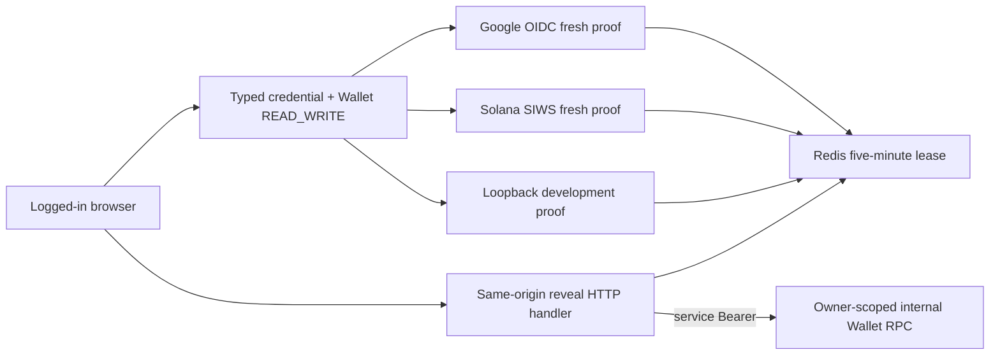

# Wallet Secret Reauthentication

## Scope

Wallet Secret Reauthentication owns the additional identity proof and fixed
five-minute authorization lease required before Athena reveals a custodied
wallet private key. It distinguishes an interactive login session from an API
Key through server-side typed credential metadata, binds reauthentication to the
current account, login JTI, and access revision, and exposes private-key reveal
only as a same-origin native HTTP resource.

[Wallet Ownership and Custody](wallet-ownership.md) owns key encryption,
owner-scoped retrieval, and canonical private-key formats. [Google OIDC
Login](google-oidc-login.md) and [Solana Wallet
Authentication](solana-wallet-authentication.md) own the primary provider
protocols reused for fresh proof. This capability does not create a new Athena
login session, extend the current session, authorize an API Key, or add a public
private-key gRPC method.

## Source Locations

| Concern | Source | Key symbols |
| --- | --- | --- |
| Typed request credential | [internal/accountcredentials/types.go](../../../internal/accountcredentials/types.go), [util/session/credential.go](../../../util/session/credential.go), [util/session/sessionmanager.go](../../../util/session/sessionmanager.go) | `AuthenticatedCredential`, `Capability`, `IsInteractiveLogin`, `WithAuthenticatedCredential`, `AuthenticateToken` |
| Lease state and stable errors | [internal/walletsecret/manager.go](../../../internal/walletsecret/manager.go), [internal/walletsecret/errors.go](../../../internal/walletsecret/errors.go) | `Manager.Issue`, `Manager.Validate`, `Manager.ClearCookie`, `LeaseTTL`, `SetSecretResponseHeaders` |
| Provider-state creation limits | [internal/walletsecret/state_rate_limit.go](../../../internal/walletsecret/state_rate_limit.go) | `CreateRateLimitedState` |
| Same-origin reveal boundary | [internal/server/wallet_secret.go](../../../internal/server/wallet_secret.go), [internal/server/walletsecrethttp/handler.go](../../../internal/server/walletsecrethttp/handler.go) | `authenticateWalletSecretHTTP`, `validWalletSecretOrigin`, `Handler.Reveal` |
| Google reauthentication | [internal/googleoidc/wallet_secret_reauth.go](../../../internal/googleoidc/wallet_secret_reauth.go), [internal/googleoidc/wallet_secret_store.go](../../../internal/googleoidc/wallet_secret_store.go), [internal/googleoidc/handler.go](../../../internal/googleoidc/handler.go) | `WalletSecretReauthentication`, `exchangeAndVerify`, `walletSecretTransactionStore` |
| Solana reauthentication | [internal/phantomauth/wallet_secret_reauth.go](../../../internal/phantomauth/wallet_secret_reauth.go), [internal/phantomauth/wallet_secret_store.go](../../../internal/phantomauth/wallet_secret_store.go) | `WalletSecretChallenge`, `WalletSecretVerify`, `walletSecretChallengeStore` |
| Logout invalidation | [internal/server/logout/logout.go](../../../internal/server/logout/logout.go) | `Handler.ServeHTTP`, `clearWalletSecret` |
| Browser flow and secret cleanup | [ui/src/app/pages/wallets.tsx](../../../ui/src/app/pages/wallets.tsx), [ui/src/app/shared/services/wallet-service.ts](../../../ui/src/app/shared/services/wallet-service.ts) | `WalletWriteSurface`, `WalletSecretModal`, `pendingWalletSecretActionKey`, `WalletService.revealPrivateKey` |
| Process and route wiring | [internal/server/athena-server.go](../../../internal/server/athena-server.go), [internal/server/authz.go](../../../internal/server/authz.go) | `NewServer`, `newHTTPServer`, `interactiveLoginGRPCMethods` |

## Architecture

`SessionManager.AuthenticateToken` returns both ordinary JWT claims and an
`AuthenticatedCredential`. The typed value identifies the account UUID,
credential capability (`login`, `apiKey`, or isolated `development`), JTI,
identity binding, and current access revision. Security-sensitive handlers use
that value instead of inferring credential type from request headers. API Keys
therefore cannot cross either the reauthentication or reveal boundary even when
their account has Wallet `READ_WRITE`.

The opaque lease cookie is only a pointer to Redis state. The stored state binds
one scope to the current login session and current authorization snapshot. A
valid lease may reveal multiple wallets owned by that account during its fixed
lifetime, but every reveal still repeats login-session validation, Wallet
`READ_WRITE`, lease validation, and owner-scoped Wallet retrieval.

## Runtime Flow

1. `POST /api/v1/wallets/{id}:revealPrivateKey` requires the configured exact
   same origin, an Athena login cookie, Wallet `READ_WRITE`, and a valid lease.
   It never accepts an account UUID from the browser. A missing login session or
   API Key returns `WALLET_LOGIN_SESSION_REQUIRED`; a missing, expired, or stale
   lease returns `WALLET_REAUTH_REQUIRED`.
2. A Google account starts `GET /auth/wallet-secrets/google?returnTo=/wallet`.
   The server validates the current login, provider, Wallet permission, and safe
   return path, then stores a one-time five-minute transaction containing PKCE,
   nonce, return path, account UUID, Session JTI digest, access revision, and
   creation time. One Lua operation first enforces the shared wallet-secret
   provider-state limits and then creates the transaction. Its `ws.` state and
   dedicated browser cookie distinguish the transaction from primary login
   while reusing `/auth/google/callback`.
3. Google receives `prompt=select_account` and `max_age=0`. The callback consumes
   the state before exchange, repeats the session binding checks, verifies the
   ID token through the shared OIDC primitive, requires a fresh `auth_time`, and
   compares the verified stable `sub` with the same persisted Google identity.
   Success issues only the wallet-secret lease and returns to the saved path; it
   does not issue or replace the Athena login cookie.
4. A Solana-wallet account posts an empty object to
   `/auth/wallet-secrets/solana/challenge`. The server obtains the address from
   the persisted identity rather than request input and stores a one-time
   five-minute SIWS challenge bound to account UUID, Session JTI digest, and
   access revision through the same atomic provider-state limiter. The statement
   says that the proof authorizes custodial key reveal only and triggers neither
   a blockchain transaction nor a network fee.
5. `/auth/wallet-secrets/solana/verify` validates the exact origin and challenge
   cookie, atomically consumes the challenge, repeats the current login and
   identity bindings, reconstructs the exact message, and verifies a canonical
   raw-base64url 64-byte Ed25519 signature against the persisted address. It
   then issues the same lease used by Google accounts.
6. With authentication disabled, only
   `POST /auth/wallet-secrets/development` is registered. It requires a loopback
   client, a loopback HTTP Origin, the isolated development credential, and
   Wallet `READ_WRITE`. External-authentication mode does not register this
   route.
7. `Manager.Issue` writes an opaque HttpOnly, SameSite=Strict cookie and a Redis
   record with exactly five minutes of TTL. `Manager.Validate` reads without
   extending the TTL and compares account, Session JTI digest, access revision,
   scope, issued time, and expiry.
8. After validation, the HTTP handler invokes the trusted internal
   `RevealWalletPrivateKey` RPC with the server-derived account UUID and wallet
   ID. The API Server Wallet client automatically attaches its service Bearer,
   and the Wallet process rejects the RPC before dispatch unless that Bearer
   matches its configured token. Foreign-owner and absent wallets both remain
   not found. The response is a JSON `{privateKey}` object and is never projected
   into public protobuf or Swagger contracts.
9. Closing the UI modal, changing route, account, or access
   revision, or losing Wallet write access clears React-held private-key state.
   Google navigation stores only `{action, walletId}` in `sessionStorage` and
   consumes it once after return. Logout clears the lease cookie and revokes the
   current login token when possible.

## State / Data

Each Redis lease stores account UUID, SHA-256 digest of the current Session JTI,
positive access revision, the fixed `wallet.private_key.reveal` scope, issued
time, and expiry. The Redis key is itself a SHA-256 digest of a random opaque
cookie value. The lease duration is exactly five minutes and validation never
refreshes either Redis TTL or cookie expiry.

The `athena.wallet-secret.lease` cookie is HttpOnly, SameSite=Strict, Secure
when the configured public origin is HTTPS, and scoped to the configured base
href's `/api/v1/wallets` path. Google reauthentication uses a separate
SameSite=Lax state cookie scoped to `/auth/google`; Solana reauthentication uses
a separate SameSite=Strict challenge cookie scoped to
`/auth/wallet-secrets/solana`. Provider transactions and challenges are also
five-minute, single-use Redis records.

Google transactions and Solana challenges share wallet-secret-only Redis rate
counters: at most 120 provider-state creations globally and 20 for one
authenticated account in each fixed one-minute window. The counters are
independent from primary Google or Solana login traffic. Per-account counter
keys contain a SHA-256 digest instead of the raw account UUID, and state creation
and both counter decisions occur in one Redis Lua operation.

Private keys exist only in Wallet service call memory, the native HTTP response,
and the current React result state. Redis contains no private key, ciphertext,
Google token, Solana signature, or raw Session JTI. Reauthentication and reveal
responses set `Cache-Control: no-store, private`, `Pragma: no-cache`,
`Vary: Cookie, Authorization`, and `Referrer-Policy: no-referrer`.

## Configuration

| Setting | Behavior |
| --- | --- |
| Redis client configuration | Required for Google reauthentication transactions, Solana challenges, and leases. Failure closes all wallet-secret access. |
| `ATHENA_GOOGLE_OIDC_REDIRECT_URI` | Supplies the exact shared Google callback, trusted public origin, and Secure-cookie decision. |
| `ATHENA_GOOGLE_OIDC_CLIENT_ID` and client secret settings | Reused for the fresh Google Authorization Code + PKCE exchange. |
| `ATHENA_SERVER_DISABLE_AUTH` | Replaces external reauthentication routes with the loopback-only development lease endpoint. |
| API Server base href | Restricts the lease cookie to the effective wallet API path. |
| `ATHENA_WALLET_INTERNAL_AUTH_TOKEN` | Required at both the API Server and Wallet process; authenticates every non-health internal Wallet RPC and must contain at least 32 bytes. |

The lease duration, scope, cookie names, provider transaction lifetimes, and
provider-state rate limits and window are fixed implementation constants rather
than environment settings.

## Invariants

- Only an interactive login or isolated loopback development credential may
  obtain or use a wallet-secret lease; API Keys are always rejected.
- Every reveal requires Wallet `READ_WRITE`, exact account ownership, a valid
  current login session, and a matching non-expired lease.
- Administrator role never bypasses wallet ownership or lease validation.
- The reveal adapter can reach Wallet custody only through the authenticated
  internal client; a network caller cannot substitute an account UUID without
  also proving the service Bearer.
- A lease is bound to account UUID, current Session JTI, access revision, and
  the single private-key-reveal scope, and its expiry never slides.
- Google reauthentication requires the same stable persisted `sub` and fresh
  `auth_time`; Solana reauthentication signs for the persisted address and
  accepts no client-supplied replacement address.
- Google and Solana state creation shares one atomic wallet-secret rate budget;
  it does not reuse primary-login counters or expose a raw account UUID in a
  rate key.
- Secret material does not enter public gRPC, Swagger, Redis state, browser
  storage, logs, metrics, or cacheable responses.
- Redis unavailability fails closed for lease issue and validation while leaving
  non-secret Wallet operations available.

## Failure Recovery

Missing, malformed, expired, replayed, or binding-mismatched state and leases
require a new proof. Google and Solana state is consumed before later identity
or signature validation, so a failed callback or verification cannot be
replayed. Redis errors and provider-state rate exhaustion return
`WALLET_REAUTH_UNAVAILABLE`; they never fall back to an in-memory or role-based
authorization path.

Missing or invalid internal service authentication fails before private-key
lookup and does not fall back to the lease or administrator role. The Wallet and
API Server refuse startup when their token is absent or too short; a mismatch
returns unauthenticated for the internal call.

Session revocation blocks the normal login validation even while an old lease
record exists. Any access update changes the revision and invalidates the old
lease immediately. Logout clears the browser lease; any unreferenced Redis
record expires naturally. A Wallet-service or decryption failure returns no
partial private key and does not extend the lease.

## Observability

Google and Solana completion logs identify provider, bounded stage/reason, and
account UUID after authentication. Stable client reasons are
`WALLET_LOGIN_SESSION_REQUIRED`, `WALLET_REAUTH_REQUIRED`, and
`WALLET_REAUTH_UNAVAILABLE`. Logs and metrics exclude private keys, ciphertext,
opaque state and lease values, raw JTIs, identity subjects, SIWS messages,
signatures, Google codes and tokens, or the Wallet internal Bearer. Redis and
provider availability are not folded into Wallet service health.

## Change Checklist

- [ ] Typed credential capability remains the login/API Key decision boundary.
- [ ] Lease account, JTI, revision, scope, and fixed-expiry bindings remain current.
- [ ] Google `sub`/`auth_time` and Solana persisted-address proof remain current.
- [ ] Shared provider-state limits stay atomic, wallet-secret-only, and keyed by
      an account digest rather than a raw UUID.
- [ ] Same-origin native HTTP reveal stays outside public gRPC and Swagger.
- [ ] Secret responses and browser state preserve no-store and cleanup semantics.
- [ ] Logout, revocation, access changes, and Redis failure still fail closed.
- [ ] The [design index](../README.md) contains the current summary.
