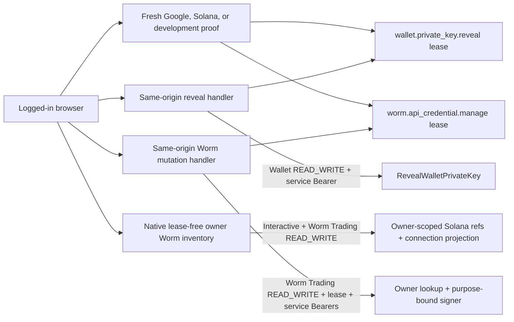

# Wallet Secret and Worm Credential Reauthentication

## Scope

This capability owns two independent additional identity proofs and fixed
five-minute authorization leases: one for revealing a custodied wallet private
key and one for managing one or more Athena-created Worm API credentials. Both
distinguish an interactive login session from an API Key through server-side typed
credential metadata and bind reauthentication to the current account, login
JTI, and access revision. The leases use separate cookies, Redis key namespaces,
scopes, routes, and stable errors; neither lease authorizes the other operation.

[Wallet Ownership and Custody](wallet-ownership.md) owns key encryption,
owner-scoped retrieval, and canonical private-key formats. [Google OIDC
Login](google-oidc-login.md) and [Solana Wallet
Authentication](solana-wallet-authentication.md) own the primary provider
protocols reused for fresh proof. [Worm Trading](../trading/worm-trading.md) owns
credential persistence, official HMAC calls, and connection state. This
capability does not create a new Athena login session, extend the current
session, authorize an API Key, reveal a private key to Worm Trading, or expose
either sensitive operation through public gRPC or Swagger.

## Source Locations

| Concern | Source | Key symbols |
| --- | --- | --- |
| Typed request credential | [internal/accountcredentials/types.go](../../../internal/accountcredentials/types.go), [util/session/credential.go](../../../util/session/credential.go), [util/session/sessionmanager.go](../../../util/session/sessionmanager.go) | `AuthenticatedCredential`, `Capability`, `IsInteractiveLogin`, `WithAuthenticatedCredential`, `AuthenticateToken` |
| Independent lease state and stable errors | [internal/walletsecret/manager.go](../../../internal/walletsecret/manager.go), [internal/walletsecret/errors.go](../../../internal/walletsecret/errors.go) | `NewManager`, `NewWormCredentialManager`, `Manager.Issue`, `Manager.Validate`, `Manager.ClearCookie`, `LeaseTTL`, stable Wallet and Worm reasons |
| Provider-state creation limits | [internal/walletsecret/state_rate_limit.go](../../../internal/walletsecret/state_rate_limit.go) | `CreateRateLimitedState` |
| Sensitive boundaries and Worm inventory | [internal/server/wallet_secret.go](../../../internal/server/wallet_secret.go), [internal/server/walletsecrethttp/handler.go](../../../internal/server/walletsecrethttp/handler.go), [internal/server/worm_connection.go](../../../internal/server/worm_connection.go) | `authenticateWalletSecretHTTP`, `authenticateWormConnectionHTTP`, `validWalletSecretOrigin`, `validWormConnectionOrigin`, `Handler.Reveal`, `listWormWalletConnections`, `manageWormConnection` |
| Google reauthentication | [internal/googleoidc/wallet_secret_reauth.go](../../../internal/googleoidc/wallet_secret_reauth.go), [internal/googleoidc/wallet_secret_store.go](../../../internal/googleoidc/wallet_secret_store.go), [internal/googleoidc/worm_credential_reauth.go](../../../internal/googleoidc/worm_credential_reauth.go), [internal/googleoidc/worm_credential_store.go](../../../internal/googleoidc/worm_credential_store.go) | `WalletSecretReauthentication`, `WormCredentialReauthentication`, `exchangeAndVerify`, separate transaction stores |
| Solana reauthentication | [internal/phantomauth/wallet_secret_reauth.go](../../../internal/phantomauth/wallet_secret_reauth.go), [internal/phantomauth/wallet_secret_store.go](../../../internal/phantomauth/wallet_secret_store.go), [internal/phantomauth/worm_credential_reauth.go](../../../internal/phantomauth/worm_credential_reauth.go), [internal/phantomauth/worm_credential_store.go](../../../internal/phantomauth/worm_credential_store.go) | Wallet and Worm `Challenge`/`Verify` handlers, separate challenge stores and SIWS statements |
| Logout invalidation | [internal/server/logout/logout.go](../../../internal/server/logout/logout.go) | `Handler.ServeHTTP`, `clearSensitiveCookies` |
| Browser flow and cleanup | [ui/src/app/pages/wallets.tsx](../../../ui/src/app/pages/wallets.tsx), [ui/src/app/pages/worm-trading.tsx](../../../ui/src/app/pages/worm-trading.tsx), [ui/src/app/shared/services/wallet-service.ts](../../../ui/src/app/shared/services/wallet-service.ts), [ui/src/app/shared/services/worm-trading-service.ts](../../../ui/src/app/shared/services/worm-trading-service.ts) | Wallet reveal flow, Worm full-account bootstrap, intent-only redirect recovery |
| Process and route wiring | [internal/server/athena-server.go](../../../internal/server/athena-server.go), [internal/server/authz.go](../../../internal/server/authz.go) | `NewServer`, `newHTTPServer`, `interactiveLoginGRPCMethods` |

## Architecture

`SessionManager.AuthenticateToken` returns both ordinary JWT claims and an
`AuthenticatedCredential`. The typed value identifies the account UUID,
credential capability (`login`, `apiKey`, or isolated `development`), JTI,
identity binding, and current access revision. Security-sensitive handlers use
that value instead of inferring credential type from request headers. API Keys
therefore cannot cross either reauthentication or native management boundary
even when their account has Wallet or Worm Trading `READ_WRITE`.

Each opaque lease cookie is only a pointer to its own Redis namespace. Stored
state binds exactly one scope to the current login session and authorization
snapshot. A valid Wallet lease may reveal multiple owned wallets during its
fixed lifetime, and a valid Worm lease may manage multiple owned Solana wallet
connections, but every operation repeats typed-login validation, the appropriate
module requirement, lease validation, and owner-scoped Wallet retrieval. Cookie
path and scope mismatch prevent either manager from accepting the other lease.

The native Worm connection collection GET is a management discovery boundary,
not a lease consumer. It requires an interactive credential and Worm Trading
`READ_WRITE`, derives the current account and Solana filter server-side, and
requires neither a Worm lease nor the mutation Origin header. It returns only
safe connection state and cannot obtain a provider challenge,
invoke Wallet signing, decrypt a Worm credential, or mutate connection state.
The subsequent POST, reconnect POST, and DELETE remain the only lease-authorized
Worm credential operations. Assets exposes DELETE only as exceptional cleanup
for an already incomplete revocation; the native boundary retains its complete
credential-revocation behavior.

## Runtime Flow

1. `POST /api/v1/wallets/{id}:revealPrivateKey` requires the configured exact
   same origin, an Athena login cookie, Wallet `READ_WRITE`, and a valid lease.
   It never accepts an account UUID from the browser. A missing login session or
   API Key returns `WALLET_LOGIN_SESSION_REQUIRED`; a missing, expired, or stale
   lease returns `WALLET_REAUTH_REQUIRED`. That 401 response is an interactive
   step-up challenge, not evidence that the Athena login session is invalid.
   The Wallet browser flow handles it locally, preserves its sensitive-write
   scope, obtains the provider-specific lease, and retries the reveal; global
   session-expiry handling must not log out or unmount the Wallet flow for this
   stable reason.
2. A Google account starts `GET /auth/wallet-secrets/google?returnTo=/wallet`.
   The server validates the current login, provider, Wallet permission, and safe
   return path, then stores a one-time five-minute transaction containing PKCE,
   nonce, return path, account UUID, Session JTI digest, access revision, and
   creation time. One Lua operation first enforces the shared wallet-secret
   provider-state limits and then creates the transaction. Its `ws.` state and
   dedicated browser cookie distinguish the transaction from primary login
   while reusing `/auth/google/callback`.
3. Google receives `prompt=select_account` and `max_age=0`. The callback consumes
   the state before exchange, repeats the session binding checks, verifies the
   ID token through the shared OIDC primitive, requires a fresh `auth_time`, and
   compares the verified stable `sub` with the same persisted Google identity.
   Success issues only the wallet-secret lease and returns to the saved path; it
   does not issue or replace the Athena login cookie.
4. A Solana-wallet account posts an empty object to
   `/auth/wallet-secrets/solana/challenge`. The server obtains the address from
   the persisted identity rather than request input and stores a one-time
   five-minute SIWS challenge bound to account UUID, Session JTI digest, and
   access revision through the same atomic provider-state limiter. The statement
   says that the proof authorizes custodial key reveal only and triggers neither
   a blockchain transaction nor a network fee.
5. `/auth/wallet-secrets/solana/verify` validates the exact origin and challenge
   cookie, atomically consumes the challenge, repeats the current login and
   identity bindings, reconstructs the exact message, and verifies a canonical
   raw-base64url 64-byte Ed25519 signature against the persisted address. It
   then issues the same lease used by Google accounts.
6. With authentication disabled, only
   `POST /auth/wallet-secrets/development` is registered. It requires a loopback
   client, a loopback HTTP Origin, the isolated development credential, and
   Wallet `READ_WRITE`. External-authentication mode does not register this
   route.
7. `Manager.Issue` writes an opaque HttpOnly, SameSite=Strict cookie and a Redis
   record with exactly five minutes of TTL. `Manager.Validate` reads without
   extending the TTL and compares account, Session JTI digest, access revision,
   scope, issued time, and expiry.
8. After validation, the HTTP handler invokes the trusted internal
   `RevealWalletPrivateKey` RPC with the server-derived account UUID and wallet
   ID. The API Server Wallet client automatically attaches its service Bearer,
   and the Wallet process rejects the RPC before dispatch unless that Bearer
   matches its configured token. Foreign-owner and absent wallets both remain
   not found. The response is a JSON `{privateKey}` object and is never projected
   into public protobuf or Swagger contracts.
9. Closing the UI modal, changing route, account, or access
   revision, or losing Wallet write access clears React-held private-key state.
   Google navigation stores only `{action, walletId}` in `sessionStorage` and
   consumes it once after return.
10. Full-account Worm connection discovery starts at native
    `GET /api/v1/worm-trading/wallet-connections`. It accepts only pagination,
    requires an interactive Athena login and Worm Trading `READ_WRITE`, and
    derives the owner, Solana type, wallet IDs, and addresses server-side. It
    requires no Worm lease or Origin header because it only projects safe
    connection state and cannot reach credential creation or Wallet signing.
    API Keys cannot invoke this management-only inventory.
11. Worm credential mutations use native
    `POST|DELETE /api/v1/worm-trading/wallet-connections/{walletId}` resources.
    Connect and reconnect use POST, with reconnect expressed by the fixed
    `:reconnect` suffix. Every mutation requires exact origin, an interactive
    Athena login, Worm Trading `READ_WRITE`, the independent Worm lease, and an
    owner-scoped Solana Wallet row. `WORM_TRADING_LOGIN_SESSION_REQUIRED` and
    `WORM_TRADING_REAUTH_REQUIRED` remain local step-up reasons rather than
    global session-expiry signals.
12. A Google Worm proof begins at
    `GET /auth/worm-trading/google?returnTo=/worm-trading`. It uses a separate
    `wc.` state value, cookie, and five-minute Redis transaction while sharing
    the normal callback and verified OIDC primitive. `prompt=select_account`,
    `max_age=0`, fresh `auth_time`, stable persisted `sub`, account, Session JTI
    digest, and access revision must all match. Success issues only the Worm
    lease and returns to the saved page.
13. A Solana Worm proof uses
    `/auth/worm-trading/solana/challenge` and `/verify`. The server accepts no
    address, derives the persisted login address, and issues a separate
    single-use SIWS challenge whose statement authorizes Worm API credential
    management only and explicitly excludes transactions and fees. Verification
    consumes its dedicated cookie and Redis state, repeats account/session/
    revision/identity checks, and verifies the exact raw-base64url Ed25519
    signature before issuing the Worm lease.
14. Disabled-auth mode registers the independent loopback-only
    `POST /auth/worm-trading/development` route. It requires the isolated
    development credential, Worm Trading `READ_WRITE`, a loopback client, and
    the exact `Origin: http://localhost:4000`; external-auth mode does not
    register it.
15. After Worm lease validation, the API Server performs Wallet ownership
    lookup, internally obtains and checks Worm Trading's exact credential
    challenge, invokes Wallet's purpose-bound signer, validates the returned
    signature encoding, compares the message digest, and completes the
    credential operation. Wallet returns no address field; it validates the
    server-supplied expected address against its owner-scoped row. The provider
    challenge, Wallet signature, Worm API key, and Worm secret never reach the
    browser.
16. Assets uses one Worm proof for its serial full-account connection batch. A
    valid lease admits successive owned-wallet mutations until its fixed expiry;
    an expired lease pauses before the next mutation and requires another
    explicit page-level proof. Google navigation stores only
    `{kind: "auto-connect"}`, `{kind: "reconnect", walletId}`, or
    `{kind: "cleanup", walletId}` and rebuilds an automatic queue from
    authoritative inventory after return. It never stores a queue or retries a
    mutation automatically. Logout clears both lease cookies before revoking
    the login token; an access revision change
    invalidates both Redis records on their next validation and aborts browser
    continuation.

## State / Data

Each Redis lease stores account UUID, SHA-256 digest of the current Session JTI,
positive access revision, exactly one of `wallet.private_key.reveal` or
`worm.api_credential.manage`, issued time, and expiry. The Redis key is itself a
SHA-256 digest of a random opaque cookie value under a scope-specific prefix.
The lease duration is exactly five minutes and validation never refreshes either
Redis TTL or cookie expiry.

The `athena.wallet-secret.lease` cookie is HttpOnly, SameSite=Strict, Secure
when the configured public origin is HTTPS, and scoped to the configured base
href's `/api/v1/wallets` path. The independent
`athena.worm-trading.lease` cookie has the same protections and is scoped to
`/api/v1/worm-trading`. Each capability has a separate SameSite=Lax Google state
cookie under `/auth/google` and a separate SameSite=Strict Solana challenge
cookie under its own auth route. Provider transactions and challenges are
five-minute, single-use Redis records with distinct key prefixes.

Wallet and Worm Google transactions and Solana challenges share one sensitive-
proof Redis rate counter: at most 120 provider-state creations globally and 20 for one
authenticated account in each fixed one-minute window. The counters are
independent from primary Google or Solana login traffic. Per-account counter
keys contain a SHA-256 digest instead of the raw account UUID, and state creation
and both counter decisions occur in one Redis Lua operation.

Private keys exist only in Wallet service call memory, the reveal HTTP response,
and the current React result state. Official Worm credential challenges are
durable only in Worm Trading's connection-attempt store; the corresponding
custody signature exists only in trusted service-call memory. Neither reaches
browser storage. The step-up SIWS message is deliberately returned to the
browser and stored in its one-time Redis record, but its signature is not.
Redis contains no private key, custody ciphertext, Worm API key or secret,
Google token, Solana signature, or raw Session JTI. Reauthentication and
sensitive-operation responses set
`Cache-Control: no-store, private`, `Pragma: no-cache`,
`Vary: Cookie, Authorization`, and `Referrer-Policy: no-referrer`.

The browser holds an automatic connection queue only in the mounted Assets
page. The Worm-specific `sessionStorage` record is an intent-only discriminated
value for full-account automatic connection, one manual reconnect, or one
exceptional cleanup; it never contains the inventory, credentials, lease,
proof, or connection result and is consumed once after Google returns.

## Configuration

| Setting | Behavior |
| --- | --- |
| Redis client configuration | Required for both scopes' Google transactions, Solana challenges, and leases. Failure closes private-key reveal and Worm credential mutations without disabling Wallet metadata, Worm management inventory, or read-only Worm activity. |
| `ATHENA_GOOGLE_OIDC_REDIRECT_URI` | Supplies the exact shared Google callback, trusted public origin, and Secure-cookie decision. |
| `ATHENA_GOOGLE_OIDC_CLIENT_ID` and client secret settings | Reused for the fresh Google Authorization Code + PKCE exchange. |
| `ATHENA_SERVER_DISABLE_AUTH` | Replaces external reauthentication routes with separate loopback-only development lease endpoints. Worm credential mutations additionally fix their accepted Origin to `http://localhost:4000`. |
| API Server base href | Restricts each lease cookie to its effective native API path. |
| `ATHENA_WALLET_INTERNAL_AUTH_TOKEN` | Required at both the API Server and Wallet process; authenticates private-key reveal and purpose-bound Worm signing RPCs and must contain at least 32 bytes. |
| `ATHENA_WORM_TRADING_INTERNAL_AUTH_TOKEN` | Authenticates the API Server's connection inventory, prepare, complete, disconnect, and activity calls to Worm Trading; it is separate from the lease and Wallet Bearer. |

The lease duration, scope, cookie names, provider transaction lifetimes, and
provider-state rate limits and window are fixed implementation constants rather
than environment settings.

## Invariants

- Only an interactive login or isolated loopback development credential may
  obtain or use either sensitive lease; API Keys are always rejected.
- Every reveal requires Wallet `READ_WRITE`, exact account ownership, a valid
  current login session, and a matching non-expired lease.
- Every Worm connection mutation requires Worm Trading `READ_WRITE`, an owned
  Solana wallet, exact origin, a valid current login session, and the matching
  non-expired Worm-only lease. Disabled-auth Worm management accepts only
  `http://localhost:4000` as that Origin.
- Worm connection inventory requires an interactive credential, Worm Trading
  `READ_WRITE`, and current-account Solana ownership, but no lease or Origin
  header; it cannot mutate a connection or invoke the purpose-bound signer.
- Administrator role never bypasses wallet ownership or lease validation.
- The reveal adapter can reach Wallet custody only through the authenticated
  internal client; a network caller cannot substitute an account UUID without
  also proving the service Bearer.
- Each lease is bound to account UUID, current Session JTI, access revision, and
  exactly one scope. Scope, cookie, path, and Redis namespace separation prevent
  Wallet reveal and Worm management from authorizing each other, and expiry
  never slides.
- Google reauthentication requires the same stable persisted `sub` and fresh
  `auth_time`; Solana reauthentication signs for the persisted address and
  accepts no client-supplied replacement address.
- Google and Solana state creation for both scopes shares one atomic sensitive-
  proof rate budget; it does not reuse primary-login counters or expose a raw
  account UUID in a rate key.
- Private keys, official Worm credential challenges and signatures, and Worm
  HMAC credentials do not enter public gRPC, Swagger, Redis state, browser
  storage, logs, metrics, or cacheable responses.
- Redis unavailability fails closed for lease issue and validation while leaving
  non-secret Wallet operations, the connection inventory, and already connected
  read-only Worm activity independent.

## Failure Recovery

Missing, malformed, expired, replayed, scope-mismatched, or binding-mismatched
state and leases require a new proof. Google and Solana state is consumed before
later identity or signature validation, so a failed callback or verification
cannot be replayed. Redis errors and provider-state rate exhaustion return the
scope-specific `WALLET_REAUTH_UNAVAILABLE` or
`WORM_TRADING_REAUTH_UNAVAILABLE`; they never fall back to an in-memory,
cross-scope, API-Key, or role-based authorization path.

Missing or invalid internal service authentication fails before private-key
lookup, purpose-bound signing, or Worm connection work and does not fall back to
a lease or administrator role. Wallet, Worm Trading, and API Server validate
their independent Bearers; a mismatch returns unauthenticated for the internal
call.

Session revocation blocks normal login validation even while either old lease
record exists. Any access update changes the revision and invalidates both old
leases immediately. Logout clears both browser cookies; unreferenced Redis
records expire naturally. A Wallet-service or decryption failure returns no
partial private key or Worm signature and does not extend a lease. Failure after
the Worm lease has admitted an operation follows Worm Trading's durable
connection and revocation state machine rather than issuing another lease or
automatically retrying credential creation. Full-account bootstrap pauses when
the lease expires and requires one explicit new proof before rebuilding its
remaining work from authoritative inventory; it never stores or blindly
replays the prior queue. A failed connect or reconnect
attempt restores its prior connection state but recomputes the warning across
all retained credentials: `REVOCATION_REQUIRED` takes priority, otherwise any
non-active old credential yields `CREDENTIAL_REVOCATION_PENDING`, so repeated
reauthentication and reconnect attempts cannot hide a key that may still have
remote trading authority. Worm Trading's 30-second maintenance
loop expires abandoned connection attempts, processes reconnect-retired
`PENDING_REVOCATION` rows, and recovers a `REVOKING` row only when its connection
is `CONNECTED` and it has remained stale for one Worm attempt timeout. An
explicit cleanup that remains `DISCONNECTING` or `REVOCATION_REQUIRED`,
including its `REVOKING` credential, is retried only when the user confirms
`Retry credential cleanup`. `CONNECT_OUTCOME_UNKNOWN` blocks connect,
reconnect, and disconnect until an operator manually reconciles the uncertain
remote result.

## Observability

Wallet-secret Google and Solana completion logs identify provider, bounded
stage/reason, and account UUID after authentication. Worm-credential proof logs
contain provider and bounded stage/reason but omit the account UUID. Wallet
stable client reasons are
`WALLET_LOGIN_SESSION_REQUIRED`, `WALLET_REAUTH_REQUIRED`, and
`WALLET_REAUTH_UNAVAILABLE`; Worm management uses the corresponding
`WORM_TRADING_LOGIN_SESSION_REQUIRED`, `WORM_TRADING_REAUTH_REQUIRED`, and
`WORM_TRADING_REAUTH_UNAVAILABLE` reasons. Logs and metrics exclude private
keys, ciphertext, opaque state and lease values, raw JTIs, identity subjects,
SIWS messages, Worm challenge messages, signatures, Google codes and tokens,
Worm credentials, or internal Bearers. Redis and identity-provider availability
are not folded into Wallet or Worm Trading service health.

## Change Checklist

- [ ] Typed credential capability remains the login/API Key decision boundary.
- [ ] Both leases' account, JTI, revision, distinct scope/cookie/path, and fixed-expiry bindings remain current.
- [ ] Google `sub`/`auth_time` and Solana persisted-address proof remain current.
- [ ] Shared provider-state limits stay atomic, sensitive-proof-only, and keyed by
      an account digest rather than a raw UUID.
- [ ] Same-origin native HTTP reveal stays outside public gRPC and Swagger.
- [ ] Native Worm inventory stays interactive, `READ_WRITE`, owner scoped,
      lease-free, and outside public gRPC/Swagger; every mutation remains
      Worm-lease-only.
- [ ] Secret responses and browser state preserve no-store and cleanup semantics.
- [ ] Logout, revocation, access changes, and Redis failure still fail closed.
- [ ] The [design index](../README.md) contains the current summary.
