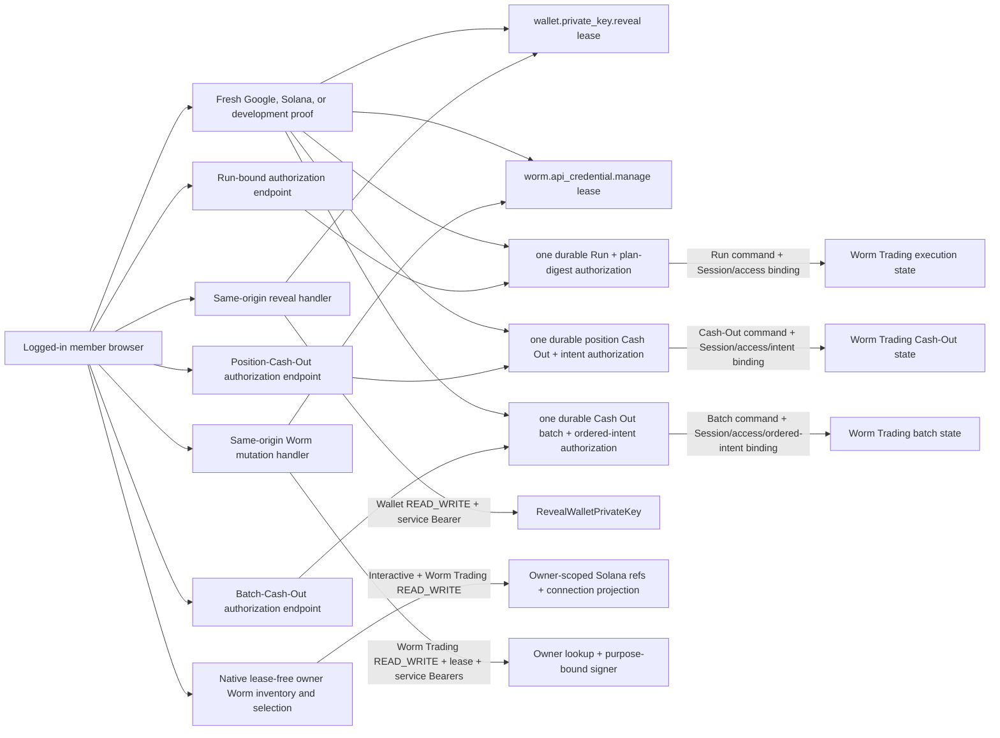

# Wallet Secret and Worm Credential Reauthentication

> 设计状态：已实现

## Scope

This capability owns five independent additional identity-proof boundaries.
Wallet private-key reveal and Athena-created Worm API-credential management use
separate fixed five-minute authorization leases. A live Worm order Execution
instead records one durable authorization for one immutable Run and plan digest;
its short-lived Google or Solana provider state is not a lease and the durable
authorization has no time TTL. An Assets position Cash Out records a separate
durable authorization for one immutable HMAC-position intent; its proof state,
pre-authorization window, and post-authorization pre-dispatch window are each
five minutes, and successful proof queues work without a Start action. A
Wallet-major Assets Cash-Out batch uses a fifth scope bound to its complete
ordered position digest; a changed Session JTI or access revision requires a
fresh batch proof before a paused batch can continue. All five distinguish an interactive login
session from an API Key through server-side typed credential metadata and bind
proof to the current account, login JTI, and access revision. Their cookies,
Redis namespaces, routes, stable errors, and persisted scopes are independent,
so none authorizes either of the other operations. They are member-application
capabilities: normal authentication always selects `athena.token.member`, and an
administrator persona or `athena.token.admin` cannot enter them.

[Wallet Ownership and Custody](wallet-ownership.md) owns key encryption,
owner-scoped retrieval, and canonical private-key formats. [Google OIDC
Login](google-oidc-login.md) and [Solana Wallet
Authentication](solana-wallet-authentication.md) own the primary provider
protocols reused for fresh proof. [Worm Trading](../trading/worm-trading.md) owns
credential persistence, official HMAC calls, and connection state. This
capability does not create a new Athena login session, extend the current
session, authorize an API Key, reveal a private key to Worm Trading, or expose
any sensitive operation through public gRPC or Swagger. [Worm Order
Execution](../trading/worm-order-execution.md) owns the authorized Run state,
coordinator, Web JWT mutation flow, and terminal reconciliation.
[Worm Position Cash Out](../trading/worm-position-cash-out.md) owns the exact-
position HMAC Close, durable attempt, observation, and Run/Cash-Out isolation.
[Worm Position Cash Out Batches](../trading/worm-position-cash-out-batches.md)
owns ordered batch execution, balance gates, and batch Wallet locks.

## Source Locations

| Concern | Source | Key symbols |
| --- | --- | --- |
| Typed request credential and realm selection | [internal/accountcredentials/types.go](../../../internal/accountcredentials/types.go), [internal/server/application_realm.go](../../../internal/server/application_realm.go), [util/session/credential.go](../../../util/session/credential.go), [util/session/sessionmanager.go](../../../util/session/sessionmanager.go) | `ApplicationRealmMember`, `authenticateRealmLoginCookie`, `AuthenticatedCredential`, `Capability`, `IsInteractiveLogin`, `WithAuthenticatedCredential`, `AuthenticateToken` |
| Independent lease state and stable errors | [internal/walletsecret/manager.go](../../../internal/walletsecret/manager.go), [internal/walletsecret/errors.go](../../../internal/walletsecret/errors.go) | `NewManager`, `NewWormCredentialManager`, `Manager.Issue`, `Manager.Validate`, `Manager.ClearCookie`, `LeaseTTL`, stable Wallet and Worm reasons |
| Lease-free selection and lease-bound reconciliation | [internal/server/worm_wallet_selection.go](../../../internal/server/worm_wallet_selection.go), [internal/server/worm_connection.go](../../../internal/server/worm_connection.go), [internal/wormtrading/wallet_selections.go](../../../internal/wormtrading/wallet_selections.go), [internal/wormtrading/worm_connections.go](../../../internal/wormtrading/worm_connections.go) | owner selection GET/replace, `InspectWalletSelectionCandidates`, selected-only connect, retirement-only disconnect, 20-slot admission |
| Provider-state creation limits | [internal/walletsecret/state_rate_limit.go](../../../internal/walletsecret/state_rate_limit.go) | `CreateRateLimitedState` |
| Sensitive boundaries and Worm inventory | [internal/server/wallet_secret.go](../../../internal/server/wallet_secret.go), [internal/server/walletsecrethttp/handler.go](../../../internal/server/walletsecrethttp/handler.go), [internal/server/worm_connection.go](../../../internal/server/worm_connection.go) | `authenticateWalletSecretHTTP`, `authenticateWormConnectionHTTP`, `validWalletSecretOrigin`, `validWormConnectionOrigin`, `Handler.Reveal`, `listWormWalletConnections`, `manageWormConnection` |
| Google reauthentication | [internal/googleoidc/wallet_secret_reauth.go](../../../internal/googleoidc/wallet_secret_reauth.go), [internal/googleoidc/wallet_secret_store.go](../../../internal/googleoidc/wallet_secret_store.go), [internal/googleoidc/worm_credential_reauth.go](../../../internal/googleoidc/worm_credential_reauth.go), [internal/googleoidc/worm_credential_store.go](../../../internal/googleoidc/worm_credential_store.go) | `WalletSecretReauthentication`, `WormCredentialReauthentication`, `exchangeAndVerify`, separate transaction stores |
| Solana reauthentication | [internal/phantomauth/wallet_secret_reauth.go](../../../internal/phantomauth/wallet_secret_reauth.go), [internal/phantomauth/wallet_secret_store.go](../../../internal/phantomauth/wallet_secret_store.go), [internal/phantomauth/worm_credential_reauth.go](../../../internal/phantomauth/worm_credential_reauth.go), [internal/phantomauth/worm_credential_store.go](../../../internal/phantomauth/worm_credential_store.go) | Wallet and Worm `Challenge`/`Verify` handlers, separate challenge stores and SIWS statements |
| Run-bound Google proof | [internal/googleoidc/worm_execution_authorization.go](../../../internal/googleoidc/worm_execution_authorization.go), [internal/googleoidc/worm_execution_store.go](../../../internal/googleoidc/worm_execution_store.go) | `WormExecutionAuthorization`, `wex.` state, fresh OIDC transaction, durable-authorizer callback |
| Run-bound Solana proof | [internal/phantomauth/worm_execution_authorization.go](../../../internal/phantomauth/worm_execution_authorization.go), [internal/phantomauth/worm_execution_store.go](../../../internal/phantomauth/worm_execution_store.go) | `WormExecutionChallenge`, `WormExecutionVerify`, plan-digest SIWS statement, single-use challenge |
| Run-bound development proof and projection | [internal/server/worm_execution_authorization.go](../../../internal/server/worm_execution_authorization.go), [internal/server/athena-server.go](../../../internal/server/athena-server.go) | `developmentWormExecutionAuthorization`, `authorizeWormExecutionProof`, stable execution-auth errors and route wiring |
| Position-Cash-Out Google proof | [internal/googleoidc/worm_position_cash_out_authorization.go](../../../internal/googleoidc/worm_position_cash_out_authorization.go), [internal/googleoidc/worm_position_cash_out_store.go](../../../internal/googleoidc/worm_position_cash_out_store.go) | `WormPositionCashOutAuthorization`, `wco.` state, intent-bound five-minute OIDC transaction |
| Position-Cash-Out Phantom proof | [internal/phantomauth/worm_position_cash_out_authorization.go](../../../internal/phantomauth/worm_position_cash_out_authorization.go), [internal/phantomauth/worm_position_cash_out_store.go](../../../internal/phantomauth/worm_position_cash_out_store.go) | `WormPositionCashOutChallenge`, `WormPositionCashOutVerify`, identity-only SIWS statement, single-use challenge |
| Position-Cash-Out development proof and projection | [internal/server/worm_position_cash_out_authorization.go](../../../internal/server/worm_position_cash_out_authorization.go), [internal/server/worm_position_cash_outs.go](../../../internal/server/worm_position_cash_outs.go), [internal/server/athena-server.go](../../../internal/server/athena-server.go) | `developmentWormPositionCashOutAuthorization`, `authorizeWormPositionCashOutProof`, stable Cash-Out proof errors and route wiring |
| Batch-Cash-Out proof and projection | [internal/googleoidc/worm_position_cash_out_batch_authorization.go](../../../internal/googleoidc/worm_position_cash_out_batch_authorization.go), [internal/phantomauth/worm_position_cash_out_batch_authorization.go](../../../internal/phantomauth/worm_position_cash_out_batch_authorization.go), [internal/server/worm_position_cash_out_batch_authorization.go](../../../internal/server/worm_position_cash_out_batch_authorization.go), [internal/server/worm_position_cash_out_batches.go](../../../internal/server/worm_position_cash_out_batches.go) | independent Google/Phantom/development state, `WORM_POSITION_CASH_OUT_BATCH`, intent-bound authorization, credential-bound Continue admission |
| Logout invalidation | [internal/server/logout/logout.go](../../../internal/server/logout/logout.go) | `Handler.ServeHTTP`, `clearSensitiveCookies` |
| Browser flow and cleanup | [ui/src/app/member/pages/wallets.tsx](../../../ui/src/app/member/pages/wallets.tsx), [ui/src/app/member/pages/worm-trading.tsx](../../../ui/src/app/member/pages/worm-trading.tsx), [ui/src/app/shared/services/wallet-service.ts](../../../ui/src/app/shared/services/wallet-service.ts), [ui/src/app/shared/services/worm-trading-service.ts](../../../ui/src/app/shared/services/worm-trading-service.ts) | Wallet reveal flow, persisted Worm-selection reconciliation, Run and position-Cash-Out intent-only redirect recovery |
| Process and route wiring | [internal/server/athena-server.go](../../../internal/server/athena-server.go), [internal/server/authz.go](../../../internal/server/authz.go) | `NewServer`, `newHTTPServer`, `interactiveLoginGRPCMethods` |

## Architecture

`SessionManager.AuthenticateToken` returns both ordinary JWT claims and an
`AuthenticatedCredential`. The typed value identifies the account UUID,
credential capability (`login`, `apiKey`, or isolated `development`), JTI,
identity binding, and current access revision. Security-sensitive handlers use
that value instead of inferring credential type from request headers. API Keys
therefore cannot cross either reauthentication or native management boundary
even when their account has Wallet or Worm Trading `READ_WRITE`.

The member application sends `X-Athena-Application-Realm: member` on native
requests; provider-start GETs additionally carry the validated
`athenaRealm=member` query required by their browser navigation boundary. The
server selects only `athena.token.member` and verifies that its account is not an
administrator. The independent `athena.token.admin` cookie may coexist but is
never a fallback for these capabilities.

Each opaque lease cookie is only a pointer to its own Redis namespace. Stored
state binds exactly one scope to the current login session and authorization
snapshot. A valid Wallet lease may reveal multiple owned wallets during its
fixed lifetime, and a valid Worm lease may manage multiple owned Solana wallet
connections, but every operation repeats typed-login validation, the appropriate
module requirement, lease validation, and owner-scoped Wallet retrieval. Cookie
path and scope mismatch prevent either manager from accepting the other lease.

The native Worm connection collection and owner selection GET/PUT are management
boundaries, not lease consumers. They require an interactive credential; selection
GET requires Worm Trading `READ`, while inventory and selection replacement
require `READ_WRITE`. Each derives the current account and Solana filter
server-side and requires no Worm lease; selection replacement alone requires
exact Origin because it mutates durable desired state. Reads return only safe
connection/selection state and cannot obtain a provider challenge, invoke
Wallet signing, or mutate connection state. Inventory removal inspection may
decrypt an active Worm credential only inside Worm Trading for complete,
read-only HMAC exposure checks; plaintext never reaches the API Server or browser.
The subsequent selected-Wallet connect/reconnect, acknowledged regenerate, and
retirement disconnect forms remain the only lease-authorized Worm credential
operations. DELETE is admitted only for a durable retirement, including retry
of an incomplete revocation. The first revocation dispatch follows a fresh
provider exposure inspection. A retry from durable `DISCONNECTING` or
`REVOCATION_REQUIRED` resumes stored credential cleanup without trying to reuse
the no-longer-active HMAC credential for that inspection. The
regenerate form is narrower still: it is admitted only for
`RECONNECT_REQUIRED` plus `CONNECT_OUTCOME_UNKNOWN`, creates a new credential,
and deliberately does not list or revoke the unknown remote key.

Live execution authorization is intentionally not another reusable Worm lease.
The browser proves the account's persisted Google or Phantom identity, or the
loopback development capability, for an exact Run revision. Worm Trading stores
the resulting proof kind, Session JTI digest, access revision, and authorization
time against the Run whose versioned `plan_digest` is already frozen. The
authorization remains associated with that Run until its terminal state, but a
changed Session, account, or access revision prevents control and requires a
new proof before continuation. It never authorizes a different Run, changes the
frozen wallets, markets, directions, or funds, or grants Worm credential
management.

Position Cash Out uses a fourth namespace and scope rather than either Worm
lease or Run proof. Its fresh provider state binds one operation UUID, command
UUID, expected revision, current account, Session-JTI digest, access revision,
and immutable position-intent digest. Worm Trading stores scope
`WORM_POSITION_CASH_OUT` with proof kind and the same binding, then atomically
queues that exact operation. The durable authorization has a five-minute
pre-dispatch window: it cannot authorize another position, another operation,
credential management, Run execution, or Wallet secret reveal. Phantom signs
only the proof's SIWS identity message; the HMAC Close needs no custodial
private-key signature and no network fee.

Batch Cash Out has a fifth, independent provider namespace and durable scope.
Its immutable digest covers the complete Wallet-major position order produced
by the authoritative build. One proof queues the whole batch; individual child
positions do not request separate browser proofs. A paused batch may continue
under the same Session-JTI/access binding. If either binding changed, the
Native API projects `AUTHORIZE_BATCH` and rejects `Continue` until a new proof
supersedes the prior authorization for the unchanged batch intent.

## Runtime Flow

1. `POST /api/v1/wallets/{id}:revealPrivateKey` requires the configured exact
   same origin, the member realm and `athena.token.member`, Wallet `READ_WRITE`,
   and a valid lease.
   It never accepts an account UUID from the browser. A missing login session or
   API Key returns `WALLET_LOGIN_SESSION_REQUIRED`; a missing, expired, or stale
   lease returns `WALLET_REAUTH_REQUIRED`. That 401 response is an interactive
   step-up challenge, not evidence that the Athena login session is invalid.
   The Wallet browser flow handles it locally, preserves its sensitive-write
   scope, obtains the provider-specific lease, and retries the reveal; global
   session-expiry handling must not log out or unmount the Wallet flow for this
   stable reason.
2. A Google member account starts
   `GET /auth/wallet-secrets/google?athenaRealm=member&returnTo=/wallet`.
   The server validates the fixed realm, current member login, provider, Wallet
   permission, and safe member-application return path, then stores a one-time five-minute
   transaction containing PKCE, nonce, return path, account UUID, Session JTI
   digest, access revision, and creation time. One Lua operation first enforces
   the shared wallet-secret provider-state limits and then creates the
   transaction. Its `ws.` state and dedicated browser cookie distinguish the
   transaction from primary login while reusing `/auth/google/callback`.
3. Google receives `prompt=select_account` and `max_age=0`. The full-page callback
   cannot retain the initiating request header, so it restores the fixed
   `member` realm from the scoped flow before selecting `athena.token.member`.
   It consumes the state before exchange, repeats the session binding checks,
   verifies the ID token through the shared OIDC primitive, requires a fresh
   `auth_time`, and compares the verified stable `sub` with the same persisted
   member Google identity. Success issues only the wallet-secret lease and
   returns to the saved path; it does not issue or replace either Athena login
   cookie.
4. A Solana-wallet account posts an empty object to
   `/auth/wallet-secrets/solana/challenge`. The server obtains the address from
   the persisted identity rather than request input and stores a one-time
   five-minute SIWS challenge bound to account UUID, Session JTI digest, and
   access revision through the same atomic provider-state limiter. The statement
   says that the proof authorizes custodial key reveal only and triggers neither
   a blockchain transaction nor a network fee.
5. `/auth/wallet-secrets/solana/verify` validates the exact origin and challenge
   cookie, atomically consumes the challenge, repeats the current login and
   identity bindings, reconstructs the exact message, and verifies a canonical
   raw-base64url 64-byte Ed25519 signature against the persisted address. It
   then issues the same lease used by Google accounts.
6. With authentication disabled, only
   `POST /auth/wallet-secrets/development` is registered. It requires a loopback
   client, a loopback HTTP Origin, the isolated development credential, and
   Wallet `READ_WRITE`. External-authentication mode does not register this
   route.
7. `Manager.Issue` writes an opaque HttpOnly, SameSite=Strict cookie and a Redis
   record with exactly five minutes of TTL. `Manager.Validate` reads without
   extending the TTL and compares account, Session JTI digest, access revision,
   scope, issued time, and expiry.
8. After validation, the HTTP handler invokes the trusted internal
   `RevealWalletPrivateKey` RPC with the server-derived account UUID and wallet
   ID. The API Server Wallet client automatically attaches its service Bearer,
   and the Wallet process rejects the RPC before dispatch unless that Bearer
   matches its configured token. Foreign-owner and absent wallets both remain
   not found. The response is a JSON `{privateKey}` object and is never projected
   into public protobuf or Swagger contracts.
9. Closing the UI modal, changing route, account, or access
   revision, or losing Wallet write access clears React-held private-key state.
   Google navigation stores only `{action, walletId}` in `sessionStorage` and
   consumes it once after return.
10. Full-account Worm connection discovery starts at native
    `GET /api/v1/worm-trading/wallet-connections`. It accepts only pagination,
    requires an interactive Athena login and Worm Trading `READ_WRITE`, and
    derives the owner, Solana type, wallet IDs, and addresses server-side. It
    requires no Worm lease or Origin header because it only projects safe
    connection state and cannot reach credential creation or Wallet signing.
    API Keys cannot invoke this management-only inventory.
11. Worm credential mutations use native
    `POST|DELETE /api/v1/worm-trading/wallet-connections/{walletId}` resources.
    Connect, reconnect, and regenerate use POST, with the latter two expressed
    by the fixed `:reconnect` and `:regenerate` suffixes. Every mutation requires
    exact origin, an interactive Athena login, Worm Trading `READ_WRITE`, the
    independent Worm lease, and an owner-scoped Solana Wallet row. Regenerate
    additionally requires
    `{"acknowledgeUnknownCredentialMayRemain":true}` and is rejected unless the
    durable connection is `RECONNECT_REQUIRED` with
    `CONNECT_OUTCOME_UNKNOWN`. The acknowledgement accepts that Athena cannot
    list or revoke an earlier key whose creation result is unknown.
    `WORM_TRADING_LOGIN_SESSION_REQUIRED` and
    `WORM_TRADING_REAUTH_REQUIRED` remain local step-up reasons rather than
    global session-expiry signals.
12. A Google Worm proof begins at
    `GET /auth/worm-trading/google?athenaRealm=member&returnTo=/worm-trading`.
    It validates the member realm and uses a separate
    `wc.` state value, cookie, and five-minute Redis transaction while sharing
    the normal callback and verified OIDC primitive. `prompt=select_account`,
    `max_age=0`, fresh `auth_time`, stable persisted `sub`, account, Session JTI
    digest, and access revision must all match. Its callback restores the member
    realm before authenticating the member cookie. Success issues only the Worm
    lease and returns to the saved page.
13. A Solana Worm proof uses
    `/auth/worm-trading/solana/challenge` and `/verify`. The server accepts no
    address, derives the persisted login address, and issues a separate
    single-use SIWS challenge whose statement authorizes Worm API credential
    management only and explicitly excludes transactions and fees. Verification
    consumes its dedicated cookie and Redis state, repeats account/session/
    revision/identity checks, and verifies the exact raw-base64url Ed25519
    signature before issuing the Worm lease.
14. Disabled-auth mode registers the independent loopback-only
    `POST /auth/worm-trading/development` route. It requires the isolated
    development credential, Worm Trading `READ_WRITE`, a loopback client, and
    the exact `Origin: http://localhost:4000`; external-auth mode does not
    register it.
15. After Worm lease validation, the API Server performs Wallet ownership
    lookup, internally obtains and checks Worm Trading's exact credential
    challenge, invokes Wallet's purpose-bound signer, validates the returned
    signature encoding, compares the message digest, and completes the
    credential operation. Wallet returns no address field; it validates the
    server-supplied expected address against its owner-scoped row. The provider
    challenge, Wallet signature, Worm API key, and Worm secret never reach the
    browser. After Worm Trading dispatches credential creation, it completes the
    provider call and local persistence under its own bounded context; loss of
    the browser request does not cancel that already-issued provider mutation.
16. Assets uses one Worm proof for serial reconciliation of the persisted
    zero-through-20 Wallet selection. A
    valid lease admits successive owned-wallet mutations until its fixed expiry;
    an expired lease pauses before the next mutation and requires another
    explicit page-level proof. Google navigation stores only
    `{kind: "reconcile-selection"}`, `{kind: "reconnect", walletId}`,
    `{kind: "regenerate", walletId}`, or `{kind: "cleanup", walletId}` and
    rebuilds removal-first work from the authoritative selection, retirements,
    and inventory after return. It never stores a queue or retries a
    mutation automatically. Member-realm logout clears both lease cookies before
    revoking the member login token; admin-realm logout leaves the member session
    and leases untouched. An access revision change
    invalidates both Redis records on their next validation and aborts browser
    continuation.
17. A live Run in `AWAITING_AUTHORIZATION` exposes `AUTHORIZE` only to an
    interactive Worm Trading `READ_WRITE` credential. The proof request binds
    canonical Run and command UUIDs, positive expected Run revision, account,
    SHA-256 Session JTI digest, current positive access revision, and the Run's
    already-frozen plan digest. API Keys cannot begin, finish, or consume this
    proof.
18. Google authorization begins at
    `GET /auth/worm-trading/executions/google` with `athenaRealm=member`,
    `runId`, `commandId`, `expectedRevision`, and a Run-detail `returnTo`. The
    server stores a single-use five-minute PKCE/nonce transaction under a `wex.`
    state, applies a provider-specific 120-global/20-account fixed-minute
    creation limit, and requests `prompt=select_account` with `max_age=0`.
19. The shared Google callback recognizes the `wex.` namespace, restores the
    fixed member realm, consumes the state before exchange, repeats the member
    login, account, Session, access-revision, provider, stable `sub`, and fresh
    `auth_time` checks, and sends only the verified non-secret binding to the Run
    authorizer. Success persists the Run authorization and redirects back; it
    neither issues a lease nor changes either Athena login cookie.
20. Phantom authorization uses
    `POST /auth/worm-trading/executions/{runId}/solana/challenge` and `/verify`.
    The challenge handler performs a fresh owner-scoped Run lookup, rejects a
    stale expected revision, obtains the immutable plan digest, and constructs a
    single-use five-minute SIWS message for the persisted login address. Its
    statement names the Run and plan digest and discloses that Athena signs the
    original Worm transaction while the 10-USDC request limit is not a
    cryptographic on-chain spend limit. Verify consumes the challenge, repeats
    all bindings, and validates the canonical raw-base64url Ed25519 signature
    before persisting authorization.
21. Disabled-auth mode registers only the loopback, exact-origin
    `POST /auth/worm-trading/executions/{runId}/development` proof. It accepts a
    command UUID and expected revision, uses the isolated development
    credential, and records proof kind `DEVELOPMENT`; external-auth mode does
    not register this endpoint.
22. A successful proof calls `AuthorizeExecutionRun` with a CAS command. The
    durable authorization stores no provider token, OIDC code, SIWS message, or
    signature. It is scoped to that Run rather than a wall-clock TTL. Start,
    Continue, Heartbeat, and Execute Next validate both the current interactive
    credential and authorization binding; a stale Session or access revision
    pauses progression until another explicit proof succeeds. Safety
    Pause/Terminate and read-only Reconcile still require interactive
    `READ_WRITE`, exact origin, owner, and Run revision but do not treat a stale
    execution proof as authority to progress.
23. Google navigation stores only `{runId}` under the execution-specific
    `sessionStorage` key so the Run detail can refresh once after return. The
    Phantom signature exists only for the verification request, and the browser
    never receives the custodial Wallet sign-in message, Worm JWT, raw
    transaction, transaction signature, or signed transaction.
24. A write-capable Assets user first creates one durable position Cash Out
    from the exact HMAC position pubkey. Creation freezes the fresh provider-
    derived Wallet, market, side, shares, creation time, optional request pubkey,
    and intent digest and returns `AWAITING_AUTHORIZATION` with a five-minute
    deadline. The operation exposes `AUTHORIZE_CASH_OUT`; API Keys cannot begin,
    complete, read, or consume its proof.
25. Google Cash-Out authorization begins through a hidden same-origin
    `POST /auth/worm-trading/position-cash-outs/google` with
    `athenaRealm=member`, operation and command UUIDs, expected revision, and a
    safe Assets return path as query bindings. The handler accepts only POST and
    requires `Origin` to exactly match the configured public origin before it
    creates state. It uses dedicated `wco.` state, cookie, Redis keys, PKCE and
    nonce, five-minute lifetime, and 120-global/20-account fixed-minute creation
    limits. The shared callback consumes state before exchange, repeats account,
    member Session, access revision, provider identity, fresh `auth_time`, and
    intent/revision descriptor checks, then authorizes only that operation.
26. Phantom uses
    `POST /auth/worm-trading/position-cash-outs/{id}/solana/challenge` and
    `/verify`. Challenge creation reloads the operation descriptor and returns a
    dedicated five-minute SIWS message for the persisted login address. The
    statement identifies the operation and intent digest and says explicitly
    that it is identity confirmation only, not a blockchain transaction or
    network-fee authorization. Verify consumes the challenge, repeats every
    owner/Session/access/revision/intent/identity binding, and checks the
    canonical raw-base64url Ed25519 signature.
27. Disabled-auth mode registers only the loopback exact-origin
    `POST /auth/worm-trading/position-cash-outs/{id}/development` proof.
    Successful Google, Phantom, or development proof atomically stores scope
    `WORM_POSITION_CASH_OUT`, proof kind, Session-JTI digest, access revision,
    and intent digest and changes the operation to `QUEUED`. A service worker
    begins automatically; there is no Start action. The authorization permits
    preflight and one at-most-once HMAC Close only for five minutes.
28. Google navigation stores only a bounded, deduplicated list of at most 100
    Cash-Out operation UUIDs under its own `sessionStorage` key. Return reloads
    every durable resource so Pending or Unknown work from different Wallets
    can recover together; terminal, HTTP 403, and HTTP 404 entries are removed
    individually. No target, proof material, HMAC request, or mutation is
    restored or replayed by the browser. Expired/cancelled proof sends no Close,
    and manual `Check status` after an unknown mutation is read-only.
29. After a batch `BUILDING` worker freezes its complete ordered position set,
    `AWAITING_AUTHORIZATION` exposes `AUTHORIZE_BATCH`. Google starts at the
    batch-specific same-origin POST route; Phantom uses the batch UUID's own
    challenge/verify routes; disabled-auth uses only the loopback development
    route. Each flow reloads the immutable batch descriptor and binds owner,
    Session digest, access revision, expected revision, and full intent digest.
30. Successful proof stores scope `WORM_POSITION_CASH_OUT_BATCH` and queues the
    batch without a Start action. It authorizes serial child creation but does
    not relax each child's durable no-replay checkpoint. The child HMAC Close
    requires no Wallet signature and does not consume the proof protocol state.
31. When a balance gate pauses the batch, a matching current Session/access
    binding may issue `Continue`. A changed binding projects
    `AUTHORIZE_BATCH`; the server rejects Continue and requires a new proof for
    the same immutable batch. Google redirect recovery stores only the batch
    UUID and reloads `/active`; no command or mutation is restored.

## State / Data

Each Redis lease stores account UUID, SHA-256 digest of the current Session JTI,
positive access revision, exactly one of `wallet.private_key.reveal` or
`worm.api_credential.manage`, issued time, and expiry. The Redis key is itself a
SHA-256 digest of a random opaque cookie value under a scope-specific prefix.
The lease duration is exactly five minutes and validation never refreshes either
Redis TTL or cookie expiry.

The `athena.wallet-secret.lease` cookie is HttpOnly, SameSite=Strict, Secure
when the configured public origin is HTTPS, and scoped to the configured base
href's `/api/v1/wallets` path. The independent
`athena.worm-trading.lease` cookie has the same protections and is scoped to
the base href's `/api/v1/worm-trading` path. Each capability has a separate
SameSite=Lax Google state cookie under the deployment-relative `/auth/google`
path and a separate SameSite=Strict Solana challenge cookie under its own
deployment-relative auth route. Provider transactions and challenges are five-
minute, single-use Redis records with distinct key prefixes.

These lease and proof cookies belong to the member realm but are separate from
the deployment-root login cookie. `athena.token.member` authenticates the
account and Session to which they bind; `athena.token.admin` is neither read nor
changed. Scoped Google transactions do not need to store a caller-controlled
realm because their entry query must be `member` and their callbacks restore
that fixed realm before login-cookie authentication.

Wallet and Worm Google transactions and Solana challenges share one sensitive-
proof Redis rate counter: at most 120 provider-state creations globally and 20 for one
authenticated account in each fixed one-minute window. The counters are
independent from primary Google or Solana login traffic. Per-account counter
keys contain a SHA-256 digest instead of the raw account UUID, and state creation
and both counter decisions occur in one Redis Lua operation.

Private keys exist only in Wallet service call memory, the reveal HTTP response,
and the current React result state. Official Worm credential challenges are
durable only in Worm Trading's connection-attempt store; the corresponding
custody signature exists only in trusted service-call memory. Neither reaches
browser storage. The step-up SIWS message is deliberately returned to the
browser and stored in its one-time Redis record, but its signature is not.
Redis contains no private key, custody ciphertext, Worm API key or secret,
Google token, Solana signature, or raw Session JTI. Reauthentication and
sensitive-operation responses set
`Cache-Control: no-store, private`, `Pragma: no-cache`,
`Vary: Cookie, Authorization`, and `Referrer-Policy: no-referrer`.

The browser holds selection-reconciliation progress only in the mounted Assets
page. The Worm-specific `sessionStorage` record is an intent-only discriminated
value for current-selection reconciliation, one manual reconnect, one
confirmed outcome-unknown regenerate, or one retirement cleanup; it never
contains the risk acknowledgement, inventory, credentials, lease, proof, or
connection result and is consumed once after Google returns. Regenerate asks
for a fresh confirmation after every failure before the browser sends its
required acknowledgement.

Execution Google transactions and Phantom challenges use their own five-minute,
single-use Redis records, state/challenge cookies, and 120-global/20-account
fixed-minute counters. They contain Run, command, expected revision, account,
Session-JTI digest, access revision, safe return path, and provider protocol
material; the Phantom record also contains the immutable plan digest and the
wallet-visible SIWS message. Redis state is deleted on consume and is not the
authorization. The durable Run authorization is stored in Worm Trading
PostgreSQL with proof kind and the Session/access binding and has no renewable
lease cookie or TTL.

The execution-specific browser `sessionStorage` value contains only the Run ID
needed to refresh after Google returns. It does not contain the plan, coordinator
token, proof transaction, SIWS signature, Worm JWT, transaction, Wallet
signature, or mutation result.

Position-Cash-Out Google transactions and Phantom challenges use another pair
of five-minute, single-use Redis namespaces, cookies, and 120-global/20-account
fixed-minute counters. They bind operation UUID, command UUID, expected
revision, account, Session-JTI digest, access revision, safe Assets return path,
intent digest, and provider protocol material. The `wco.` Google state and the
Cash-Out Solana challenge cookie cannot be consumed by Run, Wallet-secret, or
Worm-credential flows. State is deleted on consume and is not authorization.

The durable Cash-Out authorization lives in Worm Trading PostgreSQL with scope
`WORM_POSITION_CASH_OUT`, proof kind, Session-JTI digest, access revision,
intent digest, active/end state, and timestamps. It is attached to exactly one
operation and ends on completion, failure, or pre-dispatch expiry. The operation
has five minutes to await proof and, after proof, five minutes to reach a safe
dispatch checkpoint. Neither record contains Google tokens/codes, SIWS message
or signature, Wallet private key, Worm HMAC credential, or provider Close body.

Batch-Cash-Out Google transactions and Phantom challenges use the separate
`wcob.` state namespace, batch-specific cookies and routes, and scope
`WORM_POSITION_CASH_OUT_BATCH`. They bind the batch UUID and full ordered intent
digest rather than one position UUID. Their Redis records are five-minute,
single-use proof protocol state; the durable PostgreSQL authorization is the
only permission to queue or reauthorize the immutable batch. The browser keeps
only the batch UUID in its own `sessionStorage` key for redirect recovery.

The Cash-Out-specific browser `sessionStorage` value contains only a bounded,
deduplicated list of at most 100 operation UUIDs needed to recover different
Wallets after Google navigation. Terminal, forbidden, and missing operations
are pruned individually. It contains no Wallet or position snapshot, expected
revision, command, intent digest, provider proof, HMAC credential, request, or
result.

## Configuration

| Setting | Behavior |
| --- | --- |
| Redis client configuration | Required for both leases and for Wallet, Worm-credential, Run, and position-Cash-Out Google transactions or Solana challenges. Failure closes private-key reveal, Worm credential mutations, and new Run/Cash-Out provider proofs without deleting an already durable authorization or disabling safe reads. |
| `ATHENA_GOOGLE_OIDC_REDIRECT_URI` | Supplies the exact shared Google callback, trusted public origin, and Secure-cookie decision. |
| `ATHENA_GOOGLE_OIDC_CLIENT_ID` and client secret settings | Reused for the fresh Google Authorization Code + PKCE exchange. |
| `ATHENA_SERVER_DISABLE_AUTH` | Replaces external reauthentication routes with separate loopback-only development lease endpoints. Worm credential mutations additionally fix their accepted Origin to `http://localhost:4000`. |
| API Server base href | Restricts each lease cookie to its effective native API path. |
| `ATHENA_WALLET_INTERNAL_AUTH_TOKEN` | Required at both the API Server and Wallet process; authenticates private-key reveal and purpose-bound Worm signing RPCs and must contain at least 32 bytes. |
| `ATHENA_WORM_TRADING_INTERNAL_AUTH_TOKEN` | Authenticates the API Server's connection inventory, prepare, complete, disconnect, and activity calls to Worm Trading; it is separate from the lease and Wallet Bearer. |

The lease duration, scope, cookie names, provider transaction lifetimes, and
provider-state rate limits and window are fixed implementation constants rather
than environment settings. A Run authorization deliberately has no independent
TTL; its scope and usable lifetime derive from the immutable Run and current
Session/access binding.
Cash-Out provider state, its initial authorization window, and its authorized
pre-dispatch window are each fixed to five minutes. Unlike a Run proof, the
Cash-Out durable authorization therefore ends if its exact mutation has not
been safely dispatched within that second window.

## Invariants

- Only an interactive login or isolated loopback development credential may
  obtain or use either sensitive lease; API Keys are always rejected.
- Every reveal requires Wallet `READ_WRITE`, exact account ownership, a valid
  current login session, and a matching non-expired lease.
- Every Worm connection mutation requires Worm Trading `READ_WRITE`, an owned
  Solana wallet, exact origin, a valid current login session, and the matching
  non-expired Worm-only lease. Disabled-auth Worm management accepts only
  `http://localhost:4000` as that Origin.
- Automatic selection reconciliation and ordinary connect, reconnect, disconnect, and cleanup
  cannot clear `CONNECT_OUTCOME_UNKNOWN`. Only the dedicated regenerate form may
  proceed, and only after an interactive user explicitly acknowledges that the
  unknown remote credential may remain active and will not be listed or revoked.
- Worm connection inventory requires an interactive credential, Worm Trading
  `READ_WRITE`, and current-account Solana ownership, but no lease or Origin
  header; it cannot mutate a connection or invoke the purpose-bound signer.
- Reading or revision-CAS replacing the zero-through-20 desired selection does
  not consume a Worm lease. Applying it does: every credential creation or
  revocation still requires the current Worm-only lease, exact origin, selected
  or retiring membership, and owner-scoped Solana validation.
- Administrator role never bypasses wallet ownership or lease validation.
- Every proof and sensitive operation authenticates the member realm and exact
  member cookie. A coexisting administrator session cannot obtain or consume a
  lease, and its logout cannot clear member leases.
- Provider and Solana proof return targets are restricted to non-admin member
  paths; success or failure cannot cross into `/admin/*`.
- The reveal adapter can reach Wallet custody only through the authenticated
  internal client; a network caller cannot substitute an account UUID without
  also proving the service Bearer.
- Each lease is bound to account UUID, current Session JTI, access revision, and
  exactly one scope. Scope, cookie, path, and Redis namespace separation prevent
  Wallet reveal and Worm management from authorizing each other, and expiry
  never slides.
- Google reauthentication requires the same stable persisted `sub` and fresh
  `auth_time`; Solana reauthentication signs for the persisted address and
  accepts no client-supplied replacement address.
- Google and Solana state creation for both scopes shares one atomic sensitive-
  proof rate budget; it does not reuse primary-login counters or expose a raw
  account UUID in a rate key.
- Private keys, official Worm credential challenges and signatures, and Worm
  HMAC credentials do not enter public gRPC, Swagger, Redis state, browser
  storage, logs, metrics, or cacheable responses.
- Live execution authorization is exact-Run and plan-digest scoped, persists no
  provider secret, and is never accepted as either five-minute lease. Every
  progression command requires the same account, interactive Session-JTI
  digest, current access revision, permission, and optimistic Run revision;
  safety-stop and read-only reconciliation commands cannot advance execution.
- Google and Phantom execution proof state is single use and five minutes; the
  durable Run authorization is not a sliding lease and cannot authorize a
  different Run or change frozen execution intent.
- The Phantom execution statement and UI disclose the Worm transaction trust
  boundary and the difference between the requested 10-USDC funds cap and an
  independently verified on-chain spending limit.
- Position Cash Out proof is exact-operation and intent scoped, persists no
  provider secret, and is accepted as neither sensitive lease nor Run
  authorization. Its proof and authorized pre-dispatch windows are fixed to
  five minutes, never slide, and cannot change the provider-derived Wallet,
  HMAC pubkey, market, side, creation time, or request pubkey. Shares remain a
  creation-time confirmation/display snapshot and are not a subsequent
  provider-identity invariant or Close quantity.
- Google Cash-Out proof state can be created only by same-origin POST after an
  exact server-side `Origin` comparison.
- Cash-Out Phantom proof signs only the persisted login identity message. It
  cannot expose or use an Athena-managed Wallet private key, sign a transaction,
  produce a fee, dispatch HMAC Close, or authorize a different position.
- Google, Phantom, and development Cash-Out proof atomically queue the durable
  operation. Browser navigation and `sessionStorage` recover only a bounded list
  of operation UUIDs and can never act as mutation authorization or replay Close.
- Redis unavailability fails closed for lease issue and validation while leaving
  non-secret Wallet operations, the connection inventory, and already connected
  read-only Worm activity independent. It also blocks new Run/Cash-Out provider
  proofs without erasing their existing PostgreSQL operations.

## Failure Recovery

Missing, malformed, expired, replayed, scope-mismatched, or binding-mismatched
state and leases require a new proof. Google and Solana state is consumed before
later identity or signature validation, so a failed callback or verification
cannot be replayed. Redis errors and provider-state rate exhaustion return the
scope-specific `WALLET_REAUTH_UNAVAILABLE` or
`WORM_TRADING_REAUTH_UNAVAILABLE`; they never fall back to an in-memory,
cross-scope, API-Key, or role-based authorization path.

Execution Google or Phantom state that is missing, expired, consumed, stale,
rate-limited, provider-mismatched, or no longer bound to the Run revision also
requires a new explicit proof. Its stable errors are
`WORM_EXECUTION_LOGIN_SESSION_REQUIRED`,
`WORM_EXECUTION_AUTHORIZATION_REQUIRED`, and
`WORM_EXECUTION_AUTHORIZATION_UNAVAILABLE`. A provider-proof failure never
creates a partial Run authorization, falls back to the general Worm lease, or
starts execution. Redis loss prevents a new provider proof but does not erase a
durable Run authorization already stored in PostgreSQL.

Cash-Out Google or Phantom state follows the same consume-before-exchange or
consume-before-signature rule in its own namespace. Missing, expired, replayed,
rate-limited, provider-mismatched, Session/access-mismatched, revision-stale, or
intent-stale proof returns
`WORM_POSITION_CASH_OUT_LOGIN_SESSION_REQUIRED`,
`WORM_POSITION_CASH_OUT_AUTHORIZATION_REQUIRED`, or
`WORM_POSITION_CASH_OUT_AUTHORIZATION_UNAVAILABLE` and leaves Close
undispatched. It cannot fall back to the Worm credential lease or Run proof.
The durable operation expires after five minutes without proof. Successful
proof queues it atomically even when the browser loses the response; the
operation GET is the recovery path. If exact preflight cannot safely dispatch
within the next five minutes, the authorization ends and the operation fails
without Close. Once a durable attempt is dispatched, proof expiry cannot permit
another mutation and all recovery is exact-position GET only.

Missing or invalid internal service authentication fails before private-key
lookup, purpose-bound signing, or Worm connection work and does not fall back to
a lease or administrator role. Wallet, Worm Trading, and API Server validate
their independent Bearers; a mismatch returns unauthenticated for the internal
call.

Session revocation blocks normal login validation even while either old lease
record exists. Any access update changes the revision and invalidates both old
leases immediately. Member-realm logout clears both lease cookies and revokes
only `athena.token.member`; unreferenced Redis records expire naturally.
Admin-realm logout revokes only `athena.token.admin` and does not clear or revoke
the member session or its leases. A Wallet-service or decryption failure returns
no partial private key or Worm signature and does not extend a lease. Failure after
the Worm lease has admitted an operation follows Worm Trading's durable
connection and revocation state machine rather than issuing another lease or
automatically retrying credential creation. Selection reconciliation pauses
when the lease expires and requires one explicit new proof before rebuilding
its removal-first work from authoritative selection, retirements, and inventory;
it never stores or blindly
replays the prior queue. A failed connect or reconnect
attempt restores its prior connection state but recomputes the warning across
all retained credentials: `REVOCATION_REQUIRED` takes priority, otherwise any
non-active old credential yields `CREDENTIAL_REVOCATION_PENDING`, so repeated
reauthentication and reconnect attempts cannot hide a key that may still have
remote trading authority. Worm Trading's 30-second maintenance
loop expires abandoned connection attempts, processes reconnect-retired
`PENDING_REVOCATION` rows, and recovers a `REVOKING` row only when its connection
is `CONNECTED` and it has remained stale for one Worm attempt timeout. An
explicit cleanup that remains `DISCONNECTING` or `REVOCATION_REQUIRED`,
including its `REVOKING` credential, is retried only when the user confirms
`Retry credential cleanup`. `CONNECT_OUTCOME_UNKNOWN` blocks automatic
selection reconciliation and ordinary connect, reconnect, and disconnect. A confirmed
regenerate uses the same lease and owner/signing boundary to create and store a
new key while accepting that the unknown remote key may remain active. A
cancelled or failed proof leaves the lock untouched. Every prepared regenerate
failure, including challenge expiry, signing failure, service restart, and
another indeterminate result, restores the same outcome-unknown state and
requires a fresh user confirmation; success alone marks the connection
`CONNECTED`. Process startup drains inherited `PREPARED` and `COMPLETING`
attempts before serving, so restart recovery does not wait for provider
challenge expiry.

For a live Run, Session revocation, account replacement, permission-revision
change, or loss of `READ_WRITE` stops new coordinator commands and requires a
fresh proof after access is restored. This does not re-open completed Steps,
repeat Open or Finalize, or discard a mutation whose outcome is still being
reconciled. Termination ends remaining work but cannot clear a wallet-market
isolation created by an unknown mutation result.

For a position Cash Out, the current Session/access binding is checked while
creating and consuming proof, but the service-owned worker executes the queued
immutable operation independently of browser lifetime. Session loss after proof
does not cancel an already dispatched Close. It also cannot authorize a second
Close: durable attempt state and Wallet isolation remain authoritative through
restart, and user `Check status` performs only read-only reconciliation.

## Observability

Wallet-secret Google and Solana completion logs identify provider, bounded
stage/reason, and account UUID after authentication. Worm-credential proof logs
contain provider and bounded stage/reason but omit the account UUID. Wallet
stable client reasons are
`WALLET_LOGIN_SESSION_REQUIRED`, `WALLET_REAUTH_REQUIRED`, and
`WALLET_REAUTH_UNAVAILABLE`; Worm management uses the corresponding
`WORM_TRADING_LOGIN_SESSION_REQUIRED`, `WORM_TRADING_REAUTH_REQUIRED`, and
`WORM_TRADING_REAUTH_UNAVAILABLE` reasons. Logs and metrics exclude private
keys, ciphertext, opaque state and lease values, raw JTIs, identity subjects,
SIWS messages, Worm challenge messages, signatures, Google codes and tokens,
Worm credentials, or internal Bearers. Redis and identity-provider availability
are not folded into Wallet or Worm Trading service health.
Execution-proof logs add only provider and bounded stage/reason. Public Run
projections expose proof kind, authorization state, and safe timestamps but not
the Session JTI digest, access binding, Google transaction, SIWS message or
signature, coordinator token, Worm JWT, raw transaction, or custodial
signature.
Cash-Out proof logs likewise expose only provider and bounded stage/reason.
Public operation projections may show proof kind and safe authorization/
execution times, but never Session-JTI or intent digests, access binding,
Google state/code/token, Phantom message/signature, HMAC credential/header, or
raw Close response. Its stable proof reasons are the three
`WORM_POSITION_CASH_OUT_*` values above. Proof dependencies do not change
Wallet or Worm Trading health.

## Change Checklist

- [ ] Typed credential capability remains the login/API Key decision boundary.
- [ ] Both leases' account, JTI, revision, distinct scope/cookie/path, and fixed-expiry bindings remain current.
- [ ] Run authorization remains separate from both leases and stays bound to one immutable Run, plan digest, account, Session JTI digest, and access revision.
- [ ] Position Cash Out authorization remains separate from both leases and Run proof, exact-operation/intent/session/access bound, and limited to its five-minute pre-dispatch window.
- [ ] Google Cash-Out proof start remains a same-origin POST with exact server-side Origin validation.
- [ ] Google `sub`/`auth_time` and Solana persisted-address proof remain current.
- [ ] Shared provider-state limits stay atomic, sensitive-proof-only, and keyed by
      an account digest rather than a raw UUID.
- [ ] Same-origin native HTTP reveal stays outside public gRPC and Swagger.
- [ ] Native Worm inventory stays interactive, `READ_WRITE`, owner scoped,
      lease-free, and outside public gRPC/Swagger; every mutation remains
      Worm-lease-only.
- [ ] Selection GET/replace remains lease-free and revisioned, while removal-first
      credential revocation and selected-Wallet connection consume only the
      Worm-specific lease and never exceed 20 managed connections.
- [ ] Secret responses and browser state preserve no-store and cleanup semantics.
- [ ] Execution Google and Solana proof state remains single-use, five-minute, provider-specific, rate-limited, and free of durable provider secrets.
- [ ] Execution proof disclosure, stable errors, and no-TTL durable authorization match the Run state machine.
- [ ] Cash-Out Google/Solana proof state remains single-use, five-minute, independently namespaced and rate-limited, while development proof stays loopback/exact-origin only.
- [ ] Cash-Out Phantom disclosure remains identity-only with no transaction, fee, Wallet key, or HMAC Close dispatch in the proof handler.
- [ ] Member-only realm restoration, dual-login-cookie isolation, current-realm logout, revocation, access changes, and Redis failure still fail closed.
- [ ] The [design index](../README.md) contains the current summary.
