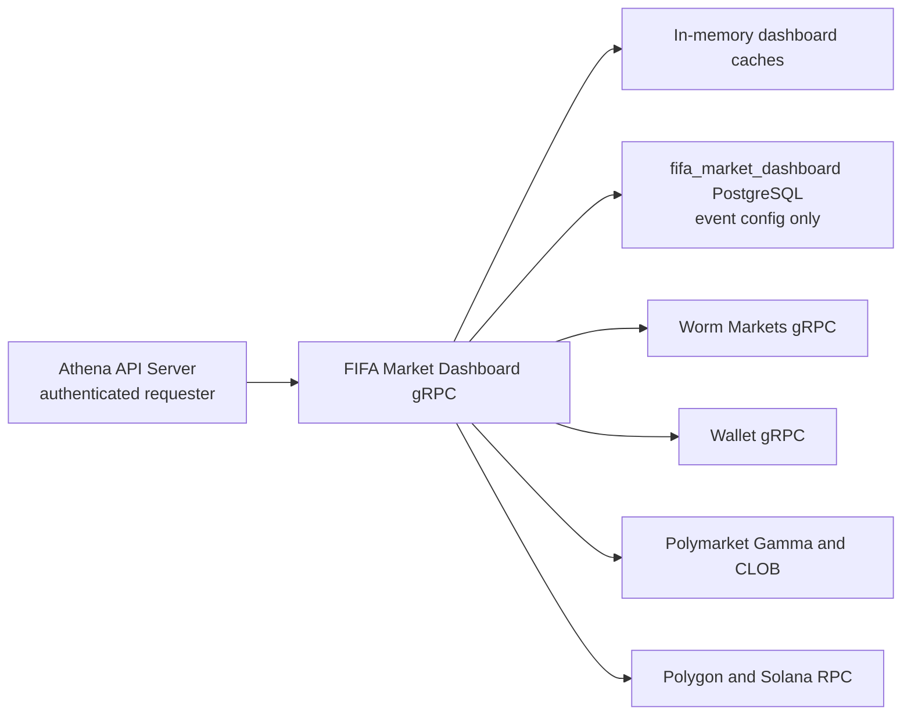

# FIFA Market Dashboard

## Scope

FIFA Market Dashboard owns the configured pairing of one Worm event and one
Polymarket FIFA event, the cached combined market view, two monitored treasury
token balances, and requester-scoped Solana wallet holdings. It exposes one
read RPC and one event-configuration update RPC, while the Athena API Server
publishes them at `/api/v1/fifa-market-dashboard` and supplies the authenticated
requester identity used for wallet access. The facade read requires FIFA Market
Dashboard `READ`; its configuration update requires that same module's
`READ_WRITE`.

The service does not synchronize the Worm market catalog, persist wallets, send
notifications, or own generic Polymarket discovery. Worm event detail comes
from the independent [Worm Markets](worm-markets.md) gRPC service. Wallet
selection comes from Athena Wallet, while Polymarket Gamma/CLOB and Polygon and
Solana JSON-RPC endpoints are direct external read dependencies.

## Source Locations

| Concern | Source | Key symbols |
| --- | --- | --- |
| Binary dispatch | [cmd/main.go](../../../cmd/main.go) | `main`, `ATHENA_BINARY_NAME` dispatch |
| Process composition and configuration | [cmd/athena-fifa-market-dashboard/commands/athena-fifa-market-dashboard.go](../../../cmd/athena-fifa-market-dashboard/commands/athena-fifa-market-dashboard.go) | `NewCommand`, `rpcURLHost` |
| gRPC lifecycle and health | [internal/fifamarketdashboard/server.go](../../../internal/fifamarketdashboard/server.go) | `Server`, `ServerOpts`, `Start`, `Stop` |
| Service lifecycle and cache state | [internal/fifamarketdashboard/service.go](../../../internal/fifamarketdashboard/service.go) | `Service`, `NewService`, `Start`, `FIFAWalletBalanceConfig` |
| Dashboard composition and configuration | [internal/fifamarketdashboard/fifa_dashboard.go](../../../internal/fifamarketdashboard/fifa_dashboard.go) | `GetFIFAMarketDashboard`, `UpdateFIFAEventConfig`, `refreshFIFADashboard`, `applyConfig` |
| Polymarket FIFA moneyline adapter | [internal/fifamarketdashboard/fifa_moneyline.go](../../../internal/fifamarketdashboard/fifa_moneyline.go) | `getFIFAMoneylineEvent`, `buildFIFAMoneylineOptions`, `hydrateFIFAMoneylineQuotes` |
| Fixed treasury balances | [internal/fifamarketdashboard/fifa_wallet_balances.go](../../../internal/fifamarketdashboard/fifa_wallet_balances.go) | `runFIFAWalletBalanceRefreshLoop`, `getFIFAPolygonPUSDBalance`, `getFIFASolanaUSDCBalance` |
| Requester wallet holdings | [internal/fifamarketdashboard/fifa_wallet_holdings.go](../../../internal/fifamarketdashboard/fifa_wallet_holdings.go) | `dashboardWalletHoldings`, `loadFIFAWalletHoldings`, `listFIFAWormPositionWallets` |
| Internal service contract | [internal/fifamarketdashboard/fifamarketdashboard.proto](../../../internal/fifamarketdashboard/fifamarketdashboard.proto) | `FIFAMarketDashboardService` |
| Public HTTP/gRPC contract | [internal/server/fifamarketdashboard/fifamarketdashboard.proto](../../../internal/server/fifamarketdashboard/fifamarketdashboard.proto) | `FIFAMarketDashboardService` HTTP annotations |
| Public proxy and requester propagation | [internal/server/fifamarketdashboard/fifamarketdashboard.go](../../../internal/server/fifamarketdashboard/fifamarketdashboard.go) | `Server`, `GetFIFAMarketDashboard`, `UpdateFIFAEventConfig` |
| Public authorization boundary | [internal/server/authz.go](../../../internal/server/authz.go), [internal/accountaccess/access.go](../../../internal/accountaccess/access.go) | `moduleGRPCRules`, `ModuleFIFAMarketDashboard`, `AccessLevelRead`, `AccessLevelReadWrite` |
| Browser route, request, and controls | [ui/src/app/pages/fifa-market-dashboard.tsx](../../../ui/src/app/pages/fifa-market-dashboard.tsx), [ui/src/app/shared/services/fifa-market-dashboard-service.ts](../../../ui/src/app/shared/services/fifa-market-dashboard-service.ts) | FIFA route, module-scoped reads and writes, event-config editor |
| Internal gRPC connection ownership | [internal/fifamarketdashboard/apiclient/apiclient.go](../../../internal/fifamarketdashboard/apiclient/apiclient.go), [util/grpc/client.go](../../../util/grpc/client.go) | `Clientset`, `NewFIFAMarketDashboardClientset`, `ClientConnection` |
| Event-config persistence | [internal/fifamarketdashboard/store/fifa_event_config_store.go](../../../internal/fifamarketdashboard/store/fifa_event_config_store.go) | `GetFIFAEventConfig`, `UpdateFIFAEventConfig` |
| PostgreSQL connection and schema | [internal/fifamarketdashboard/store/sql_store.go](../../../internal/fifamarketdashboard/store/sql_store.go), [internal/fifamarketdashboard/store/migrations/000001_init.sql](../../../internal/fifamarketdashboard/store/migrations/000001_init.sql) | `NewSQLStoreSource`, `fifa_market_dashboard_event_config` |
| Shared API model | [pkg/apis/application/v1alpha1/fifa_market_dashboard_types.go](../../../pkg/apis/application/v1alpha1/fifa_market_dashboard_types.go), [pkg/apis/application/v1alpha1/market_intelligence_types.go](../../../pkg/apis/application/v1alpha1/market_intelligence_types.go) | `FIFAMarketDashboard`, `FIFAMarketDashboardEventConfig`, wallet balance and holding items |

## Architecture

One `Service` owns all cache state behind `cacheMu`. A dashboard refresh reads
the durable event pairing and then fetches Worm and Polymarket data concurrently.
Independent loops refresh fixed treasury balances and known requesters' wallet
holdings. The service calls Worm Markets and Wallet only through generated gRPC
clients backed by one long-lived channel per dependency; it does not import
their application implementations.

The API Server proxy replaces the public request's `requester` field with
`session.GetUserIdentifier(ctx)`. This makes Wallet authorization derive from
the authenticated session rather than caller-supplied HTTP input. The API Server
authorizes only the public FIFA facade: status and dashboard reads require FIFA
`READ`, and configuration update requires FIFA `READ_WRITE`. Its internal Worm
Markets and Wallet calls are implementation dependencies of that facade and do
not require the requester to hold separate Worm Markets or Wallet module access.

## Runtime Flow

1. `athena-fifa-market-dashboard` connects to the `fifa_market_dashboard`
   database, optionally applies its embedded migration, constructs Worm Markets
   and Wallet clientsets, binds the gRPC listener, and creates the service.
2. `Service.Start` requires a store and creates default Polymarket Gamma and CLOB
   clients when they were not injected. It launches three cancellable
   goroutines: dashboard refresh, fixed wallet-balance refresh, and
   requester-holdings refresh. Standard gRPC health becomes `SERVING` after the
   goroutines are launched; startup does not wait for their first successful
   external read.
3. The dashboard loop refreshes immediately, then at the configured interval or
   when the buffered refresh signal is triggered. It drains coalesced ticker and
   signal events before beginning another refresh.
4. A dashboard refresh snapshots the current config revision, reloads the
   singleton event config from PostgreSQL, rejects an empty config, and applies
   it to the cache. It then concurrently requests the configured Worm event from
   Worm Markets and the configured Polymarket event from Gamma/CLOB.
5. Polymarket `event_ref` accepts a numeric ID, slug, or event URL and is
   normalized to an ID or slug. The event must be identifiable as FIFA and must
   contain complete home, draw, and away moneyline markets with YES and NO token
   IDs. One batch each retrieves CLOB midpoints, BUY/SELL market prices, and
   spreads before the three ordered options are cached.
6. The fixed-balance loop refreshes immediately and then at the configured
   wallet-balance interval. It sequentially reads the configured Polygon RPC for
   one fixed wallet's pUSD ERC-20 balance and the Solana RPC for one fixed USDC
   token account. Each item has an independent five-second query deadline and
   carries its own success or error fields.
7. `GetFIFAMarketDashboard` copies the config, Worm event, Polymarket event, and
   fixed balances from their caches, then resolves holdings for the authenticated
   requester. A requester's first holdings load is synchronous. A later stale
   entry is returned immediately while one asynchronous refresh is started.
8. Holdings load all Wallet records matching `chain=SOLANA` and
   `type=worm_position` in pages of 100. For each wallet, the service reads native
   SOL and all owner accounts for the USDC mint, formats their amounts, and
   stores per-wallet errors without discarding successful wallets. `singleflight`
   permits only one load per requester at a time.
9. The holdings loop wakes at the wallet-balance interval and refreshes every
   requester already present in the in-memory map. The map is populated by reads
   and currently has no idle-entry eviction.
10. `UpdateFIFAEventConfig` requires nonempty `worm_event_id` and `event_ref`,
    upserts the singleton row, applies the committed config, invalidates Worm and
    Polymarket caches when the pair changed, increments the revision, and sends
    a nonblocking refresh signal.
11. On `SIGINT` or `SIGTERM`, the command gracefully stops gRPC, sets health to
    `NOT_SERVING`, cancels all three loops, waits for them to finish, and closes
    the Worm Markets and Wallet channels before PostgreSQL. The API Server owns
    and later closes a separate FIFA Market Dashboard channel.

The singleton config update is one atomic SQL statement. External reads and
cache assignments are not part of that transaction. Cache locking makes each
individual source assignment and read snapshot race-free, but Worm,
Polymarket, balances, and holdings have independent fetch timestamps and do not
represent one distributed snapshot.

For public traffic, the API Server evaluates the FIFA module rule before step 7
or step 10 reaches this process. The downstream Worm Markets and Wallet calls
run inside the already-authorized FIFA facade and do not evaluate the caller's
other module entries.

## State / Data

`fifa_market_dashboard_event_config` is the capability's only durable table. A
checked boolean primary key enforces at most one addressable singleton row. Both
`worm_event_id` and `event_ref` must be nonempty. The initial migration creates
an empty table; the first `UpdateFIFAEventConfig` call inserts the singleton and
later calls update it atomically.

The dashboard cache stores a deep-copied event config, one Worm response, one
Polymarket moneyline response, per-source errors and fetch times, and a monotonic
config `revision`. When the pair changes, both market caches are cleared to
`cache is not ready`. Results are accepted only when their request key still
matches the current config; revision comparison also prevents a late database
read from overwriting a newer update.

Fixed treasury balances are cached as two independent response items with one
shared fetch time. The Polygon item monitors pUSD token
`0xc011a7e12a19f7b1f670d46f03b03f3342e82dfb` for wallet
`0xaff389b0c6e066057c44c25fae7277880b276ecc`. The Solana item monitors USDC mint
`EPjFWdd5AufqSSqeM2qN1xzybapC8G4wEGGkZwyTDt1v` in token account
`HhpThriqRFyYr7fA8PT5ArV4D32uitzLx7HCNCh4SXjH`.

Wallet holdings are cached by exact requester string. Each entry contains
copied items, fetch and cache timestamps, and last access. The cache is fresh
for the configured wallet-balance refresh interval. `lastAccess` is recorded
but is not currently used for eviction. Dashboard payloads receive copies of
all cached protobuf objects, so callers cannot mutate shared cache state.

Dashboard market data, quote data, treasury balances, requester holdings,
errors, and fetch timestamps are process-local and disappear on restart. There
is no cross-source transaction, durable refresh cursor, or stale snapshot table.

## Configuration

| Setting | Behavior |
| --- | --- |
| `ATHENA_FIFA_MARKET_DASHBOARD_LISTEN_ADDRESS` / `--address` | gRPC bind address; default `0.0.0.0`. |
| `--port` | gRPC port; default `8090`. The local Procfile maps `ATHENA_FIFA_MARKET_DASHBOARD_PORT` to this flag. |
| `ATHENA_FIFA_MARKET_DASHBOARD_POSTGRES_DSN` | PostgreSQL connection for database `fifa_market_dashboard`; required at startup. |
| `ATHENA_POSTGRES_AUTO_MIGRATE` | Controls embedded migration application during store connection; default `true`. |
| `ATHENA_FIFA_MARKET_DASHBOARD_WORM_MARKETS_SERVER_ADDRESS` / `--worm-markets-server-address` | Worm Markets gRPC target; local default `127.0.0.1:8084`. Production Compose supplies its service DNS address. |
| `ATHENA_FIFA_MARKET_DASHBOARD_WALLET_SERVER_ADDRESS` / `--wallet-server-address` | Wallet gRPC target; local default `127.0.0.1:8088`. Production Compose supplies its service DNS address. |
| `ATHENA_FIFA_MARKET_DASHBOARD_POLYGON_RPC_URL` / `--fifa-polygon-rpc-url` | Polygon JSON-RPC endpoint for the fixed pUSD balance; default `https://polygon-rpc.com`. |
| `ATHENA_FIFA_MARKET_DASHBOARD_SOLANA_RPC_URL` / `--fifa-solana-rpc-url` | Solana JSON-RPC endpoint for treasury USDC and requester holdings; default `https://api.mainnet-beta.solana.com`. |
| `ATHENA_FIFA_MARKET_DASHBOARD_REFRESH_INTERVAL` / `--fifa-dashboard-refresh-interval` | Config, Worm, and Polymarket refresh cadence; default `1s`, accepted range `1s` through `1h`. |
| `ATHENA_FIFA_MARKET_DASHBOARD_WALLET_BALANCE_REFRESH_INTERVAL` / `--fifa-wallet-balance-refresh-interval` | Fixed balances, holdings freshness, and periodic holdings refresh cadence; default `3s`, accepted range `1s` through `1h`. |
| `ATHENA_LOG_FORMAT`, `ATHENA_LOG_LEVEL` / command flags | Shared process log format and level; defaults `json` and `info`. |

Polymarket Gamma and CLOB use the defaults of the shared provider adapters; the
command exposes no dashboard-specific endpoint override. Fixed wallet/token
addresses, a five-second per-balance query deadline, a ten-second Wallet list or
asynchronous holdings deadline, page size 100, and Solana response limit 1 MiB
are implementation constants.

## Invariants

- The event config is one durable singleton with nonempty Worm and Polymarket
  references. An update replaces both references together.
- Worm data is obtained through Worm Markets gRPC; this service never imports or
  shares Worm Markets implementation state.
- Public dashboard reads use the authenticated session identifier as requester;
  arbitrary public request input cannot select another requester's wallets.
- Public status and dashboard reads require only FIFA Market Dashboard `READ`;
  event-config updates require FIFA Market Dashboard `READ_WRITE`. Separate
  Worm Markets or Wallet grants are neither required nor implied.
- A cached Worm or Polymarket result is stored only while its request key still
  equals the current config. A config change invalidates both market caches.
- A Polymarket event is publishable only when it is a FIFA event with exactly
  one resolved home, draw, and away moneyline option and usable YES/NO token IDs.
- Different dashboard sections retain their own fetch times and error fields;
  their successful values do not imply a common observation instant.
- The first requester holdings read is synchronous. Later stale data remains
  readable while refresh proceeds, and concurrent loads for one requester are
  collapsed with `singleflight`.
- Cache contents returned to RPC callers are copies, never shared mutable
  pointers.
- gRPC `SERVING` and `GetFIFAMarketDashboardStatus.started=true` indicate that
  refresh goroutines were launched, not that any cache is populated or current.

## Failure Recovery

Database connection or migration failure, listener failure, a missing store,
an invalid internal gRPC target, or failure to construct the default Polymarket
clients prevents startup. Worm Markets and Wallet connections are initiated
without blocking; their temporary unavailability is handled by gRPC background
reconnection. Worm Markets, Wallet, Polygon, Solana, Gamma, and CLOB availability
is not probed before health becomes serving.

A public caller without the required FIFA level is rejected by the API Server
before the facade or any downstream dependency is called. Granting the level
permits the next request without restarting this process.

A config read failure or invalid stored config clears both market sections and
places the error in their dashboard fields. A Worm or Polymarket fetch failure
clears only that source and records its error; the other concurrent source may
still succeed. The periodic loop retries on its next tick. Revision and key
checks discard late results from an obsolete config without mutating the new
cache.

Fixed-balance refresh always caches two items. A provider failure is represented
on the affected item and does not suppress the other balance. If refresh has not
completed, placeholder items explicitly report that state.

A Wallet list failure does not overwrite an existing requester cache. It is
returned to a first synchronous read or logged by background refresh. SOL and
USDC failures for an individual wallet are combined into that item's error while
other wallets remain usable. Stale cached items are returned before an
asynchronous refresh; because the refresh result is out of band, its failure is
observable in logs and the preceding cached response remains available.

`UpdateFIFAEventConfig` returns an RPC error if its single SQL upsert fails. A
missing singleton row is created by that statement. Once it commits, the in-memory
config is applied and the buffered trigger ensures an eventual refresh even if
multiple updates or ticker events coalesce. All external caches rebuild after a
restart; only the event pair is durable.

Cancellation propagates through loop contexts and dependency calls. Graceful
shutdown waits for the three owned loops. Independently spawned stale-cache
refresh goroutines use their own ten-second timeout and are not tracked by the
service wait group.

## Observability

Startup logs include the gRPC port, dependency addresses, credential-free RPC
hosts, and configured refresh intervals. Cache-refresh warnings identify config,
Worm, Polymarket, requester holdings, and RPC failures. Worm and Polymarket
warnings are emitted only when the stored error text changes, reducing repeated
messages at short refresh intervals.

The process registers standard gRPC health, Version, and FIFA Market Dashboard
services. Health is `NOT_SERVING` before successful lifecycle startup and after
shutdown; it is `SERVING` while the refresh goroutines are owned by the service.
`GetFIFAMarketDashboardStatus` reports `started` and `running` or `stopped`. The
API Server exposes status at `GET /api/v1/fifa-market-dashboard/status`, the
dashboard at `GET /api/v1/fifa-market-dashboard`, and config updates at
`PUT /api/v1/fifa-market-dashboard/event-config`.

The first two methods carry explicit FIFA `READ` rules and the update carries
FIFA `READ_WRITE`. Denials use `ACCOUNT_DATA_ACCESS_DENIED` with FIFA module
metadata. The browser route and reads use the same module scope. Losing FIFA
read access aborts FIFA requests, clears only its cache, and leaves another
module's state intact; losing FIFA write access closes the event-config editor
while preserving the readable dashboard.

Dashboard payloads expose independent fetch timestamps and error text for Worm,
Polymarket, fixed balances, and holdings. There are no capability-specific
metrics, freshness-based readiness checks, cache-size diagnostics, or durable
refresh history.

## Change Checklist

- [ ] Component responsibilities and boundaries still match this document.
- [ ] Runtime, concurrency, and transaction flows are current.
- [ ] State, data, interfaces, configuration, dependencies, and invariants are current.
- [ ] Failure recovery, health checks, and observability are current.
- [ ] The public facade remains authorized only by FIFA `READ` or `READ_WRITE`, independent of Worm Markets and Wallet grants.
- [ ] Source links and named symbols resolve to the implementation.
- [ ] The [design index](../README.md) contains the correct entry.
