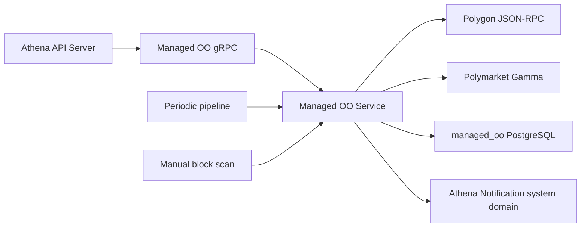

# Managed OO

## Scope

Managed OO owns Polymarket Managed Optimistic Oracle `ProposePrice` and
`DisputePrice` ingestion from Polygon, Gamma market enrichment, durable
proposal and dispute reads, manual block scans, and proposal/dispute alert
eligibility. It runs as the independent `athena-managed-oo` process and the
Athena API Server publishes it under the `/api/v1/managed-oo` HTTP namespace.

Athena Notification owns delivery after a system-management request is accepted.
Managed OO never selects an account or sends an account notification. Market
Radar, Sports Live, and Sports History own their separate Polymarket-derived
workloads. The Polygon client and `util/polymarket` Gamma client are external-
provider dependencies, not shared capability implementation state.

## Source Locations

| Concern | Source | Key symbols |
| --- | --- | --- |
| Binary dispatch | [cmd/main.go](../../../cmd/main.go) | `main`, `ATHENA_BINARY_NAME` dispatch |
| Process composition and configuration | [cmd/athena-managed-oo/commands/athena-managed-oo.go](../../../cmd/athena-managed-oo/commands/athena-managed-oo.go) | `NewCommand` |
| Lifecycle, dependencies, and serialization | [internal/managedoo/service.go](../../../internal/managedoo/service.go) | `Service`, `Start`, `Stop`, `managedOOPipelineMu` |
| gRPC lifecycle and health | [internal/managedoo/server.go](../../../internal/managedoo/server.go) | `Server`, `NewServer`, `Start`, `Stop` |
| Chain ingestion and Gamma enrichment | [internal/managedoo/log_sync.go](../../../internal/managedoo/log_sync.go) | `runManagedOOProposePriceLogSyncLoop`, `syncManagedOOProposePriceLogsMarketsAndAlerts`, `syncManagedOOMarketData` |
| Read and manual-scan API | [internal/managedoo/api.go](../../../internal/managedoo/api.go) | `ScanManagedOOBlock`, `ListManagedOOProposals`, `ListManagedOODisputes` |
| Alert rendering and enqueueing | [internal/managedoo/proposed_alerts.go](../../../internal/managedoo/proposed_alerts.go), [internal/managedoo/disputed_alerts.go](../../../internal/managedoo/disputed_alerts.go) | `sendManagedOOProposePriceAlerts`, `sendManagedOODisputePriceAlerts` |
| Durable store and transactions | [internal/managedoo/store/managed_oo_log_store.go](../../../internal/managedoo/store/managed_oo_log_store.go) | `IngestManagedOOProposePriceLogs`, `IngestManagedOODisputePriceLogs`, `UpsertManagedOOBlockLogs`, `UpsertManagedOOMarket` |
| PostgreSQL connection and schema | [internal/managedoo/store/sql_store.go](../../../internal/managedoo/store/sql_store.go), [internal/managedoo/store/migrations/000001_init.sql](../../../internal/managedoo/store/migrations/000001_init.sql) | `NewSQLStoreSource`, `managed_oo_chain_log_cursor`, log, market, label, and alert-state tables |
| Query and eligibility policy | [internal/managedoo/store/queries/managed_oo_log.sql](../../../internal/managedoo/store/queries/managed_oo_log.sql) | `ListManagedOOMarketIDsNeedingRefresh`, proposal/dispute alert candidate queries |
| Internal service contract | [internal/managedoo/managed_oo.proto](../../../internal/managedoo/managed_oo.proto) | `ManagedOOService` |
| Public HTTP/gRPC contract and proxy | [internal/server/managedoo/managedoo.proto](../../../internal/server/managedoo/managedoo.proto), [internal/server/managedoo/managedoo.go](../../../internal/server/managedoo/managedoo.go) | `ManagedOOService`, `Server` |
| Internal gRPC connection ownership | [internal/managedoo/apiclient/apiclient.go](../../../internal/managedoo/apiclient/apiclient.go), [util/grpc/client.go](../../../util/grpc/client.go) | `Clientset`, `NewManagedOOClientset`, `ClientConnection` |
| System notification contract and authenticated client | [internal/notification/notification.proto](../../../internal/notification/notification.proto), [internal/notification/apiclient/apiclient.go](../../../internal/notification/apiclient/apiclient.go) | `SystemNotificationService`, `SendSystemNotification`, `Clientset.System`, `InternalAuthTokenEnv` |
| Shared API model | [pkg/apis/application/v1alpha1/market_intelligence_types.go](../../../pkg/apis/application/v1alpha1/market_intelligence_types.go) | `ManagedOOProposalItem`, `ManagedOODisputeItem` |

## Architecture

One mutex serializes the complete periodic pipeline and manual block scans. The
service reads chain logs through Polygon, persists decoded log identity and
payloads, resolves numeric `market_id` values through Gamma, and stores market
metadata and labels. Alert queries join durable logs with usable market metadata
and exclude source identities already present in alert-state.

Proposal and dispute cursors are independent. Log rows and the corresponding
cursor advance share a transaction. A successful market upsert replaces its
labels in the same transaction. Notification enqueue and the following
alert-state write are separate cross-service operations.
All proposal and dispute alerts use the authenticated system domain; the
capability never calls `AccountNotificationService`.

## Runtime Flow

1. `athena-managed-oo` connects to the `managed_oo` database, optionally
   applies embedded migrations, creates one optional long-lived authenticated
   Notification clientset,
   binds port `8106`, and constructs the service with the configured Polygon
   RPC URL.
2. `Service.Start` requires the store, creates a default Gamma client when none
   was injected, launches one cancellable pipeline goroutine, and returns.
   Standard gRPC health becomes `SERVING` after the goroutine launches.
3. The pipeline runs immediately and every two seconds while holding
   `managedOOPipelineMu`. It synchronizes proposal logs, synchronizes dispute
   logs, enriches pending market IDs, then evaluates proposal and dispute
   system notifications. An earlier phase failure stops the current pass.
4. On the first pass for a log type, the service initializes its cursor to the
   current Polygon head and does not backfill earlier blocks automatically.
   Later passes scan from `last_block_number + 1` through the latest head in
   ranges of at most 2,000 blocks.
5. Each log type decodes the fixed Managed OO contract and event topic. Its batch
   upsert and cursor advance commit atomically, so a cursor cannot move past
   uncommitted decoded logs.
6. Market enrichment selects at most 100 numeric market IDs per pass. Pending
   dispute markets rank ahead of the general backlog. A lookup first uses a
   Gamma keyset query and then a direct market read. Metadata and labels commit
   together; a 404 is stored as `fetch_status = not_found` and is retry-eligible
   after one minute.
7. Proposal candidates require a usable market slug and at least one of the
   `Politics`, `Iran`, or `Geopolitics` labels. Dispute candidates require
   a usable market slug but no specific label. Each query returns at most 100
   unsent source logs in chain order.
8. The service submits every alert with
   `Clientset.System().SendSystemNotification`. After Notification accepts a
   request, the service writes the source
   `(tx_hash, log_index)`, notification ID, and notification time to the
   corresponding alert-state table.
9. `ScanManagedOOBlock` validates a positive supported block number, verifies
   that it does not exceed the current head, fetches both event types for exactly
   that block, and atomically upserts both sets. It then performs best-effort
   enrichment and notification evaluation. Manual scans do not advance the
   periodic cursors and cannot overlap the periodic pipeline.
10. Proposal and dispute list methods accept page numbers from 1, page sizes
    from 1 through 100 with a default of 20, and an optional exact block filter.
    Rows are ordered by descending block and log index and include any available
    market enrichment.
11. On cancellation, gRPC stops gracefully, health changes to `NOT_SERVING`,
    the pipeline context is cancelled, and shutdown waits for the goroutine
    before the Notification channel and PostgreSQL close. The API Server reuses
    one separate Managed OO channel and closes it after serving stops.

## State / Data

- `managed_oo_chain_log_cursor` stores independent proposal and dispute scan
  positions, fixed contract/topic identity, and last poll time.
- `managed_oo_propose_price_log` and
  `managed_oo_dispute_price_log` are keyed by `(tx_hash, log_index)`. They
  preserve decoded request identities and values, raw topics and data, block
  identity, the parsed ancillary text, and its extracted market ID.
- `managed_oo_market` is keyed by numeric market ID text. It stores Gamma
  metadata, event and market slugs, raw data, `ok` or `not_found` fetch state,
  errors, and the last fetch time.
- `managed_oo_market_label` is keyed by market and label and references its
  market with `ON DELETE CASCADE`.
- Proposal and dispute alert-state tables are keyed by the source log identity
  and reference their log rows. Absence means the source remains eligible;
  presence means Notification already accepted it.

A market slug is sufficient for a valid fallback
`https://polymarket.com/market/{slug}` link; an event slug enables the more
specific event/market URL. Notification links optionally carry the configured
invite code as the `r` query parameter. Durable cursors, logs, enrichment, and
alert-state resume after restart. Process-local state is limited to lifecycle
and pipeline serialization.

## Configuration

| Setting | Behavior |
| --- | --- |
| `ATHENA_MANAGED_OO_LISTEN_ADDRESS` / `--address` | gRPC bind address; default `0.0.0.0`. |
| `ATHENA_MANAGED_OO_LISTEN_PORT` / `--port` | gRPC port; default `8106`. The local Procfile uses `ATHENA_MANAGED_OO_PORT` to supply this flag. |
| `ATHENA_MANAGED_OO_POSTGRES_DSN` | PostgreSQL connection for database `managed_oo`; required at startup. |
| `ATHENA_POSTGRES_AUTO_MIGRATE` | Controls embedded migration application during store connection; default `true`. |
| `ATHENA_MANAGED_OO_POLYGON_RPC_URL` / `--polygon-rpc-url` | Polygon JSON-RPC endpoint for chain head and log queries; default `https://polygon-rpc.com`. |
| `ATHENA_MANAGED_OO_NOTIFICATION_ENABLED` / `--notification-enabled` | Enables proposal and dispute enqueueing; default `true`. |
| `ATHENA_MANAGED_OO_NOTIFICATION_SERVER_ADDRESS` / `--notification-server-address` | Notification gRPC target; local default `127.0.0.1:8086`. Production Compose supplies its service DNS address. |
| `ATHENA_NOTIFICATION_INTERNAL_AUTH_TOKEN` | Shared Notification internal Bearer attached to every non-health system-domain RPC. It must contain at least 32 non-whitespace bytes and match the Notification process; Procfile supplies the local default and Compose requires the production value. |
| `ATHENA_MANAGED_OO_NOTIFICATION_INVITE_CODE` / `--notification-invite-code` | Optional `r` query parameter added to Polymarket links; default empty. |
| `ATHENA_LOGFORMAT`, `ATHENA_LOGLEVEL` / command flags | Shared process log format and level; defaults `json` and `info`. |

The contract address and event topics, two-second poll interval, 20-second
Polygon and Gamma query deadlines, 2,000-block range, one-minute market retry
interval, 100-market enrichment limit, 100-alert limits, and 10-second
notification deadlines are implementation constants.

## Invariants

- Managed OO is the only owner of its cursors, decoded logs, enrichment state,
  read API, and proposal/dispute alert state.
- The periodic and manual pipelines never execute concurrently.
- A periodic cursor advances in the same transaction as all decoded logs through
  that head.
- First initialization starts at the current head; historical blocks enter only
  through an explicit block scan.
- Market metadata and its complete label set become visible atomically.
- A market slug is mandatory before either alert becomes a candidate; an event
  slug is optional.
- Proposal alerts require a configured label, while dispute alerts do not.
- Alert-state is committed only after Notification accepts the request.
- Proposal and dispute alerts use only authenticated
  `SystemNotificationService.SendSystemNotification`; Managed OO never enters
  the account domain or supplies an account UUID.
- Health reports process lifecycle, not cursor lag, enrichment backlog, or
  Notification availability.

## Failure Recovery

Database connection, migration, missing store, failure to construct Gamma, or an
invalid listener or Notification target prevents startup. A missing, short, or
whitespace-bearing `ATHENA_NOTIFICATION_INTERNAL_AUTH_TOKEN` also prevents
startup when alerts are enabled. Polygon and Notification availability are not
probed before health becomes serving; a temporarily unavailable Notification
service or mismatched valid token is handled as a later unavailable or
unauthenticated system send while the gRPC channel reconnects in the background.

A Polygon RPC, decoding, or log-ingest failure stops the current pass before its
cursor advances and before enrichment or alerts. A proposal-phase failure also
prevents dispute synchronization in that pass. The next two-second tick retries
from the durable cursor.

A non-404 Gamma failure stops enrichment and alerts for the current pass. A 404
is stored as `not_found` and becomes eligible after one minute; its source log
and pending alert remain durable. Missing or empty-slug enrichment keeps the
candidate out of alert queries and prevents linkless notifications.

A notification failure leaves alert-state absent and retries later. If
Notification accepts a request but the following alert-state write fails, a
later pass may enqueue a duplicate because no transaction spans both services.

Manual scan proposal and dispute rows commit together. Enrichment after that
commit is best effort: a failure is logged while the scan still returns the
persisted proposal/dispute counts. Repeating the scan is safe because source log
keys are idempotent. Cancellation propagates to active dependency calls, and
graceful shutdown waits for the serialized pipeline.

## Observability

The process registers Version, standard gRPC health, and Managed OO services.
Health is `SERVING` after the pipeline goroutine launches and
`NOT_SERVING` before startup and after shutdown. `GetManagedOOStatus`
reports `started` plus `running` or `stopped`.

The API Server exposes:

- `GET /api/v1/managed-oo/status`
- `POST /api/v1/managed-oo/blocks/{block_number}:scan`
- `GET /api/v1/managed-oo/proposals`
- `GET /api/v1/managed-oo/disputes`

Status and lists require `managed-oo:get`; block scan requires
`managed-oo:invoke`. Chain debug logs include sync name, range, log count, and
a sanitized RPC endpoint. Enrichment logs requested, fetched, and
not-found counts. Pipeline warnings identify the failed phase, and alert warnings
include source transaction hash and log index.
The Notification internal Bearer is never included in logs or response data.

There are no capability-specific metrics, cursor-lag readiness check, enrichment
backlog counter, or durable end-to-end delivery diagnostic. Operational state
is inferred from logs, list results, cursor data, and notification records.

## Change Checklist

- [ ] Component responsibilities and boundaries still match this document.
- [ ] Runtime, concurrency, and transaction flows are current.
- [ ] State, data, interfaces, configuration, dependencies, and invariants are current.
- [ ] Failure recovery, health checks, and observability are current.
- [ ] Proposal and dispute alerts still use authenticated `SendSystemNotification` only and never enter the account domain.
- [ ] Source links and named symbols resolve to the implementation.
- [ ] The [design index](../README.md) contains the correct entry.
