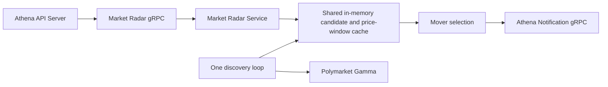

# Market Radar

## Scope

Market Radar owns the process-local Polymarket market-discovery read model used
by the hot-market, realtime, and mover views. It polls Gamma for active markets,
keeps one shared candidate cache, samples token prices into short rolling
windows, ranks movers, and optionally enqueues mover notifications. The Athena
API Server publishes the capability under the `/api/v1/market-radar` HTTP
namespace. All four public methods belong only to the read-only Market Radar
account-access module.

The capability does not persist data and does not own live sports, completed
sports history, Managed Optimistic Oracle logs, or Worm markets.
`util/polymarket` remains the external-provider adapter. Notification delivery
after `SendNotification` is accepted belongs to Athena Notification.

## Source Locations

| Concern | Source | Key symbols |
| --- | --- | --- |
| Binary dispatch | [cmd/main.go](../../../cmd/main.go) | `main`, `ATHENA_BINARY_NAME` dispatch |
| Process composition and configuration | [cmd/athena-market-radar/commands/athena-market-radar.go](../../../cmd/athena-market-radar/commands/athena-market-radar.go) | `NewCommand` |
| Lifecycle, dependencies, and in-memory state | [internal/marketradar/service.go](../../../internal/marketradar/service.go) | `Service`, `Start`, `Stop` |
| gRPC lifecycle and health | [internal/marketradar/server.go](../../../internal/marketradar/server.go) | `Server`, `NewServer`, `Start`, `Stop` |
| Candidate discovery | [internal/marketradar/hot_markets.go](../../../internal/marketradar/hot_markets.go) | `runHotMarketDiscoveryLoop`, `refreshHotMarkets`, `applyHotMarketCandidatesLocked` |
| Realtime windows | [internal/marketradar/realtime_markets.go](../../../internal/marketradar/realtime_markets.go) | `ListRealtimeMarkets`, `sampleHotMarketCandidatesLocked`, `realtimeWindowItemLocked` |
| Mover ranking and alerts | [internal/marketradar/movers.go](../../../internal/marketradar/movers.go), [internal/marketradar/mover_alerts.go](../../../internal/marketradar/mover_alerts.go) | `ListMarketMovers`, `scoreMoverWindows`, `collectMoverAlertsLocked`, `sendMoverAlerts` |
| Internal service contract | [internal/marketradar/market_radar.proto](../../../internal/marketradar/market_radar.proto) | `MarketRadarService` |
| Public HTTP/gRPC contract and proxy | [internal/server/marketradar/marketradar.proto](../../../internal/server/marketradar/marketradar.proto), [internal/server/marketradar/marketradar.go](../../../internal/server/marketradar/marketradar.go) | `MarketRadarService`, `Server` |
| Public authorization boundary | [internal/server/authz.go](../../../internal/server/authz.go), [internal/accountaccess/access.go](../../../internal/accountaccess/access.go) | `moduleGRPCRules`, `ModuleMarketRadar`, `AccessLevelRead` |
| Internal gRPC connection ownership | [internal/marketradar/apiclient/apiclient.go](../../../internal/marketradar/apiclient/apiclient.go), [util/grpc/client.go](../../../util/grpc/client.go) | `Clientset`, `NewMarketRadarClientset`, `ClientConnection` |
| Shared API model | [pkg/apis/application/v1alpha1/market_intelligence_types.go](../../../pkg/apis/application/v1alpha1/market_intelligence_types.go) | `MarketRadarHotMarketItem`, `MarketRadarRealtimeMarketItem`, `MarketRadarMoverMarketItem` |
| Provider adapter | [util/polymarket](../../../util/polymarket) | `GammaClient`, `ListMarketsKeyset` |
| Web routes and client pagination | [ui/src/app/member/pages/market-radar.tsx](../../../ui/src/app/member/pages/market-radar.tsx), [ui/src/app/components/resource-table.tsx](../../../ui/src/app/components/resource-table.tsx) | `MarketRadarPage`, `ResourceTable` |

## Architecture

One `Service` owns the candidate list, per-token current state, rolling samples,
freshness fields, and mover cooldown state behind `cacheMu`. A single
background loop refreshes all three read models together. `singleflight.Group`
also collapses an on-demand first refresh with the background refresh, so hot,
realtime, and mover RPCs never create parallel Gamma scans.

Realtime and mover values are derived from successive Gamma snapshots. The
`connected` and `last_event_at` response fields describe recent successful
sampling; the current implementation does not maintain a provider WebSocket.
The API Server is a stateless gRPC proxy and does not duplicate the cache. It
checks the explicit Market Radar `READ` rule before proxying a public method and
keeps one process-owned Market Radar channel and typed client for all proxy and
health requests instead of dialing on each request. Market Radar is read-only,
so its account-access maximum is `READ` and it has no public write rule.

## Runtime Flow

1. `athena-market-radar` creates an optional Notification clientset, binds the
   gRPC listener on port `8092`, and creates one Market Radar server.
2. `Server.Start` calls `Service.Start`. The service creates the default Gamma
   client when none was injected, launches one cancellable discovery goroutine,
   and then standard gRPC health changes from `NOT_SERVING` to `SERVING`.
3. The discovery loop runs immediately and every minute. Each pass requests
   Gamma keyset pages of at most 100 markets, ordered by 24-hour volume, until it
   has at most 650 valid candidates or exhausts the cursor.
4. Discovery keeps active, open, order-book-enabled markets with positive
   24-hour volume, usable identifiers and token IDs, while excluding
   categories. Candidates are sorted deterministically by market activity.
5. The cache targets the first 500 markets. A previously selected market may
   remain for two missing refreshes and is removed on the third, limiting churn
   near the ranking boundary. One successful refresh atomically replaces the
   shared market view and updates candidate, monitored-market, and monitored-token
   counts.
6. The same refresh samples valid token prices and retains approximately 16
   minutes of samples. Realtime responses calculate 1-, 5-, and 15-minute
   percentage-point changes. A window remains in warmup until it has an old
   enough sample.
7. Movers require a token sample no older than 120 seconds. Their score is the
   sum of absolute 1-, 5-, and 15-minute changes with weights `1.0`, `0.6`,
   and `0.3`; the largest contribution determines direction. Markets without
   a nonzero, non-warmup leader are omitted.
8. Hot, realtime, and mover list requests default to 100 items and accept at
   most 500. When no snapshot exists, the request performs one refresh with a
   15-second deadline. Subsequent reads clone data from the shared cache.
9. When enabled, each successful refresh evaluates mover alerts. Warning and
   critical thresholds, volume filtering, cooldown, severity escalation, and a
   maximum of three notifications per refresh are applied before enqueueing
   requests to Athena Notification.
10. On process cancellation, gRPC stops gracefully, health becomes
    `NOT_SERVING`, the discovery context is cancelled, and `Service.Stop`
    waits for its goroutine to return. The command closes its optional
    Notification channel only after the loop has stopped; the API Server closes
    its Market Radar channel after its HTTP/gRPC serving lifecycle ends.

A cache replacement and its sample updates occur under one in-process mutex.
There is no database, distributed transaction, durable cursor, or cross-process
cache coordination.

## State / Data

All capability state is process-local:

- `hotMarketItems` is the selected candidate snapshot and
  `hotMarketMissing` tracks boundary-retention misses.
- `realtimeStates` stores the latest price, bid, ask, spread, trade price, and
  observation time per token.
- `realtimeSamples` stores ordered token samples for the 16-minute rolling
  window. Samples for tokens no longer selected are removed.
- Fetched, stale, connection, event-time, and monitored-count fields describe
  the current snapshot.
- `moverAlertStates` is keyed by condition, token, and direction and stores the
  last notification time, severity, and score.

Reads return cloned market and token objects rather than pointers into shared
state. Restarting the process clears the snapshot, price-window warmup, and all
notification cooldowns.

## Configuration

| Setting | Behavior |
| --- | --- |
| `ATHENA_MARKET_RADAR_LISTEN_ADDRESS` / `--address` | gRPC bind address; default `0.0.0.0`. |
| `ATHENA_MARKET_RADAR_LISTEN_PORT` / `--port` | gRPC port; default `8092`. The local Procfile uses `ATHENA_MARKET_RADAR_PORT` to supply this flag. |
| `ATHENA_MARKET_RADAR_NOTIFICATION_ENABLED` / `--notification-enabled` | Creates the Notification clientset and enables mover alerts; default `true`. |
| `ATHENA_MARKET_RADAR_NOTIFICATION_SERVER_ADDRESS` / `--notification-server-address` | Notification gRPC target; local default `127.0.0.1:8086`. Production Compose supplies its service DNS address. |
| `ATHENA_MARKET_RADAR_NOTIFICATION_INVITE_CODE` / `--notification-invite-code` | Optional `r` query parameter added to Polymarket notification links; default empty. |
| `ATHENA_LOGFORMAT`, `ATHENA_LOGLEVEL` / command flags | Shared process log format and level; defaults `json` and `info`. |

The one-minute discovery interval, page and candidate limits, three-refresh
candidate eviction, rolling-window durations, mover weights and freshness, and
alert thresholds are implementation constants. Default warning and critical
scores are 6 and 12, minimum 24-hour volume is 10,000, alert cooldown is 15
minutes, send timeout is 10 seconds, and at most three alerts are selected per
refresh.

## Invariants

- Market Radar has one owner for candidate selection, token samples, mover
  ranking, and mover cooldown state; no sibling capability imports that state.
- Every selected market has a stable condition ID, usable token IDs, positive
  24-hour volume, and is active, open, and order-book enabled.
- Hot, realtime, and mover responses derive from the same selected candidate
  set and synchronized cache lock.
- A price window is not considered ready until its observation span reaches the
  requested duration.
- Movers require a fresh token observation and a nonzero weighted score.
- Concurrent initial reads and the periodic loop collapse into one Gamma scan.
- Health and lifecycle status indicate that the loop is owned by the process,
  not that a snapshot exists or is current.
- Status, Hot Markets, Realtime, and Movers all require only Market Radar
  `READ`; access to another module never grants these methods.

## Failure Recovery

Failure to create the default Gamma client prevents startup and health never
becomes serving. A discovery failure retains the previous snapshot, marks its
hot and realtime views stale, and reports the derived connection state as
disconnected. The background loop logs the failure and retries on the next
minute. A first read with no usable snapshot returns `Unavailable` when its
on-demand refresh fails.

A caller without Market Radar `READ` is rejected by the API Server before the
Market Radar dependency is called. Granting the module permits the next request
without restarting either process.

An invalid Notification target prevents command startup. Temporary Notification
unavailability does not: the nonblocking client connection reconnects in the
background, and send failure is logged without failing market refresh or read
APIs. Alert cooldown state is reserved before the send attempt, so a failed
enqueue is suppressed until the cooldown expires unless a warning escalates to
critical. The cooldown is not durable and resets on restart.

Cancellation propagates to an active Gamma request and notification send.
Graceful shutdown waits for the single discovery goroutine. There is no
last-known snapshot outside the process, so a restart begins empty and price
windows warm up again.

## Observability

The server registers Version, standard gRPC health, and Market Radar services.
Health is `SERVING` after the discovery loop launches and `NOT_SERVING`
before startup and after shutdown. `GetMarketRadarStatus` exposes the same
lifecycle as `started` plus `running` or `stopped`.

The API Server exposes:

- `GET /api/v1/market-radar/status`
- `GET /api/v1/market-radar/hot-markets`
- `GET /api/v1/market-radar/realtime-markets`
- `GET /api/v1/market-radar/movers`

All methods require the explicit Market Radar module `READ` rule. A denial uses
the shared `ACCOUNT_DATA_ACCESS_DENIED` reason with Market Radar module metadata.
List responses carry fetch time, stale state, candidate and monitored counts,
and where applicable connection and last-observation fields. Logs distinguish
initial and periodic discovery failures and include condition IDs for
notification failures. There are no capability-specific metrics, durable
refresh history, or freshness-based readiness probe.

Each of the Hot Markets, Realtime Markets, and Movers web routes requests the
first 100 items and paginates that in-memory result locally. Routes start on
page 1 with 50 rows, offer page sizes 10, 50, and 100, preserve the current page
on manual refresh, and clamp it when a smaller result invalidates the page.
Only the current page is mounted into the table. Market images use browser lazy
loading and asynchronous decoding while retaining the failed-image hide path.
Navigation and all three routes require Market Radar `READ`. Losing that module
aborts Market Radar requests, clears only its browser cache, and routes an active
view to `/account/access`; changes to another module retain this view's state.

## Change Checklist

- [ ] Component responsibilities and boundaries still match this document.
- [ ] Runtime, concurrency, and transaction flows are current.
- [ ] State, data, interfaces, configuration, dependencies, and invariants are current.
- [ ] Failure recovery, health checks, and observability are current.
- [ ] All public methods and browser routes remain scoped to read-only Market Radar `READ`.
- [ ] Source links and named symbols resolve to the implementation.
- [ ] The [design index](../README.md) contains the correct entry.
