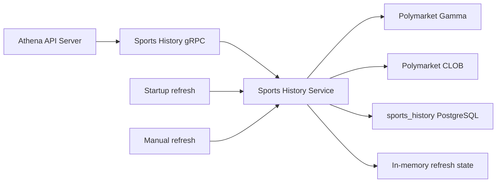

# Sports History

> 设计状态：已实现

## Scope

Sports History owns the durable Polymarket read model for recently completed ATP
and WTA singles events, their moneyline markets, full event-span price history,
and synchronization status. It performs one startup refresh and supports an
explicit manual refresh. The Athena API Server publishes the capability under
the `/api/v1/sports-history` HTTP namespace.

Current events and continuously sampled prices belong to
[Sports Live](sports-live.md). Generic market ranking belongs to
[Market Radar](market-radar.md). Sports History does not send notifications and
does not import those capability implementations. Polymarket Gamma and CLOB
access remains in the shared provider adapter under `util/polymarket`.

## Source Locations

| Concern | Source | Key symbols |
| --- | --- | --- |
| Binary dispatch | [cmd/main.go](../../../cmd/main.go) | `main`, `ATHENA_BINARY_NAME` dispatch |
| Process composition and configuration | [cmd/athena-sports-history/commands/athena-sports-history.go](../../../cmd/athena-sports-history/commands/athena-sports-history.go) | `NewCommand` |
| Lifecycle and synchronization state | [internal/sportshistory/service.go](../../../internal/sportshistory/service.go) | `Service`, `Start`, `Stop`, `sportsHistorySyncStatus` |
| Event synchronization, reads, and refresh | [internal/sportshistory/sports_history.go](../../../internal/sportshistory/sports_history.go) | `runSportsHistorySync`, `refreshSportsHistory`, `syncSportsHistory`, `RefreshSportsHistory` |
| Price-history synchronization | [internal/sportshistory/price_history.go](../../../internal/sportshistory/price_history.go) | `syncSportsHistoryPriceHistory`, `syncSportsHistoryPriceHistoryBatch` |
| gRPC lifecycle and health | [internal/sportshistory/server.go](../../../internal/sportshistory/server.go) | `Server`, `NewServer`, `Start`, `Stop` |
| Durable store and transactions | [internal/sportshistory/store/sports_history_store.go](../../../internal/sportshistory/store/sports_history_store.go) | `SyncSportsHistory`, `BatchUpsertSportsHistoryPricePoints`, `GetSportsHistoryLastSuccessAt` |
| PostgreSQL connection and schema | [internal/sportshistory/store/sql_store.go](../../../internal/sportshistory/store/sql_store.go), [internal/sportshistory/store/migrations/000001_init.sql](../../../internal/sportshistory/store/migrations/000001_init.sql) | `NewSQLStoreSource`, `sports_history_event`, `sports_history_market`, `sports_history_price_point` |
| Internal service contract | [internal/sportshistory/sports_history.proto](../../../internal/sportshistory/sports_history.proto) | `SportsHistoryService` |
| Public HTTP/gRPC contract and proxy | [internal/server/sportshistory/sportshistory.proto](../../../internal/server/sportshistory/sportshistory.proto), [internal/server/sportshistory/sportshistory.go](../../../internal/server/sportshistory/sportshistory.go) | `SportsHistoryService`, `Server` |
| Internal gRPC connection ownership | [internal/sportshistory/apiclient/apiclient.go](../../../internal/sportshistory/apiclient/apiclient.go), [util/grpc/client.go](../../../util/grpc/client.go) | `Clientset`, `NewSportsHistoryClientset`, `ClientConnection` |
| Shared API model | [pkg/apis/application/v1alpha1/market_intelligence_types.go](../../../pkg/apis/application/v1alpha1/market_intelligence_types.go) | `SportsHistoryEventCardItem`, `SportsHistoryPriceHistorySeriesItem`, `SportsHistorySyncStatus` |
| Provider adapters | [util/polymarket](../../../util/polymarket) | `GammaClient`, `CLOBClient` |

## Architecture

One `Service` owns refresh orchestration. `singleflight.Group` permits only one
refresh at a time, so the startup refresh and any concurrent manual requests
share the same execution. Event and market data, price points, and the last
successful event-snapshot time are durable. The current
`idle/syncing/succeeded/failed` execution record is process-local and is
combined with the durable last-success time for status responses.

The API Server is a thin gRPC proxy. It reuses one process-owned Sports History
channel and typed client for reads, refreshes, and health checks. No other
capability shares the Sports History store or synchronization state.

## Runtime Flow

1. `athena-sports-history` connects to the `sports_history` database, applies
   its embedded migration when enabled, binds port `8104`, and creates the
   Sports History server.
2. `Service.Start` requires the store, creates default Gamma and CLOB clients
   when none were injected, launches one startup-refresh goroutine, and returns.
   Standard gRPC health then becomes `SERVING`; startup does not wait for the
   refresh to complete.
3. The startup goroutine calls `refreshSportsHistory` once. There is no
   periodic ticker. Later synchronization occurs only through
   `RefreshSportsHistory`.
4. A refresh marks the in-memory execution state `syncing` while retaining the
   preceding last-success time. `singleflight` collapses overlapping refresh
   calls into this same operation.
5. Event discovery queries both closed and open Gamma views for `sports`
   events whose start time falls in the preceding 72 hours. It excludes esports,
   derivative titles, ATP/WTA doubles, unfinished events, and any league other
   than ATP or WTA singles. An event is retained only when it has at least one
   moneyline market.
6. `SyncSportsHistory` atomically batch-upserts events and markets, removes
   rows not seen in the current complete snapshot, and updates the fixed
   `sports_history` last-success row. After that commit, the service marks the
   event read model non-stale.
7. Price-history synchronization selects all stored moneyline token IDs and
   uses each event's start and finish as the CLOB query interval. Tokens with
   the same interval are sorted and fetched in batches of at most 20 at fidelity
   1. Valid points are upserted by token and timestamp. Errors from independent
   batches are joined and returned after all batches have been attempted.
8. The refresh state becomes `succeeded` only when both the event snapshot and
   every price batch succeed. Otherwise it becomes `failed`, records the error
   text and completion time, and preserves the latest durable event-snapshot
   success time.
9. Event reads default to 200 items and accept at most 1,000. Price-history reads
   deduplicate requested market keys and return 360 points per token by default,
   with a maximum of 720. Sync-status reads combine the process-local execution
   state with the durable last-success time.
10. A manual refresh blocks until the shared refresh completes and returns its
    status on success; a failed refresh is returned as `Unavailable`.
11. On cancellation, gRPC stops gracefully, health changes to `NOT_SERVING`,
    the service context is cancelled, and shutdown waits for the startup refresh
    if it is still running before closing PostgreSQL. The API Server closes its
    channel after its HTTP/gRPC serving lifecycle ends.

The event snapshot, stale-row cleanup, and its last-success timestamp share one
transaction. Price-history batches run after that transaction and commit
independently.

## State / Data

- `sports_history_event` is keyed by `event_key`. It stores the ATP/WTA
  classification, display and score fields, start and finish times, teams,
  provider timestamps, raw data, and fetch/last-seen times.
- `sports_history_market` is keyed by `market_key`, references its event with
  `ON DELETE CASCADE`, and stores only the market fields needed for moneyline
  cards and CLOB token discovery.
- `sports_history_price_point` is keyed by `(token_id, price_ts)`, references
  its market, and stores prices constrained to the zero-through-one range.
- `sports_history_sync_state` stores the last committed event-snapshot time
  under the fixed `sports_history` sync name.
- `sportsHistorySyncStatus` and `sportsHistoryStale` are protected by
  `cacheMu` and exist only for the current process.

Snapshot cleanup deletes events outside the current 72-hour result and cascades
to their markets and price points. A restart preserves all database state but
starts with an in-memory `idle`, stale status until the startup refresh
succeeds.

## Configuration

| Setting | Behavior |
| --- | --- |
| `ATHENA_SPORTS_HISTORY_LISTEN_ADDRESS` / `--address` | gRPC bind address; default `0.0.0.0`. |
| `ATHENA_SPORTS_HISTORY_LISTEN_PORT` / `--port` | gRPC port; default `8104`. The local Procfile uses `ATHENA_SPORTS_HISTORY_PORT` to supply this flag. |
| `ATHENA_SPORTS_HISTORY_POSTGRES_DSN` | PostgreSQL connection for database `sports_history`; required at startup. |
| `ATHENA_POSTGRES_AUTO_MIGRATE` | Controls embedded migration application during store connection; default `true`. |
| `ATHENA_LOGFORMAT`, `ATHENA_LOGLEVEL` / command flags | Shared process log format and level; defaults `json` and `info`. |

The 72-hour discovery window, Gamma page limit of 500, supported ATP/WTA singles
leagues, moneyline-only market policy, CLOB batch size 20, fidelity 1, and API
list/history limits are implementation constants.

## Invariants

- Sports History is the only owner of completed-event snapshots, their price
  points, durable last-success state, and manual refresh execution.
- At most one refresh executes at a time, including the startup refresh.
- Stored events are finished ATP or WTA singles events in the current 72-hour
  discovery window and have at least one moneyline market.
- Event/market upserts, unseen-row cleanup, and the durable last-success time
  become visible atomically.
- Price points have usable token, market, and event identities and prices from
  zero through one.
- A successful event-snapshot commit is not rolled back when a later CLOB batch
  fails.
- Health indicates that the lifecycle and startup goroutine were launched; the
  separate sync-status API describes refresh completion.

## Failure Recovery

Database connection, migration, missing store, or failure to create a default
provider client prevents the service from becoming healthy. A Gamma discovery
or event transaction failure leaves the previous snapshot and last-success
timestamp intact, marks the in-memory view stale, and records a failed refresh.

Price batches are independent and all are attempted. Earlier successful batch
writes remain durable when another batch fails. Because the event snapshot has
already committed, a price-history failure produces a failed sync execution
while event reads can remain non-stale and expose the new event last-success
time. Repeating the manual refresh safely upserts the same points and repairs
missing batches.

A failed startup refresh is logged and is not retried automatically; an operator
or UI action must invoke `RefreshSportsHistory`. Concurrent manual requests
share one result. Restarting triggers one new startup attempt and reconstructs
the durable last-success field from PostgreSQL.

Cancellation propagates to Gamma, CLOB, and PostgreSQL. If cancellation occurs
during price synchronization, committed event and completed price batches
remain. Graceful shutdown waits for the owned startup goroutine.

## Observability

The server registers Version, standard gRPC health, and Sports History services.
Health is `SERVING` after the startup refresh goroutine launches and
`NOT_SERVING` before startup and after shutdown. `GetSportsHistoryStatus`
reports only lifecycle `started` and `running` or `stopped`.

The API Server exposes:

- `GET /api/v1/sports-history/status`
- `GET /api/v1/sports-history/events`
- `POST /api/v1/sports-history/price-history:batchGet`
- `GET /api/v1/sports-history/sync-status`
- `POST /api/v1/sports-history:refresh`

Reads require `sports-history:get`; refresh requires
`sports-history:invoke`. Event responses expose a fetched time and stale flag.
Sync status exposes state, start, completion, last-success, and error text. The
startup failure log identifies the refresh error. There are no
capability-specific metrics, periodic refresh lag monitor, or
freshness-dependent readiness probe.

## Change Checklist

- [ ] Component responsibilities and boundaries still match this document.
- [ ] Runtime, concurrency, and transaction flows are current.
- [ ] State, data, interfaces, configuration, dependencies, and invariants are current.
- [ ] Failure recovery, health checks, and observability are current.
- [ ] Source links and named symbols resolve to the implementation.
- [ ] The [design index](../README.md) contains the correct entry.
