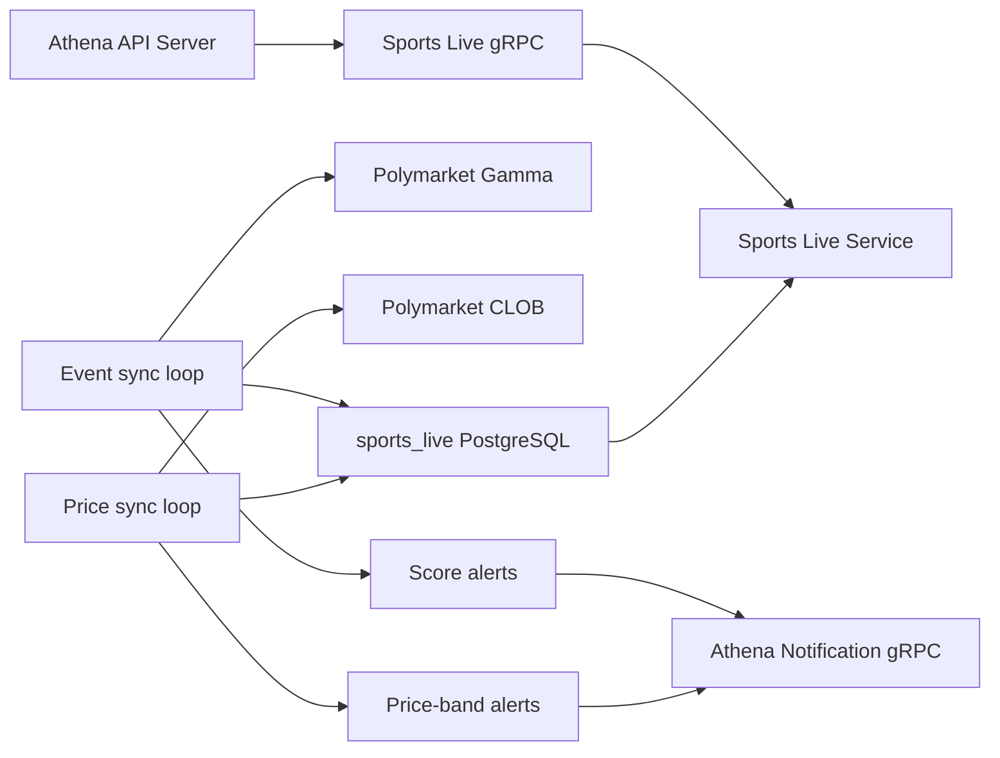

# Sports Live

## Scope

Sports Live owns the durable read model for current Polymarket sports events,
their moneyline price histories, price-band alert state, and score-change alert
state. It continuously synchronizes upstream event snapshots and CLOB price
samples, exposes event and history reads, and optionally enqueues price and score
notifications. The Athena API Server publishes the capability under the
`/api/v1/sports-live` HTTP namespace.

Completed-event history belongs to [Sports History](sports-history.md). Generic
market discovery belongs to [Market Radar](market-radar.md), Managed Optimistic
Oracle logs belong to [Managed OO](managed-oo.md), and Telegram delivery after a
notification is accepted belongs to Athena Notification. The Polymarket Gamma
and CLOB clients in `util/polymarket` remain provider adapters.

## Source Locations

| Concern | Source | Key symbols |
| --- | --- | --- |
| Binary dispatch | [cmd/main.go](../../../cmd/main.go) | `main`, `ATHENA_BINARY_NAME` dispatch |
| Process composition and configuration | [cmd/athena-sports-live/commands/athena-sports-live.go](../../../cmd/athena-sports-live/commands/athena-sports-live.go) | `NewCommand` |
| Lifecycle and dependencies | [internal/sportslive/service.go](../../../internal/sportslive/service.go) | `Service`, `Start`, `Stop` |
| gRPC lifecycle and health | [internal/sportslive/server.go](../../../internal/sportslive/server.go) | `Server`, `NewServer`, `Start`, `Stop` |
| Event synchronization and reads | [internal/sportslive/sports_live.go](../../../internal/sportslive/sports_live.go) | `runSportsLiveSyncLoop`, `syncSportsLiveMarkets`, `ListSportsLiveEvents` |
| Price-history synchronization and reads | [internal/sportslive/price_history.go](../../../internal/sportslive/price_history.go) | `runSportsLivePriceHistorySyncLoop`, `syncSportsLivePriceHistory`, `syncSportsLivePriceHistoryBatch` |
| Price and score alerts | [internal/sportslive/price_alerts.go](../../../internal/sportslive/price_alerts.go), [internal/sportslive/score_alerts.go](../../../internal/sportslive/score_alerts.go) | `updateSportsLivePriceAlerts`, `updateSportsLiveScoreAlerts` |
| Durable store and transactions | [internal/sportslive/store/sports_live_market_store.go](../../../internal/sportslive/store/sports_live_market_store.go) | `SyncSportsLiveEvents`, `BatchUpsertSportsLivePricePoints`, alert-state operations |
| PostgreSQL connection and schema | [internal/sportslive/store/sql_store.go](../../../internal/sportslive/store/sql_store.go), [internal/sportslive/store/migrations/000001_init.sql](../../../internal/sportslive/store/migrations/000001_init.sql) | `NewSQLStoreSource`, `sports_live_event`, `sports_live_market`, `sports_live_price_point` |
| Internal service contract | [internal/sportslive/sports_live.proto](../../../internal/sportslive/sports_live.proto) | `SportsLiveService` |
| Public HTTP/gRPC contract and proxy | [internal/server/sportslive/sportslive.proto](../../../internal/server/sportslive/sportslive.proto), [internal/server/sportslive/sportslive.go](../../../internal/server/sportslive/sportslive.go) | `SportsLiveService`, `Server` |
| Internal gRPC connection ownership | [internal/sportslive/apiclient/apiclient.go](../../../internal/sportslive/apiclient/apiclient.go), [util/grpc/client.go](../../../util/grpc/client.go) | `Clientset`, `NewSportsLiveClientset`, `ClientConnection` |
| Shared API model | [pkg/apis/application/v1alpha1/market_intelligence_types.go](../../../pkg/apis/application/v1alpha1/market_intelligence_types.go) | `SportsLiveEventCardItem`, `SportsLivePriceHistorySeriesItem`, `SportsTeamItem` |
| Provider adapters | [util/polymarket](../../../util/polymarket) | `GammaClient`, `CLOBClient` |

## Architecture

One process owns two cancellable background loops. The event loop refreshes the
current event and market snapshot. The price loop derives its token set from
that snapshot and appends CLOB history. Both use one capability-specific
PostgreSQL database, but they do not share one cross-loop transaction.

Read RPCs are served only from `sports_live` PostgreSQL. Gamma and CLOB are not
called on the request path. Notification is an optional process-owned gRPC
channel that is reused by both alert loops; no
Sports Live implementation code is imported into Notification or another
capability.

## Runtime Flow

1. `athena-sports-live` connects to the `sports_live` database, applies its
   embedded migration when automatic migration is enabled, optionally creates a
   Notification clientset, binds port `8094`, and creates the service.
2. `Service.Start` requires the store, creates default Gamma and CLOB clients
   when they were not injected, and launches the event and price-history loops.
   Standard gRPC health becomes `SERVING` after both goroutines launch; startup
   does not wait for a successful upstream synchronization.
3. The event loop runs immediately and every 10 seconds. It walks Gamma keyset
   pages of live, open `sports` events with at least 10,000 liquidity, excludes
   the esports tag and derivative titles, and maps all usable open markets.
4. `SyncSportsLiveEvents` opens one transaction. It batch-upserts events,
   seeds score-alert state for existing FIFWC, MLB, and NHL scores, batch-upserts
   markets, removes rows not seen after the current sync boundary, and updates
   `sports_live_sync_state`. Readers see all of those transitions together.
5. After the event transaction commits, the service evaluates score changes for
   FIFWC, MLB, and NHL. A successful notification enqueue is followed by a
   durable update of the event's last score, notification ID, and notification
   time.
6. The price-history loop runs immediately and every 15 seconds. It selects
   moneyline markets with token IDs, backfills six hours for a new token, or
   resumes two minutes before its latest point. Token requests sharing a start
   time are sorted and sent to CLOB in batches of at most 20 at fidelity 1.
7. Each price batch deduplicates by token and timestamp and upserts its points.
   Individual provider or database batch failures are logged without aborting
   later batches in the pass.
8. After processing all price batches, the service evaluates the latest price
   of each token. Alert bands correspond to prices below 0.15, 0.10, 0.05, 0.03,
   and 0.01. Moving to a more extreme band bypasses cooldown; repeating the same
   band requires the configured cooldown. Returning to the middle range removes
   the token's alert state.
9. Event reads default to 200 items and accept at most 1,000. They include the
   durable last-success time and are stale when that time is absent or older
   than two event-sync intervals. Price-history reads deduplicate requested
   market keys and return 360 points per token by default, with a maximum of
   720.
10. On cancellation, gRPC stops gracefully, health becomes `NOT_SERVING`, both
    loop contexts are cancelled, and `Service.Stop` waits for both goroutines
    before the Notification channel and PostgreSQL close. The API Server owns
    one separate Sports Live channel for all proxy and health requests and
    closes it after its serving lifecycle ends.

The event snapshot and sync timestamp share one explicit transaction. Each CLOB
price batch, price-alert state update, score-alert state update, and Notification
enqueue is a separate operation.

## State / Data

- `sports_live_event` is keyed by `event_key` and stores the current event
  snapshot, score fields, teams and raw provider data, fetch time, and last-seen
  time.
- `sports_live_market` is keyed by `market_key`, references its event with
  `ON DELETE CASCADE`, and stores identifiers, market classification, token and
  outcome payloads, quotes, volume, liquidity, raw data, and last-seen time.
- `sports_live_sync_state` stores the last committed snapshot time for the
  fixed `sports_live_markets` sync name.
- `sports_live_price_point` is keyed by `(token_id, price_ts)` and references
  its market. It is the durable source for history reads and price alerts.
- `sports_live_price_alert_state` is keyed by token and records the active
  alert band, last notification time, last point, and price.
- `sports_live_score_alert_state` is keyed by event and stores the comparison
  score plus the accepted notification identity.

The store deletes events and markets that disappear from a complete current
snapshot. Cascading foreign keys also remove their histories and alert states.
Price and score notification state survives process restarts. Process-local
state is limited to lifecycle cancellation and goroutine tracking.

## Configuration

| Setting | Behavior |
| --- | --- |
| `ATHENA_SPORTS_LIVE_LISTEN_ADDRESS` / `--address` | gRPC bind address; default `0.0.0.0`. |
| `ATHENA_SPORTS_LIVE_LISTEN_PORT` / `--port` | gRPC port; default `8094`. The local Procfile uses `ATHENA_SPORTS_LIVE_PORT` to supply this flag. |
| `ATHENA_SPORTS_LIVE_POSTGRES_DSN` | PostgreSQL connection for database `sports_live`; required at process startup. |
| `ATHENA_POSTGRES_AUTO_MIGRATE` | Controls embedded migration application during store connection; default `true`. |
| `ATHENA_SPORTS_LIVE_NOTIFICATION_ENABLED` / `--notification-enabled` | Enables both price and score notifications; default `true`. |
| `ATHENA_SPORTS_LIVE_NOTIFICATION_SERVER_ADDRESS` / `--notification-server-address` | Notification gRPC target; local default `127.0.0.1:8086`. Production Compose supplies its service DNS address. |
| `ATHENA_SPORTS_LIVE_NOTIFICATION_INVITE_CODE` / `--notification-invite-code` | Optional `r` query parameter added to Polymarket links; default empty. |
| `ATHENA_SPORTS_LIVE_PRICE_ALERT_COOLDOWN` / `--price-alert-cooldown` | Same-band repeat cooldown; default 15 minutes, accepted range one second through 24 hours. |
| `ATHENA_LOGFORMAT`, `ATHENA_LOGLEVEL` / command flags | Shared process log format and level; defaults `json` and `info`. |

The 10-second event cadence, 15-second price cadence, six-hour backfill, two-minute
overlap, batch size 20, alert thresholds, and 10-second notification timeouts
are implementation constants.

## Invariants

- Sports Live is the only owner of current sports events, live price history,
  and their price and score alert states.
- A committed event snapshot includes its event and market upserts, unseen-row
  cleanup, score-state seeding, and last-success timestamp atomically.
- Unseen-row deletion occurs only after a complete Gamma page walk succeeds.
- Only current sports events with sufficient liquidity are stored; esports and
  derivative event titles are excluded.
- Price points must have usable token and market identities and prices between
  zero and one.
- Initial score-state seeding prevents existing scores from being emitted as
  score changes on first observation.
- Price and score alert state is advanced only after Notification accepts the
  corresponding request.
- Health and lifecycle status report owned goroutines, not upstream freshness.

## Failure Recovery

Database connection, migration, or missing store failure prevents startup.
Failure to construct either default provider client also prevents the service
from becoming healthy. An invalid Notification target prevents command startup;
temporary Notification unavailability does not, because the process-owned
channel reconnects in the background.

A Gamma fetch or event transaction failure leaves the previous complete
snapshot and last-success timestamp intact. The event loop logs the failure and
retries after 10 seconds; list responses eventually become stale when the
durable success time is older than 20 seconds.

CLOB batches are independent. A failed batch leaves its earlier points intact,
later batches continue, and the overlap window repairs missing recent points on
a later pass. Alert evaluation uses whatever latest points are durable after
that pass.

Notification failures leave price or score state unchanged and are retried when
the candidate is evaluated again. If Notification accepts a request but the
following state write fails, a later pass may enqueue a duplicate because the
cross-service send and PostgreSQL write are not atomic. Disabling Notification
does not disable event or price synchronization.

Cancellation propagates to provider, database, and notification calls.
Graceful shutdown waits for both loops. Durable snapshots, price points, and
alert state resume across restarts.

## Observability

The process registers Version, standard gRPC health, and Sports Live services.
Health is `NOT_SERVING` before lifecycle startup and after shutdown, and
`SERVING` after the two loops launch. `GetSportsLiveStatus` exposes
`started` plus `running` or `stopped`.

The API Server exposes:

- `GET /api/v1/sports-live/status`
- `GET /api/v1/sports-live/events`
- `POST /api/v1/sports-live/price-history:batchGet`

All methods require `sports-live:get`. Event responses expose the last
successful snapshot time and stale flag. Logs distinguish initial and periodic
event or price failures, include token or condition IDs for alert failures, and
report deduplicated price-point counts at debug level. There are no
capability-specific metrics, price-sync success timestamp, or
freshness-dependent readiness probe.

## Change Checklist

- [ ] Component responsibilities and boundaries still match this document.
- [ ] Runtime, concurrency, and transaction flows are current.
- [ ] State, data, interfaces, configuration, dependencies, and invariants are current.
- [ ] Failure recovery, health checks, and observability are current.
- [ ] Source links and named symbols resolve to the implementation.
- [ ] The [design index](../README.md) contains the correct entry.
