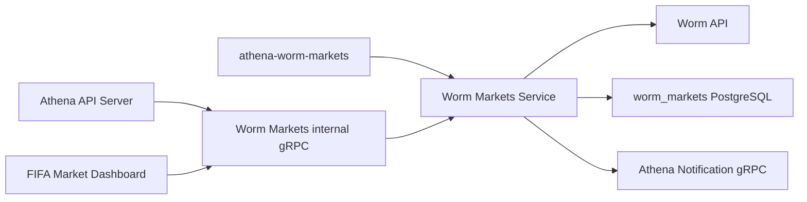

# Worm Markets

## Scope

Worm Markets owns the continuously synchronized read model for open Worm sports
leverage markets. It polls the Worm API, stores market snapshots and a rolling
price window, fills missing market rules, derives one-way live state, emits new
event, live-event, and extreme-price notifications, and exposes event reads over
its internal gRPC API. The Athena API Server publishes the same capability under
the `/api/v1/worm-markets` HTTP namespace.

The service does not own user wallets, FIFA cross-market composition, or the
presentation of Worm data in a page. Requester-scoped wallet holdings and the
combined Worm/Polymarket FIFA view belong to the independent
[FIFA Market Dashboard](fifa-market-dashboard.md). The generic Worm HTTP client
in `util/worm` remains an external-provider adapter rather than part of this
capability's application state.

## Source Locations

| Concern | Source | Key symbols |
| --- | --- | --- |
| Binary dispatch | [cmd/main.go](../../../cmd/main.go) | `main`, `ATHENA_BINARY_NAME` dispatch |
| Process composition and configuration | [cmd/athena-worm-markets/commands/athena-worm-markets.go](../../../cmd/athena-worm-markets/commands/athena-worm-markets.go) | `NewCommand` |
| gRPC lifecycle and health | [internal/wormmarkets/server.go](../../../internal/wormmarkets/server.go) | `Server`, `NewServer`, `Start`, `Stop` |
| Synchronization and read API | [internal/wormmarkets/service.go](../../../internal/wormmarkets/service.go) | `Service`, `Start`, `syncWormMarketsOnce`, `ListWormEvents`, `GetWormEvent` |
| Notification policy and delivery | [internal/wormmarkets/notifications.go](../../../internal/wormmarkets/notifications.go) | `sendWormNotifications`, `newWormEventNotifications`, `newWormLiveNotification`, `newWormPriceAlertNotification` |
| Internal service contract | [internal/wormmarkets/wormmarkets.proto](../../../internal/wormmarkets/wormmarkets.proto) | `WormMarketsService` |
| Public HTTP/gRPC contract | [internal/server/wormmarkets/wormmarkets.proto](../../../internal/server/wormmarkets/wormmarkets.proto) | `WormMarketsService` HTTP annotations |
| Public proxy | [internal/server/wormmarkets/wormmarkets.go](../../../internal/server/wormmarkets/wormmarkets.go) | `Server`, `GetWormEvent`, `ListWormEvents` |
| Internal gRPC connection ownership | [internal/wormmarkets/apiclient/apiclient.go](../../../internal/wormmarkets/apiclient/apiclient.go), [util/grpc/client.go](../../../util/grpc/client.go) | `Clientset`, `NewWormMarketsClientset`, `ClientConnection` |
| Provider adapter | [util/worm/worm.go](../../../util/worm/worm.go) | `Client`, `NewClient`, `DefaultBaseURL` |
| PostgreSQL connection and migrations | [internal/wormmarkets/store/sql_store.go](../../../internal/wormmarkets/store/sql_store.go) | `SQLStore`, `NewSQLStoreSource`, `Migrations` |
| Durable store operations | [internal/wormmarkets/store/worm_markets_store.go](../../../internal/wormmarkets/store/worm_markets_store.go) | `BatchUpsertWormMarkets`, `ListWormEventsPage`, `UpdateWormMarketLiveState` |
| Schema and query semantics | [internal/wormmarkets/store/migrations/000001_init.sql](../../../internal/wormmarkets/store/migrations/000001_init.sql), [internal/wormmarkets/store/queries/worm_markets_market.sql](../../../internal/wormmarkets/store/queries/worm_markets_market.sql) | `worm_markets_market`, `worm_markets_price_history` |
| Shared API model | [pkg/apis/application/v1alpha1/worm_markets_types.go](../../../pkg/apis/application/v1alpha1/worm_markets_types.go) | `WormMarketsEventItem`, `WormMarketsMarketItem`, `WormMarketsMarginPositionEstimateItem` |

## Architecture

`NewCommand` creates one PostgreSQL store, one Worm provider client, and an
optional Notification clientset, then gives them to one `Service`. The service
owns three independent background goroutines: the complete market sync, missing
rule enrichment, and live-state derivation. All three use the same store and
provider client. `syncMu` prevents overlapping complete market synchronizations;
the rule and live-state loops may execute concurrently with that sync.

The internal API has three unary methods. `ListWormEvents` reads the PostgreSQL
snapshot. `GetWormEvent` intentionally reads the selected event directly from
Worm, then enriches its markets concurrently with detail and margin-estimate
requests. `GetWormMarketsStatus` reports only whether the service lifecycle has
started. The API Server is a thin proxy with one process-owned Worm Markets
channel shared by API and health requests; it does not duplicate business state.

## Runtime Flow

1. `athena-worm-markets` connects to the `worm_markets` database, optionally
   applies embedded migrations, builds the Worm API client and Notification
   clientset, binds the gRPC listener, and constructs the server.
2. `Server.Start` calls `Service.Start`. Startup fails if the store or Worm
   client is absent. A cancellable process context is created, the market-sync,
   rule, and live-state goroutines are launched, and only then does standard
   gRPC health change from `NOT_SERVING` to `SERVING`.
3. The market-sync loop runs immediately and every minute. One sync walks all
   upstream pages of `state=open`, `category=sports`, `sort=leverage` with at
   most 100 markets per page. It discards malformed, duplicate, or out-of-scope
   rows; normalizes relative asset URLs; stores each page with one batch upsert;
   and records parseable last-trade prices in a separate batch statement.
4. A sync records one `syncStartedAt` boundary. Only after every upstream page
   succeeds does it delete markets whose `last_seen_at` predates that boundary.
   Deletion cascades to their price samples. An empty database suppresses the
   initial flood of new-event notifications; later inserts are grouped by event
   and produce at most one new-event notification per newly observed event.
5. The rule loop runs immediately and every minute. It lists markets whose
   `rules` column is null, fetches each market detail sequentially, and writes
   the returned rules only while that column remains null.
6. The live-state loop runs immediately and every minute. It deletes samples
   older than 30 minutes, calculates each not-yet-live market's sample count and
   max-minus-min range, and classifies it as `live` when at least two samples
   span more than `0.05`. Otherwise it is `not_live` with two samples or remains
   `unknown`. A first live market for an event produces one live notification.
7. After a market sync, live open markets are classified into durable price
   alert bands: `a` for 80/20, `b` for 90/10, and `c` for 95/5. Entering a
   non-`none` band sends a notification before a compare-and-set update of the
   stored band. Returning to the middle range resets the band without an alert.
8. `ListWormEvents` validates a limit from 1 through 100, accepts only the fixed
   `leverage` sort and `sports` category, interprets the cursor as a nonnegative
   integer offset, and returns event aggregates ordered live-first and then by
   newest upstream creation time. `stale` is currently always false.
9. `GetWormEvent` requires a condition ID and maps provider 404 responses to
   gRPC `NotFound`. It fetches market detail concurrently for every returned
   market and, when margin trading and its config are valid, estimates a YES
   position using 200 funds and maximum YES leverage. An individual enrichment
   failure is returned in that market's `trading_data_error` instead of failing
   the event RPC.
10. On `SIGINT` or `SIGTERM`, the command first gracefully stops gRPC, marks
    health `NOT_SERVING`, cancels all three loops, waits for them to exit, and
    closes its Notification channel and PostgreSQL. The API Server and FIFA
    Market Dashboard close their independent Worm Markets channels only after
    their own serving or background-loop lifecycles end.

Each generated SQL call is its own PostgreSQL transaction boundary. A page
upsert, its price-history write, later stale-row cleanup, live-state changes,
and alert-band changes do not share one explicit transaction.

## State / Data

`worm_markets_market` is the current durable market snapshot keyed by Worm
`condition_id`. It stores display fields, event identity, the fixed browse
classification, margin capability, raw upstream JSON, optionally enriched rule
JSON, fetch and last-seen times, derived live fields, and the current price alert
band. Database checks restrict stored rows to open sports leverage markets,
valid live states, valid alert bands, nonnegative creation values, object-shaped
raw JSON, and array-shaped rules when rules are present.

`worm_markets_price_history` is keyed by `(condition_id, sampled_at)` and
references the market with `ON DELETE CASCADE`. It is a working 30-minute window
for live detection, not an archival price-history product. Samples are upserted
at the timestamp of each page fetch and must be nonnegative.

Events are not stored separately. Event pages group current market rows by
`event_condition_id`, choose the most recent nonempty title and logo, and derive
event liveness with `BOOL_OR(live_state = 'live')`. Offset pagination is
therefore evaluated against the current snapshot and is not a stable cursor
across synchronization changes.

Market upserts refresh upstream fields while preserving rules, live state,
live-check metadata, live price change, and alert band. Live state is monotonic:
the update query never replaces an existing `live` value. Rule and alert-band
updates use conditional writes to avoid overwriting a concurrent transition.

The only process-local state is lifecycle cancellation/waiting, the `started`
flag, and the synchronization mutex. No sync cursor, freshness status,
notification delivery record, or event cache is held in memory.

## Configuration

| Setting | Behavior |
| --- | --- |
| `ATHENA_WORM_MARKETS_LISTEN_ADDRESS` / `--address` | gRPC bind address; default `0.0.0.0`. |
| `--port` | gRPC port; default `8084`. The local Procfile maps `ATHENA_WORM_MARKETS_PORT` to this flag. |
| `ATHENA_WORM_MARKETS_API_BASE_URL` / `--worm-api-base-url` | Worm provider base URL; default `https://api.worm.wtf`. The same base resolves relative asset URLs. |
| `ATHENA_WORM_MARKETS_POSTGRES_DSN` | PostgreSQL connection for database `worm_markets`; required by store startup. |
| `ATHENA_POSTGRES_AUTO_MIGRATE` | Controls embedded migration application during store connection; default `true`. |
| `ATHENA_WORM_MARKETS_NOTIFICATION_ENABLED` / `--notification-enabled` | Creates the Notification clientset when true; default `true`. Disabling it does not disable synchronization or reads. |
| `ATHENA_WORM_MARKETS_NOTIFICATION_SERVER_ADDRESS` / `--notification-server-address` | Notification gRPC target; local default `127.0.0.1:8086`. Production Compose supplies its service DNS address. |
| `ATHENA_LOG_FORMAT`, `ATHENA_LOG_LEVEL` / command flags | Shared process log format and level; defaults `json` and `info`. |

The one-minute loop intervals, 100-market upstream page size, 30-minute live
window, `0.05` live range threshold, price-alert bands, notification topics,
10-second notification timeout, and 200-fund margin estimate are implementation
constants rather than runtime configuration.

## Invariants

- Persisted markets always have nonempty market and event condition IDs and
  belong to the open sports browse view sorted by leverage.
- A full sync removes unseen markets only after the complete upstream page walk
  succeeds; an upstream page failure must not trigger stale-row deletion.
- Provider refreshes must preserve locally derived rules, live state, live
  evidence, and alert-band state.
- Once a market is `live`, synchronization and live-state evaluation cannot
  downgrade it. Event liveness is consequently monotonic while any constituent
  market remains stored.
- At least two samples inside the rolling window and a price range greater than
  `0.05` are required for live classification.
- Initial database population never emits new-event notifications.
- A non-`none` price alert band is committed only after its notification is
  delivered successfully; the expected old band must still match.
- `ListWormEvents` is served from owned PostgreSQL state, while `GetWormEvent`
  is a fresh provider read. Callers must not assume both responses share one
  snapshot.
- gRPC `SERVING` and `GetWormMarketsStatus.started=true` mean the loops were
  launched, not that an upstream sync has succeeded or that data is fresh.

## Failure Recovery

Invalid Worm client configuration, Notification target, database connection or
migration failure, listener failure, or missing required service dependencies
prevents startup. Temporary Notification unavailability does not prevent
startup because its nonblocking channel reconnects in the background. The
command starts neither gRPC health serving nor background work after a local
construction failure.

Background-loop failures are logged and retried at the next one-minute tick.
Because a complete sync has no encompassing transaction, successfully written
pages and samples remain visible if a later page fails. Existing unseen markets
are retained because cleanup occurs only after the full page walk. Idempotent
upserts repair the partial refresh on the next successful run.

Missing-rule failures leave `rules` null and are retried by the rule loop.
Live-state calculation updates rows individually; an error stops that pass and
the next pass resumes from durable market and sample state. Expired sample
cleanup happens before calculation, so a cleanup or query failure leaves the
previous derived states intact.

New-event and live-event delivery occurs after the insert or live-state
transition that identified the event. Those notifications have no durable
outbox and are not retried after that transition. Price alerts deliberately send
before changing `price_alert_band`; a send failure or concurrent compare-and-set
failure leaves the old band and causes a later sync to retry the transition.

Provider failures in `GetWormEvent` fail the RPC as `Unavailable`, except 404,
which is `NotFound`. Per-market trading enrichment is best effort. Cancellation
propagates to provider, database, and notification operations; graceful shutdown
waits until all background goroutines return.

## Observability

The process logs version/startup metadata and its listen port. Debug logs report
the number of synchronized markets, enriched rules, and evaluated live states.
Warnings identify failed syncs, rule fetches, live-state operations,
notifications, and concurrent alert-band changes with condition or event IDs
where available.

The server registers standard gRPC health, Version, and Worm Markets services.
Health is `NOT_SERVING` before `Service.Start` and after `Server.Stop`, and
`SERVING` between them. `GetWormMarketsStatus` exposes the same lifecycle as
`started` plus `running` or `stopped`. The API Server exposes this status at
`GET /api/v1/worm-markets/status`; reads are protected by the
`worm-markets:get` capability resource.

There are no Worm Markets-specific metrics, readiness probe, last-success
timestamp, sync lag field, or durable notification-delivery diagnostics. Data
freshness must currently be inferred from response `fetched_at` values, stored
timestamps, and logs rather than health.

## Change Checklist

- [ ] Component responsibilities and boundaries still match this document.
- [ ] Runtime, concurrency, and transaction flows are current.
- [ ] State, data, interfaces, configuration, dependencies, and invariants are current.
- [ ] Failure recovery, health checks, and observability are current.
- [ ] Source links and named symbols resolve to the implementation.
- [ ] The [design index](../README.md) contains the correct entry.
