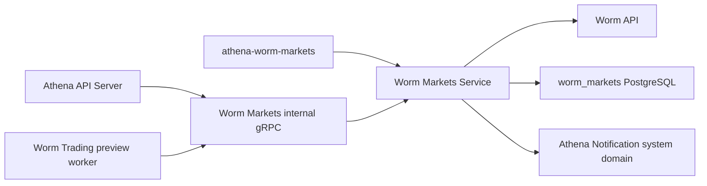

# Worm Markets

> 范围修订（2026-09-16）：用户明确保留 Worm Markets 和 Worm Trading，撤回此前 Worm 删除决定。本文业务及其页面、权限、配置、签名、凭据和数据继续保留；详见[Sports 删除与 Worm 保留决定](../../requirements/development-runtime/sports-removal.md)。现有实现与原有设计继续按本文维护。

> 访问接入目标（2026-09-16 已确认，尚未实施）：Worm Markets／Trading 共用一个 `worm` 访问开关，原有两类账户权限分别保留。新的用户请求受控，已受理后台工作继续按原规则处理；重新开放不自动补发交易。具体入口、验证回调与页面驱动边界见[访问接入设计](../../superpowers/specs/2026-09-15-business-access-control-design.md)，独立进程、配置与就绪见[运行配套](../../superpowers/specs/2026-09-15-local-full-stack-design.md#33-worm-两服务接入)。下文仍描述现有业务实现。

## Scope

Worm Markets owns the continuously synchronized read model for open Worm sports
leverage markets. It polls the Worm API, stores market snapshots and a rolling
price window, fills missing market rules, derives one-way live state, emits new
event, live-event, and extreme-price system-management notifications, and
exposes event reads over its internal gRPC API. It also exposes a fresh,
read-only combination catalog
for one Worm event. That catalog preserves every child market, marks each market
and YES/NO outcome with stable selectability reasons, and projects an optional
pair of complementary last-trade prices. It performs no margin estimate or
mutation. The Athena API Server publishes the browse capability
under `/api/v1/worm-markets`. The interactive Worm Trading Combinations facade
uses the catalog for builder display and trusted saves, while the Worm Trading
execution-preview worker refetches it to freeze current market availability,
backend, and `1x` eligibility before estimating a plan.

The service does not own user wallets or the presentation of Worm data in a
page. The generic Worm HTTP client in `util/worm` remains an external-provider
adapter rather than part of this capability's application state.
Athena Notification owns delivery after a system notification is accepted.
Worm Markets never selects an account or sends an account notification.

## Source Locations

| Concern | Source | Key symbols |
| --- | --- | --- |
| Binary dispatch | [cmd/main.go](../../../cmd/main.go) | `main`, `ATHENA_BINARY_NAME` dispatch |
| Process composition and configuration | [cmd/athena-worm-markets/commands/athena-worm-markets.go](../../../cmd/athena-worm-markets/commands/athena-worm-markets.go) | `NewCommand` |
| gRPC lifecycle and health | [internal/wormmarkets/server.go](../../../internal/wormmarkets/server.go) | `Server`, `NewServer`, `Start`, `Stop` |
| Synchronization and browse API | [internal/wormmarkets/service.go](../../../internal/wormmarkets/service.go) | `Service`, `Start`, `syncWormMarketsOnce`, `ListWormEvents`, `GetWormEvent` |
| Combination event catalog | [internal/wormmarkets/order_event_catalog.go](../../../internal/wormmarkets/order_event_catalog.go) | `GetOrderEventCatalog`, `getOrderEventCatalogMarkets`, `getOrderEventCatalogMarket`, `orderEventCatalogPricesFromLastTrade`, stable unavailable codes |
| Notification policy and delivery | [internal/wormmarkets/notifications.go](../../../internal/wormmarkets/notifications.go) | `sendWormNotifications`, `newWormEventNotifications`, `newWormLiveNotification`, `newWormPriceAlertNotification` |
| Internal service contract | [internal/wormmarkets/wormmarkets.proto](../../../internal/wormmarkets/wormmarkets.proto) | `WormMarketsService` |
| Public HTTP/gRPC contract | [internal/server/wormmarkets/wormmarkets.proto](../../../internal/server/wormmarkets/wormmarkets.proto) | `WormMarketsService` HTTP annotations |
| Public proxy | [internal/server/wormmarkets/wormmarkets.go](../../../internal/server/wormmarkets/wormmarkets.go) | `Server`, `GetWormEvent`, `ListWormEvents` |
| Internal gRPC connection ownership | [internal/wormmarkets/apiclient/apiclient.go](../../../internal/wormmarkets/apiclient/apiclient.go), [util/grpc/client.go](../../../util/grpc/client.go) | `Clientset`, `NewWormMarketsClientset`, `ClientConnection` |
| System notification contract and authenticated client | [internal/notification/notification.proto](../../../internal/notification/notification.proto), [internal/notification/apiclient/apiclient.go](../../../internal/notification/apiclient/apiclient.go) | `SystemNotificationService`, `SendSystemNotification`, `Clientset.System`, `InternalAuthTokenEnv` |
| Provider adapter | [util/worm/worm.go](../../../util/worm/worm.go) | `Client`, `NewClient`, `DefaultBaseURL` |
| PostgreSQL connection and migrations | [internal/wormmarkets/store/sql_store.go](../../../internal/wormmarkets/store/sql_store.go) | `SQLStore`, `NewSQLStoreSource`, `Migrations` |
| Durable store operations | [internal/wormmarkets/store/worm_markets_store.go](../../../internal/wormmarkets/store/worm_markets_store.go) | `BatchUpsertWormMarkets`, `ListWormEventsPage`, `UpdateWormMarketLiveState` |
| Schema and query semantics | [internal/wormmarkets/store/migrations/000001_init.sql](../../../internal/wormmarkets/store/migrations/000001_init.sql), [internal/wormmarkets/store/queries/worm_markets_market.sql](../../../internal/wormmarkets/store/queries/worm_markets_market.sql) | `worm_markets_market`, `worm_markets_price_history` |
| Shared API model | [pkg/apis/application/v1alpha1/worm_markets_types.go](../../../pkg/apis/application/v1alpha1/worm_markets_types.go) | `WormMarketsEventItem`, `WormMarketsMarketItem`, `WormMarketsMarginPositionEstimateItem` |

## Architecture

`NewCommand` creates one PostgreSQL store, one Worm provider client, and an
optional authenticated Notification clientset, then gives them to one
`Service`. The service owns three independent background goroutines: the
complete market sync, missing rule enrichment, and live-state derivation. All
three use the same store and provider client. `syncMu` prevents overlapping
complete market synchronizations; the rule and live-state loops may execute
concurrently with that sync. Alerts use only the Notification system domain;
Worm Markets never calls `AccountNotificationService`.

The internal API has four unary methods. `ListWormEvents` reads the PostgreSQL
snapshot. `GetWormEvent` intentionally reads the selected event directly from
Worm, then enriches its markets concurrently with detail and margin-estimate
requests. `GetOrderEventCatalog` is a separate provider-backed projection for
combination construction: it performs one event read and at most one detail
read per unique child market, retains provider order, and never estimates a
position. At most eight detail requests run concurrently. A valid open,
margin-enabled Polymarket or Hyperliquid market exposes canonical YES and NO
outcomes; each outcome is selectable only when its maximum leverage is a finite
number at least `1`. Market-detail failures and invalid market, event, backend,
outcome, or leverage data remain explicit catalog entries with stable
`unavailable_code` values. When Worm supplies a valid `last_trade_price`, the
catalog uses it as the YES price and computes NO as the exact decimal complement
to `1`; both prices are absent when a valid pair cannot be formed. Price presence
does not participate in selectability. The same catalog RPC serves both
interactive combination work and asynchronous execution-preview validation;
neither caller may treat the saved template snapshot as current market state.
`GetWormMarketsStatus` reports only
whether the service lifecycle has started. The API Server shares one
process-owned Worm Markets channel across browse, combination, and health
requests and does not duplicate provider state. Worm Trading owns a separate
process-lifetime clientset for its asynchronous preview worker; both clients
reach the same stateless catalog RPC.

## Runtime Flow

1. `athena-worm-markets` connects to the `worm_markets` database, optionally
   applies embedded migrations, builds the Worm API client and Notification
   clientset with the internal Bearer, binds the gRPC listener, and constructs
   the server.
2. `Server.Start` calls `Service.Start`. Startup fails if the store or Worm
   client is absent. A cancellable process context is created, the market-sync,
   rule, and live-state goroutines are launched, and only then does standard
   gRPC health change from `NOT_SERVING` to `SERVING`.
3. The market-sync loop runs immediately and every minute. One sync walks all
   upstream pages of `state=open`, `category=sports`, `sort=leverage` with at
   most 100 markets per page. It discards malformed, duplicate, or out-of-scope
   rows; normalizes relative asset URLs; stores each page with one batch upsert;
   and records parseable last-trade prices in a separate batch statement.
4. A sync records one `syncStartedAt` boundary. Only after every upstream page
   succeeds does it delete markets whose `last_seen_at` predates that boundary.
   Deletion cascades to their price samples. An empty database suppresses the
   initial flood of new-event notifications; later inserts are grouped by event
   and produce at most one new-event system notification per newly observed
   event through `Clientset.System().SendSystemNotification`.
5. The rule loop runs immediately and every minute. It lists markets whose
   `rules` column is null, fetches each market detail sequentially, and writes
   the returned rules only while that column remains null.
6. The live-state loop runs immediately and every minute. It deletes samples
   older than 30 minutes, calculates each not-yet-live market's sample count and
   max-minus-min range, and classifies it as `live` when at least two samples
   span more than `0.05`. Otherwise it is `not_live` with two samples or remains
   `unknown`. A first live market for an event produces one live system
   notification through the same method.
7. After a market sync, live open markets are classified into durable price
   alert bands: `a` for 80/20, `b` for 90/10, and `c` for 95/5. Entering a
   non-`none` band submits a system notification before a compare-and-set update
   of the stored band. Returning to the middle range resets the band without an
   alert.
8. `ListWormEvents` validates a limit from 1 through 100, accepts only the fixed
   `leverage` sort and `sports` category, interprets the cursor as a nonnegative
   integer offset, and returns event aggregates ordered live-first and then by
   newest upstream creation time. `stale` is currently always false.
9. `GetWormEvent` requires a condition ID and maps provider 404 responses to
   gRPC `NotFound`. It fetches market detail concurrently for every returned
   market and, when margin trading and its config are valid, estimates a YES
   position using 200 funds and maximum YES leverage. An individual enrichment
   failure is returned in that market's `trading_data_error` instead of failing
   the event RPC.
10. `GetOrderEventCatalog` requires a canonical Solana public key as its Event
    Condition ID and maps provider 404 to gRPC `NotFound`. It rejects an event
    ID mismatch, malformed or duplicate child IDs, and cancellation at the RPC
    boundary. Child detail reads are bounded to eight concurrent calls. A
    detail failure does not remove the summary: the child remains present with
    `MARKET_DETAIL_UNAVAILABLE`, and a valid last-trade price from that same
    Event summary may still provide its display-only price pair. A successful
    detail supplies its own last-trade price. YES retains the provider decimal;
    NO is calculated with exact decimal arithmetic as `1 - YES`. Missing,
    malformed, or out-of-range values omit both prices without changing either
    direction's selectability. Other market-wide and per-outcome validation
    failures use stable unavailable codes. This path calls neither an additional
    provider endpoint, the margin estimate endpoint, the database, nor any Worm
    mutation. The Worm Trading preview worker calls this same RPC once per
    unique Event and performs its public Estimate calls through its own pinned
    Worm adapter after catalog validation.
11. On `SIGINT` or `SIGTERM`, the command first gracefully stops gRPC, marks
    health `NOT_SERVING`, cancels all three loops, waits for them to exit, and
    closes its Notification channel and PostgreSQL. The API Server closes its
    independent Worm Markets channel only after its own serving lifecycle ends.
    Worm Trading likewise closes its preview-worker clientset as part of that
    process's command teardown.

Each generated SQL call is its own PostgreSQL transaction boundary. A page
upsert, its price-history write, later stale-row cleanup, live-state changes,
and alert-band changes do not share one explicit transaction.

## State / Data

`worm_markets_market` is the current durable market snapshot keyed by Worm
`condition_id`. It stores display fields, event identity, the fixed browse
classification, margin capability, raw upstream JSON, optionally enriched rule
JSON, fetch and last-seen times, derived live fields, and the current price alert
band. Database checks restrict stored rows to open sports leverage markets,
valid live states, valid alert bands, nonnegative creation values, object-shaped
raw JSON, and array-shaped rules when rules are present.

`worm_markets_price_history` is keyed by `(condition_id, sampled_at)` and
references the market with `ON DELETE CASCADE`. It is a working 30-minute window
for live detection, not an archival price-history product. Samples are upserted
at the timestamp of each page fetch and must be nonnegative.

Events are not stored separately. Event pages group current market rows by
`event_condition_id`, choose the most recent nonempty title and logo, and derive
event liveness with `BOOL_OR(live_state = 'live')`. Offset pagination is
therefore evaluated against the current snapshot and is not a stable cursor
across synchronization changes.

Market upserts refresh upstream fields while preserving rules, live state,
live-check metadata, live price change, and alert band. Live state is monotonic:
the update query never replaces an existing `live` value. Rule and alert-band
updates use conditional writes to avoid overwriting a concurrent transition.

The only process-local state is lifecycle cancellation/waiting, the `started`
flag, and the synchronization mutex. No sync cursor, freshness status,
notification delivery record, or event cache is held in memory.

The combination catalog is a request-scoped projection only. It is not written
to `worm_markets_market`, cached across requests, or reused as saved-template
state. The execution-preview worker may copy its validated current fields into
the preview database, but Worm Markets retains no preview identity or lifecycle.
Titles, logos, market state, backend, outcome labels, leverage strings,
optional last-trade prices, selectability, and unavailable codes live only in
the current RPC response. The catalog price is a display observation from the
provider response, not a best ask, midpoint, estimate, executable quote, or
execution guarantee.

## Configuration

| Setting | Behavior |
| --- | --- |
| `ATHENA_WORM_MARKETS_LISTEN_ADDRESS` / `--address` | gRPC bind address; default `0.0.0.0`. |
| `--port` | gRPC port; default `8084`. This module is not selected by the default local full-stack graph; configure its direct process explicitly. |
| `ATHENA_WORM_MARKETS_API_BASE_URL` / `--worm-api-base-url` | Worm provider base URL; default `https://api.worm.wtf`. The same base resolves relative asset URLs. |
| `ATHENA_WORM_MARKETS_POSTGRES_DSN` | PostgreSQL connection for database `worm_markets`; required by store startup. |
| `ATHENA_POSTGRES_AUTO_MIGRATE` | Controls embedded migration application during store connection; default `true`. |
| `ATHENA_WORM_MARKETS_NOTIFICATION_ENABLED` / `--notification-enabled` | Creates the Notification clientset when true; default `true`. Disabling it does not disable synchronization or reads. |
| `ATHENA_WORM_MARKETS_NOTIFICATION_SERVER_ADDRESS` / `--notification-server-address` | Notification gRPC target; local default `127.0.0.1:8086`. Production Compose supplies its service DNS address. |
| `ATHENA_NOTIFICATION_INTERNAL_AUTH_TOKEN` | Shared Notification internal Bearer attached to every non-health system-domain RPC. It must contain at least 32 non-whitespace bytes and match the Notification process; Direct local launches must supply a matching token; Compose requires the production value. |
| `ATHENA_LOGFORMAT`, `ATHENA_LOGLEVEL` / `--logformat`, `--loglevel` | Shared process log format and level; defaults `json` and `info`. |

The one-minute loop intervals, 100-market upstream page size, 30-minute live
window, `0.05` live range threshold, price-alert bands, notification topics,
10-second notification timeout, browse-detail 200-fund margin estimate, and
eight-request combination-catalog detail concurrency are implementation
constants rather than runtime configuration.

## Invariants

- Persisted markets always have nonempty market and event condition IDs and
  belong to the open sports browse view sorted by leverage.
- A full sync removes unseen markets only after the complete upstream page walk
  succeeds; an upstream page failure must not trigger stale-row deletion.
- Provider refreshes must preserve locally derived rules, live state, live
  evidence, and alert-band state.
- Once a market is `live`, synchronization and live-state evaluation cannot
  downgrade it. Event liveness is consequently monotonic while any constituent
  market remains stored.
- At least two samples inside the rolling window and a price range greater than
  `0.05` are required for live classification.
- Initial database population never emits new-event notifications.
- A non-`none` price alert band is committed only after its system notification
  is accepted; the expected old band must still match.
- New-event, live-event, and price alerts use only authenticated
  `SystemNotificationService.SendSystemNotification`; Worm Markets never enters
  the account domain or supplies an account UUID.
- `ListWormEvents` is served from owned PostgreSQL state, while `GetWormEvent`
  is a fresh provider read. Callers must not assume both responses share one
  snapshot.
- `GetOrderEventCatalog` is also a fresh provider read. It preserves the event's
  child-market order, returns exactly one YES and one NO projection per child,
  and never estimates, signs, creates, or submits a trade. Both combination
  writes and execution-preview builds must refetch it rather than trusting a
  saved or browser-supplied availability snapshot.
- A catalog outcome is selectable only when all market-wide checks pass and its
  own maximum leverage is finite and at least `1`; unavailable children remain
  visible with stable machine-readable reasons.
- Catalog last-trade prices are either absent on both outcomes or valid decimal
  values in `[0,1]` whose exact sum is `1`. Their presence never makes a
  direction selectable or unselectable.
- gRPC `SERVING` and `GetWormMarketsStatus.started=true` mean the loops were
  launched, not that an upstream sync has succeeded or that data is fresh.

## Failure Recovery

Invalid Worm client configuration, Notification target, database connection or
migration failure, listener failure, or missing required service dependencies
prevents startup. A missing, short, or whitespace-bearing
`ATHENA_NOTIFICATION_INTERNAL_AUTH_TOKEN` also prevents startup when alerts are
enabled. Temporary Notification unavailability or a mismatched valid token does
not prevent startup because the nonblocking channel reconnects and later
unavailable or unauthenticated system sends follow normal alert failure
handling. The command starts neither gRPC health serving nor background work
after a local construction failure.

Background-loop failures are logged and retried at the next one-minute tick.
Because a complete sync has no encompassing transaction, successfully written
pages and samples remain visible if a later page fails. Existing unseen markets
are retained because cleanup occurs only after the full page walk. Idempotent
upserts repair the partial refresh on the next successful run.

Missing-rule failures leave `rules` null and are retried by the rule loop.
Live-state calculation updates rows individually; an error stops that pass and
the next pass resumes from durable market and sample state. Expired sample
cleanup happens before calculation, so a cleanup or query failure leaves the
previous derived states intact.

New-event and live-event delivery occurs after the insert or live-state
transition that identified the event. Those notifications have no durable
outbox and are not retried after that transition. Price alerts deliberately send
before changing `price_alert_band`; a send failure or concurrent compare-and-set
failure leaves the old band and causes a later sync to retry the transition.

Provider failures in `GetWormEvent` fail the RPC as `Unavailable`, except 404,
which is `NotFound`. Per-market trading enrichment is best effort. Cancellation
propagates to provider, database, and notification operations; graceful shutdown
waits until all background goroutines return.

Provider failures in `GetOrderEventCatalog` fail the event RPC as `Unavailable`,
except 404, which is `NotFound`. A child detail failure is isolated to that
catalog item and makes both directions unselectable; the Event summary can still
supply its last-trade price for display. An absent or invalid provider price
removes the complete YES/NO price pair rather than inventing a zero or weakening
catalog validation. Cancellation stops the bounded worker set and returns the
context status. Because the catalog is not persisted, retry performs a new
authoritative event and market read.

## Observability

The process logs version/startup metadata and its listen port. Debug logs report
the number of synchronized markets, enriched rules, and evaluated live states.
Warnings identify failed syncs, rule fetches, live-state operations,
notifications, and concurrent alert-band changes with condition or event IDs
where available.
The Notification internal Bearer is never included in logs or response data.

The server registers standard gRPC health, Version, and Worm Markets services.
Health is `NOT_SERVING` before `Service.Start` and after `Server.Stop`, and
`SERVING` between them. `GetWormMarketsStatus` exposes the same lifecycle as
`started` plus `running` or `stopped`. The API Server exposes this status at
`GET /api/v1/worm-markets/status`; reads are protected by the
`worm-markets:get` capability resource.

There are no Worm Markets-specific metrics, readiness probe, last-success
timestamp, sync lag field, or durable notification-delivery diagnostics. Data
freshness must currently be inferred from response `fetched_at` values, stored
timestamps, and logs rather than health.
`GetOrderEventCatalog` supplies its own request-time `fetched_at`, optional
last-trade price pairs, and stable per-market/outcome unavailable codes. The
timestamp records when Athena obtained the catalog; it is not the time of the
provider's last trade. The catalog adds no separate metric or readiness signal.

## Change Checklist

- [ ] Component responsibilities and boundaries still match this document.
- [ ] Runtime, concurrency, and transaction flows are current.
- [ ] State, data, interfaces, configuration, dependencies, and invariants are current.
- [ ] The combination catalog remains provider-backed, bounded, stable-reasoned, exact-complement-priced, and free of extra reads, owned persistence, estimates, and mutations for both combination and preview consumers.
- [ ] Failure recovery, health checks, and observability are current.
- [ ] New-event, live-event, and price alerts still use authenticated `SendSystemNotification` only and never enter the account domain.
- [ ] Source links and named symbols resolve to the implementation.
- [ ] The [design index](../README.md) contains the correct entry.
