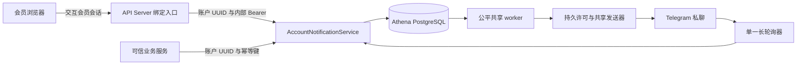

# 账户 Telegram 通知

> 设计状态：已实现；发送恢复与新调度器的后续范围见文末。

## 范围

账户 Telegram 通知在 `athena-notification` 进程中负责普通账户绑定与持久私聊投递，包括浏览器绑定尝试、Bot 更新消费、账户与 Telegram 私聊的一对一关系、绑定 revision、投递幂等及不可达收件人恢复。

业务服务决定何时通知账户，并调用内部账户契约。本能力不订阅业务事件，不公开账户投递历史或个人测试发送接口，也不管理管理员系统通知的 Topic 和记录；后者见[系统通知运营](system-notification-operations.md)。

## 源码入口

| 职责 | 源码 | 关键符号 |
| --- | --- | --- |
| 内部账户与共享运行契约 | [internal/notification/notification.proto](../../../internal/notification/notification.proto) | `AccountNotificationService`, `NotificationRuntimeService`, `SendAccountNotification` |
| 公开会员入口 | [internal/server/notification/notification.proto](../../../internal/server/notification/notification.proto), [internal/server/notification/notification.go](../../../internal/server/notification/notification.go) | 会员绑定 HTTP 路由, `authenticatedAccountID`, `publicTelegramBinding` |
| 公开鉴权 | [internal/server/authz.go](../../../internal/server/authz.go) | `ordinaryMemberInteractiveGRPCMethods`, `authorizeOrdinaryInteractiveAccount` |
| 绑定与入队逻辑 | [internal/notification/service.go](../../../internal/notification/service.go) | `GetTelegramBinding`, `CreateTelegramBindingAttempt`, `DeleteTelegramBinding`, `SendAccountNotification` |
| Telegram 更新消费 | [internal/notification/poller.go](../../../internal/notification/poller.go) | `TelegramPoller`, `handleMessage`, `handleMyChatMember` |
| 公平投递与共享发送器 | [internal/notification/worker.go](../../../internal/notification/worker.go), [internal/notification/sender.go](../../../internal/notification/sender.go) | `claimFairNotificationBatch`, `processClaimedAccountNotification`, `TelegramSender` |
| Telegram 适配器 | [util/telegram/telegram.go](../../../util/telegram/telegram.go) | `Client`, `PollUpdates`, `GetWebhookInfo`, dynamic `SendMessageRequest.ChatID` |
| 持久模型与查询 | [internal/accountstate/store/migrations/000001_init.sql](../../../internal/accountstate/store/migrations/000001_init.sql), [internal/notification/store/queries/telegram_bindings.sql](../../../internal/notification/store/queries/telegram_bindings.sql), [internal/notification/store/queries/account_notifications.sql](../../../internal/notification/store/queries/account_notifications.sql) | 绑定、尝试、消费位置、版本及账户投递表 |
| 事务存储入口 | [internal/notification/store/telegram_bindings.go](../../../internal/notification/store/telegram_bindings.go), [internal/notification/store/account_notifications.go](../../../internal/notification/store/account_notifications.go) | `CompleteTelegramBindingAttempt`, `EnqueueAccountNotification`, `Authorize`、`RecordStarted`、`RecordOutcome` |
| 进程装配与内部鉴权 | [cmd/athena-notification/commands/athena_notification.go](../../../cmd/athena-notification/commands/athena_notification.go), [internal/notification/server.go](../../../internal/notification/server.go), [internal/notification/apiclient/internal_auth.go](../../../internal/notification/apiclient/internal_auth.go) | 单一 Telegram 客户端, `InternalAuthTokenEnv`, gRPC 拦截器 |
| 会员界面 | [ui/src/app/member/pages/notifications.tsx](../../../ui/src/app/member/pages/notifications.tsx), [ui/src/app/member/notification-service.ts](../../../ui/src/app/member/notification-service.ts), [ui/src/app/member/notification-storage.ts](../../../ui/src/app/member/notification-storage.ts) | `NotificationsPage`, `MemberNotificationService`, 单标签页绑定指引 |
| 持久发送许可及结果 | [attempts.go](../../../internal/notification/store/attempts.go)、[delivery/types.go](../../../internal/notification/delivery/types.go)、[delivery_attempts.sql](../../../internal/notification/store/queries/delivery_attempts.sql) | `Permit`、`Outcome`、`Authorize`、`RecordStarted`、`RecordOutcome` |
| HTTP 调用证据 | [send_transport.go](../../../util/telegram/send_transport.go) | `WithSendStarted`、`SendError`、`sendTransport` |

## 架构与权限

会员浏览器只调用公开绑定入口。API Server 从已认证会员上下文取得账户 UUID，构造内部请求；公开请求不含目标账户字段。内部账户服务与运行服务共用 PostgreSQL 存储、Telegram Bot、长轮询器及系统通知发送器。

公开鉴权只允许使用交互会员登录凭据的 Pending 或活跃普通账户，拒绝管理员会话与 API Key。除标准 gRPC health 外，全部内部通知 RPC 要求同一经过校验的 Bearer；health 无需认证。

## 运行流程

1. 进程根据 Bot token 创建一个 Telegram 客户端，映射 `test`/`prod` 系统 chat ID，校验内部 Bearer，同步 Bot 资料，确认没有 webhook，加载持久 `next_update_id`，再启动 poller 与 worker。
2. `GET /api/v1/notification-bindings/telegram` 注入当前账户 UUID，返回安全绑定投影、当前绑定尝试和 Bot 名称/可用性；浏览器不接收 Telegram 数字 user ID 或私聊 chat ID。
3. 创建绑定尝试生成 32 字节加密随机数，编码为无 padding 的 43 字符 Base64URL token，仅保存 SHA-256 digest。新尝试替换该账户旧尝试，有效期十分钟；响应只返回一次 `https://t.me/<bot>?start=<token>` 与 `/start <token>`。
4. 会员页面把尝试 ID、深链接与备用命令保存在当前标签页 `sessionStorage`。可见时每三秒单飞读取状态；恢复焦点/可见时立即读取。成功、失败、本地过期、尝试 ID 不符、取消、解绑、会话结束和账户变化均清理缓存。
5. Poller 只接受非 Bot 用户在私聊中发送的 token，且 Telegram user ID 必须等于 chat ID。解析时不记录 token 或更新正文；取得账户和 Telegram 身份 advisory lock，锁定并复核尝试，检查身份唯一性，分配新 revision，终止旧绑定未许可投递，替换绑定并删除已消费尝试，全部在同一事务完成。身份锁在唯一索引之前串行化不同账户的竞争。
6. 重绑在新 token 成功消费前保持原绑定有效。取消只删除尝试。解绑在同一账户 gate 内删除绑定和尝试，取消 pending 投递，并给 sending 投递写永久资格墓碑；已有许可仍可完成或成为 unknown。
7. 每条更新处理成功后推进持久 offset；空成功轮询更新 `last_poll_at`，处理更新也写 `last_update_at`。重复更新受 token 状态、身份、账户锁和 revision 约束。
8. `my_chat_member` 的离开/封禁更新将对应绑定标为 unreachable，取消 pending 并撤销 sending 的后续尝试资格。之后的 `member` 更新恢复同一绑定可达性，但不复活已取消投递或资格墓碑。
9. `SendAccountNotification` 规范化账户 UUID、内容、来源、严重程度和幂等键，计算 payload digest，在账户 gate 内入队。相同 `(account_id, source, idempotency_key)` 返回原投递；不同 payload 冲突。绑定不存在或不可达时不插入投递；只有 connected 绑定产生 pending 并返回 `QUEUED` 与 ID。
10. Worker 交替领取账户与系统队列。领取只占用调度锁，不增加发送尝试数。`Authorize` 在共享账户 gate 的短事务中再次核验 owner、私聊身份、chat/revision、connected、pending、永久资格墓碑、重试时间与五次上限，插入 attempt 并将投递改为 sending，提交后才调用 Telegram。
11. HTTP `RoundTrip` 入口通过容量为一的 channel 握手记录实际 started 时间；回调不等待数据库或 HTTP 响应。结果通过独立事务按投递 ID、attempt UUID、sending 状态 CAS 写入。

## 状态与数据

- `telegram_binding_versions` 为每个账户保存跨解绑持续递增的 revision；只有成功 token 建立/替换绑定才递增，可达性变化不改变 revision。
- `telegram_bindings` 以账户 UUID 为键，Telegram user ID 与私聊 chat ID 各自唯一；保存安全名称、状态、revision、绑定/更新时间与错误类别。
- `telegram_binding_attempts` 每账户一行，全局唯一 32 字节 token digest；状态为 pending/failed，失败码如 `expired`、`telegram_identity_in_use`。绑定尝试状态与消息状态分离。
- `telegram_polling_state` 为单例，保存 next update ID、最近成功轮询/处理时间及更新时间。
- `account_notification_deliveries` 固定 owner、来源、幂等键、payload digest、正文、私聊 chat ID 与 revision；状态为 pending/sending/sent/failed/unknown/cancelled。`current_attempt_id` 指向当前许可，`eligibility_revoked_at/reason` 永久禁止旧投递重试。
- `notification_delivery_attempts` 保存 UUID、work kind/ID、账户 owner、sender incarnation、payload digest、authorized/started/result 时间、provider message ID、outcome/code 和 retry-after。许可事务核验 kind 对应的投递及 owner；不可把许可用于不同 payload。缺失的实际起点保留 NULL，不由授权或结果时间补造。

通知与账户表共用 Athena 数据库及唯一权威迁移。通知表没有账户外键，owner 由认证公开入口或可信内部调用提供。原始绑定 token 只出现在创建响应、标签页存储和 Telegram 命令中。

## 配置

| 配置 | 行为 |
| --- | --- |
| `ATHENA_SERVER_POSTGRES_DSN` | 共享 Athena 数据库与权威嵌入迁移。 |
| `ATHENA_NOTIFICATION_INTERNAL_AUTH_TOKEN` | 内部共享 Bearer，至少 32 字节且不含空白/控制字符。 |
| `ATHENA_NOTIFICATION_TELEGRAM_BOT_TOKEN` | 账户/系统共享 Bot 的必需 token。 |
| `ATHENA_NOTIFICATION_TELEGRAM_API_URL` | Telegram API 地址，默认官方地址。 |
| `ATHENA_NOTIFICATION_TELEGRAM_TIMEOUT_SECONDS` | 非轮询适配器 HTTP 超时；worker 发送另有五秒 context 截止。长轮询使用独立客户端和超时。 |
| `ATHENA_NOTIFICATION_TELEGRAM_BOT_NAME`、`..._SHORT_DESCRIPTION`、`..._DESCRIPTION` | 启动同步的 Bot 资料。 |
| `ATHENA_NOTIFICATION_WORKER_SEND_INTERVAL` | 当前共享串行发送间隔，默认 1.1 秒。 |
| `ATHENA_NOTIFICATION_WORKER_POLL_INTERVAL`、`..._BATCH_SIZE`、`..._LOCK_TIMEOUT` | 队列轮询、公平批量与尚未许可的领取锁恢复。发送总尝试上限固定为五次。 |

进程只运行一个长轮询消费者。Procfile 提供本地内部凭据；生产 Compose 把同一凭据注入 Notification 与可信调用方。Bot token 和具体系统群组 ID 仅提供给 Notification 容器。

## 不变量与故障处理

- 普通账户最多一个私聊绑定，Telegram 身份最多归属一个账户；账户和身份 advisory lock 保护并发绑定。一致的账户 gate 名称为 `athena:account:<UUID>`。
- 公开绑定请求不接受目标 UUID，管理员与 API Key 不跨普通会员交互边界；原始 token、完整更新、Bot 凭据和私聊数字身份不进入日志或公开响应。
- 缺失/不可达收件人不入队，一个幂等 tuple 不产生多行；账户历史和个人测试发送不是公开 V1 功能。
- 解绑/重绑先提交则不能取得旧资格的新许可；已有单条许可可完成。重新绑定或恢复可达性都不能清除旧投递的资格墓碑。
- sent/failed/unknown/cancelled 为终态。失去资格后的明确 failed/retryable 结果将投递终结为 cancelled，attempt 仍保存原始 failed/retryable 证据。只有明确 retryable 且仍有资格、尝试数小于五才回 pending；等待为 1/2/4/8 秒退避与 Telegram Retry-After 的最大值。网络断连、超时、取消、响应读取或解析失败发生在 HTTP 起点之后时结果为 unknown，不自动重发。发送不跟随重定向，不使用隐式 POST 重放。
- 成功回执即使缺 started 也写 sent。结果写库失败只重试相同 attempt 的结果 CAS；提交不确定先按 UUID 查询结果，无法确认则继续保留已消耗许可，不能发送。迟到或冲突结果不能覆盖终态。
- 明确 forbidden/not-found/blocked 结果失败当前投递，将仍匹配的绑定标为 unreachable 并取消余下未许可任务；之后恢复绑定也不重建旧任务。

配置 webhook 会阻止启动，因为 Telegram 不允许其与 `getUpdates` 共存。Poller 失败使用有上限指数退避，从持久 offset 恢复；仅处理成功才推进。无效、已消费、过期或冲突 token 不能接管身份；身份冲突只将本次尝试失败，不暴露其他账户。

适配器在生成外部错误文本前保存结构化分类；Retry-After 和稳定不可达类别仍可供机器读取，原始 provider 描述、响应体、请求 URL、凭据不写入投递错误。只有 pending 的领取锁可超时重领；已许可 sending 不因领取锁超时重发。进程取消等待 poller 和 worker 退出。

## 可观测性与后续范围

管理员运行入口报告进程生命周期、Bot 可用性/ID/名称、poller 状态、最近轮询/更新时间、账户 pending/retry/failed/sending/unknown 独立计数与不可达绑定数。gRPC health 在资料同步、webhook 检查、poller 与 worker 启动后才为 SERVING。诊断日志使用内部更新/投递/attempt ID；轮询失败、结果写库失败和绑定更新错误为 warning。

当前持久发送许可与结果路径已实现。崩溃遗留 sending 保留事实且不会重新领取；确认旧 sender 已停止后，将无结果 attempt 终结为 unknown 的恢复入口和跨 chat 调度属于 [Trader Sync 后续实现](../trading/trader-sync-activity-alerts.md)，尚未实现。产品 grant 撤销钩子也由后续任务接入，不能把已有绑定墓碑误称为完整产品撤权实现。

## 维护检查

- 会员入口继续注入当前账户并要求普通交互登录。
- token 生成、digest、TTL、单次返回及标签页清理保持一致。
- 尝试、身份、revision、重绑、取消、解绑和永久墓碑事务保持不变量。
- offset、webhook 排斥、成员状态恢复、安全日志保持有效。
- 幂等、无收件人结果、公平领取、持久许可、HTTP 起点和结果 CAS 同步维护。
- 会员页面三秒可见轮询、焦点行为、本地 QR 与响应式控件匹配 API。
- 源码链接和[设计索引](../README.md)保持正确。
