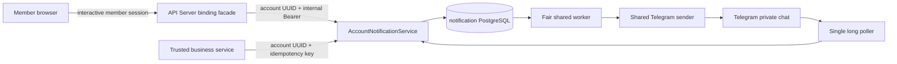

# Account Telegram Notifications

> 设计状态：已实现

## Scope

Account Telegram Notifications owns the ordinary-account binding lifecycle and
durable, account-targeted Telegram delivery inside the `athena-notification`
process. It covers browser binding attempts, Bot update consumption, one-to-one
Athena-account/Telegram-private-chat identity, binding revisions, account
delivery idempotency, and unreachable-recipient recovery.

Business services decide when an account should be notified and call the
internal account contract. This capability does not subscribe to business
events, expose account delivery history or a personal test-send operation, or
own administrator system-notification topics and records. System operations are
documented in [System Notification Operations](system-notification-operations.md).

## Source Locations

| Concern | Source | Key symbols |
| --- | --- | --- |
| Internal account and shared runtime contracts | [internal/notification/notification.proto](../../../internal/notification/notification.proto) | `AccountNotificationService`, `NotificationRuntimeService`, `SendAccountNotification` |
| Public member facade | [internal/server/notification/notification.proto](../../../internal/server/notification/notification.proto), [internal/server/notification/notification.go](../../../internal/server/notification/notification.go) | member binding HTTP routes, `authenticatedAccountID`, `publicTelegramBinding` |
| Public authorization | [internal/server/authz.go](../../../internal/server/authz.go) | `ordinaryMemberInteractiveGRPCMethods`, `authorizeOrdinaryInteractiveAccount` |
| Binding and enqueue application logic | [internal/notification/service.go](../../../internal/notification/service.go) | `GetTelegramBinding`, `CreateTelegramBindingAttempt`, `DeleteTelegramBinding`, `SendAccountNotification` |
| Telegram update consumer | [internal/notification/poller.go](../../../internal/notification/poller.go) | `TelegramPoller`, `handleMessage`, `handleMyChatMember` |
| Fair delivery worker and shared sender | [internal/notification/worker.go](../../../internal/notification/worker.go), [internal/notification/sender.go](../../../internal/notification/sender.go) | `claimFairNotificationBatch`, `processClaimedAccountNotification`, `TelegramSender` |
| Telegram provider adapter | [util/telegram/telegram.go](../../../util/telegram/telegram.go) | `Client`, `PollUpdates`, `GetWebhookInfo`, dynamic `SendMessageRequest.ChatID` |
| Durable schema and queries | [internal/accountstate/store/migrations/000001_init.sql](../../../internal/accountstate/store/migrations/000001_init.sql), [internal/notification/store/queries/telegram_bindings.sql](../../../internal/notification/store/queries/telegram_bindings.sql), [internal/notification/store/queries/account_notifications.sql](../../../internal/notification/store/queries/account_notifications.sql) | binding, attempt, offset, version, and account-delivery tables |
| Transactional store facade | [internal/notification/store/telegram_bindings.go](../../../internal/notification/store/telegram_bindings.go), [internal/notification/store/account_notifications.go](../../../internal/notification/store/account_notifications.go) | `CompleteTelegramBindingAttempt`, `EnqueueAccountNotification`, `SendAccountNotificationWithBindingLock` |
| Process wiring and internal authentication | [cmd/athena-notification/commands/athena_notification.go](../../../cmd/athena-notification/commands/athena_notification.go), [internal/notification/server.go](../../../internal/notification/server.go), [internal/notification/apiclient/internal_auth.go](../../../internal/notification/apiclient/internal_auth.go) | one Telegram client, `InternalAuthTokenEnv`, gRPC interceptors |
| Member UI | [ui/src/app/member/pages/notifications.tsx](../../../ui/src/app/member/pages/notifications.tsx), [ui/src/app/member/notification-service.ts](../../../ui/src/app/member/notification-service.ts), [ui/src/app/member/notification-storage.ts](../../../ui/src/app/member/notification-storage.ts) | `NotificationsPage`, `MemberNotificationService`, one-tab binding instructions |

## Architecture

The member browser calls only the public binding facade. The API Server obtains
the account UUID from the authenticated member context and constructs the
internal request; public messages contain no target account field. The internal
account service and runtime service share one PostgreSQL store, one Telegram Bot
client, one long poller, and the same outbound sender as the system domain.

The public authorization boundary admits Pending and active ordinary accounts
only when the credential is an interactive member login. Administrator sessions
and API Keys are rejected. All non-health internal notification RPCs require the
same validated Bearer credential; standard gRPC health remains unauthenticated.

## Runtime Flow

1. `athena-notification` creates one Telegram client from the Bot token, maps
   the configured `test` and `prod` system chat IDs, validates the internal
   Bearer, synchronizes the Bot profile, verifies that no webhook is configured,
   and loads the durable `next_update_id` before starting its poller and worker.
2. `GET /api/v1/notification-bindings/telegram` injects the authenticated
   account UUID and returns the current safe binding projection, current attempt,
   and Bot username/availability. Telegram numeric user and private-chat IDs are
   never returned to the browser.
3. Creating an attempt generates 32 cryptographically random bytes, encodes a
   43-character unpadded Base64URL token, persists only its SHA-256 digest, and
   replaces the account's prior attempt with a ten-minute pending attempt. The
   response returns `https://t.me/<bot>?start=<token>` and `/start <token>` once.
4. The member page stores the attempt ID, deep link, and fallback command in the
   current tab's `sessionStorage`. While visible it performs one non-overlapping
   status read every three seconds; focus and visibility restoration trigger an
   immediate read. Success, failure, local expiry, attempt-ID mismatch, cancel,
   disconnect, session end, and account-identity change clear the stored value.
5. The poller accepts a start token only from a non-Bot user in a private chat
   whose Telegram user ID equals the chat ID. It resolves the attempt without
   logging the token or update body, takes the account and Telegram-identity
   advisory locks, locks and revalidates the attempt, verifies identity
   uniqueness, allocates the next durable binding revision, cancels pending
   deliveries for a replaced revision, replaces the binding, and deletes the
   successful attempt in one transaction. The identity lock serializes attempts
   from different Athena accounts before either can reach the unique indexes.
6. A reconnect attempt does not alter the old binding before successful token
   consumption. Cancelling deletes only the attempt. Disconnect takes the same
   account lock, deletes binding and attempt, and cancels every pending account
   delivery for that account.
7. After each handled Telegram update the poller advances the durable offset.
   Empty successful polls update `last_poll_at`; handled updates also update
   `last_update_at`. Replayed binding and membership transitions are constrained
   by token state, identity, account lock, and binding revision.
8. `my_chat_member` updates for the bound private identity mark `left`/blocked
   recipients unreachable and cancel that revision's pending deliveries.
   A later `member` update restores the same binding to connected.
9. `SendAccountNotification` canonicalizes the account UUID, content, source,
   severity, and idempotency key, computes a payload digest, and serializes the
   enqueue under the account lock. An existing `(account_id, source,
   idempotency_key)` returns its original delivery and rejects a different
   payload. A missing or unreachable binding returns the corresponding result
   without inserting a delivery. Only a connected binding inserts a pending row
   and returns `QUEUED` with a delivery ID.
10. The shared worker claims account and system rows in alternating order. Before
    an account send, `SendAccountNotificationWithBindingLock` reacquires the
    account lock, verifies the current chat ID, revision, connected state, and
    pending row, then holds that lock through the Telegram call and sent-state
    commit. A completed disconnect or reconnect therefore cannot be followed by
    a send to the superseded private chat.

## State / Data

- `telegram_binding_versions` retains one monotonically increasing revision per
  account, including across disconnects.
- `telegram_bindings` is keyed by account UUID. Telegram user ID and private-chat
  ID are independently unique; safe username/display name, status, revision,
  binding time, update time, and last provider error are stored.
- `telegram_binding_attempts` permits one row per account and a globally unique
  32-byte token digest. State is `pending` or `failed`; failure reasons are
  stable codes such as `expired` and `telegram_identity_in_use`.
- `telegram_polling_state` is a singleton containing the next update ID, last
  successful poll time, last handled-update time, and update time.
- `account_notification_deliveries` freezes account UUID, source, idempotency
  key, payload digest, content, private chat ID, and binding revision. Its states
  are `pending`, `sent`, `failed`, and `cancelled`; attempt, lock, retry,
  provider-message, error, and send timestamps support durable work recovery.

The notification tables share the Athena database with account tables, but
intentionally have no account foreign key. Account ownership is supplied by the
authenticated public facade or a trusted internal caller. Raw binding tokens
exist only in the create response, browser tab storage, and the Telegram command.

## Configuration

| Setting | Behavior |
| --- | --- |
| `ATHENA_SERVER_POSTGRES_DSN` | Shared Athena database connection and authoritative embedded migration source. |
| `ATHENA_NOTIFICATION_INTERNAL_AUTH_TOKEN` | Shared internal gRPC Bearer; at least 32 bytes with no whitespace/control characters. |
| `ATHENA_NOTIFICATION_TELEGRAM_BOT_TOKEN` | Required token for the single account/system Bot client. |
| `ATHENA_NOTIFICATION_TELEGRAM_API_URL` | Telegram API base; defaults to the official API URL. |
| `ATHENA_NOTIFICATION_TELEGRAM_TIMEOUT_SECONDS` | Non-polling Telegram request timeout; defaults to the provider adapter timeout. |
| `ATHENA_NOTIFICATION_TELEGRAM_BOT_NAME`, `..._SHORT_DESCRIPTION`, `..._DESCRIPTION` | Desired Bot profile synchronized at startup. |
| `ATHENA_NOTIFICATION_WORKER_SEND_INTERVAL` | Shared delay between account and system sends; default 1.1 seconds. |
| `ATHENA_NOTIFICATION_WORKER_POLL_INTERVAL`, `..._BATCH_SIZE`, `..._MAX_ATTEMPTS`, `..._LOCK_TIMEOUT` | Queue polling, fair batch size, retry cap, and stale-claim recovery. |

The process runs one long-polling consumer. Procfile supplies the local internal
credential; production Compose requires and injects the same value into the
Notification process and its trusted callers. Production Compose exposes the
Bot token and concrete system group IDs only to the Notification container.

## Invariants

- One ordinary Athena account has at most one Telegram private binding, and one
  Telegram user/chat identity belongs to at most one Athena account. Account
  and identity advisory locks make the one-to-one decision deterministic under
  concurrent binding attempts.
- A binding revision increases only when a start token successfully establishes
  or replaces a binding; status changes do not change the revision.
- A reconnect leaves the current binding usable until the replacement commits.
- Browser binding requests never accept an account UUID, and API Keys and
  administrator sessions never cross the ordinary interactive boundary.
- Raw binding tokens, full Telegram updates, and private chat IDs are absent from
  logs and public responses.
- No account delivery row is created for a currently missing or unreachable
  binding, and one idempotency tuple cannot create two rows.
- Account sends revalidate and hold the same advisory lock used by reconnect and
  disconnect, so committed binding changes fence old private chats.
- Account history and personal test-send operations are not public V1 features.

## Failure Recovery

A configured webhook prevents Notification startup because Telegram disallows
`getUpdates` while it is active. Poll failures use bounded exponential backoff;
the persisted offset resumes after restart and is advanced only after an update
handler succeeds. Invalid, consumed, expired, or conflicting tokens never take
over an identity. A conflict marks the attempt failed without exposing another
Athena account.

Temporary Telegram and database failures leave a pending delivery eligible for
retry. HTTP 429 honors Telegram's retry delay; other transient failures use the
worker backoff and bounded attempt count. Permanent forbidden/not-found/block
responses fail the active delivery, mark the still-current binding unreachable,
and cancel its remaining pending rows. A later membership update restores
reachability but does not recreate cancelled rows.

Provider and SDK failures are converted at the Telegram adapter boundary to
bounded typed errors. Retry-after seconds and stable forbidden/not-found/
unreachable categories remain machine-readable, while response bodies,
provider descriptions, request URLs, Bot tokens, and private identities are not
propagated into logs or persisted delivery errors. Account retry and terminal
failure transitions reacquire the account advisory lock and update only the
matching chat, revision, and still-pending row. A reconnect or disconnect that
commits first therefore keeps the delivery cancelled instead of being
overwritten by a late worker transition.

Claim locks are durable timestamps and may be reclaimed after the configured
timeout. A worker revalidates binding state after claim, so cancellation or a
new revision converts stale work into a no-send result. Process cancellation
stops the poller and worker and waits for both before shutdown completes.

## Observability

`NotificationRuntimeService.GetNotificationRuntimeStatus`, exposed only through
the administrator facade, reports process lifecycle, Bot availability/ID/name,
poller activity, last poll/update timestamps, account pending/retry/failed
counts, and unreachable-binding count. Standard gRPC health is `SERVING` only
after profile synchronization, webhook validation, poller startup, and worker
startup succeed.

Logs identify update or delivery records by internal numeric IDs when needed,
but omit the raw token, complete update, Bot credential, and private Telegram
identity. Poll failures, retry scheduling, terminal delivery failure, and
binding state update errors are warning-level diagnostic events.

## Change Checklist

- [ ] Public member routes still inject the current account and require an ordinary interactive login.
- [ ] Token generation, hashing, TTL, one-time response, and tab-storage cleanup remain synchronized.
- [ ] Attempt, identity, revision, reconnect, cancel, and disconnect transactions preserve their invariants.
- [ ] Polling offset, webhook exclusion, membership recovery, and safe logging remain current.
- [ ] Account idempotency, no-recipient results, fair claiming, retry behavior, and binding-locked send remain current.
- [ ] Member UI states, three-second visible polling, focus behavior, local QR generation, and responsive controls match the API.
- [ ] Source links resolve and the [design index](../README.md) contains the correct entry.
