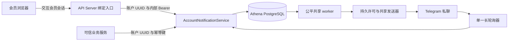

# 账户 Telegram 通知

> 设计状态：已实现；Trader Sync 摘要及产品授权扩展见文末。

## 范围

账户 Telegram 通知在 `athena-notification` 进程中负责普通账户绑定与持久私聊投递，包括浏览器绑定尝试、Bot 更新消费、账户与 Telegram 私聊的一对一关系、绑定 revision、投递幂等及不可达收件人恢复。

业务服务决定何时通知账户，并调用内部账户契约。本能力不订阅业务事件，不公开账户投递历史或个人测试发送接口，也不管理管理员系统通知的 Topic 和记录；后者见[系统通知运营](system-notification-operations.md)。

## 源码入口

| 职责 | 源码 | 关键符号 |
| --- | --- | --- |
| 内部账户与共享运行契约 | [internal/notification/notification.proto](../../../internal/notification/notification.proto) | `AccountNotificationService`, `NotificationRuntimeService`, `SendAccountNotification` |
| 公开会员入口 | [internal/server/notification/notification.proto](../../../internal/server/notification/notification.proto), [internal/server/notification/notification.go](../../../internal/server/notification/notification.go) | 会员绑定 HTTP 路由, `authenticatedAccountID`, `publicTelegramBinding` |
| 公开鉴权 | [internal/server/authz.go](../../../internal/server/authz.go) | `ordinaryMemberInteractiveGRPCMethods`, `authorizeOrdinaryInteractiveAccount` |
| 绑定与入队逻辑 | [internal/notification/service.go](../../../internal/notification/service.go) | `GetTelegramBinding`, `CreateTelegramBindingAttempt`, `DeleteTelegramBinding`, `SendAccountNotification` |
| Telegram 更新消费 | [internal/notification/poller.go](../../../internal/notification/poller.go) | `TelegramPoller`、`ApplyBotUpdate` |
| 公平投递与共享发送器 | [internal/notification/worker.go](../../../internal/notification/worker.go), [internal/notification/sender.go](../../../internal/notification/sender.go) | `Dispatcher`、`notificationSource`、`sendPermittedNotification`、`TelegramSender` |
| Telegram 适配器 | [util/telegram/telegram.go](../../../util/telegram/telegram.go) | `Client`, `PollUpdates`, `GetWebhookInfo`, dynamic `SendMessageRequest.ChatID` |
| 持久模型与查询 | [internal/accountstate/store/migrations/000001_init.sql](../../../internal/accountstate/store/migrations/000001_init.sql), [internal/notification/store/queries/telegram_bindings.sql](../../../internal/notification/store/queries/telegram_bindings.sql), [internal/notification/store/queries/account_notifications.sql](../../../internal/notification/store/queries/account_notifications.sql) | 绑定、尝试、消费位置、版本及账户投递表 |
| 事务存储入口 | [internal/notification/store/bot_updates.go](../../../internal/notification/store/bot_updates.go)、[internal/notification/store/telegram_bindings.go](../../../internal/notification/store/telegram_bindings.go), [internal/notification/store/account_notifications.go](../../../internal/notification/store/account_notifications.go) | `ApplyBotUpdate`、`EnqueueAccountNotification`, `Authorize`、`RecordStarted`、`RecordOutcome` |
| 进程装配与内部鉴权 | [cmd/athena-notification/commands/athena_notification.go](../../../cmd/athena-notification/commands/athena_notification.go), [internal/notification/server.go](../../../internal/notification/server.go), [internal/notification/apiclient/internal_auth.go](../../../internal/notification/apiclient/internal_auth.go) | 单一 Telegram 客户端, `InternalAuthTokenEnv`, gRPC 拦截器 |
| 会员界面 | [ui/src/app/member/pages/notifications.tsx](../../../ui/src/app/member/pages/notifications.tsx), [ui/src/app/member/notification-service.ts](../../../ui/src/app/member/notification-service.ts), [ui/src/app/member/notification-storage.ts](../../../ui/src/app/member/notification-storage.ts) | `NotificationsPage`, `MemberNotificationService`, 单标签页绑定指引 |
| 持久发送许可及结果 | [attempts.go](../../../internal/notification/store/attempts.go)、[delivery/types.go](../../../internal/notification/delivery/types.go)、[delivery_attempts.sql](../../../internal/notification/store/queries/delivery_attempts.sql) | `Permit`、`Outcome`、`Authorize`、`RecordStarted`、`RecordOutcome` |
| HTTP 调用证据 | [send_transport.go](../../../util/telegram/send_transport.go) | `WithSendStarted`、`SendError`、`sendTransport` |

## 架构与权限

会员浏览器只调用公开绑定入口。API Server 从已认证会员上下文取得账户 UUID，构造内部请求；公开请求不含目标账户字段。内部账户服务与运行服务共用 PostgreSQL 存储、Telegram Bot、长轮询器及系统通知发送器。



公开鉴权只允许使用交互会员登录凭据的 Pending 或活跃普通账户，拒绝管理员会话与 API Key。除标准 gRPC health 外，全部内部通知 RPC 要求同一经过校验的 Bearer；health 无需认证。

## 运行流程

1. 进程根据 Bot token 创建一个 Telegram 客户端，映射 `test`/`prod` 系统 chat ID，校验内部 Bearer，同步 Bot 资料，确认没有 webhook，加载持久 `next_update_id`，再启动 poller 与 worker。
2. `GET /api/v1/notification-bindings/telegram` 注入当前账户 UUID，返回安全绑定投影、当前绑定尝试和 Bot 名称/可用性；浏览器不接收 Telegram 数字 user ID 或私聊 chat ID。
3. 创建绑定尝试生成 32 字节加密随机数，编码为无 padding 的 43 字符 Base64URL token，仅保存 SHA-256 digest。新尝试替换该账户旧尝试，有效期十分钟；响应只返回一次 `https://t.me/<bot>?start=<token>` 与 `/start <token>`。
4. 会员页面把尝试 ID、深链接与备用命令保存在当前标签页 `sessionStorage`。可见时每三秒单飞读取状态；恢复焦点/可见时立即读取。成功、失败、本地过期、尝试 ID 不符、取消、解绑、会话结束和账户变化均清理缓存。
5. Poller 将每个 update 交给 `ApplyBotUpdate`。事务先插入 `telegram_consumed_updates`，重复 update ID 直接跳过。只接受非 Bot 用户的私聊 token，且 user ID 必须等于 chat ID；先取账户 gate，再取 Telegram 身份 advisory lock，锁定并复核尝试、身份唯一性，分配新 revision，终止旧绑定未许可投递及成功绑定回复，替换绑定并删除尝试。解析不记录 token 或更新正文。
6. 重绑在新 token 成功消费前保持原绑定有效。取消只删除尝试。解绑在同一账户 gate 内删除绑定和尝试，取消 pending 投递，并给 sending 投递写永久资格墓碑；已有许可仍可完成或成为 unknown。
7. 消费记录、绑定/版本及尝试变化、`telegram_binding_replies` 回复和持久 offset 在同一个 `pgx.Tx` 提交。失败全回滚；提交确认丢失只重放这个数据库事务，幂等记录防止重复增 revision 或回复。成功后重启从持久 offset 继续；空成功轮询仍更新 `last_poll_at`。Poller 不调用 `SendMessage`。
8. `my_chat_member` 的离开/封禁更新将对应绑定标为 unreachable，取消 pending 并撤销 sending 的后续尝试资格。之后的 `member` 更新恢复同一绑定可达性，但不复活已取消投递或资格墓碑。
9. `SendAccountNotification` 规范化账户 UUID、内容、来源、严重程度和幂等键，计算 payload digest，在账户 gate 内入队。相同 `(account_id, source, idempotency_key)` 返回原投递；不同 payload 冲突。绑定不存在或不可达时不插入投递；只有 connected 绑定产生 pending 并返回 `QUEUED` 与 ID。
10. 账户、系统和 reply 三个 `WorkSource` 统一进入 `Dispatcher`；候选读取不使用会被单 owner 占满的全局前 N 条，未来 `NotBefore` 仍可见。按 owner 公平轮转并优先即将到期任务，默认跨 chat 并发 12，同一物理 chat 只有一个执行中尝试。共享 Bot 20 次/秒、私聊至少一秒、群组 20 次/分钟；以真实 HTTP 起点回调推进运行内 monotonic 时钟窗口，持久 UTC started 独立保存。先预留容量再等待账户 gate，取得 gate 后检查一秒有效槽及共享预算资格；过期或后来收到 Retry-After 收紧而失效的预留均不生成 attempt，释放后重新调度。`Authorize` 短事务再次核验私聊身份、chat/revision、connected、pending、永久资格墓碑、重试时间与五次上限，插入 attempt 并将投递改为 sending，提交后才调用 Telegram。
11. HTTP `RoundTrip` 入口通过容量为一的 channel 握手记录实际 started 时间；回调不等待数据库或 HTTP 响应。结果通过独立事务按投递 ID、attempt UUID、sending 状态 CAS 写入。

## 状态与数据

- `telegram_binding_versions` 为每个账户保存跨解绑持续递增的 revision；只有成功 token 建立/替换绑定才递增，可达性变化不改变 revision。
- `telegram_bindings` 以账户 UUID 为键，Telegram user ID 与私聊 chat ID 各自唯一；保存安全名称、状态、revision、绑定/更新时间与错误类别。
- `telegram_binding_attempts` 每账户一行，全局唯一 32 字节 token digest；状态为 pending/failed，失败码如 `expired`、`telegram_identity_in_use`。绑定尝试状态与消息状态分离。
- `telegram_polling_state` 为单例，保存 next update ID、最近成功轮询/处理时间及更新时间。`telegram_consumed_updates` 按 update ID 唯一，消费证据无自动清理。
- `telegram_binding_replies` 按 update ID 唯一，冻结私聊 chat、正文、payload digest。成功回复保存 owner/revision，解绑、重绑或不可达终止旧 pending 并永久禁止旧 sending 后续尝试。无效、过期或身份冲突回复没有成功绑定资格，owner/revision 为空，目标只来自已验证私聊 update。全部回复以 `work_kind=reply` 使用统一 `Authorize`、`RecordStarted`、`RecordOutcome`；最多五次，unknown 不重发。
- `account_notification_deliveries` 固定 owner、来源、幂等键、payload digest、正文、私聊 chat ID 与 revision；状态为 pending/sending/sent/failed/unknown/cancelled。`current_attempt_id` 指向当前许可，`eligibility_revoked_at/reason` 永久禁止旧投递重试。
- `notification_delivery_attempts` 保存 UUID、work kind/ID、账户 owner、sender incarnation、实际数字 chat ID/群组分类、payload digest、authorized/started/result 时间、provider message ID、outcome/code、retry-after 与 monotonic 届满后写入的 retry_after_released_at。许可事务核验 kind 对应的投递及 owner；不可把许可用于不同 payload。缺失的实际起点保留 NULL，不由授权或结果时间补造。

通知与账户表共用 Athena 数据库及唯一权威迁移。通知表没有账户外键，owner 由认证公开入口或可信内部调用提供。原始绑定 token 只出现在创建响应、标签页存储和 Telegram 命令中。

## 配置

| 配置 | 行为 |
| --- | --- |
| `ATHENA_SERVER_POSTGRES_DSN` | 共享 Athena 数据库与权威嵌入迁移。 |
| `ATHENA_NOTIFICATION_INTERNAL_AUTH_TOKEN` | 内部共享 Bearer，至少 32 字节且不含空白/控制字符。 |
| `ATHENA_NOTIFICATION_TELEGRAM_BOT_TOKEN` | 账户/系统共享 Bot 的必需 token。 |
| `ATHENA_NOTIFICATION_TELEGRAM_API_URL` | Telegram API 地址，默认官方地址。 |
| `ATHENA_NOTIFICATION_TELEGRAM_TIMEOUT_SECONDS` | 非轮询适配器 HTTP 超时；worker 发送在可取消的本地预算准入完成后开始五秒 HTTP context 截止。长轮询使用独立客户端和超时。 |
| `ATHENA_NOTIFICATION_TELEGRAM_BOT_NAME`、`..._SHORT_DESCRIPTION`、`..._DESCRIPTION` | 启动同步的 Bot 资料。 |
| `ATHENA_NOTIFICATION_WORKER_CONCURRENCY` / `--worker-concurrency` | 跨 chat 并发，默认 12；CLI 读取环境范围 1–12。Bot/私聊/群组窗口及五次上限保持统一。 |

进程只运行一个长轮询消费者。Procfile 提供本地内部凭据；生产 Compose 把同一凭据注入 Notification 与可信调用方。Bot token 和具体系统群组 ID 仅提供给 Notification 容器。

## 不变量与故障处理

- 普通账户最多一个私聊绑定，Telegram 身份最多归属一个账户；账户和身份 advisory lock 保护并发绑定。一致的账户 gate 名称为 `athena:account:<UUID>`。
- 公开绑定请求不接受目标 UUID，管理员与 API Key 不跨普通会员交互边界；原始 token、完整更新、Bot 凭据和私聊数字身份不进入日志或公开响应。
- 缺失/不可达收件人不入队，一个幂等 tuple 不产生多行；账户历史和个人测试发送不是公开 V1 功能。
- 解绑/重绑先提交则不能取得旧资格的新许可；已有单条许可可完成。重新绑定或恢复可达性都不能清除旧投递的资格墓碑。
- sent/failed/unknown/cancelled 为终态。失去资格后的明确 failed/retryable 结果将投递终结为 cancelled，attempt 仍保存原始 failed/retryable 证据。只有明确 retryable 且仍有资格、尝试数小于五才回 pending；等待为 1/2/4/8 秒退避与 Telegram Retry-After 的最大值。网络断连、超时、取消、响应读取或解析失败发生在 HTTP 起点之后时结果为 unknown，不自动重发。发送不跟随重定向，不使用隐式 POST 重放。
- 成功回执即使缺 started 也写 sent。结果写库失败只重试相同 attempt 的结果 CAS；提交不确定先按 UUID 查询结果，无法确认则继续保留已消耗许可，不能发送。迟到或冲突结果不能覆盖终态。
- 明确 forbidden/not-found/blocked 结果失败当前投递，将仍匹配的绑定标为 unreachable 并取消余下未许可任务；之后恢复绑定也不重建旧任务。

配置 webhook 会阻止启动，因为 Telegram 不允许其与 `getUpdates` 共存。Poller 失败使用有上限指数退避，从持久 offset 恢复；仅处理成功才推进。无效、已消费、过期或冲突 token 不能接管身份；身份冲突只将本次尝试失败，不暴露其他账户。

适配器在生成外部错误文本前保存结构化分类；Retry-After 和稳定不可达类别仍可供机器读取，原始 provider 描述、响应体、请求 URL、凭据不写入投递错误。调度候选不持有领取锁；已许可 sending 不重新入队。进程取消后先等待 poller，再等待全部 dispatch、Sender 与结果补记退出，最后登记正常停止。

## 可观测性与后续范围

管理员运行入口报告进程生命周期、Bot 可用性/ID/名称、poller 状态、最近轮询/更新时间、账户 pending/retry/failed/sending/unknown 独立计数与不可达绑定数。gRPC health 在资料同步、webhook 检查、poller 与 worker 启动后才为 SERVING。诊断日志使用内部更新/投递/attempt ID；轮询失败、结果写库失败和绑定更新错误为 warning。

持久发送许可、共享调度、单 sender 登记和显式恢复入口已经实现。运行 RPC 暂未增加独立 reply 队列计数。Trader Sync 产品 grant 撤销钩子及摘要首条源已接入共享账户资格和调度；后续 API/runtime composition 仍需注入摘要 siteURL。

## 单 sender 与恢复操作

进程先取得固定 PostgreSQL session advisory lock，再登记 `notification_sender_instances` 的 incarnation、主机、PID 和进程标识。任何未确认停止实例都会阻止新实例启动；DB 连接断开、锁消失、端口释放和 PID 复用都不是停止证明。心跳及授权前检查发现失锁时取消调度与 poller，health 变为 NOT_SERVING，致命错误传到命令入口并退出。异常实例保留未确认状态。

正常 Stop 等待所有发送和结果补记后保存 `stop_confirmation=graceful` 并恢复仍无结果的 consumed permit。故障恢复由操作员查询实例登记，结合对应主机的 supervisor/container 状态确认该登记进程已经退出，然后运行：

```bash
athena-notification --recover-stopped-sender=<incarnation-UUID>
```

这个参数本身是操作员对**对应已登记进程已退出**的明确确认；命令不会通过 lease、PID 或端口自动推断。命令持独占 session lock 验证登记，保存 `operator` 确认并调用 `RecoverSender`，成功后退出，不创建 Telegram 客户端或发送消息。所有部署（包括自动重启容器）仍须先完成此确认；未确认时安全拒绝启动。

恢复只处理该 incarnation 当前仍 sending 的 attempt：已有明确结果按原事实补记，无结果 CAS 为 unknown；终态和其他 incarnation 不受影响。结果补记失败如实返回错误，可在修复数据库后重跑同一确认命令。之后正常启动重建预算。只有在独占锁内证明实例登记和全部 attempt 历史均为空时，才豁免首次等待；其余每次启动都先等待完整 60 秒 monotonic 恢复屏障，期间不授权，不能因 UTC 前跳而清除窗口。该屏障单列本地恢复延迟并保留总体投递时延，不计为外部 Telegram 耗时。读取全部相关历史 attempt，不限 current_attempt。真实 started 还原原 chat/group 窗口；缺起点但有结果用 result_at 作为保守上界；无起点的 unknown 在确认停止后的完整一分钟内保持 Bot 冷却，不回填 started_at。尚未由 monotonic 计时证明届满的 Retry-After 以 attempt 的空 retry_after_released_at 保留；启动读取全部未解除记录，不按 UTC 时间过滤，并保守等待完整未解除最大值（可超过60秒）。运行内的回执同样立即缩紧预算，只有等待真实完成后才写解除标记；已解除历史不会在后续启动重复触发长等待。恢复等待属于运行异常，不宣称为正常发送时效。历史实际路由固定在 attempt，不从重启后的 test/prod 配置反推。

实现入口为 [dispatcher.go](../../../internal/notification/dispatcher.go)、[budget.go](../../../internal/notification/budget.go)、[source.go](../../../internal/notification/source.go)、[sender_session.go](../../../internal/notification/store/sender_session.go) 和 [recovery.go](../../../internal/notification/store/recovery.go)。

## 维护检查

- 会员入口继续注入当前账户并要求普通交互登录。
- token 生成、digest、TTL、单次返回及标签页清理保持一致。
- 尝试、身份、revision、重绑、取消、解绑和永久墓碑事务保持不变量。
- offset、webhook 排斥、成员状态恢复、安全日志保持有效。
- 幂等、无收件人结果、公平领取、持久许可、HTTP 起点和结果 CAS 同步维护。
- 会员页面三秒可见轮询、焦点行为、本地 QR 与响应式控件匹配 API。
- 源码链接和[设计索引](../README.md)保持正确。

### 动态限流与实际起点

`Tighten` 与许可 guard/提交由独立读写锁排序：收紧先完成则未许可预留失效；guard 已取得读锁则提交或回滚后才释放，收紧随后处理。该锁不跨账户 gate 等待。已提交但未开始 HTTP 的许可仍受后来 Retry-After 约束，保留同一 attempt 等待，不能以撤权后的已许可例外豁免动态限流。

`WithSendAdmission` 将可取消的预算准入传至 Telegram HTTP 客户端。等待时不持账户 gate 或预算锁；最终准入读锁仅保留至 transport 实际 started 握手，立即释放后才执行网络请求。`Tighten` 写锁与这一真实起点排序，已进入 HTTP 的尝试保留原请求及结果。Started 回调只做内存记账和有界通道交接，不等待预算或写库。准入取消返回 not_started，持久许可仍只消耗原一次 attempt；事务取消、HTTP 前失败及正常起点均清理读锁。

五秒 HTTP 超时在准入后起算，本地冷却等待不算外部 Telegram 耗时；创建、授权、真实开始和结果时间保留总体延迟。摘要消费者已在预算等待时释放短 gate，保留同一冻结批次及许可，重入 gate 后完成非阻塞最后准入与 started 补记。

## 摘要首条与共享许可

[SummarySource](../../../internal/notification/summary_source.go) 消费 Trader Sync 的 waiting membership；其未来候选带 notBefore/deadline，按 owner 的持久 head 保序。候选的 summary_head Ref 只服务调度，真实冻结部分继续以 account WorkRef 进入同一个 AuthorizeTx/executePermit/RecordOutcome 路径。普通 account source 不领取未解决首条批次的任何部分；首条有起点后，其他部分独立许可并可与下批首条交错。

固定连接 session advisory key 与账户事务相同。AuthorizeTx 不自行提交，也不再取另一连接的 account gate；guard 位于 delivery 行锁之后，预算完成回调由外层 Commit/Rollback 收尾。首条提交未知只可有界确认原 attempt/head，未确认不发。确认许可不等于原物理 session 仍持锁：先结束原授权预算 guard，释放或丢弃旧连接，再在同一存活调用中可取消地重取账户 gate，核验同一 permit/head/实例后才进入最终准入；不再次授权或计次。连接故障期间可能存在 f<t<s，实际时间及额外账户锁等待仍保留为本地成本。预算 Tighten 与最终 HTTP 准入通过同一 RW 锁排序；需要等待时先释放账户 session，等待结束释放临时预算读锁，再重取账户 session 和核验原许可。非阻塞 tryAdmitStart 可再次拒绝；真实 Started 回调仍恒定时间，预算读锁在该回调后、实际 I/O 前释放。

Started 事实通过固定连接在一秒内补记后释放 gate，不等 HTTP 回执；RecordStarted 本身不再请求账户 gate，结果仍在原账户短事务里 CAS。已 sent/unknown 且起点丢失的 head 也纳入明确停止恢复，不能只恢复当前 sending，不能因 NULL 起点跨进程重发。运行内保留真实观察的 monotonic 基点；恢复缺证据时只记录 recovery_basis_at 和原因，不伪造 first_started_at。预算等待的起止、时长和外部 Retry-After/本地协调原因及 gate 等待保留在 batch，完整总体延迟与动态 f<t<s 的 miss 不被抹去。

`SQLStore.BorrowPool()` 仅返回借用引用；启动前 `Service.ConfigureSummaries(pool,siteURL)` 要求原池并注册实际 WorkSource。Service.Stop 和摘要协调者负责 cancel/join/释放所持 session，trader-store 适配器不 Close。唯一 pool owner 仍是 [通知 CLI](../../../cmd/athena-notification/commands/athena_notification.go) 的 `defer utilio.Close(store)`；Task12 将通过现有 ServerOpts/CLI 启动注入上述配置，不另建池。完整冻结、Unicode/UTF-16 分条与成员关系见 [Trader Sync 设计](../trading/trader-sync-activity-alerts.md#摘要首条的短-gate)。


## Trader Sync 生产组合

原 notification CLI 通过 ATHENA_URL 提供 ServerOpts.SiteURL；NewServer 在 Start 前从原 SQLStore.BorrowPool 取得同物理池并调用 ConfigureSummaries。启动后 account/system/reply/summary 共用现有 dispatcher、poller 和发送预算。Service.Stop 取消并 join 所有工作及补记后，CLI 的 store 唯一关闭池；摘要适配器无独立 Run/Close。缺 siteURL 或物理池明确返回构造错误。`--recover-stopped-sender` 分支仍先于 Telegram 客户端/summary 组合，不需 Trader Sync RPC/WSS/HMAC 配置，不发送消息；停止证明规则不变。

ATHENA_TRADER_SYNC_PROXY_URL 只属于 API 内来源客户端；即使 notification 继承该环境，也不用于 Telegram。sendMessage 专属 5 秒截止与现有 30 秒长轮询保持分离。


## 实际结果时间与恢复进度

HTTP Started 保留原 time.Now 的 monotonic 部分，只有持久/序列化时转 UTC。worker 在 Sender.Send 返回即刻捕获 sender_returned_at 与可证明的 Started→返回 sender_elapsed_ns，再随原 outcome CAS 一次保存；result_at 继续表示 worker 处理结果时刻。结果补记重试复用同一时间、permit 和 attempt，不再次调用 Sender。没有真实起点则耗时 NULL；明确成功但落库未知仅记录受控 observed_outcome/result_persisted=false 警告，DB 仍保持未知证据，不能因此重发。返回上界包含真实 Sender 解析工作，不能称纯网络或服务端 ACK 时间。

原恢复 owner 发布 recovery：initializing、waiting、completed、cancelled、failed。Start 在启动 worker 前同步清除旧 completed 快照；历史读取前开始计时，首次空历史也有 completed 证据。原内部/公开 runtime 透传 state/reason/startedAt/remainingMillis/elapsedMillis/clockSource，毫秒为 string；未知剩余省略，合法零为 "0"，来源为 sender_monotonic。fatal/stopped 优先，尚未完成恢复为 recovering，不能因 poller 活跃就显示 running。API 不创建另一个恢复计时器、不解除预算。恢复暂停与许可后动态预算等待是本地延迟，保留总体；HTTP 五秒截止仍在预算准入之后起算。

txgate 的可选观察仅赋本地变量，区分 Begin/pool 与 advisory，调用层锁外输出。普通 Authorize 与摘要初始及重新取得短 gate 都复用这一入口，不改变任何许可、撤权、锁序或首条握手协议。


新 recovery 对象的 Swagger 通过既有逐定义规范化链生成，与真实 gateway 保持 startedAt/remainingMillis/elapsedMillis/clockSource；旧 Runtime 顶层字段命名不变。真实 gateway 测试同时核对 Swagger properties、未知剩余缺失和合法字符串零。直接 TelegramSender 调用不经过 worker，因此 Outcome.Timing 可为空；worker 路径才在 Send 返回旁路冻结 timing 并随原结果 CAS 保存。单条真实公网探针的时间/授权边界见[限定验收报告](../../testing/trader-sync-activity-alerts-acceptance.md#单条真实-telegram-发送)。
