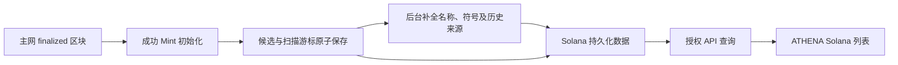

# Solana 设计总览

更新日期：2026-09-13。本文汇总当前已确认设计，作为后续研发入口。

## 当前结论

Solana 是独立于 EVM Token 的业务板块。首版先完成新 Mint 发现、基础信息补全与 ATHENA 列表查看，用户已认可实际页面；先看真实样本，再决定研究资料、资产筛选和活动规则。

首版已在 `codex/solana-discovery` 分支完成实现和本地验收，实现基线 `cc677b94`。现已按用户授权将该分支与 `codex/trader-sync-independent` 集成到 `rf4`，并通过本次集成验证，见[集成验收](../../testing/rf4-branch-integration.md)与[集成计划](../../superpowers/plans/2026-09-13-rf4-branch-integration.md)。源分支验收证据仍保留，本次集成另有验证记录；尚未部署生产环境。

| 能力 | 已确认设计 | 当前状态 |
| --- | --- | --- |
| 独立板块 | 独立 Solana 列表、业务数据和 READ/NONE 授权，不混入 EVM Token | 首版已实现、已验收 |
| 新候选发现 | Mainnet Beta，finalized 区块中 Token Program / Token-2022 的成功 Mint 初始化，覆盖顶层与 CPI | 首版已实现、已验收 |
| 基础资料 | 名称、符号、发行来源与初始化链上证据；缺失/失败明确展示 | 首版已实现、已验收；历史队列未全部补完 |
| 来源识别 | Pump.fun、Raydium LaunchLab、直接 Token 程序初始化；其他保留未知及可确认程序 | 首版已实现、已验收 |
| 项目研究 | 发行被观测后持续研究，不因首笔交易、年龄或静默终止 | 后续方向已确认，尚未实现 |
| 活动刷新 | 认可的链上活动触发；每项目下一轮至少间隔一小时 | 后续方向已确认；活动清单和执行细节待定 |
| 自动交易、评级与完整研究资料 | 先看样本后再决定 | 未纳入首版 |

“新 Mint 候选”不等于已确认的代币研究项目。普通代币、NFT、LP、头寸凭证等暂未分类；名称或符号相同也不能合并为一个项目，身份以 Mint 为准。

## 首版流程

新发行来源由初始化交易直接识别，历史已保存候选再按原签名补查。名称与符号来自后续 finalized 账户快照；采集失败不阻断新候选发现。网页刷新只重读保存结果。

## 三种频率的区别

| 约束 | 对象 | 语义 |
| --- | --- | --- |
| 节点请求预算 | 扫描和首次信息补全共用的 RPC | 控制实际请求速率、并发与 429 冷却，已实现 |
| 首次信息补全重试 | 暂无元数据或读取失败的候选 | 缺失 1 小时后、失败 5 分钟后重试；成功信息不周期更新，已实现 |
| 后续研究刷新间隔 | 每个正式研究项目 | 有认可活动才产生刷新需求，下一轮至少间隔一小时；尚未实现 |

这三个约束不能相互替代。首次补全采用 1 小时重试，不表示已完成用户设想的活动监听或每小时研究刷新。

## 当前运行状态与恢复边界

用户已要求暂停收集。2026-09-13 已停止源分支的 `solana-preview`，其发现、后台补全、API 与 UI 预览进程均已退出；该预览地址不提供服务。本次 `rf4` 集成保持暂停。默认 managed 全栈只有 Trader Sync、API Server、Notification、Wallet、Profit Sharing 和 UI 六服务，不启动 Solana 扫描或后台补全。

停机时数据库 `athena_solana_preview` 中保留 **2321** 条候选、起点 **446684678**、已处理游标 **446687144**。这些是停止时快照，不是实时计数。基础设施与数据未删除，尚未完成的补全队列一并保留。

原 `athena_solana_preview` 的账户 schema 与 `rf4` 不兼容，不能指向原库直接运行 `rf4` 的 `up` / `verify` 或 reset。此次保留原库、游标、原分支及 `/home/yege/work/athena/.worktrees/solana-discovery`，不修改旧数据库，也不新增历史 schema 兼容路径。

以后用户明确要求恢复原预览时，从该原 worktree 的保留版本使用 `make run ATHENA_RUN_PROFILE=solana-preview` 管理原库；先确认没有其他 checkout 正在扫描同一数据库。原版本续接原游标和待处理记录，不重新选取最新链头作为起点。历史区块或交易能否补查仍受节点保留范围限制。停止使用同一 checkout 的 `make stop ATHENA_RUN_PROFILE=solana-preview`。`rf4` 预览使用新的专用数据库；将旧数据转入 `rf4` 需单独明确数据迁移范围。本次新入口的 schema 准备、端口及资源归属见[Solana 局部运行说明](../../developer-guide/running-locally.md#solana-discovery-local)。

人工停机是运维动作，不会改变后续“项目不自动结束研究”的业务方向。首版没有项目研究执行器，也没有后台常驻授权要求。

## 阅读顺序与职责

| 文档 | 负责内容 |
| --- | --- |
| [业务需求](../../requirements/solana/README.md) | 目标、确认范围、非目标与待决问题 |
| [项目发现](project-discovery.md) | 数据接入、游标、事务、服务、接口和运行边界 |
| [基础信息补全与发行来源](candidate-metadata.md) | 名称/符号来源、平台归因、字段合同、队列与重试 |
| [列表页](../web-ui/solana-discovery.md) | 页面信息、查询、授权与状态表达 |
| [持续研究与刷新](research-lifecycle-and-refresh.md) | 尚未实施的后续方向与建议调度语义 |

## 验证事实

首版真实主网样本 `s8z8Xg4b21SnUaucPKEzZ1rCmPFkLxYu2okNHidpump` 曾自动补成 `Anita maxyn / brotha / Pump.fun`，名称/符号与独立 finalized 账户快照吻合，重启保留初始化与补全证据。还观察到头寸 NFT，支持保持候选而非自动分类的边界。

源分支实现已有 100 项后端数据库/并发测试及子测试、7 项页面测试、API 契约测试、UI 静态检查、桌面/手机真实页面验收和会员/管理员两项 smoke 通过的记录。原始验收已随代码收录为[发现验收](../../testing/solana-discovery.md)及[基础信息补全验收](../../developer-guide/acceptance-records/2026-09-13-solana-metadata.md)。这些记录描述源分支当时结果。

本次 `rf4` 集成验证已通过：Go 包测试及相关 PostgreSQL schema/事务集成测试、31 套共 361 项前端测试、前端静态检查与构建、Solana 独立可执行构建，以及 86 项隔离浏览器测试和真实新环境的 2 项 smoke 均通过。新 managed 全栈在 `http://localhost:34000` 保留运行，Solana 服务继续暂停；会员/管理员 bootstrap、Trader Sync 查询和 Solana 暂停时的 API 隔离行为已核对。命令、证据及验收边界见[本次集成验收](../../testing/rf4-branch-integration.md)。

公共 RPC 预览停止前仍有区块积压，历史元数据队列也未清空；不承诺固定发现延迟、全链全部平台覆盖或全部候选都有名称。未来是否购买高容量 RPC、使用 Yellowstone/Geyser 或扩展平台，在新需求明确后决定。
