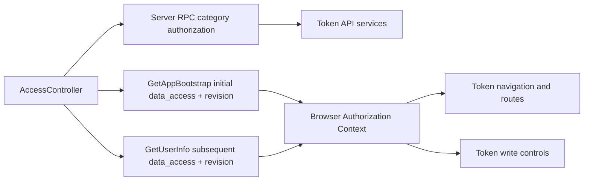

# Token UI and API Access Control

## Scope

Token Intelligence uses the same hierarchical business-data access level as
every other ATHENA data capability. This document explains how `READ` exposes
Token pages and queries, how `READ_WRITE` additionally enables Token mutations,
and how server authorization and browser presentation stay synchronized.

Token workers, internal service-to-service calls, project research behavior,
and persistence behind an authorized request remain owned by their Token
subsystems. Login availability, administrator operations, durable access state,
and the complete browser authorization lifecycle are documented in
[Account Access Control](../identity-access/account-access-control.md).

## Source Locations

| Concern | Source | Key symbols |
| --- | --- | --- |
| Effective access authority | [internal/accountaccess/access.go](../../../internal/accountaccess/access.go), [internal/accountaccess/controller.go](../../../internal/accountaccess/controller.go) | `DataAccess`, `RequirementDataRead`, `RequirementDataWrite`, `Controller.Authorize` |
| Token API authorization boundary | [internal/server/authz.go](../../../internal/server/authz.go) | `dataReadGRPCMethods`, `dataWriteGRPCMethods`, `authorizeGRPC` |
| Token API proxy boundary | [internal/server/tokenapi/tokenapi.go](../../../internal/server/tokenapi/tokenapi.go) | Token catalog, research, policy, and operations methods |
| Browser authorization state | [ui/src/app/app.tsx](../../../ui/src/app/app.tsx), [ui/src/app/shared/context.ts](../../../ui/src/app/shared/context.ts), [ui/src/app/shared/services/auth-service.ts](../../../ui/src/app/shared/services/auth-service.ts) | `Bootstrap`, `AuthorizationCtx`, `canReadData`, `canWriteData`, Token navigation and routes |
| Token clients and write controls | [ui/src/app/shared/services/token-service.ts](../../../ui/src/app/shared/services/token-service.ts), [ui/src/app/pages](../../../ui/src/app/pages) | Token request methods and page actions |

## Architecture

There is no Token-specific account list, role, or policy. The authenticated
account's effective aggregate is the sole input:

- `NONE` cannot mount Token routes or call Token API methods.
- `READ` can open every Token read page and call every Token query, including
  projects, reports, observations, contract code, collection diagnostics,
  node status, runtime configuration, policies, and chain checkpoints.
- `READ_WRITE` includes all reads and can create, update, or delete blocklist
  entries and update chain checkpoints.
- The administrator always has `READ_WRITE`; its separate administrator flag
  is not needed for ordinary Token data operations.

The UI access level improves presentation but is not the security boundary.
Every public Token RPC is independently categorized and enforced by the API
Server before it reaches the Token proxy or service implementation.

## Runtime Flow

1. Authentication resolves the current account through `AccessController`.
   Disabled credentials stop at the account-maintenance boundary before Token
   authorization runs.
2. The API Server classifies Token `Get` and `List` methods as data-read. Token
   `Create`, `Update`, and `Delete` policy methods and checkpoint updates are
   data-write.
3. `Controller.Authorize` permits a data-read request for `READ` or
   `READ_WRITE` and permits a data-write request only for `READ_WRITE`. A denial
   occurs before the Token API dependency is called.
4. On a browser cold start, `GetAppBootstrap` returns settings together with an
   `ANONYMOUS`, `AUTHENTICATED`, or `ACCOUNT_MAINTENANCE` session projection.
   Only `AUTHENTICATED` supplies `data_access` and `authorization_revision`; the
   shell initializes the shared Authorization Context directly from it.
5. Token navigation and all `/token/*` routes require `canReadData`. An
   authenticated Token cold start therefore makes one application-bootstrap
   request followed directly by the mounted page's own Token requests, without
   an initial `GetUserInfo`. Token query pages mount for `READ` and
   `READ_WRITE`; each mutation or sensitive write interaction is rendered and
   enabled only when `canWriteData` is true. Direct HTTP or gRPC calls remain
   subject to the same server categorization.
6. After successful login and while an authenticated page is visible, the shell
   uses `GetUserInfo` for the new session projection and subsequent
   authorization refreshes every 15 seconds and when the window regains focus.
   A stable account-data 403 starts the same deduplicated refresh immediately.
7. When a Token user's authorization revision changes, the shell cancels stale
   work, clears shared asynchronous Token data, project list caches, and saved
   return positions, closes write interactions, and remounts the route. A
   downgrade to `READ` retains the current query page without write controls;
   a downgrade to `NONE` routes to `/user-info`. An upgrade exposes the Token
   navigation without a new login.

Token project list, project detail, trends, observations, wallet normal
transactions, Swap activity, Swap events, Report revisions, Selections, and
collection-task reads all share the same data-read category. The unified access
level does not create per-page or per-endpoint grants.

## State / Data

This capability adds no Token-specific authorization state. The durable
account aggregate and its in-memory snapshot belong to Account Access Control.
The browser initializes the current `data_access` and authorization revision
from application bootstrap, then keeps later `GetUserInfo` projections in the
shared Authorization Context for the active identity.

Token caches contain business responses rather than authorization decisions.
They are scoped to the current login and authorization generation and are
cleared when that generation changes, preventing a downgraded or different
identity from rendering a prior snapshot.

## Configuration

There is no Token-specific access setting. Ordinary accounts default to
`NONE`, and administrators replace the complete account aggregate through the
account-access API. `ATHENA_SERVER_DISABLE_AUTH` is the process-wide
development bypass and makes application bootstrap supply the authenticated
built-in administrator identity with `READ_WRITE`.

## Invariants

- Token reads require data-read and therefore accept only `READ` or
  `READ_WRITE`.
- Token mutations require data-write and therefore accept only `READ_WRITE`.
- Every ordinary account at the same data level has the same Token access; no
  per-route or per-resource policy exists.
- Token navigation, routes, and write controls derive only from the shared
  Authorization Context, not usernames or client-side allowlists.
- Initial Token route eligibility comes from `GetAppBootstrap`; subsequent
  eligibility changes come from `GetUserInfo`, and both use the shared account
  access authority.
- Hiding a route or action is not authorization; the server independently
  categorizes every public Token RPC.
- All project and project-scoped reads use the same data-read category as
  Report, Selection, and collection histories.
- Cached Token data never crosses a login or authorization-generation boundary.
- Access changes do not alter Token API paths, domain state, or public business
  data types.

## Failure Recovery

An anonymous application bootstrap routes to login without mounting a Token
page. An initial disabled credential returns HTTP 200 with the
`ACCOUNT_MAINTENANCE` bootstrap status so the browser can retain settings and
show the maintenance login page. A later exact maintenance 503 from
`GetUserInfo` or a Token request clears browser session caches and routes to
that page while preserving the credential. An account-data denial returns gRPC
`PermissionDenied` and HTTP 403 with
`ACCOUNT_DATA_ACCESS_DENIED`; the browser refreshes authorization without
clearing the credential.

A denied mutation never reaches the Token service and is safe to retry after
an administrator grants `READ_WRITE`. A denied read is likewise safe to retry
after `READ` or `READ_WRITE` is granted. If the authorization refresh itself
fails, the existing retry/error boundary remains visible rather than assuming
an access level.

## Observability

Rejected Token calls use normal request logging and gRPC/gateway status
mapping. The stable `google.rpc.ErrorInfo` reason distinguishes account-data
denial from an unrelated 403. Initial account maintenance is visible through
the application-bootstrap status; later maintenance remains distinguishable as
gRPC `Unavailable`, HTTP 503, and the fixed maintenance message. This
capability adds no Token-specific metric or health endpoint.

## Change Checklist

- [ ] Every Token query remains categorized as data-read.
- [ ] Every Token mutation remains categorized as data-write.
- [ ] Token navigation, routes, and write controls match `canReadData` and `canWriteData`.
- [ ] Project, Report, Selection, collection, policy, and checkpoint methods remain in the intended category.
- [ ] Authorization revision changes clear Token caches and stale work without clearing valid credentials.
- [ ] Bootstrap maintenance status, later maintenance 503, stable data 403, and ordinary authentication errors remain distinguishable.
- [ ] Source links and named symbols resolve to the implementation.
- [ ] The [design index](../README.md) contains the correct entry.
