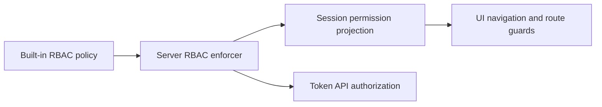

# Token UI and API Access Control

## Scope

This capability makes the Token Intelligence web UI and its public Token API
available only to administrators. It covers the built-in role policy, the
permissions projected into the web session, navigation and route filtering,
and authorization at the server API boundary.

Token worker processes, internal service-to-service connections, authentication,
and the Token domain behavior behind an authorized request remain outside this
boundary.

## Source Locations

| Concern | Source | Key symbols |
| --- | --- | --- |
| Built-in role grants | [assets/builtin-policy.csv](../../../assets/builtin-policy.csv) | `role:admin`, `role:readonly`, `tokenapi` policies |
| RBAC initialization | [internal/server/athena-server.go](../../../internal/server/athena-server.go) | `NewServer`, `SetBuiltinPolicy` |
| Web-session permission projection | [internal/server/session/session.go](../../../internal/server/session/session.go) | `uiBootstrapPermissions`, `GetUserInfo`, `userPermissions` |
| Token API authorization | [internal/server/authz.go](../../../internal/server/authz.go) | `rbacGRPCMethods`, `authorizeGRPC` |
| UI navigation, session bootstrap, and route guards | [ui/src/app/app.tsx](../../../ui/src/app/app.tsx), [ui/src/app/shared/services/requests.ts](../../../ui/src/app/shared/services/requests.ts) | `Shell`, `invalidatePendingRequestErrors`, `tokenNavItem`, `filterNavItems`, `RequirePermission`, `AppRoutes` |

## Architecture

The built-in policy is the source of truth for both presentation access and API
access. The UI does not compare usernames or maintain a separate administrator
allowlist. It consumes only the concrete permissions returned for the current
session.

`role:admin` has wildcard `get` and `update` access to the `tokenapi` resource.
`role:readonly` has no `tokenapi` grants. The built-in `admin` account is assigned
to `role:admin`, which inherits the unrelated read-only permissions through the
existing role hierarchy.

## Runtime Flow

1. Server startup loads `assets/builtin-policy.csv` into the RBAC enforcer.
2. On the first protected route of a browser login session, the web client
   calls `GetUserInfo`. The shell blocks protected routes only for this initial
   bootstrap. Protected-to-protected pathname and query changes reuse the
   resulting access snapshot without unmounting the active route or issuing
   another session request.
3. `userPermissions` checks every entry in `uiBootstrapPermissions` against the
   caller's claims. Administrators receive the concrete Token permissions that
   drive the UI; read-only users receive no Token permissions.
4. The UI converts the returned permissions into session-scoped `AccessState`.
   `filterNavItems` removes every inaccessible Token child, including the
   `/token/chain-processing` diagnostics route, and consequently removes the
   empty Token navigation group for a read-only user.
5. Each `/token/*` route is wrapped by `RequirePermission`. A direct read-only
   navigation renders the existing 403 result before the Token page component
   mounts, so the page does not initiate Token data requests.
6. Every Token API method is independently mapped to the `tokenapi` resource in
   `rbacGRPCMethods`. `authorizeGRPC` rejects read-only callers before proxying
   the request to the Token API service.

Entering the login route clears `AccessState`, tab-local project query caches,
and saved Projects return positions. A successful login therefore performs a
new protected-route bootstrap without exposing data from the previous
identity. A successful logout, `loggedIn=false`, or any API 401 performs the
same invalidation before replacing the route with `/login`. A server-side role
change within an otherwise valid session becomes visible to navigation after a
hard reload or a new login; server authorization remains authoritative for
every intervening request. Each invalidation also advances the shared request
error generation, so an error emitted later by a request from the ended session
cannot terminate the newly authenticated session.

The unified Projects list, both of its UI projections, the project-detail
snapshot, Swap activity summary, and paginated Swap event methods all map
explicitly to the existing `tokenapi/get/projects` permission. The Report tab's
revision history continues to call `ListReportRevisions`, which maps to
`tokenapi/get/report-revisions` and remains in the session bootstrap permission
set. There is no separate current-Report list route or permission.

## State / Data

This capability adds no durable state. Role grants are embedded in the server
binary through the built-in policy. The RBAC enforcer caches its evaluated
policy in memory, and the browser keeps the current user's concrete permission
set in `AccessState` for the active login session.

`GetUserInfoResponse.permissions` remains a list of resource, action, and
subresource triples. Administrator-only access changes which triples are
returned; it does not change the response schema.

## Configuration

There is no Token-specific access configuration. `AthenaServerOpts.DisableAuth`
is the existing process-wide development override: when enabled, the server
disables enforcement and supplies administrator claims. Normal authenticated
operation always uses the built-in role policy described here.

## Invariants

- Only `role:admin` receives `tokenapi` read or update grants.
- `role:readonly` receives no `tokenapi` grant, including runtime options,
  projects, and chain checkpoints.
- Token UI visibility and route access derive from server-provided permissions,
  not from a client-side username check.
- Hiding navigation is not the security boundary; every Token API method is
  also protected by a server-side `tokenapi` authorization rule.
- `GetProjectSwapActivity` and `ListProjectSwapEvents` require the same
  `tokenapi/get/projects` permission as `GetProjectDetail`.
- `ListProjects` and both Projects UI views require `tokenapi/get/projects`;
  `ListReportRevisions` continues to require
  `tokenapi/get/report-revisions`.
- Current Report risk and Evaluation summaries do not introduce a standalone
  Report-list permission.
- An inaccessible Token route renders the shared 403 result without mounting
  its page component.
- Token API paths, request and response messages, and public data types are
  unchanged by role assignment.

## Failure Recovery

An invalid built-in policy prevents server startup. An unauthenticated session
request clears browser session state and follows the login flow. If the initial
user-information request fails for another reason, the shell retains the
protected-route boundary and presents a retry action; it does not synthesize an
empty permission set or render a misleading 403. Retrying this recovery state
is the only session request made without entering a new login session.

Authorization failures are safe to retry after the caller's role or session
changes. They do not reach the Token API service and cannot mutate Token state.

## Observability

Rejected Token API calls use the existing gRPC `PermissionDenied` and HTTP
authorization error mapping. The UI renders the existing 403 result for denied
routes. RBAC debug logging remains controlled by the shared
`ATHENA_RBAC_DEBUG` setting; this capability adds no health endpoint, metric, or
log format.

## Change Checklist

- [ ] `role:readonly` has no `tokenapi` policy and `role:admin` retains wildcard access.
- [ ] Session permission projection still covers every Token navigation and route permission.
- [ ] Token navigation filtering and direct-route denial remain aligned.
- [ ] Every public Token API method has a server-side `tokenapi` authorization rule.
- [ ] Chain processing summaries and attempt history remain mapped to the same
      `tokenapi/get/chain-checkpoints` permission as checkpoint reads.
- [ ] Project detail, Swap activity, and Swap event reads remain mapped to
      `tokenapi/get/projects`.
- [ ] Projects Overview and Report Risk remain mapped to
      `tokenapi/get/projects`, while Report revision history remains mapped to
      `tokenapi/get/report-revisions`.
- [ ] New Token API response types do not change the session permission schema.
- [ ] Source links and named symbols resolve to the implementation.
- [ ] The [design index](../README.md) contains the correct entry.
