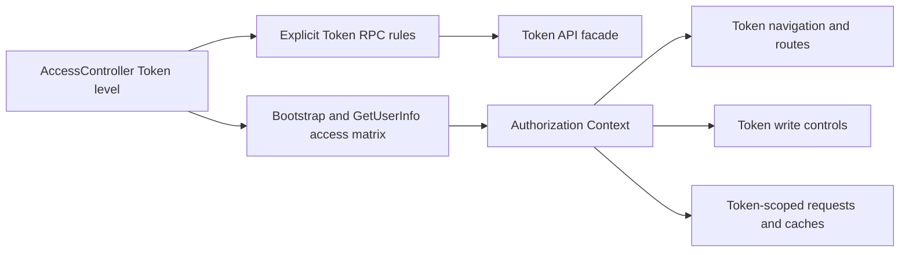

# Token Module Access Control

## Scope

Token Intelligence is one product module in the unified account access matrix.
This document explains how Token `READ` exposes every Token query and page, how
Token `READ_WRITE` additionally exposes policy and checkpoint mutations, and how
the API Server and browser enforce that module independently from every other
product.

Token workers, internal service-to-service activity, research scheduling, and
persistence behind an authorized request remain owned by their Token
subsystems. Login availability, administrator operations, durable account
aggregates, and the full browser session lifecycle are documented in
[Account Access Control](../identity-access/account-access-control.md).

## Source Locations

| Concern | Source | Key symbols |
| --- | --- | --- |
| Effective module authority | [internal/accountaccess/access.go](../../../internal/accountaccess/access.go), [internal/accountaccess/controller.go](../../../internal/accountaccess/controller.go) | `ModuleToken`, `AccessLevelRead`, `AccessLevelReadWrite`, `RequireModule`, `Controller.Authorize` |
| Explicit Token RPC rules | [internal/server/authz.go](../../../internal/server/authz.go) | `moduleGRPCRules`, `moduleRead`, `moduleWrite`, `authorizeGRPC` |
| Token public facade | [internal/server/tokenapi/tokenapi.go](../../../internal/server/tokenapi/tokenapi.go) | Token catalog, research, policy, and operations methods |
| Browser module registry and context | [ui/src/app/shared/access-modules.ts](../../../ui/src/app/shared/access-modules.ts), [ui/src/app/shared/context.ts](../../../ui/src/app/shared/context.ts), [ui/src/app/member/app.tsx](../../../ui/src/app/member/app.tsx) | `accountDataModules`, `AccountDataModule.Token`, `AuthorizationCtx.canRead`, `AuthorizationCtx.canWrite` |
| Token request scopes and caches | [ui/src/app/shared/services/token-service.ts](../../../ui/src/app/shared/services/token-service.ts), [ui/src/app/components/data.ts](../../../ui/src/app/components/data.ts), [ui/src/app/member/pages/project-navigation.tsx](../../../ui/src/app/member/pages/project-navigation.tsx) | Token read/write request scopes, `clearAsyncDataCache`, `clearProjectsReturnSnapshots` |
| Token pages and write interactions | [ui/src/app/member/pages](../../../ui/src/app/member/pages), [ui/src/app/member/routes.tsx](../../../ui/src/app/member/routes.tsx) | Token routes, blocklist editors, checkpoint editor, delete confirmations |

## Architecture

There is no Token-specific account, role, resource permission, or route grant.
The active account's Token matrix entry is the sole product-level input:

- Token `NONE` cannot mount Token routes or call public Token business RPCs.
- Token `READ` can open all Token query pages and call every Token query,
  including project and contract views, reports, observations, collection
  diagnostics, node state, runtime configuration, policies, and chain state.
- Token `READ_WRITE` includes all reads and can create, update, or delete
  contract-code and wallet blocklist entries and update chain checkpoints.
- The administrator has Token `NONE` as part of its fixed isolated aggregate.
  Administrator capability never satisfies a Token rule, and the administrator
  application contains no Token navigation, routes, service construction, or
  cache namespace.

A Token grant does not grant Wallet or any market module. The
UI access level controls presentation, while the API Server remains the security
boundary for direct HTTP and gRPC callers.

## Runtime Flow

1. Authentication resolves the account through `AccessController`. A disabled
   credential stops at account maintenance before a Token rule is evaluated.
2. `moduleGRPCRules` maps every public Token `Get` or `List` operation to
   `RequireModule(ModuleToken, AccessLevelRead)`. Contract-code and wallet
   blocklist creates, updates, and deletes, plus chain checkpoint updates, map
   to Token `READ_WRITE`.
3. `authorizeGRPC` checks the explicit rule before invoking the Token proxy.
   Missing Token access returns the stable module denial; the Token dependency
   is not called.
4. `GetAppBootstrap` supplies the complete initial account aggregate, including
   Token. After login and during the session, `GetUserInfo` supplies the same
   aggregate. The member shell derives `canRead(AccountDataModule.Token)` and
   `canWrite(AccountDataModule.Token)` from that entry. An administrator leaves
   the member application before a Token service or request is created.
5. Token navigation and every `/token/*` route require Token `READ`. All Token
   query pages mount at `READ` or `READ_WRITE`; mutation controls and sensitive
   write interactions render and operate only at `READ_WRITE`.
6. Token service methods tag each browser request with the Token module and
   `read` or `write` mode. The shared request layer can therefore abort Token
   work without affecting another product.
7. The shell refreshes authorization every 15 seconds while visible, on focus
   or visibility return, and immediately after a stable module denial. If Token
   falls below `READ`, it aborts all Token requests, clears Token asynchronous
   data and saved project return positions, and routes an active Token page to
   `/account/access`.
8. If Token falls from `READ_WRITE` to `READ`, only Token write requests are
   aborted. Query pages and read caches remain mounted. Page effects clear
   unsaved Token write drafts and destroy active write or delete confirmations.
   A change to another module leaves Token requests, caches, routes, and
   interactions untouched.
9. Raising Token to `READ` or `READ_WRITE` exposes the matching navigation and
   controls after the next projection without replacing the credential.

Project lists and details, trends, observations, wallet normal transactions,
Swap activity and events, Report revisions, Selections, and collection-task
reads all use the same Token `READ` rule. The module level does not create
per-page or per-project grants.

## State / Data

This capability adds no Token-specific authorization persistence. Token access
is one child row in the complete account aggregate owned by Account Access
Control. The API Server reads that value from the controller snapshot on every
Token request.

The browser stores the active aggregate in Authorization Context. Token caches
contain business responses, not authorization decisions, and are registered
under the Token module. Saved project return positions use the same lifecycle.
They are cleared when Token read access is lost or the authenticated identity
ends, but not for an unrelated module change.

## Configuration

There is no Token-specific environment grant. Ordinary accounts start with
Token `NONE`, and an administrator replaces the complete account access
aggregate through the Account API. With authentication disabled, role `member`
uses the `local-user` maximum member projection and therefore Token
`READ_WRITE`; role `administrator` uses `local-admin` and therefore Token
`NONE`.

## Invariants

- Every public Token query has an explicit Token `READ` rule.
- Every public Token mutation has an explicit Token `READ_WRITE` rule.
- Token access is independent from all other product modules.
- Token navigation, routes, controls, request scopes, and caches use the shared
  module registry and Authorization Context, not usernames or client allowlists.
- Hiding a route or action is not authorization; the API Server evaluates the
  Token rule for every public request.
- Administrator role never substitutes for Token `READ` or `READ_WRITE`.
- All project and project-scoped reads use the same Token `READ` boundary as
  reports, selections, and collection histories.
- Token read loss clears Token business state; write loss clears only pending
  writes and write UI while preserving readable data.
- A different module's access change does not invalidate Token state.
- Access changes do not alter Token paths, domain data, worker scheduling, or
  public business message types.

## Failure Recovery

An anonymous bootstrap routes to login without mounting Token. An initial
disabled credential produces the HTTP 200 `ACCOUNT_MAINTENANCE` bootstrap state;
a later exact maintenance 503 ends the browser session projection and routes to
the maintenance login page while preserving the credential.

A Token denial returns gRPC `PermissionDenied` and HTTP 403 with
`ACCOUNT_DATA_ACCESS_DENIED`. Its `google.rpc.ErrorInfo` metadata identifies the
Token module and required and effective levels. The browser refreshes
authorization without clearing the credential. A denied read or mutation never
reaches the Token service and can be retried after the matching grant. If the
authorization refresh fails, the current retry/error boundary remains instead
of synthesizing a new level.

## Observability

Rejected Token calls use normal request logging and gRPC/gateway status mapping.
The stable reason and module metadata distinguish a Token access denial from an
unrelated 403 or another module denial. Account maintenance remains separately
identifiable by the bootstrap status or gRPC `Unavailable`, HTTP 503, code 14,
and `系统维护中`. This capability adds no Token-specific authorization metric or
health endpoint.

## Change Checklist

- [ ] Every Token query remains mapped to Token `READ` in `moduleGRPCRules`.
- [ ] Every Token mutation remains mapped to Token `READ_WRITE`.
- [ ] Token navigation, routes, request scopes, caches, and write controls use the shared Token module entry.
- [ ] Project, Report, Selection, collection, policy, and checkpoint methods remain in the intended level.
- [ ] Token read loss and write loss perform the correct scoped cleanup without affecting another module.
- [ ] Token code remains in the member dependency graph and absent from the administrator dependency graph.
- [ ] Bootstrap maintenance, later maintenance 503, module 403, and ordinary authentication errors remain distinguishable.
- [ ] Source links and named symbols resolve to the implementation.
- [ ] The [design index](../README.md) contains the correct entry.
