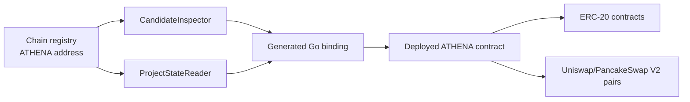

# ATHENA EVM Aggregator Contract

## Scope

The ATHENA contract is a stateless on-chain read aggregator for Token Intelligence. It probes ERC-20 metadata, derives V2 pair addresses, summarizes pair liquidity and quote values, reads related-wallet balances, and returns allowance state used by off-chain simulation. This document covers the contract's chain-specific construction, query behavior, generated Go binding, and direct Token Intelligence consumers. Contract broadcasting, address provisioning, project persistence, and off-chain simulation execution are outside this boundary.

## Source Locations

| Concern | Source | Key symbols |
| --- | --- | --- |
| Solidity implementation | [pkg/abi/ATHENA/ATHENA.sol](../../../pkg/abi/ATHENA/ATHENA.sol) | `Athena`, `ValidateERC20`, `ListProjectStates`, `ListWalletAssetStates`, `ListWalletSimulationStates` |
| Generated deployment and call binding | [pkg/abi/ATHENA/ATHENA.go](../../../pkg/abi/ATHENA/ATHENA.go) | `DeployATHENA`, `ATHENACaller`, `ATHENAMetaData` |
| ABI generation | [hack/generate-abi.sh](../../../hack/generate-abi.sh) | `compile_solidity`, `abigen` |
| Chain command configuration | [cmd/tokenchain/flags.go](../../../cmd/tokenchain/flags.go) | `Flags.Bind`, `Flags.Registry` |
| Fixed chain and deployed-address registry | [internal/token/chainregistry/registry.go](../../../internal/token/chainregistry/registry.go) | `Chain.AthenaContract`, `Registry.Chain` |
| Shared EVM connection lifecycle | [internal/token/adapters/evm/chain_client_registry.go](../../../internal/token/adapters/evm/chain_client_registry.go) | `ChainClientRegistry.Client`, `Reset`, `Close` |
| Candidate validation consumer | [internal/token/adapters/evm/candidate_inspector.go](../../../internal/token/adapters/evm/candidate_inspector.go) | `CandidateInspector.InspectCandidates` |
| Research-state consumer | [internal/token/adapters/evm/project_state_reader.go](../../../internal/token/adapters/evm/project_state_reader.go) | `ProjectStateReader`, `ReadChainState`, `ReadWalletAssetState`, `ReadSimulationResult` |

## Architecture

The Go consumers select the deployed contract address from the chain registry and call it through the generated binding over the shared EVM client registry. The contract contains all supported-chain protocol addresses and CREATE2 pair hashes as bytecode constants. It reads token and pair contracts directly and does not write storage or call an off-chain service.

## Runtime Flow

1. Deployment passes a numeric chain ID to `DeployATHENA`. The constructor accepts Ethereum Mainnet (`1`) or BSC Mainnet (`56`), selects the chain's Factory, wrapped-native token, USDT, V2 fee recipient, and V2 pair init code hash, then probes USDT decimals. The parameter selects configuration and is not compared with `block.chainid`.
2. `ValidateERC20` probes each address for non-empty name and symbol, positive decimals and total supply, and decodable `balanceOf` and `allowance` responses. Valid tokens receive deterministic WETH and USDT pair addresses.
3. `ListProjectStates` repeats token validation, checks whether each derived pair has deployed code, reads pair balances and liquidity state, converts quote balances to USDT using the WETH/USDT reserves, and produces token and pair reports.
4. `ListWalletAssetStates` reads wrapped-native, USDT, and native balances for each non-zero wallet and reports their aggregate USDT value.
5. `ListWalletSimulationStates` reads token allowances for the dead address, zero address, derived pairs, and the requested caller balance. Off-chain code uses this state to build simulation calls.
6. Every list result preserves input order. The Go adapters require the returned array length to match the request before mapping results into Token Intelligence domain values.

## State / Data

The contract has no mutable storage. Its deployed runtime contains immutable Factory, WETH, USDT, USDT-decimal, pair-hash, and fee-recipient values selected by the constructor. Pair addresses are derived with CREATE2 from the Factory address, sorted token addresses, and the configured init code hash.

Token and pair observations are transient return values. `updatedAt` is the current block timestamp. Wallet native balance is read from the EVM account, while token, allowance, supply, and reserve values come from bounded or defensive static calls.

## Configuration

| Chain ID | Factory | Wrapped native | USDT | V2 pair init code hash | USDT decimal fallback |
| --- | --- | --- | --- | --- | --- |
| `1` | `0x5C69bEe701ef814a2B6a3EDD4B1652CB9cc5aA6f` | `0xC02aaA39b223FE8D0A0e5C4F27eAD9083C756Cc2` | `0xdAC17F958D2ee523a2206206994597C13D831ec7` | `0x96e8ac4277198ff8b6f785478aa9a39f403cb768dd02cbee326c3e7da348845f` | `6` |
| `56` | `0xcA143Ce32Fe78f1f7019d7d551a6402fC5350c73` | `0xbb4CdB9CBd36B01bD1cBaEBF2De08d9173bc095c` | `0x55d398326f99059fF775485246999027B3197955` | `0x00fb7f630766e6a796048ea87d01acd3068e8ff67d078148a3fa3f4a84f69bd5` | `18` |

The Ethereum fee-recipient address is `0xf38521f130fcCF29dB1961597bc5d2B60F995f85`; the BSC fee-recipient address is `0x0ED943Ce24BaEBf257488771759F9BF482C39706`. Runtime services obtain the deployed contract addresses from `ATHENA_TOKEN_ETH_ATHENA_CONTRACT` and `ATHENA_TOKEN_BSC_ATHENA_CONTRACT`, exposed as the corresponding `--eth-athena-contract` and `--bsc-athena-contract` command settings. The maintained [local](../../../.env) and [production](../../../.env.prod) configurations enable Ethereum Mainnet at `0x32173a786d03A45FcC7119608F54ff59cB11716f` and disable BSC Mainnet while retaining its deployment at `0x372333a07c7b358Ef29187315e4FDF42Bc44FAC1`.

`ATHENA_TOKEN_NODE_WS_PROXY_URL` / `--node-ws-proxy-url` supplies an optional HTTP, HTTPS, or SOCKS5 proxy exclusively to the shared Token EVM WebSocket registry. `make run` removes standard proxy variables from Goreman children and supplies the WSL host's HTTP proxy on port `10809` by default. An empty value forces direct dialing, which is the production and manual-launch behavior. Process-wide HTTP proxy variables are not consulted by this EVM connection path.

## Invariants

- Only constructor arguments `1` and `56` are accepted.
- The caller is responsible for deploying the selected configuration to the intended network because the constructor does not inspect `block.chainid`.
- Each hard-coded init code hash must match the pair creation bytecode used by its configured Factory.
- Token pairs are sorted before CREATE2 derivation, and neither identical nor zero token addresses are valid derivation inputs.
- Public list methods preserve input order and return one item per input.
- A token is valid only when every required metadata and probe call decodes successfully and its decimals and total supply are positive.
- A derived pair is treated as created only when code exists at the computed address.

## Failure Recovery

An unsupported constructor argument reverts deployment. The constructor does not call the configured Factory; deployment therefore does not depend on a Factory hash getter. A failed or zero USDT-decimal probe uses the chain-specific fallback.

Defensive token probes return an unsuccessful flag and zero or empty value instead of bubbling most target-contract failures. A malformed `uint8` metadata response whose first ABI word exceeds the valid range is treated as an unsuccessful probe rather than bubbling a decode revert, while trailing return data remains permitted. Missing pair code produces an uncreated pair state. Failed or malformed reserve reads produce zero reserves, preventing quote conversion. Invalid pair-derivation inputs revert the affected aggregate call.

Go consumers treat contract-call failures and result-length mismatches as failed work. EVM adapters reset their cached chain client after call failures so the surrounding periodic worker can retry through normal job recovery.

## Observability

The contract emits no events and has no health endpoint or mutable status. Deployment failures surface through the transaction or gas-estimation result. Runtime call failures are reported by the Token Intelligence workers that invoke the generated binding; their shared telemetry and logs identify the chain, project, and failed periodic job. Each newly selected shared EVM client logs whether the dedicated proxy is enabled and includes the complete unredacted proxy endpoint.

## Change Checklist

- [ ] Recheck both constructor branches, protocol addresses, decimal fallbacks, and pair init code hashes.
- [ ] Recheck CREATE2 pair derivation against the configured V2 Factory.
- [ ] Recheck public return shapes and generated Go bindings.
- [ ] Recheck `CandidateInspector` and `ProjectStateReader` mappings.
- [ ] Recheck defensive-call limits, fallback values, and aggregate failure behavior.
- [ ] Keep the [design index](../README.md) entry current.
