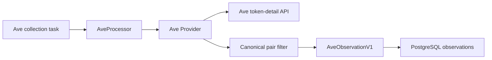

# Ave Market Data Collection

## Scope

Ave Market Data Collection retrieves vendor token-detail data for Token Intelligence projects, normalizes the token snapshot, retains only the project's canonical wrapped-native and USDT V2 pairs, and commits versioned Ave observations. The research scheduler owns when collection runs, the ATHENA contract and Validator own pair-address derivation and persistence, and the project-detail read model owns presentation.

## Source Locations

| Concern | Source | Key symbols |
| --- | --- | --- |
| Collector process composition | [cmd/athena-token-collector/commands/athena-token-collector.go](../../../cmd/athena-token-collector/commands/athena-token-collector.go) | `NewCommand` |
| Collection application boundary | [internal/token/research/application/collector.go](../../../internal/token/research/application/collector.go) | `AveMarketDataRequest`, `AveProcessor` |
| Ave response normalization | [internal/token/adapters/ave/provider.go](../../../internal/token/adapters/ave/provider.go) | `Provider.GetMarketData`, `normalizeObservation`, `normalizePair` |
| Ave HTTP client | [util/ave/ave.go](../../../util/ave/ave.go) | `Client`, `GetTokenDetail` |
| Observation contract | [internal/token/research/observation.go](../../../internal/token/research/observation.go) | `AveObservationV1`, `AveTokenV1`, `AvePairV1` |
| Observation persistence | [internal/token/adapters/postgres/observation_store.go](../../../internal/token/adapters/postgres/observation_store.go) | `CommitCollection`, `persistObservation` |

## Architecture

The claimed project context supplies the token contract, chain ID, and canonical wrapped-native and USDT pair addresses. The Ave adapter requests token data by token contract and chain, then uses the project pair addresses as the only accepted pair identities. Pair symbols and Ave's main-pair selection do not affect retention.

## Runtime Flow

1. The Ave collector claims a due task together with its `ProjectCollectionContext`.
2. `AveProcessor` constructs an `AveMarketDataRequest` from the project's chain, token contract, WETH/WBNB pair, and USDT pair.
3. The provider requests `/v2/tokens/{contract}-{chain}` and validates that the returned token contract and chain match the request.
4. Token-level supply, price, valuation, TVL, holder, and risk fields are normalized independently of pair selection.
5. The provider scans Ave's pair list and considers only entries whose parsed pair contract exactly equals one of the two project pair addresses. Other entries are skipped without parsing their chain, reserves, volume, valuation, or token addresses.
6. The first matching wrapped-native pair and first matching USDT pair are normalized. The observation stores them in wrapped-native-then-USDT order; absent pairs are omitted.
7. The collector canonicalizes the observation JSON and computes its content hash. A changed result creates a new observation, updates the current pointer and evidence revision, and enqueues a report build. An unchanged result only refreshes the current observation check time.
8. Either successful result marks the collection task succeeded and the Ave schedule completed in the same PostgreSQL transaction. Ave is not collected again for that project.

## State / Data

`AveObservationV1` keeps the existing token object and `pairs` array. The array contains zero, one, or two entries:

- index zero is the wrapped-native pair when present;
- the USDT pair follows the wrapped-native pair, or occupies index zero when it is the only match;
- no other Ave pair is persisted.

Token-level `TVL` and `MainPairTVL` remain Ave-provided token metrics and are not recalculated from the retained pair entries.

Observations are immutable versioned rows. `project_current_observation` identifies the latest committed Ave snapshot for each project.

## Configuration

| Setting | Behavior |
| --- | --- |
| `ATHENA_TOKEN_AVE_API_KEY` / `--ave-api-key` | Required Ave API key used in the `X-API-KEY` request header. |
| `ATHENA_TOKEN_AVE_API_BASE_URL` / `--ave-api-base-url` | Ave API origin. Defaults to `https://prod.ave-api.com`. |
| Ave HTTP timeout | Fixed at 60 seconds in the adapter and client defaults. |
| `ATHENA_TOKEN_AVE_RETRY_INTERVAL` / `--ave-retry-interval` | Delay after a failed Ave collection attempt. Defaults to 5 minutes. |
| `ATHENA_TOKEN_HEALTH_LISTEN_ADDRESS` / `--health-listen-address` | Shared collector telemetry listener. The Ave collector default is `127.0.0.1:8113`. |

## Invariants

- Pair identity is exact contract-address equality against the persisted project pair addresses.
- Alternative AMMs, symbol matches, and Ave's `main_pair` value never substitute for a canonical project pair.
- A committed observation contains at most one wrapped-native pair and at most one USDT pair.
- Retained pair order is deterministic: wrapped native before USDT.
- Missing key pairs are valid and produce no placeholder entries.
- The observation JSON shape and schema version remain unchanged.
- The first successful Ave response completes the schedule, whether or not its normalized content differs from an existing observation.

## Failure Recovery

Missing configuration or client construction failure prevents the Ave collector from starting. HTTP failures, an invalid token identity, invalid token-level data, malformed retained-pair data, or persistence failures fail the current attempt. The same task becomes available after the five-minute default retry interval. The tenth failed attempt marks both the task and Ave schedule failed, so no later task revision is created.

Malformed or mismatched non-key pairs are ignored because they cannot affect the persisted observation. Observation insertion, current-pointer replacement, evidence revision, report enqueueing, task success, and schedule advancement remain transactional.

## Observability

The Ave collector uses the shared worker telemetry endpoints:

- `GET /healthz` reports process liveness.
- `GET /readyz` reports PostgreSQL readiness and the Ave data-collector job state.
- `GET /metrics` exposes loop results, queue diagnostics, last success and error times, and consecutive failures.

Failed loops emit the shared `token periodic job failed` log with the Ave data type. Task and schedule rows retain the attempt count, schedule failure count, last collection error, next attempt, and successful check time.

## Change Checklist

- [ ] Token identity and chain validation still match the Ave request.
- [ ] Canonical pair filtering uses persisted project addresses and retains deterministic order.
- [ ] Token-level metrics remain independent from pair retention.
- [ ] Observation hashing, persistence, task completion, and retry behavior remain aligned.
- [ ] API configuration, health endpoints, logs, and metrics remain current.
- [ ] Source links and named symbols resolve to the implementation.
- [ ] The [design index](../README.md) contains the correct entry.
